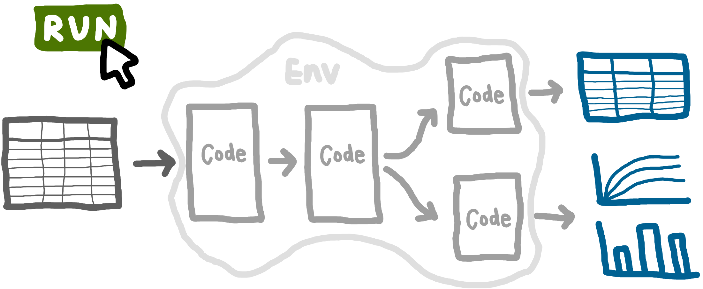

<!-- Hide as no python-content or r-content blocks -->

::: {.pale-blue}

This practical guide shows you how to build **reproducible** discrete-event simulation models (DES) that fit into a **reproducible analytical pipeline (RAP)**, with tips that benefit all types of models and analysis.

:::

This resource is an output of **STARS**, a research project led by Prof. **Tom Monks** . The book is written by **Amy Heather**  and reviewed by Prof. **Nav Mustafee** , Dr. **Alison Harper** , and Prof. **Tom Monks** . The STARS project is supported by the Medical Research Council [grant number MR/Z503915/1]. The listed researchers are associated with the **University of Exeter** Medical and Business Schools.

> *Please **cite** us if you use this resource!* <!--TODO: Add Zenodo DOI once archive-->
