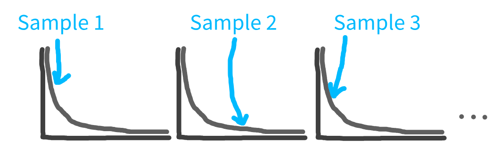

:::: {.pale-blue}

**Learning objectives:**

* Identify what **data** is needed for input modelling and why **quality** matters.
* Understand how input data forms the basis for **randomness** in simulated systems.
* **Inspect, fit, and select probability distributions** for your model using both **targeted and comprehensive** approaches.

**Acknowledgements:** Inspired by @Robinson2007 and @Monks2024.

::::

:::: {.very-pale-blue}

**Required packages:**

The following imports are required. These should be available from environment setup on the [Structuring as a package](/pages/guide/setup/package.qmd) page.

::: {.python-content}

```{python}
from distfit import distfit
import numpy as np
import pandas as pd
import plotly.express as px
import plotly.graph_objects as go
from scipy import stats
```

```{python}
#| echo: false
# To ensure renders correctly in quarto
import plotly.io as pio  # pylint: disable=ungrouped-imports
pio.renderers.default = "plotly_mimetype"
```

:::

::: {.r-content}

```{r}
#| output: false
library(dplyr)
library(fitdistrplus)
library(ggplot2)
library(lubridate)
library(plotly)
library(readr)
library(tidyr)
```

:::

::::

## Data

To build a DES model, you first need **data** that reflects the system you want to model. In healthcare, this might mean you need to access healthcare records with patient arrival, service and departure times, for example. The quality of your simulation depends directly on the quality of your data. Key considerations include:

* **Accuracy**. Inaccurate data leads to inaccurate simulation results.
* **Sample size**. Small samples can give misleading results if they capture unusual periods, lack variability, or are affected by outliers.
* **Level of detail**. The data must be granular enough for your needs. For example, daily totals may be insufficient if you want to model hourly arrivals (although may still be possible if know distribution - [as noted below](#input-modelling-steps)).
* **Representative**. The data should reflect the current system. For instance, data from the COVID-19 period may not represent typical operations.

Input data validation (covered on the [verification and validation](../verification_validation/verification_validation.qmd#input-data-validation) page) involves checking that the data (and distributions used) are appropriate and accurate reflections of your system.

## How is this data used in the model?

Discrete-event simulation (DES) models are **stochastic**, which means they incorporate random variation, to reflect the inherent variability of real-world systems.

Instead of using fixed times for events (like having a patient arrive exactly every five minutes), DES models pick the timing of events by **randomly sampling values from a probability distribution**.

{fig-alt="Illustration showing multiple samples being taken from one distribution."}

## Input modelling

The process of selecting the most appropriate statistical distributions to use in your model is called **input modelling**.

When selecting appropriate distributions, if you only have summary statistics (like the mean), you may need to rely on expert opinion or the general properties of the process you're modelling. For example:

* **Arrivals**: Random independent arrivals are often modelled with the Poisson distribution, whilst their inter-arrival times are modelled using an exponential distribution (@Pishro-Nik2014).
  * *The Poisson and exponential distributions are mathematically linked: if arrivals follow a Poisson process with a constant rate, then the time between arrivals follows an exponential distribution with the same rate parameter.*
* **Length of stay**: Length of stay is commonly right skewed (@Lee2003), and so will often be modelled with distributions like exponential, gamma, log-normal (for log-transformed length of stay) or Weibull.

However, these standard choices may not always be appropriate. If the actual process differs from your assumptions or has unique features, the chosen distribution might not fit well.

Therefore, if you have enough data, it's best to analyse it directly to select the most suitable distributions. This analysis generally involves two key steps:

1. **Identify candidate distributions**. This step is essential because it uses your knowledge of the real process and visual inspection of the data (time series, histograms) to narrow down to distributions that are both statistically plausible and contextually appropriate (for example, non‑negative, right‑skewed, allowing for counts vs continuous times).
2. **Fit distributions to your data and compare goodness-of fit**.
    a. **Targeted approach**. Fit and test only the candidate distributions from Step 1.
    b. **Comprehensive approach**. Fit and test a wide range of distributions, then use Step 1 knowledge to exclude contextually inappropriate options (for example, distributions that allow negative times, or that ignore clear temporal patterns) even if they appear to fit well mathematically

Though the comprehensive approach tests lots of different distributions, it's still important to do step 1 as:

* It's important to be aware of **temporal patterns** in the data (e.g. spikes in service length every Friday).
* You may find distributions which mathematically fit but are **contextually inappropriate** (e.g. normal distribution for service times, which can't be negative).
* You may find better fit for complex distributions, even when **simpler are sufficient**.

We'll demonstrate steps for input modelling below using the **synthetic arrival data** from the [nurse visit simulation](/pages/example_models/example_models.qmd) (not based on real-world data). In this case, we already know which distributions to use (as we sampled from them to create our synthetic data!). However, the steps still illustrate how you might select distributions in practice with real data.

## Set-up

Click here to download the arrival data.



You can also download a copy of the data dictionary:



::: {.python-content}

We'll run the analysis in a Jupyter Notebook. To create a notebook from the command line, run:

```{.bash}
touch notebooks/input_modelling.ipynb
```

:::

::: {.r-content}

We'll run the analysis in a R Markdown file. To create a file from the command line, run:

```{.bash}
touch rmarkdown/input_modelling.Rmd
```

:::

## Step 1. Identify possible distributions

You first need to select which distributions to fit to your data. You should both:

* Consider the known properties of the process being modelled (as above), and-
* Inspect the data by plotting a histogram.

Regarding the known properties, it would be good to consider the exponential distribution for our arrivals, as that is a common choice for random independent arrivals.

To inspect the data, we will create two plots:

| Plot type | What does it show? | Why do we create this plot? |
| - | - | -- |
| **Time series** | Trends, seasonality, and outliers (e.g., spikes or dips over time). | To check for **stationarity** (i.e. no trends or sudden changes). Stationary is an assumption of many distributions, and if trends or anomalies do exist, we may need to exclude certain periods or model them separately. The time series can also be useful for spotting outliers and data gaps. |
| **Histogram** | The shape of the data's distribution. | Helps **identify which distributions might fit** the data. |

We repeat this for the arrivals and service (nurse consultation) time, so have created functions to avoid duplicate code between each.

<br>

### Importing and processing the data

::: {.python-content}

First, we import the data. Specifying `dtype` ensures the time columns are read as strings so the original formatting and any leading zeros are preserved (instead of being lost if read as numbers).

```{python}
# Import data
data = pd.read_csv("input_modelling_resources/NHS_synthetic.csv", dtype={
    "ARRIVAL_TIME": str,
    "SERVICE_TIME": str,
    "DEPARTURE_TIME": str
})

# Preview data
data.head()
```

:::

::: {.r-content}

First, we import the data.

```{r}
# Import data, treating time columns as strings to preserve formatting
data <- read_csv(
  file.path("input_modelling_resources", "NHS_synthetic.csv"),
  show_col_types = FALSE
)

# Show the first few rows of the imported data
head(data)
```

:::

<br>

We then calculate the inter-arrival times (IAT). IAT means the amount of time between one arrival and the next.

::: {.python-content}

```{python}
# Combine ARRIVAL_DATE and ARRIVAL_TIME into a single datetime column so pandas
# can interpret it as a timestamp
data["arrival_datetime"] = pd.to_datetime(
    data["ARRIVAL_DATE"] + " " + data["ARRIVAL_TIME"].str.zfill(4),
    format="%Y-%m-%d %H%M"
)

# Sort records by arrival time before calculating time gaps between arrivals
# The diff() function gets the difference between each arrival and the previous
# .dt.total_seconds() gets the result in seconds, then divide by 60 for mins
data = data.sort_values("arrival_datetime")
data["iat_mins"] = (
    data["arrival_datetime"].diff().dt.total_seconds() / 60
)

# Show the first few rows of the imported data
data[["ARRIVAL_DATE", "ARRIVAL_TIME", "arrival_datetime", "iat_mins"]].head()
```

:::

::: {.r-content}

> As per the [tidyverse style guide](https://style.tidyverse.org/pipes.html), we use base R's `|>` instead of magrittr's `%>%`.

```{r}
data <- data |>
  # Combine date/time and convert to datetime
  mutate(arrival_datetime = ymd_hm(paste(ARRIVAL_DATE, ARRIVAL_TIME))) |>
  # Sort by arrival time
  arrange(arrival_datetime) |>
  # Calculate inter-arrival times
  mutate(
    iat_mins = as.numeric(
      difftime(
        arrival_datetime, lag(arrival_datetime), units = "mins"
      )
    )
  )

# Preview
data |>
  select(ARRIVAL_DATE, ARRIVAL_TIME, arrival_datetime, iat_mins) |>
  head()
```

:::

<br>

We also calculate the service times.

::: {.python-content}

```{python}
# Combine service and departure dates/times into datetime columns
data["service_datetime"] = pd.to_datetime(
    data["SERVICE_DATE"] + " " + data["SERVICE_TIME"].str.zfill(4)
)
data["departure_datetime"] = pd.to_datetime(
    data["DEPARTURE_DATE"] + " " + data["DEPARTURE_TIME"].str.zfill(4)
)

# Calculate service time in minutes
# Subtracting two datetime columns gives a Timedelta object
# Dividing by pd.Timedelta(minutes=1) converts any duration into minutes
time_delta = data["departure_datetime"] - data["service_datetime"]
data["service_mins"] = time_delta / pd.Timedelta(minutes=1)

# Preview
data[["service_datetime", "departure_datetime", "service_mins"]].head()
```

:::

::: {.r-content}

```{r}
data <- data |>
  mutate(
    service_datetime   = ymd_hm(paste(SERVICE_DATE, SERVICE_TIME)),
    departure_datetime = ymd_hm(paste(DEPARTURE_DATE, DEPARTURE_TIME)),
    service_mins = as.numeric(
      difftime(departure_datetime, service_datetime, units = "mins")
    )
  )

# Preview
data |>
  select(service_datetime, departure_datetime, service_mins) |>
  head()
```

:::

### Time series plots

::: {.python-content}

The function below generates an interactive time series line plot from a pandas Series, using the index as the date axis and the supplied label for the y-axis.

```{python}
def inspect_time_series(time_series, y_lab):
    """
    Plot time-series.

    Parameters
    ----------
    time_series : pd.Series
        Series containing the time series data (where index is the date).
    y_lab : str
        Y axis label.

    Returns
    -------
    fig : plotly.graph_objects.Figure
    """
    # Label as "Date" and provided y_lab, and convert to dataframe
    df = time_series.rename_axis("Date").reset_index(name=y_lab)

    # Create plot
    fig = px.line(df, x="Date", y=y_lab)
    fig.update_layout(showlegend=False, width=700, height=400)
    return fig
```

```{python}
# Calculate mean arrivals per day and plot time series
p = inspect_time_series(
    time_series=data.groupby(by=["ARRIVAL_DATE"]).size(),
    y_lab="Number of arrivals")


p.show()
```

<br>

We see no trends, seasonality or outliers in the time series plot for number of arrivals per day.

<br>

```{python}
# Calculate mean service length per day, dropping last day (incomplete)
daily_service = data.groupby("SERVICE_DATE")["service_mins"].mean()
daily_service = daily_service.iloc[:-1]

# Plot mean service length each day
p = inspect_time_series(time_series=daily_service,
                        y_lab="Mean consultation length (min)")
p.show()
```

<br>

We see no trends, seasonality or outliers in the time series plot for mean service length per day.

<br>

:::

::: {.r-content}

The function below creates a time series line plot from a data frame with date and value columns, optionally saves it as a static image, and returns either a static ggplot object or an interactive Plotly plot depending on the `interactive` argument.

```{r}
#' Plot time-series
#'
#' @param time_series Dataframe with date column and numeric column to plot.
#' @param date_col String. Name of column with dates.
#' @param value_col String. Name of column with numeric values.
#' @param y_lab String. Y axis label.
#' @param interactive Boolean. Whether to render interactive or static plot.
#' @param save_path String. Path to save static file to (inc. name and
#' filetype). If NULL, then will not save.
#'
#' @return A ggplot object (static) or a plotly object (interactive type),
#' depending on `interactive` parameter.
#' @export

inspect_time_series <- function(
  time_series, date_col, value_col, y_lab, interactive, save_path = NULL
) {
  # Create custom tooltip text
  time_series$tooltip_text <- paste0(
    "<span style='color:white'>",
    "Date: ", time_series[[date_col]], "<br>",
    y_lab, ": ", time_series[[value_col]], "</span>"
  )

  # Create plot
  p <- ggplot(time_series, aes(x = .data[[date_col]],
                               y = .data[[value_col]],
                               text = tooltip_text)) +  # nolint: object_usage_linter
    geom_line(group = 1L, color = "#727af4") +
    labs(x = "Date", y = y_lab) +
    theme_minimal()

  # Save file if path provided
  if (!is.null(save_path)) {
    ggsave(save_path, p, width = 7L, height = 4L)
  }

  # Display as interactive or static figure
  if (interactive) {
    ggplotly(p, tooltip = "text", width = 700L, height = 400L)
  } else {
    p
  }
}
```

```{r}
# Plot daily arrivals
daily_arrivals <- data |> group_by(ARRIVAL_DATE) |> count()
inspect_time_series(
  time_series = daily_arrivals, date_col = "ARRIVAL_DATE", value_col = "n",
  y_lab = "Number of arrivals", interactive = TRUE
)
```

<br>

We see no trends, seasonality or outliers in the time series plot for number of arrivals per day.

<br>

```{r}
# Calculate mean service length per day, dropping last day (incomplete)
daily_service <- data |>
  group_by(SERVICE_DATE) |>
  summarise(mean_service = mean(service_mins)) |>
  filter(row_number() <= n() - 1L)

# Plot mean service length each day
inspect_time_series(
  time_series = daily_service, date_col = "SERVICE_DATE",
  value_col = "mean_service", y_lab = "Mean consultation length (min)",
  interactive = TRUE
)
```

<br>

We see no trends, seasonality or outliers in the time series plot for mean service length per day.

<br>

:::

:::: {.callout-note title="What would if look like if there were trends, seasonality or outliers?"}

**Trends** are increases or decreases in the data over time. For example, if the mean length of consultations was getting longer and longer over time.

In this example, there is a small linear increase to the daily mean service time:

::: {.python-content}

```{python}
#| echo: false

# Add a simple linear trend: +0.05 minutes per day
trend = 0.05 * np.arange(len(daily_service))
daily_service_trend = daily_service.copy() + trend

p = inspect_time_series(
    time_series=daily_service_trend,
    y_lab="Mean consultation length (min)"
)
p.show()
```

:::

::: {.r-content}

```{r}
#| echo: false

daily_service_trend <- daily_service |>
  arrange(SERVICE_DATE) |>
  mutate(
    day_index = row_number(),
    # Add a linear trend: +0.05 minutes per day
    mean_service_trend = mean_service + 0.05 * day_index
  )

inspect_time_series(
  time_series = daily_service_trend,
  date_col = "SERVICE_DATE",
  value_col = "mean_service_trend",
  y_lab = "Mean consultation length (min)",
  interactive = TRUE
)
```

:::

**Seasonality** are regular patterns in the data depending on time or day - like higher arrivals every weekend, or peaks over each winter.

In this example, there are higher arrivals at weekends than midweek:

::: {.python-content}

```{python}
#| echo: false

# Daily arrivals
daily_arrivals = data.groupby("ARRIVAL_DATE").size()
daily_arrivals.index = pd.to_datetime(daily_arrivals.index)

# Boost December, slightly reduce other months
daily_arrivals_dec = daily_arrivals.copy()
is_december = daily_arrivals_dec.index.month == 12

daily_arrivals_dec = np.where(
    is_december,
    daily_arrivals_dec * 1.4,   # higher in December
    daily_arrivals_dec * 0.9,   # slightly lower otherwise
)

daily_arrivals_dec = pd.Series(
    daily_arrivals_dec, index=daily_arrivals.index
)

p = inspect_time_series(
    time_series=daily_arrivals_dec,
    y_lab="Number of arrivals (higher in December)"
)
p.show()
```

:::

::: {.r-content}

```{r}
#| echo: false

daily_arrivals_dec <- daily_arrivals |>
  mutate(
    month = lubridate::month(ARRIVAL_DATE),
    n_dec = if_else(month == 12L, n * 1.4, n * 0.9)
  )

inspect_time_series(
  time_series = daily_arrivals_dec,
  date_col = "ARRIVAL_DATE",
  value_col = "n_dec",
  y_lab = "Number of arrivals",
  interactive = TRUE
)
```

:::

**Outliers** are unusual observations (e.g., very very high or low number of arrivals that differ from the rest).

In this example, we have one day with very high arrivals, and another day with very low arrivals:

::: {.python-content}

```{python}
#| echo: false

# Start from the original daily arrivals
daily_arrivals_outliers = daily_arrivals.copy()

# One very high day and one very low day
high_day = pd.to_datetime("2025-02-15")
low_day  = pd.to_datetime("2025-03-10")

if high_day in daily_arrivals_outliers.index:
    daily_arrivals_outliers.loc[high_day] *= 3

if low_day in daily_arrivals_outliers.index:
    daily_arrivals_outliers.loc[low_day] *= 0.2

p = inspect_time_series(
    time_series=daily_arrivals_outliers,
    y_lab="Number of arrivals"
)
p.show()
```

:::

::: {.r-content}

```{r}
#| echo: false

daily_arrivals_outliers <- daily_arrivals |>
  arrange(ARRIVAL_DATE) |>
  mutate(n_outlier = n) |>
  # One very high day and one very low day
  mutate(
    n_outlier = ifelse(
      ARRIVAL_DATE == as.Date("2025-02-15"), n_outlier * 3, n_outlier
    ),
    n_outlier = ifelse(
      ARRIVAL_DATE == as.Date("2025-03-10"), n_outlier * 0.2, n_outlier
    )
  )

inspect_time_series(
  time_series = daily_arrivals_outliers,
  date_col = "ARRIVAL_DATE",
  value_col = "n_outlier",
  y_lab = "Number of arrivals",
  interactive = TRUE
)
```

:::

::::

### Histogram plots

::: {.python-content}

```{python}
def inspect_histogram(series, x_lab, bin_width=1):
    """
    Plot histogram.

    Parameters
    ----------
    series : pd.Series
        Series containing the values to plot as a histogram.
    x_lab : str
        X axis label.
    bin_width : int
        Width of histogram X axis bins.

    Returns
    -------
    fig : plotly.graph_objects.Figure
    """
    # Calculate bin edges
    min_val = int(series.min())
    max_val = int(series.max()) + 1
    bin_edges = np.arange(min_val, max_val + bin_width, bin_width)
    nbins = len(bin_edges) - 1

    # Plot histogram
    fig = px.histogram(series, nbins=nbins)
    fig.update_layout(
        xaxis_title=x_lab, showlegend=False, width=700, height=400
    )

    # Build interval labels for each bin
    bin_labels = [f"{x_lab}: {bin_edges[i]}–{bin_edges[i+1]}"
                  for i in range(nbins)]
    fig.update_traces(
        hovertemplate="%{customdata}<br>Count: %{y}",
        customdata=bin_labels,
        name=""
    )
    return fig
```

```{python}
# Plot histogram of inter-arrival times
p = inspect_histogram(series=data["iat_mins"],
                      x_lab="Inter-arrival time (min)")
p.show()
```

<br>

The inter-arrival times are right skewed distribution. Hence, it would be good to try exponential, gamma and Weibull distributions.

<br>

```{python}
# Plot histogram of service times
p = inspect_histogram(series=data["service_mins"],
                      x_lab="Consultation length (min)")
p.show()
```

<br>

The service times are right skewed distribution. Hence, it would be good to try exponential, gamma and Weibull distributions.

<br>

:::

:::{.r-content}

```{r}
#' Plot histogram
#'
#' @param data A dataframe or tibble containing the variable to plot.
#' @param var String. Name of the column to plot as a histogram.
#' @param x_lab String. X axis label.
#' @param interactive Boolean. Whether to render interactive or static plot.
#' @param save_path String. Path to save static file to (inc. name and
#' filetype). If NULL, then will not save.
#'
#' @return A ggplot object (static) or a plotly object (interactive type),
#' depending on `interactive` parameter.
#' @export

inspect_histogram <- function(
  data, var, x_lab, interactive, save_path = NULL
) {
  # Remove non-finite values
  data <- data[is.finite(data[[var]]), ]

  # Create plot
  p <- ggplot(data, aes(x = .data[[var]])) +
    geom_histogram(
      aes(
        text = paste0(
          "<span style='color:white'>", x_lab, ": ",
          round(after_stat(x), 2L), "<br>Count: ", # nolint: object_usage_linter
          after_stat(.data[["count"]]), "</span>"
        )
      ),
      fill = "#727af4", bins = 30L
    ) +
    labs(x = x_lab, y = "Count") +
    theme_minimal() +
    theme(legend.position = "none")

  # Save file if path provided
  if (!is.null(save_path)) {
    ggsave(save_path, p, width = 7L, height = 4L)
  }

  # Display as interactive or static figure
  if (interactive) {
    ggplotly(p, tooltip = "text", width = 700L, height = 400L)
  } else {
    p
  }
}
```

```{r}
#| warning: false
# Plot histogram of inter-arrival times
inspect_histogram(
  data = data, var = "iat_mins", x_lab = "Inter-arrival time (min)",
  interactive = TRUE
)
```

<br>

The inter-arrival times are right skewed distribution. Hence, it would be good to try exponential, gamma and Weibull distributions.

<br>

```{r}
#| warning: false
# Plot histogram of service times
inspect_histogram(
  data = data, var = "service_mins", x_lab = "Consultation length (min)",
  interactive = TRUE
)
```

<br>

The service times are right skewed distribution. Hence, it would be good to try exponential, gamma and Weibull distributions.

<br>

**Alternative:** You can use the `fitdistrplus` package to create these histograms - as well as the empirical cumulative distribution function (CDF), which can help you inspect the tails, central tendency, and spot jumps or plateaus in the data.

```{r}
# Get IAT and service time columns as numeric vectors (with NA dropped)
data_iat <- data |> drop_na(iat_mins) |> select(iat_mins) |> pull()
data_service <- data |> select(service_mins) |> pull()

# Plot histograms and CDFs
plotdist(data_iat, histo = TRUE, demp = TRUE)
plotdist(data_service, histo = TRUE, demp = TRUE)
```

:::

<br>

::: {.callout-note title="Common input distributions"}

When you are inspecting the histogram, you are mainly looking at the shape of the distribution and what values are possible (e.g., are they counts or continuous times, and can they ever be negative?). The table below summarises common choices in DES:

| Distribution | Type/support | Typical shape | Common DES uses | Caveat/common mistake
| - | - | - | - | -- |
| Poisson | Discrete, counts ≥ 0 | Right‑skewed, unimodal when mean is moderate | Number of arrivals per period (e.g. patients per hour). | Assumes independent arrivals at a constant rate; often violated when arrival rates vary over time or come in bursts. |
| Exponential | Continuous, > 0 | Strongly right‑skewed, highest near 0, long tail | Inter‑arrival times, simple service times. | Has the "memoryless" property (the remaining time does not depend on how long you have already waited), which is often unrealistic for service times that improve or worsen with duration. |
| Gamma | Continuous, > 0 | Flexible right‑skewed; can be more "humped" than exponential | Service times, length of stay when more flexible shape is needed. | Easy to overfit if you do not have much data; its parameters can be hard for non‑statistical stakeholders to interpret directly. |
| Lognormal | Continuous, > 0 | Right‑skewed with long tail; arises from multiplicative effects | Length of stay or service with occasional very long values. | Can generate extremely large values that may dominate the simulation if you do not check that the long tail matches real‑world data. |
| Weibull | Continuous, > 0 | Right‑skewed; can model increasing or decreasing hazard over time | Time‑to‑event where risk changes with time (failures, discharges). | The shape parameter controls how risk changes over time and is often misunderstood; if risk is really constant, the simpler exponential distribution is enough. |
| Normal | Continuous, any real | Symmetric bell curve, allows negatives | Approx. symmetric variables where negatives are plausible; usually not suitable for raw service times. | Because it allows negative values, using it directly for durations can produce impossible negative times; only suitable if you truncate negatives or if the mean is much larger than the standard deviation so negatives are virtually impossible. |
| Uniform | Continuous, between min and max | Flat; all values between bounds equally likely | Crude model when only min/max are known. | Often underestimates realistic variability and structure in the data; frequently used as a quick placeholder and then mistakenly treated as a realistic final choice instead of fitting a more appropriate distribution. |
​
:::

## Step 2. Fit distributions and compare goodness-of fit

We will fit distributions and assess goodness-of-fit using the **Kolmogorov-Smirnov (KS) Test**. This is a common test which is well-suited to continuous distributions. For categorical (or binned) data, consider using chi-squared tests.

The KS test compares your sample data to a specified theoretical distribution.

**Null hypothesis:** Data come from the specified distribution.

**Alternative hypothesis:** Data do not follow that distribution.

The KS Test returns a statistic and p value.

* **Statistic:** Measures how well the distribution fits your data.
    * Ranges from 0 to 1.
    * **Lower KS test statistics indicate a better fit**.
* **P-value:** Tells you if the fit could have happened by chance.
    * Ranges from 0 to 1.
    * **Higher p-values suggest the data follow the distribution**. In other words, we are measuring evidence against the null hypothesis, and a larger p-value means there is little evidence to reject the null, so the data are *consistent* with the chosen distribution - while a small p-value suggests a lack of fit.
    * In large datasets, even good fits often have small p-values, so it is useful to look at both the KS statistic and graphical diagnostics when judging fit.

::: {.python-content}

`scipy.stats` is a popular library for fitting and testing statistical distributions. For more convenience, `distfit`, which is built on `scipy`, is another popular package which can test multiple distributions simultaneously (or evaluate specific distributions).

We will illustrate how to perform the targeted approach using `scipy` directly, and the comprehensive approach using `distfit` - but you could use either for each approach.

:::

::: {.r-content}

`fitdistrplus` is a popular library for fitting and testing statistical distributions. This can evaluate specific distributions or test multiple distributions. We will use this library to illustrate how to perform the targeted or comprehensive approach.

:::

### Targeted approach

::: {.python-content}

To implement the targeted approach using `scipy.stats`...

```{python}
def fit_distributions(input_series, dists):
    """
    This function fits statistical distributions to the provided data and
    performs Kolmogorov-Smirnov tests to assess the goodness of fit.

    Parameters
    ----------
    input_series : pandas.Series
        The observed data to fit the distributions to.
    dists : list
        List of the distributions in scipy.stats to fit, eg. ["expon", "gamma"]

    Notes
    -----
    A lower test statistic and higher p-value indicates better fit to the data.
    """
    for dist_name in dists:
        # Fit distribution to the data
        dist = getattr(stats, dist_name)
        params = dist.fit(input_series)

        # Return results from Kolmogorov-Smirnov test
        ks_result = stats.kstest(input_series, dist_name, args=params)
        print(f"Kolmogorov-Smirnov statistic for {dist_name}: " +
              f"{ks_result.statistic:.4f} (p={ks_result.pvalue:.5f})")


# Fit and run Kolmogorov-Smirnov test on the inter-arrival and service times
distributions = ["expon", "gamma", "weibull_min"]
```

Inter-arrival time:

```{python}
fit_distributions(input_series=data["iat_mins"].dropna(), dists=distributions)
```

Service time:

```{python}
fit_distributions(input_series=data["service_mins"], dists=distributions)
```

:::

::: {.r-content}

We have several of zeros (as times are rounded to nearest minute, and arrivals are frequent / service times can be short). Weibull is only defined for positive values, so we won't try that. We have built in error-handling to `fit_distributions` to ensure that.

```{r}
# Percentage of inter-arrival times that are 0
paste0(round(sum(data_iat == 0L) / length(data_iat) * 100L, 2L), "%")
paste0(round(sum(data_service == 0L) / length(data_service) * 100L, 2L), "%")
```

```{r}
#' Compute Kolmogorov-Smirnov Statistics for Fitted Distributions
#'
#' @param data Numeric vector. The data to fit distributions to.
#' @param dists Character vector. Names of distributions to fit.
#'
#' @return Named numeric vector of Kolmogorov-Smirnov statistics, one per
#' distribution.
#' @export

fit_distributions <- function(data, dists) {
  # Define distribution requirements
  positive_only <- c("lnorm", "weibull")
  non_negative <- c("exp", "gamma")
  zero_to_one <- "beta"

  # Check data characteristics
  has_negatives <- any(data < 0L)
  has_zeros <- any(data == 0L)
  has_out_of_beta_range <- any(data < 0L | data > 1L)

  # Filter distributions based on data
  valid_dists <- dists
  if (has_negatives || has_zeros) {
    valid_dists <- setdiff(valid_dists, positive_only)
  }
  if (has_negatives) {
    valid_dists <- setdiff(valid_dists, non_negative)
  }
  if (has_out_of_beta_range) {
    valid_dists <- setdiff(valid_dists, zero_to_one)
  }

  # Warn about skipped distributions
  skipped <- setdiff(dists, valid_dists)
  if (length(skipped) > 0L) {
    warning("Skipped distributions due to data constraints: ",
            toString(skipped), call. = FALSE)
  }

  # Exit early if no valid distributions remain
  if (length(valid_dists) == 0L) {
    warning("No valid distributions to test after filtering", call. = FALSE)
    return(numeric(0L))
  }

  # Fit remaining distributions
  fits <- lapply(
    valid_dists, function(dist) suppressWarnings(fitdist(data, dist))
  )
  gof_results <- gofstat(fits, fitnames = valid_dists)

  # Return KS statistics
  gof_results$ks
}


distributions <- c("exp", "gamma", "weibull")
fit_distributions(data_iat, distributions)
fit_distributions(data_service, distributions)
```

:::

Although both the KS test statistic and p-value are reported, it's common for the p-value to round to zero, especially with large datasets. In these cases, differences in test statistic are more informative for comparing models than tiny differences in p-value.

Unsurprisingly, the best fit for both is the **exponential distribution** (as it has the lowest test statistic).

We can create a version of our histograms from before but with the distributions overlaid, to visually support this.

::: {.python-content}

```{python}
def inspect_histogram_with_fits(series, x_lab, dist_name):
    """
    Plot histogram with overlaid fitted distributions.

    Parameters
    ----------
    series : pd.Series
        Series containing the values to plot as a histogram.
    x_lab : str
        X axis label.
    dist_name : str
        Name of the distributions in scipy.stats to fit, eg. "expon"

    Returns
    -------
    fig : plotly.graph_objects.Figure
    """
    # Plot histogram with probability density normalisation
    fig = px.histogram(series, nbins=30, histnorm="probability density")
    fig.update_layout(
        xaxis_title=x_lab, showlegend=True, width=700, height=400
    )

    # Fit and plot each distribution
    x = np.linspace(series.min(), series.max(), 1000)
    dist = getattr(stats, dist_name)
    params = dist.fit(series.dropna())
    pdf_fitted = dist.pdf(x, *params[:-2], loc=params[-2], scale=params[-1])
    fig.add_trace(go.Scatter(x=x, y=pdf_fitted, mode="lines", name=dist_name))

    return fig
```

```{python}
# Plot histograms with fitted distributions
p = inspect_histogram_with_fits(series=data["iat_mins"].dropna(),
                                x_lab="Inter-arrival time (min)",
                                dist_name="expon")
p.show()

p = inspect_histogram_with_fits(series=data["service_mins"],
                                x_lab="Service time (min)",
                                dist_name="expon")
p.show()
```

:::

::: {.r-content}

The simplest way to do this is to just use the plotting functions from `fitdistrplus`.

```{r}
# Fit and create plot for IAT
iat_exp <- suppressWarnings(fitdist(data_iat, "exp"))
denscomp(iat_exp, legendtext = "Exponential")

# Fit and create plot for service
ser_exp <- suppressWarnings(fitdist(data_service, "exp"))
denscomp(ser_exp, legendtext = "Exponential")
```

:::

### Comprehensive approach

::: {.python-content}

To implement the comprehensive approach using `distfit`...

```{python}
# Fit popular distributions to inter-arrivals times
dfit_iat = distfit(distr="popular", stats="RSS", verbose="silent")
_ = dfit_iat.fit_transform(data["iat_mins"].dropna())

# Fit popular distributions to service times
dfit_service = distfit(distr="popular", stats="RSS", verbose="silent")
_ = dfit_service.fit_transform(data["service_mins"])
```

We can view a summary table from `distfit` using `.summary`.

The **score** column is the result from a goodness-of-fit test. This is set using `stats` in `distfit` (e.g. `distfit(stats="RSS")`). It provides several possible tests including:

* `RSS` - residual sum of squares
* `wasserstein` - Wasserstein distance
* `ks` - Kolmogorov-Smirnov statistic
* `energy` - energy distance
* `goodness_of_fit` - general purpose test from `scipy.stats.goodness_of_fit`

For continuous data, `ks` is often a good choice - but for `distfit`, they use an unusual method for calculation of this statistic. In `distfit`, they resample from the fitted distribution and compare that to the original data. Meanwhile, our targeted implementation just used the standard KS test from `scipy.stats`, which is the standard KS statistics that is commonly understood.

As such, we have left `distfit` with `RSS`.

```{python}
print(dfit_iat.summary)
print(dfit_service.summary)
```

However, we can calculate a standard KS statistic ourselves using the function below - which, as we can see, matches up with our targeted approach results above.

```{python}
def calculate_ks(input_series, dfit_summary):
    """
    Calculate standard Kolmogorov-Smirnov statistics for fitted distributions.

    This function applies the standard scipy.stats.kstest to data using the
    distribution parameters obtained from distfit, providing conventional
    KS statistics rather than distfit's resampling-based approach.

    Parameters
    ----------
    input_series : pandas.Series
        The original data series used for distribution fitting.
    dfit_summary : pandas.DataFrame
        The summary DataFrame from a distfit object, containing fitted
        distribution names and parameters.

    Returns
    -------
    pandas.DataFrame
        A DataFrame containing the distribution names, KS statistics,
        and p-values from the standard KS test.

    Notes
    -----
    Lower KS statistic values indicate better fits to the data.
    """
    results = []
    for _, row in dfit_summary.iterrows():
        dist_name = row["name"]
        dist_params = row["params"]

        # Perform KS test using scipy.stats.kstest
        ks_result = stats.kstest(input_series, dist_name, args=dist_params)

        # Store the results
        results.append({
            "name": dist_name,
            "ks": ks_result.statistic[0],
            "p_value": ks_result.pvalue[0]
        })

    # Create a DataFrame with the results, rounded to 5 d.p.
    return pd.DataFrame(results).sort_values(by="ks").round(5)
```

```{python}
calculate_ks(input_series=data[["iat_mins"]].dropna(),
             dfit_summary=dfit_iat.summary)
```

```{python}
calculate_ks(input_series=data[["service_mins"]],
             dfit_summary=dfit_service.summary)
```

<br>

The `distfit` package has some nice visualisation functions. For example, using the inter-arrival times...

```{python}
# PDF with all the distributions overlaid
p, _ = dfit_iat.plot(n_top=11, figsize=(7, 4))
p.tight_layout()
p.show()
```

```{python}
# CDF with all the distributions overlaid
p, _ = dfit_iat.plot(chart="cdf", n_top=11, figsize=(7, 4))
p.tight_layout()
p.show()
```

```{python}
# QQ plot with all distributions overlaid
p, _ = dfit_iat.qqplot(data["iat_mins"].dropna(), n_top=11, figsize=(7, 4))
p.tight_layout()
p.show()
```

```{python}
# Summary plot using the RSS
p, _ = dfit_iat.plot_summary(figsize=(7, 5))
p.tight_layout()
p.show()
```

We can also use it to create a plot with a specific distribution overlaid, like in the targeted approach:

```{python}
# To create a plot with a specific distribution overlaid...
dfit = distfit(distr="expon")
_ = dfit.fit_transform(data["iat_mins"].dropna())
p, _ = dfit.plot(figsize=(7, 4))
p.tight_layout()
p.show()
```

:::

::: {.r-content}

The `fitdistrplus` package does not have a built-in function to automatically fit a large set of distributions in a single command. Instead, we just need to specify a list of candidate distributions.

```{r}
# Continuous distributions supported natively by fitdist
# (you could use other packages to get other distributions to test)
distributions <- c("norm", "lnorm", "exp", "cauchy", "gamma", "logis", "beta",
                   "weibull", "unif")
fit_distributions(data_iat, distributions)
fit_distributions(data_service, distributions)
```

Again, **exponential** is returned as the best fit.

### Plots

The `fitdistrplus` package also has some nice visualisation functions.

```{r}
iat_exp <- suppressWarnings(fitdist(data_iat, "exp"))
plot(iat_exp)
```

:::

## Step 3. Choose distributions

::: {.python-content}

Using the targeted approach, we found exponential to be the best. Using the comprehensive approach, there were a few distributions that were all very low scores (pareto, expon, genextreme). Choosing between these...

* Exponential - simple, wide application, good for context, fewer parameters
* Generalised pareto - useful if data has heavier tail (not the case here)
* Generalised extreme value - more complex, spefically designed for modeling maximum values or extreme events

As such, **exponential** seems a good choice for inter-arrival and service times.

:::

::: {.r-content}

Using the targeted and comprehensive approach, we found **exponential** to be best for inter-arrival and service times.

:::

## Parameters

The exponential distribution is defined by a single parameter, but this parameter can be expressed in two ways - as the:

* **Mean** (also called the **scale**) - this is just your sample mean.
* **Rate** (also called **lambda** λ) - this is calculated as `1 / mean`.

::: {.python-content}

We will use the `Exponential` class from `sim-tools`, which uses the `numpy.random.exponential()` function. That accepts the **scale** parameter, so we just need to calculate the sample mean.

Mean:

* Inter-arrival time: 4 minutes.
* Service time: 10 minutes.

```{python}
print(data["iat_mins"].dropna().mean())
print(data["service_mins"].dropna().mean())
```

:::

::: {.r-content}

We will use the `rexp()` function from the `stats` package which requires the **rate** parameter, not the mean.

Rate:

* Inter-arrival time: 0.25
* Service time: 0.1

```{r}
1L / mean(data_iat)
1L / mean(data_service)
```

:::

For guidance on storing and using these parameters, see the pages managing parameters [in a script](parameters_script.qmd) and [in a file](parameters_file.qmd).

## Working with insufficient data

A common challenge in healthcare modelling is having insufficient data or no suitable raw data. In these cases, you need to adapt your distribution-fitting approach.

### What indicates insufficient data?

* Your histogram looks very jagged or sparse, making it hard to see a clear shape.
* You're trying to fit distributions with multiple parameters (gamma, Weibull, lognormal) but have fewer than 30-50 observations.
* Goodness-of-fit test results change dramatically when you add or remove just a few observations.
* You only have summary statistics (mean, median, range) rather than individual observations.
* Your data comes from a very short time period and may not capture typical variation.

### What should you do?

1. **Use simple standard distributions**. Prefer distributions with fewer parameters (exponential over gamma; uniform or triangular over more complex forms). These are less prone to overfitting and their parameters are easier for stakeholders to interpret and validate.

2. **Use the triangular distribution**. This is a simple way to capture uncertainty when you only have approximate minimum, mode and maaximum values. These may have been optained through a handful of observations, or expert interviews - asking "What is the shortest time this has ever taken?", "What is typical?", and "What is the longest time this has taken?".

3. **Pool data across similar settings**. If your site has limited data, consider combining it with comparable sites, time periods, or patient groups. Document your pooling rationale and, where possible, check for heterogeneity between groups.

4. **Use structured expert elicitation**. Formal methods like the Sheffield Elicitation Framework (SHELF) or Delphi panels can elicit probability distributions from clinical or operational experts. This is particularly valuable for parameters that are difficult to observe directly.

5. **Conduct sensitivity analysis**. When parameter uncertainty is high due to limited data, conduct sensitivity analysis to understand how your conclusions change across plausible ranges. This helps communicate uncertainty to stakeholders and identifies which parameters most need better data.

## Test yourself

If you haven't already followed along, **now's the time to put everything from this page into practice!**

**Task:**

::: {.python-content}
* Download the arrival data, and create a Jupyter notebook for your analysis.
:::
::: {.r-content}
* Download the arrival data, and create an R markdown file for your analysis.
:::



::: {.python-content}
* Inspect the arrival data and fit it to probability distributions. You can use `distfit` or any of the other functions introduced above.
:::
::: {.r-content}
* Inspect the arrival data and fit it to probability distributions. You can use `fitdistrplus` or any of the other functions introduced above.
:::

## References

::: {#refs}
:::

<br><br>
