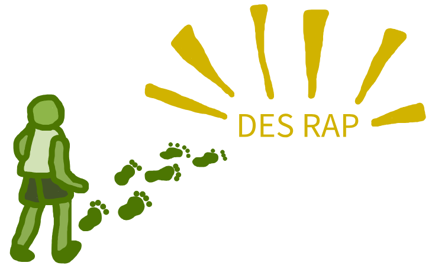

## How to use this guide

Work through each page **in order**. Follow along with the code examples as you go. You’ll gradually build up a working model and your skills as you progress.

Each section builds on the previous one. You can:

* Follow the explanations and instructions
* Copy and run the provided code
* Complete exercises at the end to test your understanding

{width=80% fig-align="center"}

### Language selection

Use the toggle above to switch between Python and R examples throughout.

::: {.cream}

::: {.python-content}
You have selected: <i class="fa-brands fa-python"></i> **Python**
:::

::: {.r-content}
You have selected: <i class="fa-brands fa-r-project"></i> **R**
:::

:::

### What you'll need

::: {.cream}

* Your chosen programming language installed (Python or R).
* A code editor or IDE (e.g., VSCode, RStudio, PyCharm, Positron).

:::

## Example models

[Four complete example repositories](/pages/examples/examples.qmd) show fully-implemented DES models. At the end of relevant pages, you'll see an **"Explore the example models"** callout pointing you to sections you can reference.

Work through the guide first to understand the fundamentals, then refer to the examples to see how concepts work in practice and adapt them for your own models.

:::: {.columns}

::: {.column width=30%}

 

:::

::: {.column width=70%}

:::

::::

 

---

**Ready? Let's get started.** [→ Next: Version control](/pages/guide/setup/version.qmd)