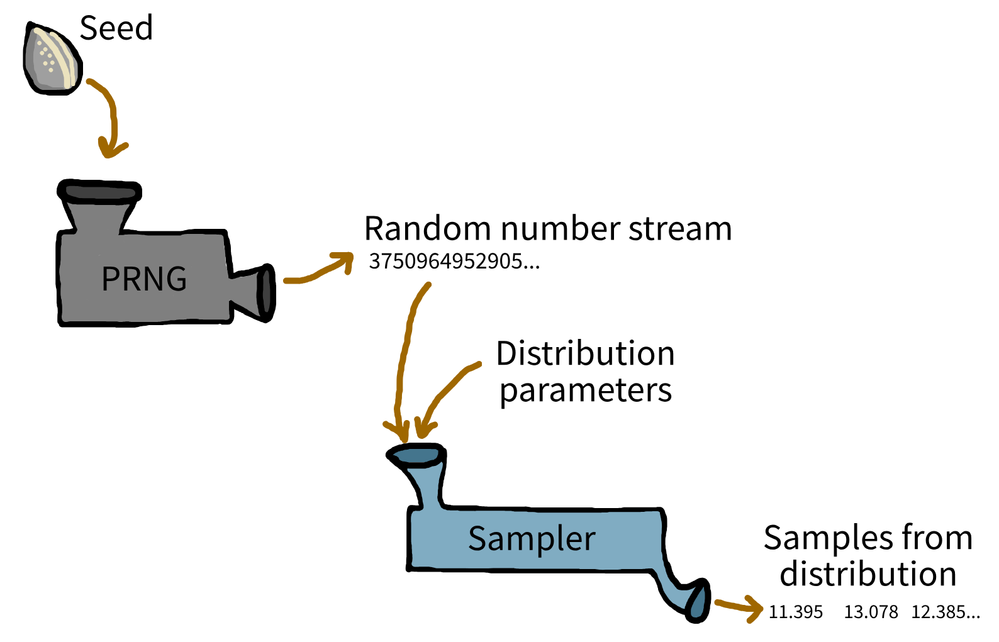



:::: {.pale-blue}

**Learning objectives:**

* Understand **randomness and pseudorandom** number generators.
* Explore **tools** for random sampling.
* Learn about **independent random number streams**.

**Relevant reproducibility guidelines:**

* STARS Reproducibility Recommendations: Control randomness.

::::

:::: {.very-pale-blue}

**Required packages:**

These should be available from environment setup in the "Test yourself" section of [Environments](../setup/environment.qmd).

::: {.python-content}

```{python}
import numpy as np
from sim_tools.distributions import Exponential, Normal
```

:::

::: {.r-content}

```{r}
#| output: false
library(simEd)
```

:::

::::

## Randomness

When simulating real-world systems (e.g. patients arriving, prescriptions queueing), using fixed values is unrealistic. Instead, **discrete-event simulations rely on randomness**: they generate event times and outcomes by sampling randomly from probability distributions.


However, computers can't generate "true" randomness. Instead, they use **pseudorandom number generators (PRNGs)**: algorithms which produce a sequence of numbers that appear random, but are in fact completely determined by an initial starting point called a **seed**. If you use the same seed, you'll get the same random sequence every time - a crucial feature for reproducibility in research and development.

By default, most software PRNGs initialise the seed based on something that changes rapidly, such as the current system time. This ensures a unique sequence with every fresh run. But for **reproducible experiments**, you should manually set the seed yourself, allowing you and others to exactly recreate simulation results.



## Introducing tools for random sampling

:::::: {.python-content}

<div class="h3-tight"></div>

### NumPy

NumPy is a widely used Python package for generating random numbers. Since NumPy version 1.17, the recommended approach for random sampling is through the new Generator API.

To start, create a **generator object** using `np.random.default_rng()`. This generator is an independent random number source and manages its own random state.
It offers methods for generating random samples from many distributions, such as normal, exponential, and uniform.

For example, to generate 3 samples from an exponential distribution (with a mean of 17):

```{python}
rng = np.random.default_rng()
rng.exponential(scale=17, size=3)
```

To ensure the same results everytime the code runs, initialise with a fixed seed:

```{python}
# Create a generator with a fixed seed for reproducibility
rng = np.random.default_rng(seed=20)

# Generate 3 samples from an exponential distribution (mean=17)
sample1 = rng.exponential(scale=17, size=3)

# Reset the generator with the same seed
rng = np.random.default_rng(seed=20)

# Generate 3 samples again (should be identical to the first run)
sample2 = rng.exponential(scale=17, size=3)

# Print the results
print(f"First run: {sample1}")
print(f"Second run (same seed): {sample2}")
```

#### Legacy API (not recommended for new code)

You might encounter older code using NumPy's legacy random number API. This approach sets a **global** seed and samples using functions like `np.random.exponential()`:

```{python}
np.random.seed(20)
np.random.exponential(scale=17, size=3)
```

### sim-tools

The [sim-tools](https://github.com/TomMonks/sim-tools) package (developed by Prof. Tom Monks) provides an object-oriented approach to sampling from a variety of statistical distributions.

`sim-tools` builds on NumPy's random number generator and distributions. This means you get the same reliable, well-tested methods, with a convenient object-oriented interface. The package also includes some additional distribution types and tools for simulation.

To use `sim-tools`, you import the class for the distribution you need, specify parameters, and then use the instance to generate samples. Each object has its own seed and random state.

For example:

```{python}
# Create an Exponential distribution object with mean 6 and seed 3
exp = Exponential(mean=6, random_seed=3)

# Generate 3 random samples
samples = exp.sample(size=3)
print(samples)
```

::::::

:::::: {.r-content}

In R, random sampling is typically done with functions from the `stats` package. To ensure reproducibility, set a global random seed with `set.seed()`. Then use the appropriate function for your desired distribution.

For example, the exponential distribution is sampled with `rexp()` which requires the rate parameter (the inverse of the mean). To generate 3 samples from an exponential distribution with a mean of 6, you would use:

```{r}
set.seed(3L)
rexp(n = 3L, rate = 1L / 6L)
```

::::::

## Independent random number streams

In your simulation, you often have **multiple distinct processes** that involve random sampling (e.g. patients arriving, consultation lengths, routing decisions).

If these processes share the **same random number generator**, changes in one part of your model (like altering the number of samples drawn for arrivals) can unintentionally **affect the random numbers used elsewhere**. This can introduce subtle, hard-to-detect errors, making your simulation **harder to debug and compare across scenarios**.

To demonstrate this problem, we will sample from two distributions: arrivals and processing times.

:::: {.python-content}

### Problem: shared generators

```{python}
rng = np.random.default_rng(1)
arrivals = rng.exponential(scale=3, size=3)
processing = rng.normal(loc=10, scale=2, size=3)

print(f"Arrivals: {arrivals}\nProcessing: {processing}")
```

Change to five arrivals samples:

```{python}
rng = np.random.default_rng(1)
arrivals = rng.exponential(scale=3, size=5)
processing = rng.normal(loc=10, scale=2, size=3)

print(f"Arrivals: {arrivals}\nProcessing: {processing}")
```

::: {.pale-red}

⚠️ **Processing samples have changed, despite no changes to their sampling code!**

This happens because both processes share a generator: drawing more arrival samples moves the random number sequence forward, so the processing draws start from a different place.
Each draw from the generator advances its internal "state", delivering the next pseudo-random number in the sequence. These states aren’t visible to the user, but are shown here as A, B, C, etc. for illustration.

**Sampling three arrivals:**

| RNG state | Arrival sample | Processing sample |
| :-: | :-: | :-: |
| A | 3.21908708 | - |
| B | 0.92535943 | - |
| C | 16.12631062 | - |
| D | - | 11.81071173 |
| E | - | 10.89274914 |
| F | - | 8.92609353 |

**Sampling five arrivals:**

Processing now uses states **F, G, H** instead of **D, E, F**.

| RNG state | Arrival sample | Processing sample |
| :-: | :-: | :-: |
| A | 3.21908708 | - |
| B | 0.92535943 | - |
| C | 16.12631062 | - |
| D | 1.09928134 | - |
| E | 0.34608612 | - |
| F | - | 8.92609353 |
| G | - | 11.16223621 |
| H | - | 10.72914479 |

This means that if you change arrivals from 3 to 5 samples, processing samples will change too, even if you didn’t touch their code, simply because both use the same random stream.

:::

### Solution: independent generators

```{python}
rng_a = np.random.default_rng(1)
rng_p = np.random.default_rng(2)
arrivals = rng_a.exponential(scale=3, size=3)
processing = rng_p.normal(loc=10, scale=2, size=3)

print(f"Arrivals: {arrivals}\nProcessing: {processing}")
```

```{python}
rng_a = np.random.default_rng(1)
rng_p = np.random.default_rng(2)
arrivals = rng_a.exponential(scale=3, size=5)
processing = rng_p.normal(loc=10, scale=2, size=3)

print(f"Arrivals: {arrivals}\nProcessing: {processing}")
```

::: {.pale-green}

✅ Processing samples remain the same.

:::

### sim-tools

The same rule applies for `sim-tools`: use one object per process, each with it's own seed.

```{python}
arrivals_exp = Exponential(mean=3, random_seed=1)
processing_norm = Normal(mean=10, sigma=2, random_seed=2)

arrivals = arrivals_exp.sample(3)
processing = processing_norm.sample(3)

print(f"Arrivals: {arrivals}\nProcessing: {processing}")
```

```{python}
arrivals_exp = Exponential(mean=3, random_seed=1)
processing_norm = Normal(mean=10, sigma=2, random_seed=2)

arrivals = arrivals_exp.sample(5)
processing = processing_norm.sample(3)

print(f"Arrivals: {arrivals}\nProcessing: {processing}")
```

::: {.pale-green}

✅ Processing samples remain the same.

:::

### Which package did we use?

We've used `sim-tools` for sampling in the example models in this book. This is because, with `sim-tools`, you're encouraged to use independent random number streams by design, as each distribution gets its own instance of a distribution class, each with its own parameters and random seed.

You can still use NumPy directly if you prefer - you'll just need to remember to deliberately create separate random generators, as it's not "enforced". If you don't explicitly create one per stream, it's easy to accidentally fall back on using a single generator. 

::::

:::: {.r-content}

### Problem: single random number stream

```{r}
set.seed(1L)
arrivals <- rexp(n = 3L, rate = 1L / 3L)
processing <- rnorm(n = 3L, mean = 10L, sd = 2L)

print(arrivals)
print(processing)
```

Change to five arrivals samples:

```{r}
set.seed(1L)
arrivals <- rexp(n = 5L, rate = 1L / 3L)
processing <- rnorm(n = 3L, mean = 10L, sd = 2L)

print(arrivals)
print(processing)
```

::: {.pale-red}

⚠️ **Processing samples have changed, despite no changes to their sampling code!**

This happens because both processes share a single random number generator: drawing more arrival samples moves the sequence forward, so the processing draws start from a different place. But in R, exactly how the random numbers are used depends not just on how many you draw, but which distributions you use and their internal algorithms.

Each call to a random function in R advances the internal generator, but different distributions might use up the stream at different rates. For example, generating one normal value might use more than one core random draw. So the link between arrival and processing samples - shown as A, B, C, etc. - only gives a rough idea, not an exact step-by-step mapping.

**Sampling three arrivals:**

| RNG state | Arrival sample | Processing sample |
| :-: | :-: | :-: |
| A | 2.2655455 | - |
| B | 3.5449283 | - |
| C | 0.4371202 | - |
| D | - | 12.65960 |
| E | - | 12.54486 |
| F | - | 10.82928 |

**Sampling five arrivals:**

Processing now uses states **F, G, H** instead of **D, E, F**.

| RNG state | Arrival sample | Processing sample |
| :-: | :-: | :-: |
| A | 2.2655455 | - |
| B | 3.5449283 | - |
| C | 0.4371202 | - |
| D | 0.4193858 | - |
| E | 1.3082059 | - |
| F | - | 6.920100 |
| G | - | 8.142866 |
| H | - | 9.410559 |

In R, changing how many samples you draw for one process will almost always change the random numbers used later - even more so when you mix different distributions. That’s why results can shift unexpectedly, even if you only changed the arrivals.

:::

### Solution: independent streams

By default, R's stats package uses a single random number stream and does not support managing multiple, independent streams.

The [`simEd`](https://cran.r-project.org/web/packages/simEd/index.html) package, last updated in 2023, provides equivalent functions that **allow separate random number streams**. The package is described in:

> B. Lawson and L. M. Leemis, “An R package for simulation education,” 2017 Winter Simulation Conference (WSC), Las Vegas, NV, USA, 2017, pp. 4175-4186, doi: 10.1109/WSC.2017.8248124 <https://ieeexplore.ieee.org/document/8248124>.

To use `simEd`, take the code from above but change the prefix on functions from `r` to `v` - so `rexp` becomes `vexp`, and `rnorm` becomes `vnorm`.

```{r}
set.seed(1L)
arrivals <- vexp(n = 3L, rate = 1L / 3L)
processing <- vnorm(n = 3L, mean = 10L, sd = 2L)

print(arrivals)
print(processing)
```

```{r}
set.seed(1L)
arrivals <- vexp(n = 5L, rate = 1L / 3L)
processing <- vnorm(n = 3L, mean = 10L, sd = 2L)

print(arrivals)
print(processing)
```

::: {.pale-green}

✅ Processing samples remain the same.

:::

::: {.callout-note title="👥 Acknowledgements"}

This section on `simEd` is adapted from the [R sampling](https://pythonhealthdatascience.github.io/stars-treat-simmer/02_model/03_r_sampling.html#using-the-simed-package) page in Monks, Thomas, Alison Harper, Amy Heather, and Navonil Mustafee. 2024. “**Towards Sharing Tools, Artifacts, and Reproducible Simulation: a ‘simmer‘ model example.**” Zenodo. <https://doi.org/10.5281/zenodo.11222943> (MIT Licence).

We also acknowledge the work of B. Lawson and L. M. Leemis for the `simEd` package and their contributions to simulation education.

:::

### Which package did we use?

We've used R's standard random sampling functions in the example models in this book. This is mainly because they're fast, even though all draws share a single global random stream. If you need independent streams, the `simEd` package allows for that, but it can slow things down—which is why we didn't use it here.

::::

### Is this a big deal?

These quirks with random number streams are **worth understanding**, especially for modellers concerned with detailed reproducibility, or if you find yourself debugging odd glitches in sensitivity analyses.

::: {.python-content}

With Python, it's easy to avoid pitfalls from shared random number streams - just use the new Generator API (`np.random.default_rng`) to create separate generators for each process in your simulation, rather than sharing a global one, or packages like `sim-tools`. That said, for most simulations, even if you use a single stream, the impact is usually minor - so it's not something to stress over.

:::

::: {.r-content}

For most everyday simulation work though, this isn't a disaster! In fact, for standard DES models in R (like our examples), it's quite normal to rely on the default setup - where all random draws come from a single, global stream. Unless you're doing really specialised work, like comparing many scenarios in fine detail, the impact on your results is typically minor.

:::

The key is simply to be **aware** of how shared random number streams work, so you aren't caught by surprise if results subtly shift when you tweak the simulation structure.

## What's next?

On [the next page](patients.qmd), we'll learn how to add sampling to your model through the example of generating some patients arriving in your simulation.

## Test yourself

```{r}
#| echo: false
library(webexercises) # nolint: library_call_linter
```

:::{.callout-note}

## What is a pseudorandom number generator (PRNG)?

```{r}
#| output: asis
#| echo: false
cat(longmcq(c(
  "A source of truly unpredictable numbers from physical processes",
  answer = paste0(
    "An algorithm that produces numbers that appear random but are determined",
    " by a starting seed"
  ),
  "A hardware device that measures system noise to generate randomness"
)))
```

:::

:::{.callout-note}

## What is the role of a seed in a PRNG?

```{r}
#| output: asis
#| echo: false
cat(longmcq(c(
  "It decides which distribution to sample from",
  answer = "It ensures reproducibility by fixing the random sequence",
  "It prevents correlation between distributions"
)))
```

:::

:::{.callout-note}

## Why is it recommended to use independent random number streams in simulation models?

```{r}
#| output: asis
#| echo: false
cat(longmcq(c(
  "To make the simulation run faster",
  "To avoid requiring a seed",
  answer = (
    "To prevent one process's sampling from shifting another process's results"
  )
)))
```

:::

:::: {.python-content}

::: {.callout-note}

## Which of the following statements best describes the difference between NumPy's legacy random API and the Generator API?

```{r}
#| output: asis
#| echo: false
cat(longmcq(c(
  "The legacy API supports more distributions",
  "The legacy API enforces independent random streams",
  answer = "The Generator API isolates random state per generator object",
  "They are functionally identical"
)))
```

:::

::: {.callout-note}

## In the `sim-tools` package, how do you ensure separate random number streams for different processes?

```{r}
#| output: asis
#| echo: false
cat(longmcq(c(
  "Use one global RNG across all distributions",
  answer = "Create one distribution object per process, each with its own seed",
  "Disable seeding entirely",
  "Use `np.random.seed()` globally"
)))
```

:::

::::

:::: {.r-content}

::: {.callout-note}

## What is the limitation of R's base random number generation for simulation?

```{r}
#| output: asis
#| echo: false
cat(longmcq(c(
  "It cannot set seeds",
  answer = (
    "It relies on a single global stream, making independent streams difficult"
  ),
  "It doesn't support exponential sampling"
)))
```

:::

::::

<br>

If you haven't already, try out **random sampling** for yourself!

::: {.python-content}
Have a go with **NumPy** and **sim-tools**.
:::
::: {.r-content}
Have a go with **base R** and **simEd**.
:::

* Sample random numbers from a distribution - try exponential, normal, or uniform.

* Set and change the seed, then sample again. Do you get the same results each time?

* Increase the number of samples for one process - see if results for other streams change.

<br><br>
