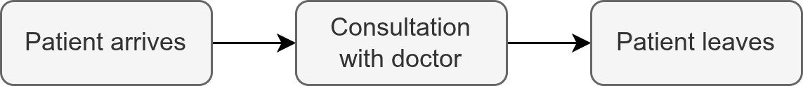
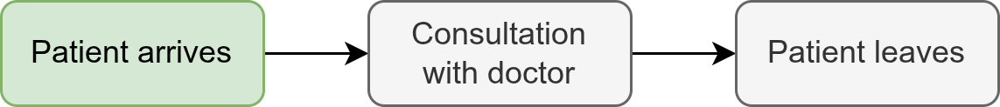

```{python}
#| echo: false
# pylint: disable=attribute-defined-outside-init, maybe-no-member
# pylint: disable=undefined-variable, used-before-assignment
```

:::: {.pale-blue}

**Learning objectives:**

* Create a **simple arrivals model**.
* Organise simulation distributions with a **registry**.

**Pre-reading:**

As this builds on concepts introduced in prior pages, we suggest first reading:

* [Parameters from script](../inputs/parameters_script.qmd)
* [Parameters from file](../inputs/parameters_file.qmd)
* [Randomness](distributions.qmd).

**Acknowledgements:** Inspired by Rosser et al. ([2025](https://des.hsma.co.uk/)).

::::

:::: {.very-pale-blue}

**Required packages:**

These should be available from environment setup on the [Structuring as a package](/pages/guide/setup/package.qmd) page.

::: {.python-content}

```{python}
import numpy as np
import simpy
from sim_tools.distributions import DistributionRegistry, Exponential
```

:::

::: {.r-content}

```{r}
library(simmer)
```

:::

::::

## Preparation: conceptual modelling

Before writing any code, it's important that you have defined a conceptual model of the process, as this will guide the design of your simulation. You also need to have defined all the necessary parameters. With these essentials in place, the process of building the simulation can start.

We will not describe how to design conceptual models in this book, but there are lots of resources available online, such as:

> Chwif, L., Banks, J., de Moura Filho, J. P., & Santini, B. (2013). A framework for specifying a discrete-event simulation conceptual model. Journal of Simulation, 7(1), 50–60. <https://doi.org/10.1057/jos.2012.18>.

In this book, we will building a simple model where patients arrive, wait to see a doctor, and then leave.

{fig-alt="DAG for simple model."}

This is similar to the [nurse visit simulation model](/pages/example_models/example_models.qmd#nurse-visit-simulation) (just with some differing parameters), whilst the [stroke pathway simulation](/pages/example_models/example_models.qmd#stroke-pathway-simulation) has a more complex conceptual model.

## Creating a simple simulation model with arrivals

::: {.blue}

The best approach to building your model is to go carefully **step by step**, testing and understanding each component before adding more complexity.

:::

In this book, our first step will be to write code that **generates arrivals into the system**, as highlighted in green:

{fig-alt="DAG with highlighted step 'Patient arrives'."}

::: {.python-content}

### Parameter class

First, we need an object with the simulation parameters. Here, we use a class similar to that on the [Parameters from script](../inputs/parameters_script.qmd) page, with some tweaks to the parameters contained.

```{python}
class Parameters:
    """
    Parameter class.

    Attributes
    ----------
    interarrival_time : float
        Mean time between arrivals (minutes).
    run_length : int
        Total duration of simulation (minutes).
    verbose : bool
        Whether to print messages as simulation runs.
    """
    def __init__(
        self, interarrival_time=5, run_length=50, verbose=True
    ):
        """
        Initialise Parameters instance.

        Parameters
        ----------
        interarrival_time : float
            Time between arrivals (minutes).
        run_length : int
            Total duration of simulation (minutes).
        verbose : bool
            Whether to print messages as simulation runs.
        """
        self.interarrival_time = interarrival_time
        self.run_length = run_length
        self.verbose = verbose
```

### Patient class

We'll create a class to represent patients. Classes are useful as they can keep track of state and group logic (see [Code organisation](../setup/code_structure.qmd) page for more).

For now, this will just have two attributes: `patient_id` and `arrival_time`. However, when we start tracking [Performance measures](../output_analysis/outputs.qmd), this class will be modified to store other attributes useful for output analysis.

```{python}
class Patient:
    """
    Represents a patient.

    Attributes
    ----------
    patient_id : int
        Unique patient identifier.
    arrival_time : float
        Time patient entered the system (minutes).
    """
    def __init__(self, patient_id, arrival_time):
        """
        Initialises a new patient.

        Parameters
        ----------
        patient_id : int
            Unique patient identifier.
        arrival_time : float
            Time patient entered the system (minutes).
        """
        self.patient_id = patient_id
        self.arrival_time = arrival_time
```

### Model class

We'll also create a class for the model. This class is explained line by line below.

::: {.callout-note title="Imports"}

The code within this book is shown as it runs inside a Quarto document, where modules are not arranged as a Python package and relative imports are not used.

In a package-based setup (as described on the [Structuring as a package](/pages/guide/setup/package.qmd) page), each module should include the appropriate imports (including local imports). For example:

```{.python}
import simpy
from .patient import Patient
```

A complete list of external imports is shown at the top of the page; when structuring your code as a package, you will also need to add the corresponding local imports in each module.

:::

```{python}
class Model:
    """
    Simulation model.

    Attributes
    ----------
    param : Parameters
        Simulation parameters.
    run_number : int
        Run number for random seed generation.
    env : simpy.Environment
        The SimPy environment for the simulation.
    patients : list
        List of Patient objects.
    arrival_dist : Exponential
        Distribution used to generate random patient inter-arrival times.
    """
    def __init__(self, param, run_number):
        """
        Create a new Model instance.

        Parameters
        ----------
        param : Parameters
            Simulation parameters.
        run_number : int
            Run number for random seed generation.
        """
        self.param = param
        self.run_number = run_number

        # Create SimPy environment
        self.env = simpy.Environment()

        # Create a random seed sequence based on the run number
        ss = np.random.SeedSequence(self.run_number)
        seeds = ss.spawn(1)

        # Set up attributes to store results
        self.patients = []

        # Initialise distributions
        self.arrival_dist = Exponential(
            mean=self.param.interarrival_time,
            random_seed=seeds[0]
        )

    def generate_arrivals(self):
        """
        Process that generates patient arrivals.
        """
        while True:
            # Sample and pass time to next arrival
            sampled_iat = self.arrival_dist.sample()
            yield self.env.timeout(sampled_iat)

            # Create a new patient
            patient = Patient(patient_id=len(self.patients)+1,
                              arrival_time=self.env.now)
            self.patients.append(patient)

            # Print arrival time
            if self.param.verbose:
                print(f"Patient {patient.patient_id} arrives " +
                      f"at time: {patient.arrival_time:.3f}")

    def run(self):
        """
        Run the simulation.
        """
        # Schedule arrival generator
        self.env.process(self.generate_arrivals())

        # Run the simulation
        self.env.run(until=self.param.run_length)
```

### Explaining the model class

```{.python}
def __init__(self, param, run_number):
    """
    Create a new Model instance.

    Parameters
    ----------
    param : Parameters
        Simulation parameters.
    run_number : int
        Run number for random seed generation.
    """
    self.param = param
    self.run_number = run_number
```

There are two arguments required by the initialiser: `param` and `run_number`.

The `param` argument accepts an instance of the `Parameters` object, which groups all necessary simulation values in one place. This minimises the number of arguments required by `Model`, as it only needs one input for parameters.

The `run_number` will be used when generating the random seeds. This is important when performing multiple replications, as it ensures each run gets a unique seed (see the [Replications](../output_analysis/replications.qmd) page for more details).

<br>

```{.python}
# Create SimPy environment
self.env = simpy.Environment()
```

A SimPy `Environment` is the main simulation container. Everything that happens in the simulation is managed inside this environment. It tracks the flow of time and manages when events, such as arrivals, should occur.

For example, when patient arrivals are added, the environment is responsible for controlling their timing and execution.

<br>

```{.python}
# Create a random seed sequence based on the run number
ss = np.random.SeedSequence(self.run_number)
seeds = ss.spawn(1)
```

[On the previous page](distributions.qmd), you saw how using separate random generators (streams) prevents changes in one process from affecting another. But to get truly independent random streams, you also need to make sure **those generators start with seeds that are themselves independent**. This avoids unwanted correlations and ensures reproducibility.

You might be tempted to create seeds for each generator using a simple pattern like: seed1 = `run_number`, seed2 = `run_number * 2`, seed = `run_number*3`.

However, it is more robust to use NumPy's `SeedSequence` method. You simply provide a single starter seed (e.g., `run_number`), then call `SeedSequence.spawn()` to generate a list of independent seeds. In this case, we just create a list with one seed (`spawn(1)`).

> **Why do we want independent seeds?** When you manually create seeds using simple rules (e.g., `+1`, `+2`), there's a chance that your random streams will end up correlated. These hidden correlations can make simulation results less reliable, particularly if you run many experiments, parallelise tasks, or rely on random streams interacting. `np.random.SeedSequence()` is specifically designed to produce seeds that will generate independent streams.

Independent seeding also helps you avoid subtle mistakes that can happen with manual schemes. For example, if you used `[run_number * 1, run_number * 2, run_number * 3]` to make seeds for different generators, then for `run_number = 0` every stream would get a seed of 0, making all your streams identical!

<br>

```{.python}
# Set up attributes to store results
self.patients = []
```

The `patients` list will store the `Patient` instances created for each arrival. The list stores references to the objects, so any changes made to a Patient's attributes after being added will be reflected in the list.

<br>

```{.python}
# Initialise distributions
self.arrival_dist = Exponential(
    mean=self.param.interarrival_time,
    random_seed=seeds[0]
)
```

We've used the `Exponential` distribution from `sim-tools` to generate inter-arrival times for patients.

<br>

```{.python}
def generate_arrivals(self):
    """
    Process that generates patient arrivals.
    """
    while True:
        # Sample and pass time to next arrival
        sampled_iat = self.arrival_dist.sample()
```

The `generate_arrivals` method is where patient arrivals are produced throughout the model run.

Using `while True` ensures the arrival generator continues to cycle and create new arrivals until the overall simulation time limit is reached.

Each time the loop cycles, it draws the next inter-arrival time from the exponential distribution, waits for that interval, and then triggers an arrival event.

<br>

```{.python}
yield self.env.timeout(sampled_iat)
```

The statement `yield self.env.timeout(sampled_iat)` is how the simulation waits between successive arrivals. It tells the SimPy environment to pause this arrivals process for the sampled time interval.

<br>

```{.python}
# Create a new patient
patient = Patient(patient_id=len(self.patients)+1,
                  arrival_time=self.env.now)
self.patients.append(patient)
```

Create an instance of the `Patient` class for each arrival, with a `patient_id` and `arrival_time`.

<br>

```{.python}
# Print arrival time
if self.param.verbose:
    print(f"Patient {patient.patient_id} arrives " +
          f"at time: {patient.arrival_time:.3f}")
```

Printing the time of each arrival gives a quick and visible check that the arrival process is working as expected. For now, simple print statements are effective, but this can later be replaced by a more sophisticated logging approach (see [Logging](logs.qmd)).

<br>

```{.python}
def run(self):
    """
    Run the simulation.
    """
    # Schedule arrival generator
    self.env.process(self.generate_arrivals())
```

Our final method in `Model` is `run`, which is responsible for setting up and running the simulation itself.

Before running the simulation, we have to tell SimPy that the process for creating arrivals should be managed as an "event generator" by calling `self.env.process()`. SimPy will now keep track of the arrival process and schedule its actions (timeouts and events) according to the rules laid out in our method.

<br>

```{.python}
# Run the simulation
self.env.run(until=self.param.run_length)
```

The simulation is now ready to go! We run it by calling `self.env.run()`, which will run the scheduled events until the desired end time is reached (taken from the `Parameters` object);

### Run the model

To try running the model, set up the parameters and model objects as shown, then call `run()`.

```{python}
param = Parameters()
model = Model(param=param, run_number=0)
model.run()
```

:::

:::: {.r-content}

### How to run the example code

The examples below can be run in a script, notebook, or as part of a package. Setup and imports differ slightly depending on your method; see below for details.

**Package structure** - recommended (see [Structuring as a package](../setup/package.qmd) page for more details)

* Create a package‑level documentation file with `usethis::use_package_doc()`, and add `@importFrom` tags there to declare the functions you use across the package.
* Run `devtools::document()` (to update imports in your `NAMESPACE`) and `devtools::load_all()` (to load your package and dependencies).
* You do not need `library()` calls in your analysis scripts: loading your package makes its exported functions, and any imported functions, available automatically.

**Script / Notebook**

* Start with necessary imports (e.g., `library(simmer)`).
* Use functions/class directly, or prefix with `simmer::`.
* Roxygen `@importFrom` tags do **not** affect scripts - but are included in case you choose to use the package structure.


### Imports

As mentioned above and on our [packaging](/pages/guide/setup/package.qmd) page, we will be listing imports for our simulation functions using package-level documentation, initially created with `usethis::use_package_doc()`.

For this page, we will add the following imports:

```{.r}
#' @keywords internal
"_PACKAGE"

## usethis namespace: start
#' @importFrom simmer add_generator run simmer timeout trajectory
## usethis namespace: end

NULL

```

### Parameter function

First, we need an object with the simulation parameters. Here, we use a function similar to that on the [Parameters from script](../inputs/parameters_script.qmd) page, with some tweaks to the parameters contained.

```{r}
#' Generate parameter list.
#'
#' @param interarrival_time Numeric. Time between arrivals (minutes).
#' @param run_length Numeric. Total duration of simulation (minutes).
#' @param verbose Boolean. Whether to print messages as simulation runs.
#'
#' @return A named list of parameters.
#' @export

create_params <- function(interarrival_time = 5L,
                          run_length = 50L,
                          verbose = TRUE) {
  list(
    interarrival_time = interarrival_time,
    run_length = run_length,
    verbose = verbose
  )
}
```

### Model function

We'll then create a function for the model (explained line by line below).

```{r}
#' Run simulation.
#'
#' @param param List. Model parameters.
#' @param run_number Numeric. Run number for random seed generation.
#'
#' @export

model <- function(param, run_number) {

  # Set random seed based on run number
  set.seed(run_number)

  # Create simmer environment
  env <- simmer("simulation", verbose = param[["verbose"]])

  # Define the patient trajectory
  patient <- trajectory("consultation") |>
    timeout(1L)

  env <- env |>
    # Add patient generator
    add_generator("patient", patient, function() {
      rexp(n = 1L, rate = 1L / param[["interarrival_time"]])
    }) |>
    # Run the simulation
    simmer::run(until = param[["run_length"]])

}
```

### Explaining the model function

```{.r}
#' Run simulation.
#'
#' @param param List. Model parameters.
#' @param run_number Numeric. Run number for random seed generation.
#' 
#' @export

model <- function(param, run_number) {
```

There are two arguments required by the function: `param` and `run_number`.

The `param` argument requires the named list of parameters from the `create_params()` function, which groups all necessary simulation values in one list. This minimises the number of arguments required by `model()`, as it only needs one input for parameters.

The `run_number` will be used when generating the random seeds. This is important when performing multiple replications, as it ensures each run gets a unique seed (see the [Replications](../output_analysis/replications.qmd) page for more details).

<br>

```{.r}
# Set random seed based on run number
set.seed(run_number)
```

A global random seed is set based on the `run_number`.

<br>

```{.r}
# Create simmer environment
env <- simmer("simulation", verbose = param[["verbose"]])
```

The simmer environment is the main simulation container. Everything that happens in the simulation is organised inside this environment. It tracks the flow of time and manages when events, such as arrivals, should occur.

For example, when patient arrivals are added, the environment is responsible for controlling their timing and execution.

The `verbose` argument is set to `TRUE` in `param`, and enables activity information to be printed during simulation execution. This gives a quick and visible check that the arrival process is working as expected. Custom logging approaches are explored later (see [Logging](logs.qmd)).

<br>

```{.r}
# Define the patient trajectory
patient <- trajectory("consultation") |>
  timeout(1)
```

In simmer, a trajectory must be defined for any type of arrival. It specifies the sequence of steps each arrival follows in the simulation. For now, we will just set a simple trajectory: `timeout(1)`, which means the arrival waits for one time unit, effectively doing nothing.

<br>

```{.r}
env <- env |>
  # Add patient generator
  add_generator("patient", patient, function() {
    rexp(n = 1L, rate = 1L / param[["interarrival_time"]])
  }) |>
  # Run the simulation
  simmer::run(until = param[["run_length"]])
```

We use `add_generator` to set up the patient arrivals. It uses the exponential distribution (`rexp()`) to sample inter-arrival times (with mean specified by `param`).

The simulation is then run for a specified duration using the `run()` method. Because some R packages also have a function `run`, its safest to use `simmer::run()` to avoid function name conflicts.

### Run the model

To try running the model, set up the parameters and run `model()`.

```{r}
param <- create_params()
model(param = param, run_number = 1L)
```

::::

## Distribution registry

In more advanced models, you may need multiple different random distributions (e.g., for arrivals, consultations, transfers, service times). Managing these with individual distribution objects quickly becomes tedious and can clutter your code.

::: {.python-content}

The `DistributionRegistry` class from `sim-tools` provides a structured way to organise all your distributions. Instead of instantiating each distribution separately, you define them in a single configuration dictionary and let the registry handle the set-up.

This will feel excessive for our basic example, but having a distribution registry can make things easier for larger models.

::: {.callout-note title="Modifying code"}

When you hover over the code below, any lines with changes will be highlighted in **bold**. The highlight may correspond to a change anywhere on that line, not necessarily to the entire line.

This example shows how you can adapt the code from above to use a *distribution registry* approach.

In later sections, we'll use similar annotations when demonstrating other modifications.

We recommend following along and adapting your code as shown. However, in subsequent chapters, we'll return to the simpler method rather than the distribution registry, so you may prefer to leave your code unchanged and simply read through this example.

:::

### Parameter class

In the `Parameters` class, distributions are now specified in a nested dictionary called `dist_config`. Each entry describes the distribution type and its parameters.

Here, the distribution type is hard-coded whilst the mean can be changed. This is fine in our simple example, but for more complex or flexible models, these settings would usually be read from an [external configuration file](../inputs/parameters_file.qmd), which allows for easier adjustment without hard coding.

```{python}
class Parameters:
    """
    Parameter class.

    Attributes
    ----------
    dist_config : dict#<<
        Holds all distribution specifications.#<<
    run_length : int
        Total duration of simulation (minutes).
    verbose : bool
        Whether to print messages as simulation runs.
    """
    def __init__(
        self, interarrival_time=5, run_length=50, verbose=True
    ):
        """
        Initialise Parameters instance.

        Parameters
        ----------
        interarrival_time : float
            Time between arrivals (minutes).
        run_length : int
            Total duration of simulation (minutes).
        verbose : bool
            Whether to print messages as simulation runs.
        """
        self.dist_config = {#<<
            "interarrival_time": {#<<
                "class_name": "Exponential",#<<
                "params": {"mean": interarrival_time}#<<
            }#<<
        }#<<
        self.run_length = run_length
        self.verbose = verbose
```

### Patient class

No changes needed!

### Model class

The model now uses `DistributionRegistry.create_batch()` to set up all required distributions at once.

This creates a dictionary and we can access specific distributions via e.g., `self.dist["interarrival_time"]`.

Seed spawning is now also handled by the registry.

```{python}
class Model:
    """
    Simulation model.

    Attributes
    ----------
    param : Parameters
        Simulation parameters.
    run_number : int
        Run number for random seed generation.
    env : simpy.Environment
        The SimPy environment for the simulation.
    patients : list
        List of Patient objects.
    arrival_dist : Exponential
        Distribution used to generate random patient inter-arrival times.
    """
    def __init__(self, param, run_number):
        """
        Create a new Model instance.

        Parameters
        ----------
        param : Parameters
            Simulation parameters.
        run_number : int
            Run number for random seed generation.
        """
        self.param = param
        self.run_number = run_number

        # Create SimPy environment
        self.env = simpy.Environment()

        # Set up attributes to store results
        self.patients = []

        # Create all the distributions#<<
        self.dist = DistributionRegistry.create_batch(#<<
            config=dict(self.param.dist_config), main_seed=self.run_number#<<
        )#<<
        if self.param.verbose:#<<
            print(self.dist)#<<

    def generate_arrivals(self):
        """
        Process that generates patient arrivals.
        """
        while True:
            # Sample and pass time to next arrival
            sampled_iat = self.dist["interarrival_time"].sample()#<<
            yield self.env.timeout(sampled_iat)

            # Create a new patient
            patient = Patient(patient_id=len(self.patients)+1,
                              arrival_time=self.env.now)
            self.patients.append(patient)

            # Print arrival time
            if self.param.verbose:
                print(f"Patient {patient.patient_id} arrives " +
                      f"at time: {patient.arrival_time:.3f}")

    def run(self):
        """
        Run the simulation.
        """
        # Schedule arrival generator
        self.env.process(self.generate_arrivals())

        # Run the simulation
        self.env.run(until=self.param.run_length)
```

### Run the model

We can see that results are consistent with before.

```{python}
param = Parameters()
model = Model(param=param, run_number=0)
model.run()
```

### Changes in results when switch to using distribution registry

If you switch from setting up distributions manually to using the sim-tools `DistributionRegistry`, you may see **differences in which seeds get used for your distributions**, even if your overall parameters and input seed stay the same. This is because the **order in which the seed sequence is assigned** to each distribution can change depending on your setup.

#### Manual set-up (you choose the assignment order)

Say you're simulating child and adult arrivals to a clinic. When you set up the distributions manually, you decide on which seeds are used. For example:

```{.python}
# Manual order: child first, adult second
child_arrival_dist = Exponential(mean=..., random_seed=seeds[0])
adult_arrival_dist = Exponential(mean=..., random_seed=seeds[1])
```

#### Registry set-up

If you use `DistributionRegistry.create_batch()` with `sort=True` (the default), the distributions are sorted alphabetically before assigning seeds. This means they are always initialised in a predictable, consistent order - regardless of how the configuration dictionary has been written. However, this will often mean changes from your manual approach. For example:

* Adult arrivals -> `seeds[0]`
* Child arrivals -> `seeds[1]`

With `sort=False`, seeds are assigned using the order in your configuration dictionary as written. This can mean it is consistent with your manual approach - although also means it will change if you change the order in the dictionary. For example:

* Child arrivals -> `seeds[0]`
* Adult arrivals -> `seeds[1]`

:::

::: {.r-content}

One solution is to write a `create_distribution_registry` function (based on `DistributionRegistry` in the Python package [sim-tools](https://github.com/sim-tools/sim-tools)) to provide a structured way to organise all your distributions. Instead of creating each distribution separately in the code, you define them in a single configuration dictionary and let the registry handle the set-up.

This will feel excessive for our basic example, but having a distribution registry can make things easier for larger models.

### Distribution registry

This is copied from the R stroke pathway example simulation model.



```{r}
#' Transform mean/sd on original scale to meanlog/sdlog for
#' lognormal
#'
#' @param params A list with elements `mean` and `sd` (on
#'   original scale).
#' @return A list with elements `meanlog` and `sdlog`.
#' @export

transform_to_lnorm <- function(params) {
  variance <- params$sd^2L
  sigma_sq <- log(variance / (params$mean^2L) + 1L)
  sdlog <- sqrt(sigma_sq)
  meanlog <- log(params$mean) - sigma_sq / 2L
  list(meanlog = meanlog, sdlog = sdlog)
}


#' Validate a single sampler config element
#'
#' @param cfg A list expected to contain `class_name` and `params` elements.
#' @return Invisibly `NULL` on success; stops with an error otherwise.
#' @export

validate_single_config <- function(cfg) {
  if (!is.list(cfg)) {
    stop("Each element of 'config' must be a list.", call. = FALSE)
  }
  if (is.null(cfg$class_name)) {
    stop(
      "Each config element must have a 'class_name' entry.",
      call. = FALSE
    )
  }
  if (is.null(cfg$params) || !is.list(cfg$params)) {
    stop(
      "Each config element must have a 'params' list.",
      call. = FALSE
    )
  }
  invisible(NULL)
}


#' Create a distribution registry
#'
#' @description
#' Creates a distribution registry that manages and generates
#' parameterised samplers for a variety of probability
#' distributions. Common distributions are included by default,
#' and more can be added.
#'
#' Once defined, you can create sampler objects for each
#' distribution - individually (`dist_create`) or in batches
#' (`dist_create_batch`) - and then easily draw random samples
#' from these objects.
#'
#' @return A list containing registry functions and data.
#' @export

create_distribution_registry <- function() {

  # Internal registry storage
  registry <- new.env(parent = emptyenv())

  # ===== Register default distributions =====

  registry[["exponential"]] <- function(mean) {
    function(size = 1L) rexp(size, rate = 1L / mean)
  }

  registry[["uniform"]] <- function(min, max) {
    function(size = 1L) runif(size, min = min, max = max)
  }

  registry[["discrete"]] <- function(values, prob) {
    values <- unlist(values)
    prob <- unlist(prob)

    stopifnot(length(values) == length(prob), prob >= 0L)

    if (round(abs(sum(prob) - 1L), 2L) > 0.01) {
      stop(
        sprintf(
          "'prob' must sum to 1 +- 0.01. Sum: %s",
          abs(sum(unlist(prob)))
        ),
        call. = FALSE
      )
    }

    function(size = 1L) {
      sample(values, size = size, replace = TRUE, prob = prob)
    }
  }

  registry[["normal"]] <- function(mean, sd) {
    function(size = 1L) rnorm(size, mean = mean, sd = sd)
  }

  registry[["lognormal"]] <- function(meanlog = NULL, sdlog = NULL,
                                      mean = NULL, sd = NULL) {
    # If meanlog/sdlog provided, use them directly
    if (!is.null(meanlog) && !is.null(sdlog)) {
      function(size = 1L) {
        rlnorm(size, meanlog = meanlog, sdlog = sdlog)
      }

    } else if (!is.null(mean) && !is.null(sd)) {

      # Transform mean/sd to meanlog/sdlog
      params <- transform_to_lnorm(list(mean = mean, sd = sd))
      function(size = 1L) {
        rlnorm(size,
               meanlog = params$meanlog,
               sdlog  = params$sdlog)
      }

    } else {
      stop(
        "Please supply either 'meanlog' and 'sdlog', or 'mean' and 'sd' ",
        "for a lognormal distribution.",
        call. = FALSE
      )
    }
  }

  registry[["poisson"]] <- function(lambda) {
    function(size = 1L) rpois(size, lambda = lambda)
  }

  registry[["binomial"]] <- function(size_param, prob) {
    function(size = 1L) {
      rbinom(size, size = size_param, prob = prob)
    }
  }

  registry[["geometric"]] <- function(prob) {
    function(size = 1L) rgeom(size, prob = prob)
  }

  registry[["beta"]] <- function(shape1, shape2) {
    function(size = 1L) {
      rbeta(size, shape1 = shape1, shape2 = shape2)
    }
  }

  registry[["gamma"]] <- function(shape, rate) {
    function(size = 1L) {
      rgamma(size, shape = shape, rate = rate)
    }
  }

  registry[["chisq"]] <- function(df) {
    function(size = 1L) rchisq(size, df = df)
  }

  registry[["student_t"]] <- function(df) {
    function(size = 1L) rt(size, df = df)
  }

  # ===== Public API =====

  # Register a new distribution
  register <- function(name, generator, overwrite = FALSE) {
    if (!overwrite && exists(name, envir = registry, inherits = FALSE)) {
      stop(
        sprintf(
          "Distribution '%s' already exists. Set overwrite = TRUE ",
          "to replace it."
        ),
        call. = FALSE
      )
    }
    assign(name, generator, envir = registry)
    invisible(TRUE)
  }

  # Get a registered distribution generator
  get_distribution <- function(name) {
    if (!exists(name, envir = registry, inherits = FALSE)) {
      stop(
        sprintf(
          paste0(
            "Distribution '%s' not found.\n",
            "Available distributions:\n\t%s\n",
            "Use register() to add new distributions."
          ),
          name,
          toString(ls(envir = registry))
        ),
        call. = FALSE
      )
    }
    get(name, envir = registry, inherits = FALSE)
  }

  # Create a parameterised sampler
  create_sampler <- function(name, ...) {
    generator <- get_distribution(name)
    arg_list <- list(...)

    formals_names <- names(formals(generator))
    if (!is.null(formals_names)) {
      extra_args <- setdiff(names(arg_list), formals_names)
      if (length(extra_args) > 0L) {
        warning(
          sprintf(
            "Unused argument(s) for distribution '%s': %s",
            name,
            toString(extra_args)
          ),
          call. = FALSE
        )
      }
    }

    do.call(generator, arg_list)
  }

  # Create multiple samplers from config
  # Each element of `config` is expected to be a list with
  # components:
  #   - class_name: name of the registered distribution
  #   - params: list of parameters to pass to that distribution's
  #     generator
  create_batch <- function(config) {
    if (!is.list(config)) {
      stop("config must be a list (named or unnamed).", call. = FALSE)
    }

    lapply(config, function(cfg) {
      validate_single_config(cfg)
      do.call(create_sampler, c(list(cfg$class_name), cfg$params))
    })
  }

  # Return public API as a list
  list(
    register = register,
    get = get_distribution,
    create = create_sampler,
    create_batch = create_batch,
    transform_to_lnorm = transform_to_lnorm
  )
}
```

### Parameter function

In the `create_params` function, distributions are now specified in a nested list called `dist_config`. Each entry describes the distribution type and its parameters.

Here, the distribution type is hard-coded whilst the mean can be changed. This is fine in our simple example, but for more complex or flexible models, these settings would usually be read from an [external configuration file](../inputs/parameters_file.qmd), which allows for easier adjustment without hard coding.

::: {.callout-note title="Modifying code"}

When you hover over the code below, any lines with changes will be highlighted in **bold**. The highlight may correspond to a change anywhere on that line, not necessarily to the entire line.

This example shows how you can adapt the code from above to use a *distribution registry* approach.

In later sections, we'll use similar annotations when demonstrating other modifications.

We recommend following along and adapting your code as shown. However, in subsequent chapters, we'll return to the simpler method rather than the distribution registry, so you may prefer to leave your code unchanged and simply read through this example.

:::

```{r}
#' Generate parameter list.
#'
#' @param interarrival_time Numeric. Time between arrivals (minutes).
#' @param run_length Numeric. Total duration of simulation (minutes).
#' @param verbose Boolean. Whether to print messages as simulation runs.
#'
#' @return A named list of parameters.
#' @export

create_params <- function(interarrival_time = 5L,
                          run_length = 50L,
                          verbose = TRUE) {
  list(
    dist_config = list(#<<
      interarrival_time = list(#<<
        class_name = "exponential", #<<
        params = list(mean = interarrival_time)#<<
      )#<<
    ), #<<
    run_length = run_length,
    verbose = verbose
  )
}
```

### Model function

```{r}
#' Run simulation.
#'
#' @param param List. Model parameters.
#' @param run_number Numeric. Run number for random seed generation.
#'
#' @importFrom simmer add_generator run simmer timeout trajectory
#'
#' @export

model <- function(param, run_number) {

  # Set random seed based on run number
  set.seed(run_number)

  # Create simmer environment
  env <- simmer("simulation", verbose = param[["verbose"]])

  # Set up sampling distributions #<<
  registry <- create_distribution_registry() #<<
  param[["dist"]] <- registry$create_batch( #<<
    as.list(param[["dist_config"]]) #<<
  ) #<<

  # Define the patient trajectory
  patient <- trajectory("consultation") |>
    timeout(1L)

  env <- env |>
    # Add patient generator
    add_generator("patient", patient, function() {
      param[["dist"]][["interarrival_time"]]() #<<
    }) |>
    # Run the simulation
    simmer::run(until = param[["run_length"]])

}
```

### Run the model

We can see that results are consistent with before.

```{r}
param <- create_params()
model(param = param, run_number = 1L)
```

:::

## Explore the example models

<div class="h3-tight"></div>

### Nurse visit simulation

:::: {.python-content}



::: {.blue-table}
| | |
| - | - |
| **Key file** | `simulation/param.py`<br>`simulation/patient.py`<br>`simulation/model.py` |
| **What to look for?** | The structure is similar to the first example on this page. The `Param` class (in `param.py`) stores all simulation settings, including `patient_inter`. The `Model` class (in `model.py`) sets up the simulation environment, initialises the required distribution for arrivals, and `generate_patient_arrivals()` samples inter-arrival times and triggers arrivals. |
| **Why it matters?** | Clear simple set-up with separation of parameters and model logic. |
: {tbl-colwidths="[20,80]"}
:::
::::

:::: {.r-content}



::: {.blue-table}
| | |
| - | - |
| **Key file** | `R/parameters.R`<br>`simulation/patient.py`<br>`R/model.R` |
| **What to look for?** | The structure is similar to the first example on this page. The `parameters` function stores all simulation settings, including `patient_inter`. The `model` function sets up the simulation environment, creates a patient arrival generator, and runs the simulation. |
| **Why it matters?** | Clear simple set-up with separation of parameters and model logic. |
: {tbl-colwidths="[20,80]"}
:::
::::

### Stroke pathway simulation

:::: {.python-content}



::: {.blue-table}
| | |
| - | - |
| **Key file** | `simulation/parameters.py`<br>`simulation/model.py` |
| **What to look for?** | The model uses a `DistributionRegistry` to manage multiple distributions for different entities and processes. The `dist_config` from `Param` (`parameters.py`) is used by the registry. The dictionary of distributions is nested for easy access - restructured as `dist[type][unit][patient]`. Arrivals are generated using the adaptable `patient_generator()` method, which selects the appropriate distribution to sample based on patient type and unit. |
| **Why it matters?** | Using a distribution registry and a flexible arrival generator method avoids repeated, hard-coded logic and simplifies maintenance in this more complex model. |
: {tbl-colwidths="[20,80]"}
:::
::::

:::: {.r-content}



::: {.blue-table}
| | |
| - | - |
| **Key file** | `inst/extdata/parameters.json`<br>`R/parameters.R`<br>`R/model.R`<br>`R/distribution_registry.R` |
| **What to look for?** | The model uses `create_distribution_registry()` to manage multiple distributions for different entities and processes. The `dist_config` from `parameters()` is used by the registry. The list of distributions is nested for easy access - restructured as `dist[type][unit][patient]`. The arrival generator is created using the `add_patient_generator()` functions, which sets up an appropriate distribution to sample based on patient type and unit. |
| **Why it matters?** | Using a distribution registry and a flexible arrival generator method avoids repeated, hard-coded logic and simplifies maintenance in this more complex model. |
: {tbl-colwidths="[20,80]"}
:::
::::

## Test yourself

Have a go at setting up a basic simulation model with entity generation, while following good package organisation.

**Task:**

::: {.python-content}

1. **Copy the code:** Take `Parameters` and `Model` class from above (simple or with distribution registry) and place them in modules within your package (e.g., `parameters.py` and `model.py` within a `simulation/` folder).

2. **Set up a notebook:** Create a new notebook file (e.g., `notebooks/run_model.ipynb`).

3. **Import and run the model:** From your notebook, import `Parameters` and `Model` from your package and run the model.

:::

::: {.r-content}

1. **Copy the code:** Take the `create_params()` and `model()` functions from above (simple or with distributoin registry) and place them in modules within your package (e.g., `create_params.R` and `model.R` within an `R/` folder).

2. **Set up an Rmarkdown file:** Create a new Rmarkdown file (e.g., `rmarkdown/run_model.Rmd`).

3. **Import and run the model:** From your Rmarkdown file, import `create_params` and `model` from your package and run the model.

:::

4. **Experiment:**
    * If you copied the simple versions, try using the versions with distribution registries, and vice versa.
    * Try different seeds by varying `run_number` in your notebook.
    * Try adding a new arrival type - add the distribution parameters in `Parameters`, and see how you can sample from them in `Model`.

::: {.callout-tip}

If you are unsure how to organise your code as a package, checkout out the [Structuring as a Package](../setup/package.qmd) page for a tutorial on this.

:::

## Further information

::: {.python-content}

* "[HSMA - little book of DES](https://des.hsma.co.uk/)" from Sammi Rosser, Dan Chalk and Amy Heather 2025

    *Introduction to writing discrete event simulation models for healthcare in SimPy.*

:::

::: {.r-content}

N/A

:::

<br><br>
