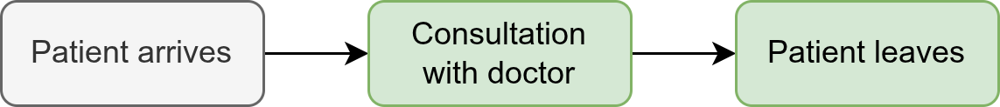

:::: {.pale-blue}

**Learning objectives:**

* Add a **resource-based process** (doctor consultation) to the model.

**Pre-reading:**

This page continues on from: [Entity generation](patients.qmd).

> *Entity generation → Entity processing*

**Acknowledgements:** Inspired by Rosser et al. ([2025](https://des.hsma.co.uk/)).

::::

:::: {.very-pale-blue}

**Required packages:**

The following imports are required. These should be available from environment setup on the [Structuring as a package](/pages/guide/setup/package.qmd) page.

::: {.python-content}

```{python}
import numpy as np
import simpy
from sim_tools.distributions import Exponential
```

:::

::: {.r-content}

```{r}
library(simmer)
```

:::

::::

## Adding a consultation with a doctor to the model

On this page, you will extend the model from the previous page by adding a consultation with a doctor and then logging patients as having departed, as shown in green in the diagram below.

{fig-alt="DAG with highlighted steps 'Consultation with doctor' and 'Patient leaves'."}

<br>

You can hover over the code to see the changes highlighted in **bold**. The highlight may correspond to a change anywhere on that line, not necessarily to the entire line. Follow along and modify your code as indicated to add the consultation step to your model.

::: {.python-content}

### Parameter class

There are two new parameters: `consultation_time` and `number_of_doctors`.

```{python}
class Parameters:
    """
    Parameter class.

    Attributes
    ----------
    interarrival_time : float
        Mean time between arrivals (minutes).
    consultation_time : float#<<
        Mean length of doctor's consultation (minutes).#<<
    number_of_doctors : int#<<
        Number of doctors.#<<
    run_length : int
        Total duration of simulation (minutes).
    verbose : bool
        Whether to print messages as simulation runs.
    """
    def __init__(
        self, interarrival_time=5, consultation_time=10,#<<
        number_of_doctors=3, run_length=50, verbose=True#<<
    ):
        """
        Initialise Parameters instance.

        Parameters
        ----------
        interarrival_time : float
            Time between arrivals (minutes).
        consultation_time : float#<<
            Length of consultation (minutes).#<<
        number_of_doctors : int#<<
            Number of doctors.#<<
        run_length : int
            Total duration of simulation (minutes).
        verbose : bool
            Whether to print messages as simulation runs.
        """
        self.interarrival_time = interarrival_time
        self.consultation_time = consultation_time#<<
        self.number_of_doctors = number_of_doctors#<<
        self.run_length = run_length
        self.verbose = verbose
```

### Patient class

No changes needed!

```{python}
class Patient:
    """
    Represents a patient.

    Attributes
    ----------
    patient_id : int
        Unique patient identifier.
    arrival_time : float
        Time patient entered the system (minutes).
    """
    def __init__(self, patient_id, arrival_time):
        """
        Initialises a new patient.

        Parameters
        ----------
        patient_id : int
            Unique patient identifier.
        arrival_time : float
            Time patient entered the system (minutes).
        """
        self.patient_id = patient_id
        self.arrival_time = arrival_time
```

### Model class

These changes are explained below...

```{python}
class Model:
    """
    Simulation model.

    Attributes
    ----------
    param : Parameters
        Simulation parameters.
    run_number : int
        Run number for random seed generation.
    env : simpy.Environment
        The SimPy environment for the simulation.
    doctor : simpy.Resource#<<
        SimPy resource representing doctors.#<<
    patients : list
        List of Patient objects.
    arrival_dist : Exponential
        Distribution used to generate random patient inter-arrival times.
    consult_dist : Exponential#<<
        Distribution used to generate length of a doctor's consultation.#<<
    """
    def __init__(self, param, run_number):
        """
        Create a new Model instance.

        Parameters
        ----------
        param : Parameters
            Simulation parameters.
        run_number : int
            Run number for random seed generation.
        """
        self.param = param
        self.run_number = run_number

        # Create SimPy environment
        self.env = simpy.Environment()

        # Create resource
        self.doctor = simpy.Resource(#<<
            self.env, capacity=self.param.number_of_doctors#<<
        )#<<

        # Create a random seed sequence based on the run number
        ss = np.random.SeedSequence(self.run_number)
        seeds = ss.spawn(2)#<<

        # Set up attributes to store results
        self.patients = []

        # Initialise distributions
        self.arrival_dist = Exponential(mean=self.param.interarrival_time,
                                        random_seed=seeds[0])
        self.consult_dist = Exponential(mean=self.param.consultation_time,#<<
                                        random_seed=seeds[1])#<<

    def generate_arrivals(self):
        """
        Process that generates patient arrivals.
        """
        while True:
            # Sample and pass time to next arrival
            sampled_iat = self.arrival_dist.sample()
            yield self.env.timeout(sampled_iat)

            # Create a new patient
            patient = Patient(patient_id=len(self.patients)+1,
                              arrival_time=self.env.now)
            self.patients.append(patient)

            # Print arrival time
            if self.param.verbose:
                print(f"Patient {patient.patient_id} arrives " +
                      f"at time: {patient.arrival_time:.3f}")

            # Start process of consultation#<<
            self.env.process(self.consultation(patient))#<<

    def consultation(self, patient):#<<
        """#<<
        Process that simulates a consultation.#<<

        Parameters#<<
        ----------#<<
        patient :#<<
            Instance of the Patient() class representing a single patient.#<<
        """#<<
        # Patient requests access to a doctor (resource)#<<
        with self.doctor.request() as req:#<<
            yield req#<<

            if self.param.verbose:#<<
                print(f"Patient {patient.patient_id} starts consultation " +#<<
                      f"at: {self.env.now:.3f}")#<<

            # Sample consultation duration and pass time spent with doctor#<<
            time_with_doctor = self.consult_dist.sample()#<<
            yield self.env.timeout(time_with_doctor)#<<

            # Record end time#<<
            if self.param.verbose:#<<
                print(f"Patient {patient.patient_id} " +#<<
                      f"leaves at: {self.env.now:.3f}")#<<

    def run(self):
        """
        Run the simulation.
        """
        # Schedule arrival generator
        self.env.process(self.generate_arrivals())

        # Run the simulation
        self.env.run(until=self.param.run_length)

```

<br>

#### Explaining changes to the model class

```{.python}
# Create resource
self.doctor = simpy.Resource(                                       
    self.env, capacity=self.param.number_of_doctors                 
)
```

This creates a resource called doctor using SimPy. It represents the group of doctors, with the number available set up `number_of_doctors`.

In simulations, a resource is something a process (here, a patient) needs to use, but only a limited number can access it at once - patients will wait if all doctors are busy.

<br>

```{.python}
seeds = ss.spawn(2)
```

We now create two seeds: one for patient arrivals and one for consultations.

<br>

```{.python}
self.consult_dist = Exponential(mean=self.param.consultation_time,  
                                random_seed=seeds[1])
```

Alike arrivals, the length of each consultation is sampled from an exponential distribution using the sim-tools `Exponential` class.

<br>

```{.python}
# Start process of consultation                                 
self.env.process(self.consultation(patient))
```

As soon as a patient arrives, we tell SimPy to begin handling this patient's consultation using `self.env.process()`.

SimPy uses a process-based approach - see the section on [how DES models advance time and handle events](/pages/intros/des.qmd) on the DES page for an explanation of how this works.

<br>

```{.python}
def consultation(self, patient):
    """
    Process that simulates a consultation.

    Parameters
    ----------
    patient :
        Instance of the Patient() class representing a single patient.
    """  
    # Patient requests access to a doctor (resource)
    with self.doctor.request() as req:
        yield req

        if self.param.verbose:
            print(f"Patient {patient.patient_id} starts consultation " +
                  f"at: {self.env.now:.3f}")

```

Each patient asks for a doctor using `self.doctor.request()`. If they're all busy, the patient waits in a queue until one is free.

Once a doctor is available, SimPy assigns the resource to that patient, and the consultation start time is printed.

<br>

```{.python}
# Sample consultation duration and pass time spent with doctor
time_with_doctor = self.consult_dist.sample()
yield self.env.timeout(time_with_doctor)

# Record end time
if self.param.verbose:
    print(f"Patient {patient.patient_id} " +
            f"leaves at: {self.env.now:.3f}")
```

The duration of the consultation is then randomly sampled from the distribution set up earlier. The simulation then waits for this amount of time using `timeout()`, after which the doctor is released and free for the next patient.

### Run the model

```{python}
param = Parameters()
model = Model(param=param, run_number=0)
model.run()
```

:::

:::: {.r-content}

### Imports

We need some more functions from `simmer`: `add_resource`, `release` and `seize`.

```{.r}
#' @keywords internal
"_PACKAGE"

## usethis namespace: start
#' @importFrom simmer add_generator add_resource release run seize simmer #<<
#' @importFrom simmer timeout trajectory
## usethis namespace: end

NULL

```

### Parameter function

There are two new parameters: `consultation_time` and `number_of_doctors`.

```{r}
#' Generate parameter list.
#'
#' @param interarrival_time Numeric. Time between arrivals (minutes).
#' @param consultation_time Numeric. Mean length of doctor's#<<
#'   consultation (minutes).#<<
#' @param number_of_doctors Numeric. Number of doctors.#<<
#' @param run_length Numeric. Total duration of simulation (minutes).
#' @param verbose Boolean. Whether to print messages as simulation runs.
#'
#' @return A named list of parameters.
#' @export

create_params <- function(
  interarrival_time = 5L,
  consultation_time = 10L, #<<
  number_of_doctors = 3L, #<<
  run_length = 50L,
  verbose = TRUE
) {
  list(
    interarrival_time = interarrival_time,
    consultation_time = consultation_time, #<<
    number_of_doctors = number_of_doctors, #<<
    run_length = run_length,
    verbose = verbose
  )
}
```

### Model function

We make two main changes to the `model()` function.

* **Patient trajectory.** Patients must now wait for a doctor, spend a random amount of time in consultation (`timeout()` with `rexp()` function), and then release a doctor.

* **Doctor resource setup.** The simulation environment adds a "doctor" resource with a specified capacity (`number_of_doctors`) using the `add_resource()` function.

```{r}
#' Run simulation.
#'
#' @param param List. Model parameters.
#' @param run_number Numeric. Run number for random seed generation.
#'
#' @export

model <- function(param, run_number) {

  # Set random seed based on run number
  set.seed(run_number)

  # Create simmer environment
  env <- simmer("simulation", verbose = param[["verbose"]])

  # Define the patient trajectory
  patient <- trajectory("consultation") |>
    seize("doctor", 1L) |> #<<
    timeout(function() { #<<
      rexp(n = 1L, rate = 1L / param[["consultation_time"]]) #<<
    }) |> #<<
    release("doctor", 1L) #<<

  env <- env |>
    # Add doctor resource #<<
    add_resource("doctor", param[["number_of_doctors"]]) |> #<<
    # Add patient generator
    add_generator("patient", patient, function() {
      rexp(n = 1L, rate = 1L / param[["interarrival_time"]])
    }) |>
    # Run the simulation
    simmer::run(until = param[["run_length"]])

}
```

### Run the model

```{r}
param <- create_params()
model(param = param, run_number = 1L)
```

<br>

::: {.callout-note title="How to interpret simmer's print messages"}

Now we've added a resource-based process, this output may appear a little confusing! To make sense of it, let's work through some examples...

<br>

**Example with no waiting: `patient0`**

The patient arrives at 3.77591.

```
         0 |    source: patient          |       new: patient0         | 3.77591
```

Immediately, they request a doctor (`Seize`). There is one available (`SERVE`).

```
   3.77591 |   arrival: patient0         |  activity: Seize            | doctor, 1, 0 paths
   3.77591 |  resource: doctor           |   arrival: patient0         | SERVE
```

The consultation begins (`Timeout`).

```
   3.77591 |   arrival: patient0         |  activity: Timeout          | function()
```

The consultation finishes at 5.23298, and the patient leaves.

```
   5.23298 |   arrival: patient0         |  activity: Release          | doctor, 1
   5.23298 |  resource: doctor           |   arrival: patient0         | DEPART
   5.23298 |      task: Post-Release     |          :                  | 
```

<br>

**Example with waiting: `patient6`**

The patient arrives at 32.1017.

```
   28.2916 |    source: patient          |       new: patient6         | 32.1017
```

They request a doctor (`Seize`), but none are available, so they join a queue (`ENQUEUE`).

```
   32.1017 |   arrival: patient6         |  activity: Seize            | doctor, 1, 0 paths
   32.1017 |  resource: doctor           |   arrival: patient6         | ENQUEUE
```

At 34.4236, a doctor becomes available (`SERVE`) and their consultation begins (`Timeout`).

```
   34.4236 |  resource: doctor           |   arrival: patient6         | SERVE
   34.4236 |   arrival: patient6         |  activity: Timeout          | function()
```

At 44.969, their consultation ends.

```
    44.969 |   arrival: patient6         |  activity: Release          | doctor, 1
    44.969 |  resource: doctor           |   arrival: patient6         | DEPART
    44.969 |      task: Post-Release     |          :                  | 
```

<br>

You can create custom logs which are easier to interpret - see the [Logging](logs.qmd) page.

:::

::::

## Explore the example models

<div class="h3-tight"></div>

### Nurse visit simulation

:::: {.python-content}



::: {.blue-table}
| | |
| - | - |
| **Key file** | `simulation/param.py`<br>`simulation/patient.py`<br>`simulation/model.py`<br>`simulation/monitoredresource.py` |
| **What to look for?** | This is similar to our example above - though it uses a custom `MonitoredResource` class instead of `simpy.Resource()`. Additionally, the patient's times (e.g. arrival, consultation length) are saved as attributes. |
| **Why it matters?** | `MonitoredResource` is introduced to support performance measurement (see [Performance measures](../output_analysis/outputs.qmd)). For the core process of seizing a resource, it functions the same as a standard `simpy.Resource()`. Storing the times is also only relevant for later performance analysis. |
: {tbl-colwidths="[20,80]"}
:::

::::

:::: {.r-content}



::: {.blue-table}
| | |
| - | - |
| **Key file** | `R/parameters.R`<br>`R/model.R` |
| **What to look for?** | This is similar to our example above, except that the time spent with the nurse resource is sampled and set as an attribute (`set_attribute()`), then the `timeout()` function retrieves this attribute. |
| **Why it matters?** | This general process of adding and seizing resources is pretty simple, but the model uses attributes as we needed a record of their time with the resource for a [performance measure](../output_analysis/outputs.qmd) |
: {tbl-colwidths="[20,80]"}
:::

::::

### Stroke pathway simulation

:::: {.python-content}



::: {.blue-table}
| | |
| - | - |
| **Key file** | `simulation/patient.py`<br>`simulation/model.py` |
| **What to look for?** | No `simpy.Resource()` are used! Instead of a consultation length, they will sample their length of stay and transfer destination. |
| **Why it matters?** | The hospital units are modelled as having infinite capacity - so no resources are used, as patients never have to queue. This means that occupancy metrics reflect demand without artificial caps, so the model provides unbiased estimates of how many beds would be needed at any moment, and how often real-world capacity could be exceeded. |
: {tbl-colwidths="[20,80]"}
:::

::::

:::: {.r-content}



::: {.blue-table}
| | |
| - | - |
| **Key file** | `R/model.R`<br>`R/create_asu_trajectory.R`<br>`R/create_rehab_trajectory.R` |
| **What to look for?** | For this model, the resources are beds in an acute stroke unit (`asu`) or rehabilitation unit (`rehab`). They are set to have an infinite capacity - `add_resource (.env = env, name = paste0(unit, "_bed"), capacity = Inf )`. The patients will request these bed resources - e.g. `seize("asu_bed", 1L)` - but never have to queue. Instead of a consultation length, they will sample their length of stay and transfer destination. |
| **Why it matters?** | Setting bed resources to infinite capacity means that occupancy metrics reflect demand without artificial caps, so the model provides unbiased estimates of how many beds would be needed at any moment, and how often real-world capacity could be exceeded. The patient trajectories for this model are defined in separate files due to the amount of code. |
: {tbl-colwidths="[20,80]"}
:::

::::

## Test yourself

If you haven't already, try adding a resource-based process for your model.

**Task:**

* Copy over the modifications above and run model.

* Try changing parameters like `consultation_time` or `number_of_doctors` - how do the results change?

::: {.python-content}

* Try editing the print messages. For example, you could print the sampled consultation length and a calculation of when the patient is expected to leave (arrival + consultation length). Then, you can compare this with the actual time they leave - is it consistent?

:::

## Further information

::: {.python-content}

* "[HSMA - little book of DES](https://des.hsma.co.uk/)" from Sammi Rosser, Dan Chalk and Amy Heather 2025

    *Introduction to writing discrete event simulation models for healthcare in SimPy.*

:::

::: {.r-content}

N/A

:::

<br><br>
