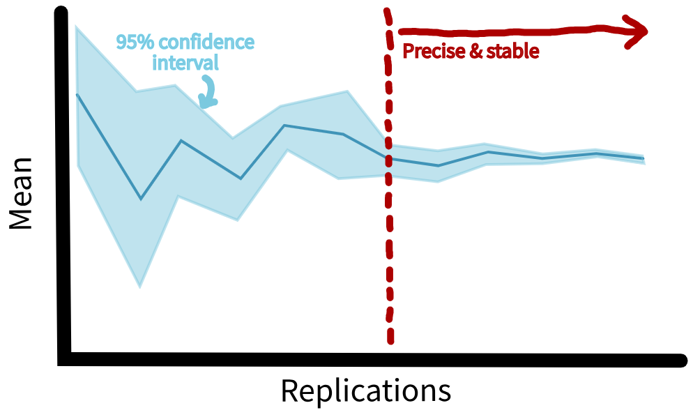

```{python}
#| echo: false
# pylint: disable=undefined-variable,unused-import
```

:::: {.pale-blue}

**Learning objectives:**

* Understand how the **confidence interval method** can be used to choose an appropriate number of replications to run.
* Learn how to implement this **manually** or using an **automated** method.

**Pre-reading:**

This page continues on from: [Replications](replications.qmd).

> *Entity generation → Entity processing → Initialisation bias → Performance measures → Replications → Number of replications*

::::

:::: {.very-pale-blue}

**Required packages:**

These should be available from environment setup on the [Structuring as a package](/pages/guide/setup/package.qmd) page.

::: {.python-content}

```{python}
from typing import Protocol, runtime_checkable

from IPython.display import HTML
from itables import to_html_datatable
import numpy as np
import pandas as pd
import scipy.stats as st
import simpy
from sim_tools.distributions import Exponential
from sim_tools.output_analysis import (
    confidence_interval_method,
    plotly_confidence_interval_method,
    ReplicationsAlgorithm
)
```

```{python}
#| echo: false
# To ensure renders correctly in quarto
import plotly.io as pio  # pylint: disable=ungrouped-imports
pio.renderers.default = "plotly_mimetype"
```

:::

::: {.r-content}

```{r}
#| output: false
library(dplyr)
library(kableExtra)
library(knitr)
library(simmer)
library(tidyr)
```

:::

::::

<br><br>

When running your simulation model, each replication will give a slightly different result because of randomness. To get a reliable estimate of any performance measure (such as average waiting time), you run the simulation multiple times and take the average across all these runs.

**How many replications should you run?** If you run **too few**, your average could jump around a lot with varying seeds, making your result unstable and unreliable. If you run **too many**, it will take a long time and use more computing resources than needed. To find a sensible balance, we can use the **confidence interval method**.

Choice of an appropriate number of replications forms part of your model experimentation validation (see [verification and validation](../verification_validation/verification_validation.qmd#experimentation-validation) page).

## Confidence interval method

When finding the average result across several simulation runs, you can also calculate a **confidence interval**. This is a measure of variation which shows the range where your true average result is likely to fall. You should choose a suitable confidence level (typically 95%).

Then, run your simulation for an **increasing number of replications**. At first, this confidence interval might jump around as different replication produce varying results. However, after enough runs, the interval will settle into a **stable and narrow** range. At this point, you can assume that adding more runs probably wouldn't change your answer by much. 

<br>

{fig-align="center"}

When selecting the number of replications you should **repeat the analysis for all performance measures** and select the highest value as your number of replications.

We'll show two ways of implementing this: **manually** and **automated**.

## Simulation code

The simulation being used is that from the [Replications](replications.qmd) page.

::: {.callout-note}

On this page, we will use a longer warm-up and run length than the short illustrative values used earlier (i.e., 30 minute warm-up, 40 minute data collection).

We are not using the previously determined warm-up length, but have simply chosen reasonably long values for this example. Very short runs, like 30/40 minutes, will be unstable and need many replications to achieve reliable outcomes.

As before, these assumptions are for demonstration only, and in later examples we will return to the shorter parameter settings for simplicity.

:::

```{python}
#| echo: false






```

```{r}
#| echo: false
#| file: replications_resources/create_params.R
```

```{r}
#| echo: false
#| file: replications_resources/filter_warmup.R
```

```{r}
#| echo: false
#| file: replications_resources/get_run_results.R
```

```{r}
#| echo: false
#| file: length_warmup_resources/metrics.R
```

```{r}
#| echo: false
#| file: replications_resources/model.R
```

```{r}
#| echo: false
#| file: replications_resources/runner.R
```


## Manual inspection

:::: {.python-content}

To begin, we run our simulation model for multiple replications using our usual workflow. Here, we have set to run for 50 replications.

For this analysis, we are interested in the mean results from each replication (`result["run"]`).

```{python}
# Run simulation for multiple replications
runner = Runner(param=Parameters(warm_up_period=10000,
                                 data_collection_period=10000,
                                 number_of_runs=50))
result = runner.run_reps()
HTML(to_html_datatable(result["run"]))
```

<br>

We pass these results to the `confidence_interval_method` function from the [sim-tools](https://github.com/sim-tools/sim-tools) package.

The `desired_precision` parameter is set to 0.1, which means we are interested in identifying when the percentage deviation of the confidence interval from the mean falls **below 10%**. *Note: This threshold is our default but relatively arbitrary. We are just using it to help us identify the point where results are stable enough.*

```{python}
# Define metrics to inspect
metrics = ["mean_wait_time", "mean_utilisation_tw", "mean_queue_length",
           "mean_time_in_system", "mean_patients_in_system"]

# Run the confidence interval method
confint_results = confidence_interval_method(
    replications=result["run"][metrics],
    desired_precision=0.1,
    min_rep=5,
    decimal_places=6
)
```

<br>

For each metric, the function returns:

1. The number of replications required for **deviation to fall below 10%** (and must also be **higher than `min_rep`** set in `confidence_interval_method()`).
2. A dataframe of cumulative calculations: the mean, cumulative mean, standard deviation, confidence interval bounds, and the percentage deviation of the confidence interval from the mean (displayed in the far-right column).

::: {.panel-tabset}

## Mean wait time

```{python}
print(confint_results["mean_wait_time"][0])
```

```{python}
HTML(to_html_datatable(confint_results["mean_wait_time"][1]))
```

## Mean utilisation

```{python}
print(confint_results["mean_utilisation_tw"][0])
```

```{python}
HTML(to_html_datatable(confint_results["mean_utilisation_tw"][1]))
```

## Mean queue length

```{python}
print(confint_results["mean_queue_length"][0])
```

```{python}
HTML(to_html_datatable(confint_results["mean_queue_length"][1]))
```

## Mean time in system

```{python}
print(confint_results["mean_time_in_system"][0])
```

```{python}
HTML(to_html_datatable(confint_results["mean_time_in_system"][1]))
```

## Mean patients in system

```{python}
print(confint_results["mean_patients_in_system"][0])
```

```{python}
HTML(to_html_datatable(confint_results["mean_patients_in_system"][1]))
```

:::

<br>

To visualise when precision is achieved and check for stability, we can use the `plotly_confidence_interval_method` function from [sim-tools](https://github.com/sim-tools/sim-tools):

::: {.panel-tabset}

## Mean wait time

```{python}
p = plotly_confidence_interval_method(
    n_reps=confint_results["mean_wait_time"][0],
    conf_ints=confint_results["mean_wait_time"][1],
    metric_name="Mean Wait Time")
p.update_layout(autosize=True, width=None, height=390)
```

## Mean utilisation

```{python}
p = plotly_confidence_interval_method(
    n_reps=confint_results["mean_utilisation_tw"][0],
    conf_ints=confint_results["mean_utilisation_tw"][1],
    metric_name="Mean Utilisation")
p.update_layout(autosize=True, width=None, height=390)
```

## Mean queue length

```{python}
p = plotly_confidence_interval_method(
    n_reps=confint_results["mean_queue_length"][0],
    conf_ints=confint_results["mean_queue_length"][1],
    metric_name="Mean Queue Length")
p.update_layout(autosize=True, width=None, height=390)
```

## Mean time in system

```{python}
p = plotly_confidence_interval_method(
    n_reps=confint_results["mean_time_in_system"][0],
    conf_ints=confint_results["mean_time_in_system"][1],
    metric_name="Mean Time In System")
p.update_layout(autosize=True, width=None, height=390)
```

## Mean patients in system

```{python}
p = plotly_confidence_interval_method(
    n_reps=confint_results["mean_patients_in_system"][0],
    conf_ints=confint_results["mean_patients_in_system"][1],
    metric_name="Mean Patients In System")
p.update_layout(autosize=True, width=None, height=390)
```

:::

::::

:::: {.r-content}

For this analysis, we have created two functions `confidence_interval_method` and `plot_replication_ci`.

::: {.callout-note collapse="true" title="View functions"}

```{r}
#' Use the confidence interval method to select the number of replications.
#'
#' This could be altered to use WelfordStats and ReplicationTabuliser if
#' desired, but currently is independent.
#'
#' @param param List of parameters for the model.
#' @param desired_precision Desired mean deviation from confidence interval.
#' @param metric Name of performance metric to assess.
#' @param verbose Boolean, whether to print messages about parameters.
#'
#' @importFrom rlang .data
#' @importFrom utils tail
#'
#' @return Dataframe with results from each replication.
#' @export

confidence_interval_method <- function(
  param, desired_precision, metric, verbose = TRUE
) {
  # Run model for specified number of replications
  if (isTRUE(verbose)) {
    print(param)
  }
  results <- runner(param = param)[["run_results"]]

  # Initialise list to store the results
  cumulative_list <- list()

  # For each row in the dataframe, filter to rows up to the i-th replication
  # then perform calculations
  for (i in 1L:param[["number_of_runs"]]) {

    # Filter rows up to the i-th replication
    subset_data <- results[[metric]][1L:i]

    # Get latest data point
    last_data_point <- tail(subset_data, n = 1L)

    # Calculate mean
    mean_value <- mean(subset_data)

    # Some calculations require a few observations else will error...
    if (i < 3L) {
      # When only one observation, set to NA
      stdev <- NA
      lower_ci <- NA
      upper_ci <- NA
      deviation <- NA
    } else {
      # Else, calculate standard deviation, 95% confidence interval, and
      # percentage deviation
      stdev <- stats::sd(subset_data)
      ci <- stats::t.test(subset_data)[["conf.int"]]
      lower_ci <- ci[[1L]]
      upper_ci <- ci[[2L]]
      deviation <- ((upper_ci - mean_value) / mean_value)
    }

    # Append to the cumulative list
    cumulative_list[[i]] <- data.frame(
      replications = i,
      data = last_data_point,
      cumulative_mean = mean_value,
      stdev = stdev,
      lower_ci = lower_ci,
      upper_ci = upper_ci,
      deviation = deviation
    )
  }

  # Combine the list into a single data frame
  cumulative <- do.call(rbind, cumulative_list)
  cumulative[["metric"]] <- metric

  # Get the minimum number of replications where deviation is less than target
  compare <- dplyr::filter(
    cumulative, .data[["deviation"]] <= desired_precision
  )
  if (nrow(compare) > 0L) {
    # Get minimum number
    n_reps <- compare |>
      dplyr::slice_head() |>
      dplyr::select(replications) |>
      dplyr::pull()
    message("Reached desired precision (", desired_precision, ") in ",
            n_reps, " replications.")
  } else {
    warning("Running ", param[["number_of_runs"]], " replications did not ",
            "reach desired precision (", desired_precision, ").",
            call. = FALSE)
  }
  cumulative
}
```

```{r}
#' Generate a plot of metric and confidence intervals with increasing
#' simulation replications
#'
#' @param conf_ints A dataframe containing confidence interval statistics,
#' including cumulative mean, upper/lower bounds, and deviations. As returned
#' by ReplicationTabuliser summary_table() method.
#' @param yaxis_title Label for y axis.
#' @param file_path Path and filename to save the plot to.
#' @param min_rep The number of replications required to meet the desired
#' precision.
#'
#' @return A ggplot object if file_path is NULL; otherwise, the plot is saved
#' to file and NULL is returned invisibly.
#' @export

plot_replication_ci <- function(
  conf_ints, yaxis_title, file_path = NULL, min_rep = NULL
) {
  # Plot the cumulative mean and confidence interval
  p <- ggplot2::ggplot(conf_ints,
                       ggplot2::aes(x = .data[["replications"]],
                                    y = .data[["cumulative_mean"]])) +
    ggplot2::geom_line() +
    ggplot2::geom_ribbon(
      ggplot2::aes(ymin = .data[["lower_ci"]], ymax = .data[["upper_ci"]]),
      alpha = 0.2
    )

  # If specified, plot the minimum suggested number of replications
  if (!is.null(min_rep)) {
    p <- p +
      ggplot2::geom_vline(
        xintercept = min_rep, linetype = "dashed", color = "red"
      )
  }

  # Modify labels and style
  p <- p +
    ggplot2::labs(x = "Replications", y = yaxis_title) +
    ggplot2::theme_minimal()

  # Save the plot
  if (!is.null(file_path)) {
    ggplot2::ggsave(filename = file_path,
                    width = 6.5, height = 4L, bg = "white")
  } else {
    p
  }
}
```

:::

```{r}
metrics <- c("mean_wait_time_doctor", "utilisation_doctor",
             "mean_queue_length_doctor", "mean_time_in_system",
             "mean_patients_in_system")

ci_df <- list()
for (m in metrics) {
  ci_df[[m]] <- confidence_interval_method(
    param = create_params(warm_up_period = 10000L,
                          data_collection_period = 10000L,
                          number_of_runs = 50L),
    desired_precision = 0.1,
    metric = m,
    verbose = FALSE
  )
}
```

::: {.panel-tabset}

## Mean wait time

```{r}
ci_df[["mean_wait_time_doctor"]] |>
  kable() |>
  scroll_box(height = "400px")
plot_replication_ci(
  conf_ints = ci_df[["mean_wait_time_doctor"]],
  yaxis_title = "Mean wait time",
  min_rep = 5L
)
```

## Mean utilisation

```{r}
ci_df[["utilisation_doctor"]] |>
  kable() |>
  scroll_box(height = "400px")
plot_replication_ci(
  conf_ints = ci_df[["utilisation_doctor"]],
  yaxis_title = "Utilisation",
  min_rep = 5L
)
```

## Mean queue length

```{r}
ci_df[["mean_queue_length_doctor"]] |>
  kable() |>
  scroll_box(height = "400px")
plot_replication_ci(
  conf_ints = ci_df[["mean_queue_length_doctor"]],
  yaxis_title = "Mean queue length",
  min_rep = 5L
)
```

## Mean time in system

```{r}
ci_df[["mean_time_in_system"]] |>
  kable() |>
  scroll_box(height = "400px")
plot_replication_ci(
  conf_ints = ci_df[["mean_time_in_system"]],
  yaxis_title = "Mean time in system",
  min_rep = 5L
)
```

## Mean patients in system

```{r}
ci_df[["mean_patients_in_system"]] |>
  kable() |>
  scroll_box(height = "400px")
plot_replication_ci(
  conf_ints = ci_df[["mean_patients_in_system"]],
  yaxis_title = "Mean number of patients in system",
  min_rep = 5L
)
```

:::

::::

## Automated

::: {.python-content}

<div class="h3-tight"></div>

### Description of the algorithm

As an alternative to manually determining the number of runs required, we can use a more automated method. In this automated method, an algorithm will tell us the number of runs needed. We will use the `ReplicationsAlgorithm` class from [sim-tools](https://github.com/sim-tools/sim-tools).

Here's how it works:

* The algorithm **runs the simulation model repeatedly**, for an **increasing number** of runs.
* After each run, it checks if the results are **stable enough**. It does this by looking at the percentage deviation of the confidence interval from the mean.
* The algorithm also incorporates a **look-ahead period**, meaning it continues to run the simulation and check that results stay stable for the next few runs (and that this wasn't just a lucky one-off!).

### Model adapter

The `ReplicationsAlgorithm` work with many different simulation models, as long as they all present the same interface for running a single replication. This common interface is defined by the defined by the `ReplicationsAlgorithmModelAdapter` protocol in `sim-tools`.

A `Protocol` describes the expected methods and attributes an object must provide. In this case, the protocol states that a compatible model must implement a `single_run(replication_number)` method returning a dictionary of metric values.

It is tagged `@runtime_checkable` so that, in addition to helping static type checkers, the code can also perform runtime checks (for example using `isinstance`) to verify that an object really satisfies the protocol's interface.

```{python}
@runtime_checkable
class ReplicationsAlgorithmModelAdapter(Protocol):
    """
    Adapter pattern for the "Replications Algorithm".

    All models that use ReplicationsAlgorithm must provide a
    single_run(replication_number) interface.
    """

    def single_run(self, replication_number: int) -> dict[str, float]:
        """
        Run a single unique replication of the model and return results.

        Parameters
        ----------
        replication_number : int
            The replication sequence number.

        Returns
        -------
        dict[str, float]
            {'metric_name': value, ... } for all metrics being tracked.
        """
```

### Creating an adapter for our model

We can reuse our existing `Runner` and `Parameters` classes, wrapping them in a small adapter class (`SimulationAdapter`) so that they match the `ReplicationsAlgorithmModelAdapter` interface.

The `SimulationAdapter` stores the parameter object, constructs a `Runner` instance, and lists the metrics to extract. It's `single_run` method then calls `Runner.run_single` and returns the results as a dictionary.

```{python}
class SimulationAdapter:
    """
    Adapter for running model replications compatible with
    ReplicationsAlgorithm.

    Attributes
    ----------
    param : Parameters
        The simulation parameter object for Runner.
    metrics : list[str]
        The metric(s) to output from each run.
    runner : Runner
        An instance of runner initialised with the provided parameters.
    """
    def __init__(self, param, metrics):
        """
        Initialise adapter.

        Parameters
        ----------
        param : Parameters
            The simulation parameter object for Runner.
        metrics : list[str]
            The metric(s) to output from each run.
        """
        self.param = param
        self.metrics = metrics
        self.runner = Runner(self.param)

    def single_run(self, replication_number):
        """
        Run a single simulation replication and return required metrics.
        """
        result = self.runner.run_single(run=replication_number)
        return {metric: result["run"][metric] for metric in self.metrics}
```

<br>

For example:

```{python}
adapter = SimulationAdapter(param=Parameters(), metrics=metrics)
adapter.single_run(replication_number=0)
```

### Run algorithm

An instance of `SimulationAdapter` can now be passed directly to `ReplicationsAlgorithm`, while still using the same `Runner` and `Parameters` classes introduced earlier.

```{python}
# Set up model with adapter
sim_model = SimulationAdapter(
  param=Parameters(warm_up_period=10000,
                   data_collection_period=10000),
  metrics=metrics)

# Set up and run the algorithm
analyser = ReplicationsAlgorithm(
    alpha=0.05,
    half_width_precision=0.1,
    look_ahead=5,
    replication_budget=100,
    verbose=False
)
nreps, summary_frame = analyser.select(model=sim_model, metrics=metrics)
```

<br>

The algorithm returns:

1. The number of replications required for each metric (here, assigned to `nreps`).
2. A dataframe containing the cumulative results and deviations for each metric (in a single dataframe, here assigned to `summary_frame`).

```{python}
# View results
print(nreps)
HTML(to_html_datatable(summary_frame))
```

<br>

Again, we can use `plotly_confidence_interval_method` to create plots.

::: {.panel-tabset}

## Mean wait time

```{python}
p = plotly_confidence_interval_method(
    n_reps=nreps["mean_wait_time"],
    conf_ints=summary_frame[
        summary_frame["metric"] == "mean_wait_time"].reset_index(),
    metric_name="Mean Wait Time")
p.update_layout(autosize=True, width=None, height=390)
```

## Mean utilisation

```{python}
p = plotly_confidence_interval_method(
    n_reps=nreps["mean_utilisation_tw"],
    conf_ints=summary_frame[
        summary_frame["metric"] == "mean_utilisation_tw"].reset_index(),
    metric_name="Mean Utilisation")
p.update_layout(autosize=True, width=None, height=390)
```

## Mean queue length

```{python}
p = plotly_confidence_interval_method(
    n_reps=nreps["mean_queue_length"],
    conf_ints=summary_frame[
        summary_frame["metric"] == "mean_queue_length"].reset_index(),
    metric_name="Mean Queue Length")
p.update_layout(autosize=True, width=None, height=390)
```

## Mean time in system

```{python}
p = plotly_confidence_interval_method(
    n_reps=nreps["mean_time_in_system"],
    conf_ints=summary_frame[
        summary_frame["metric"] == "mean_time_in_system"].reset_index(),
    metric_name="Mean Time In System")
p.update_layout(autosize=True, width=None, height=390)
```

## Mean patients in system

```{python}
p = plotly_confidence_interval_method(
    n_reps=nreps["mean_patients_in_system"],
    conf_ints=summary_frame[
        summary_frame["metric"] == "mean_patients_in_system"].reset_index(),
    metric_name="Mean Patients In System")
p.update_layout(autosize=True, width=None, height=390)
```

:::

::::

:::: {.r-content}

As an alternative to manually determining the number of runs required, we can use a more automated method, creating an algorithm which recommends the required number of runs. 

For this analysis, we have created three functions: `create_welford_stats`, `create_replication_tabuliser`, and `create_replications_algorithm`.

::: {.callout-note collapse="true" title="View functions"}

```{r}
# nolint start: cyclocomp_linter

#' Create a Welford Statistics Tracker
#'
#' @description
#' Computes running sample mean and variance using Welford's algorithm.
#' They are computed via updates to a stored value, rather than storing lots of
#' data and repeatedly taking the mean after new values have been added.
#'
#' Implements Welford's algorithm for updating mean and variance.
#' See Knuth. D `The Art of Computer Programming` Vol 2. 2nd ed. Page 216.
#'
#' This function is based on the Python class `OnlineStatistics` from Tom Monks
#' (2021) sim-tools: fundamental tools to support the simulation process in
#' python (https://github.com/sim-tools/sim-tools) (MIT Licence).
#'
#' @param data Initial data sample (optional).
#' @param alpha Significance level for confidence interval calculations.
#'   For example, if alpha is 0.05, then the confidence level is 95%.
#' @param observer Observer function to notify on updates (optional).
#'   If provided, will be called with the state list after each update.
#'
#' @return A list of functions with the following methods:
#'   - `welford_update(x)`: Add a new data point
#'   - `get_n()`: Get number of observations
#'   - `get_mean()`: Get running mean
#'   - `get_latest_data()`: Get most recent data point
#'   - `get_sum_sq()`: Get sum of squared differences
#'   - `variance()`: Compute variance
#'   - `std()`: Compute standard deviation
#'   - `std_error()`: Compute standard error of the mean
#'   - `half_width()`: Compute half-width of confidence interval
#'   - `lci()`: Compute lower confidence interval bound
#'   - `uci()`: Compute upper confidence interval bound
#'   - `deviation()`: Compute precision as percentage deviation
#'
#' @export

create_welford_stats <- function(data = NULL, alpha = 0.05, observer = NULL) {

  # Use an environment to store mutable state
  # This avoids <<- while allowing proper state mutation
  state_env <- new.env()

  state_env$n <- 0L
  state_env$latest_data <- NA
  state_env$mean <- NA
  state_env$sq <- NA
  state_env$alpha <- alpha
  state_env$observer <- observer

  # Notify observer if present
  notify_observer <- function() {
    if (is.null(state_env$observer)) return(invisible(NULL))
    observer_state <- list(
      n = state_env$n,
      latest_data = state_env$latest_data,
      mean = state_env$mean,
      sq = state_env$sq
    )
    state_env$observer(observer_state)
    invisible(NULL)
  }

  # Update running statistics with a new data point
  welford_update <- function(x) {
    state_env$n <- state_env$n + 1L
    state_env$latest_data <- x

    # Calculate the mean and sq using Welford's algorithm and notify observer
    if (state_env$n == 1L) {
      state_env$mean <- x
      state_env$sq <- 0L
      notify_observer()
      return(invisible(NULL))
    }

    updated_mean <- state_env$mean + ((x - state_env$mean) / state_env$n)
    state_env$sq <- state_env$sq + ((x - state_env$mean) * (x - updated_mean))
    state_env$mean <- updated_mean

    notify_observer()
    invisible(NULL)
  }

  # Compute variance
  variance <- function() {
    if (state_env$n < 2L) return(NA_real_)
    state_env$sq / (state_env$n - 1L)
  }

  # Compute standard deviation
  std <- function() {
    if (state_env$n < 3L) return(NA_real_)
    sqrt(variance())
  }

  # Compute standard error of the mean
  std_error <- function() {
    s <- std()
    if (is.na(s)) return(NA_real_)
    s / sqrt(state_env$n)
  }

  # Compute half-width of confidence interval
  half_width <- function() {
    if (state_env$n < 3L) return(NA_real_)
    dof <- state_env$n - 1L
    t_value <- qt(1L - (state_env$alpha / 2L), df = dof)
    t_value * std_error()
  }

  # Compute lower confidence interval bound
  lci <- function() {
    hw <- half_width()
    if (is.na(hw)) return(NA_real_)
    state_env$mean - hw
  }

  # Compute upper confidence interval bound
  uci <- function() {
    hw <- half_width()
    if (is.na(hw)) return(NA_real_)
    state_env$mean + hw
  }

  # Compute precision of confidence interval (percentage deviation)
  deviation <- function() {
    mw <- state_env$mean
    if (is.na(mw) || mw == 0L) return(NA_real_)
    hw <- half_width()
    if (is.na(hw)) return(NA_real_)
    hw / mw
  }

  # If initial data supplied, process it
  if (!is.null(data)) {
    for (x in as.vector(data)) {
      welford_update(x)
    }
  }

  # Return public API
  list(
    welford_update = welford_update,
    get_n = function() state_env$n,
    get_mean = function() state_env$mean,
    get_latest_data = function() state_env$latest_data,
    get_sum_sq = function() state_env$sq,
    get_alpha = function() state_env$alpha,
    variance = variance,
    std = std,
    std_error = std_error,
    half_width = half_width,
    lci = lci,
    uci = uci,
    deviation = deviation
  )
}


#' Create a Replication Tabuliser
#'
#' @description
#' Observes and records results from Welford statistics tracker.
#' Updates each time new data is processed. Can generate a results dataframe.
#'
#' This function is based on the Python class `ReplicationTabulizer` from Tom
#' Monks (2021) sim-tools: fundamental tools to support the simulation process
#' in python (https://github.com/sim-tools/sim-tools) (MIT Licence).
#'
#' @return A list of functions with the following methods:
#'   - `tab_update(state)`: Record results from Welford tracker state
#'   - `summary_table()`: Get accumulated results as a dataframe
#'   - `get_data_points()`: Get raw data points
#'   - `get_cumulative_means()`: Get running means
#'   - `get_std_devs()`: Get standard deviations
#'   - `get_lcis()`: Get lower confidence bounds
#'   - `get_ucis()`: Get upper confidence bounds
#'   - `get_deviations()`: Get precision deviations
#'
#' @export

create_replication_tabuliser <- function() {

  # Use an environment to store mutable state
  state_env <- new.env()

  state_env$data_points <- NULL
  state_env$cumulative_mean <- NULL
  state_env$std <- NULL
  state_env$lci <- NULL
  state_env$uci <- NULL
  state_env$deviation <- NULL

  # Add new results from Welford stats
  tab_update <- function(stats) {
    # stats is a list with n, latest_data, mean, sq
    # We need to compute std, lci, uci, deviation

    # Get values from state
    n <- stats$n
    latest_data <- stats$latest_data
    mean_val <- stats$mean
    sq <- stats$sq

    # Compute derived values (same as Welford methods)
    variance <- if (n < 2L) NA_real_ else sq / (n - 1L)
    std_val <- if (n < 3L) NA_real_ else sqrt(variance)

    std_error_val <- if (is.na(std_val)) {
      NA_real_
    } else {
      std_val / sqrt(n)
    }

    half_width_val <- if (n < 3L) {
      NA_real_
    } else {
      dof <- n - 1L
      t_value <- qt(0.975, df = dof)  # 95% CI, so 0.975 quantile
      t_value * std_error_val
    }

    lci_val <- if (is.na(half_width_val)) {
      NA_real_
    } else {
      mean_val - half_width_val
    }

    uci_val <- if (is.na(half_width_val)) {
      NA_real_
    } else {
      mean_val + half_width_val
    }

    deviation_val <- if (is.na(mean_val) || mean_val == 0L ||
                           is.na(half_width_val)) {
      NA_real_
    } else {
      half_width_val / mean_val
    }

    # Append to state
    state_env$data_points <- c(state_env$data_points, latest_data)
    state_env$cumulative_mean <- c(state_env$cumulative_mean, mean_val)
    state_env$std <- c(state_env$std, std_val)
    state_env$lci <- c(state_env$lci, lci_val)
    state_env$uci <- c(state_env$uci, uci_val)
    state_env$deviation <- c(state_env$deviation, deviation_val)
  }

  # Create results table from stored lists
  summary_table <- function() {
    data.frame(
      replications = seq_len(length(state_env$data_points)),
      data = state_env$data_points,
      cumulative_mean = state_env$cumulative_mean,
      stdev = state_env$std,
      lower_ci = state_env$lci,
      upper_ci = state_env$uci,
      deviation = state_env$deviation
    )
  }

  # Return public API
  list(
    tab_update = tab_update,
    summary_table = summary_table,
    get_data_points = function() state_env$data_points,
    get_cumulative_means = function() state_env$cumulative_mean,
    get_std_devs = function() state_env$std,
    get_lcis = function() state_env$lci,
    get_ucis = function() state_env$uci,
    get_deviations = function() state_env$deviation
  )
}


#' Replication Algorithm for Automatic Selection
#'
#' @description
#' Implements an adaptive replication algorithm for selecting the
#' appropriate number of simulation replications based on statistical
#' precision.
#'
#' Uses the "Replications Algorithm" from Hoad, Robinson, & Davies (2010).
#' Automated selection of the number of replications for a discrete-event
#' simulation. Journal of the Operational Research Society.
#' https://www.jstor.org/stable/40926090.
#'
#' Given a model's performance measure and a user-set confidence interval
#' half width precision, automatically select the number of replications.
#' Combines the "confidence intervals" method with a sequential look-ahead
#' procedure to determine if a desired precision in the confidence interval
#' is maintained.
#'
#' This function is based on the Python class `ReplicationsAlgorithm` from Tom
#' Monks (2021) sim-tools: fundamental tools to support the simulation process
#' in python (https://github.com/sim-tools/sim-tools) (MIT Licence).
#'
#' @param param Model parameters (list).
#' @param metrics List of performance measure names to track (should correspond
#'   to column names from the run results dataframe).
#' @param desired_precision Target half width precision for the algorithm
#'   (i.e. percentage deviation of the confidence interval from the mean,
#'   expressed as a proportion, e.g. 0.1 = 10%). Choice is fairly arbitrary.
#' @param initial_replications Number of initial replications to perform
#'   (default: 3).
#' @param look_ahead Minimum additional replications to look ahead to assess
#'   stability of precision. When replications are <= 100, the value of
#'   look_ahead is used. When > 100, then look_ahead / 100 * max(n, 100)
#'   is used (default: 5).
#' @param replication_budget Maximum allowed replications. Use for larger
#'   models where replication runtime is a constraint (default: 1000).
#' @param verbose Boolean, whether to print messages about parameters
#'   (default: TRUE).
#'
#' @return A list of functions with the following methods:
#'   - `select()`: Execute the replication algorithm
#'   - `get_nreps()`: Get minimum replications required for each metric
#'   - `get_summary_table()`: Get full results table with cumulative
#'     statistics for each replication
#'   - `get_reps()`: Get number of replications performed
#'
#' @export

create_replications_algorithm <- function(
    param,
    metrics,
    desired_precision = 0.1,
    initial_replications = 3L,
    look_ahead = 5L,
    replication_budget = 1000L,
    verbose = TRUE) {

  # Use an environment to store mutable state
  state_env <- new.env()

  state_env$param <- param
  state_env$metrics <- metrics
  state_env$desired_precision <- desired_precision
  state_env$initial_replications <- initial_replications
  state_env$look_ahead <- look_ahead
  state_env$replication_budget <- replication_budget
  state_env$reps <- initial_replications
  state_env$nreps <- NA
  state_env$summary_table <- NA

  # Validate inputs
  validate_inputs <- function() {
    for (p in c("initial_replications", "look_ahead")) {
      if (state_env[[p]] %% 1L != 0L || state_env[[p]] < 0L) {
        stop(
          p, " must be a non-negative integer, but provided ",
          state_env[[p]], ".",
          call. = FALSE
        )
      }
    }
    if (state_env$desired_precision <= 0L) {
      stop("desired_precision must be greater than 0.", call. = FALSE)
    }
    if (state_env$replication_budget < state_env$initial_replications) {
      stop(
        "replication_budget must be greater than initial_replications.",
        call. = FALSE
      )
    }
  }

  # Calculate the klimit (lookahead window)
  klimit <- function() {
    as.integer((state_env$look_ahead / 100L) * max(state_env$reps, 100L))
  }

  # Find first position where element is below deviation and maintained
  find_position <- function(lst) {
    # Ensure input is a list
    if (!is.list(lst)) {
      stop(
        "find_position requires a list but was supplied: ", typeof(lst),
        call. = FALSE
      )
    }

    # Check if list is empty or no values below threshold
    if (length(lst) == 0L || all(is.na(lst)) || !any(unlist(lst) < 0.5)) {
      return(NULL)
    }

    # Find first non-NA value in list
    start_index <- which(
      !vapply(lst, is.na, logical(1L))
    )[1L]

    # Iterate through list, stopping when at last point where we still
    # have enough elements to look ahead
    max_index <- length(lst) - state_env$look_ahead
    if (start_index > max_index) {
      return(NULL)
    }

    for (i in start_index:max_index) {
      # Trim to list with current value + lookahead
      # Check if all fall below desired deviation
      segment <- lst[i:(i + state_env$look_ahead)]
      if (all(vapply(
        segment,
        function(x) x < state_env$desired_precision,
        logical(1L)
      ))) {
        return(i)
      }
    }
    NULL
  }

  # Execute the replication algorithm
  select <- function() {
    # Create instances of observers for each metric
    observers <- setNames(
      lapply(state_env$metrics, function(x) create_replication_tabuliser()),
      state_env$metrics
    )

    # Create nested list to store record for each metric
    solutions <- setNames(
      lapply(state_env$metrics, function(x) {
        list(nreps = NA, target_met = 0L, solved = FALSE)
      }),
      state_env$metrics
    )

    # If no initial replications, create empty Welford instances
    if (state_env$initial_replications == 0L) {
      stats <- setNames(
        lapply(
          state_env$metrics,
          function(x) {
            create_welford_stats(
              observer = function(s) observers[[x]]$tab_update(s)
            )
          }
        ),
        state_env$metrics
      )
    } else {
      # Run initial replications
      state_env$param[["number_of_runs"]] <- state_env$initial_replications
      result <- runner(state_env$param)[["run_results"]]

      # Create Welford instances pre-loaded with initial data
      stats <- setNames(
        lapply(state_env$metrics, function(x) {
          create_welford_stats(
            data = result[[x]],
            observer = function(s) observers[[x]]$tab_update(s)
          )
        }),
        state_env$metrics
      )

      # Check if any have met precision after initial replications
      for (metric in state_env$metrics) {
        if (isTRUE(stats[[metric]]$deviation() <
                     state_env$desired_precision)) {
          solutions[[metric]]$nreps <- state_env$reps
          solutions[[metric]]$target_met <- 1L
          if (klimit() == 0L) {
            solutions[[metric]]$solved <- TRUE
          }
        }
      }
    }

    # Check if all metrics are solved
    is_all_solved <- function() {
      statuses <- unlist(lapply(solutions, function(x) x$solved))
      all(statuses)
    }

    # Main algorithm loop
    while (!is_all_solved() &&
             state_env$reps < state_env$replication_budget + klimit()) {

      # Increment counter
      state_env$reps <- state_env$reps + 1L

      # Run another replication
      result <- model(
        run_number = state_env$reps,
        param = state_env$param
      )[["run_results"]]

      # Loop through metrics
      for (metric in state_env$metrics) {
        # If not yet solved
        if (!solutions[[metric]]$solved) {
          # Update running statistics
          stats[[metric]]$welford_update(result[[metric]])

          # If precision achieved
          if (isTRUE(stats[[metric]]$deviation() <
                       state_env$desired_precision)) {
            # Record solution if not previously met
            if (solutions[[metric]]$target_met == 0L) {
              solutions[[metric]]$nreps <- state_env$reps
            }

            # Update how many times precision met in row
            solutions[[metric]]$target_met <-
              solutions[[metric]]$target_met + 1L

            # Mark solved if lookahead period passed
            if (solutions[[metric]]$target_met > klimit()) {
              solutions[[metric]]$solved <- TRUE
            }
          } else {
            # If precision not achieved, reset
            solutions[[metric]]$nreps <- NA
            solutions[[metric]]$target_met <- 0L
          }
        }
      }
    }

    # Correction using find_position
    for (metric in names(solutions)) {
      adj_nreps <- find_position(
        as.list(observers[[metric]]$get_deviations())
      )
      # If maintained solution found, replace in solutions
      if (!is.null(adj_nreps) && !is.na(solutions[[metric]]$nreps)) {
        solutions[[metric]]$nreps <- adj_nreps
      }
    }

    # Extract minimum replications for each metric
    state_env$nreps <- lapply(solutions, function(x) x$nreps)

    # Extract metrics that were not solved and return warning
    if (anyNA(state_env$nreps)) {
      unsolved <- names(state_env$nreps)[
        vapply(state_env$nreps, is.na, logical(1L))
      ]
      warning(
        "The replications did not reach the desired precision ",
        "for the following metrics - ", toString(unsolved),
        call. = FALSE
      )
    }

    # Combine observer summary frames into single table
    summary_tables <- lapply(names(observers), function(name) {
      tab <- observers[[name]]$summary_table()
      tab$metric <- name
      tab
    })
    state_env$summary_table <- do.call(rbind, summary_tables)

    invisible(NULL)
  }

  # Initialize validation
  validate_inputs()

  # Print parameters if verbose
  if (isTRUE(verbose)) {
    cat("Model parameters:\n")
    print(state_env$param)
  }

  # Return public API
  list(
    select = select,
    get_nreps = function() state_env$nreps,
    get_summary_table = function() state_env$summary_table,
    get_reps = function() state_env$reps,
    get_param = function() state_env$param,
    get_metrics = function() state_env$metrics,
    get_desired_precision = function() state_env$desired_precision
  )
}

# nolint end
```

:::

```{r}
# Set up algorithm
alg <- create_replications_algorithm(
  param = create_params(
    warm_up_period = 10000L,
    data_collection_period = 10000L
  ),
  metrics = metrics
)

# Run algorithm
alg$select()

# View recommended number of replications
alg$get_nreps()

# View full results table
alg$get_summary_table() |>
  kable() |>
  scroll_box(height = "400px")
```

<br>

We can use the function `plot_replication_ci` from above again to create the plots.

::: {.panel-tabset}

## Mean wait time

```{r}
plot_replication_ci(
  conf_ints = dplyr::filter(
    alg$get_summary_table(),
    metric == "mean_wait_time_doctor"
  ),
  yaxis_title = "Mean wait time",
  min_rep = alg$get_nreps()[["mean_wait_time_doctor"]]
)
```

## Mean utilisation

```{r}
plot_replication_ci(
  conf_ints = dplyr::filter(
    alg$get_summary_table(),
    metric == "utilisation_doctor"
  ),
  yaxis_title = "Mean utilisation",
  min_rep = alg$get_nreps()[["utilisation_doctor"]]
)
```

## Mean queue length

```{r}
plot_replication_ci(
  conf_ints = dplyr::filter(
    alg$get_summary_table(),
    metric == "mean_queue_length_doctor"
  ),
  yaxis_title = "Mean queue length",
  min_rep = alg$get_nreps()[["mean_queue_length_doctor"]]
)
```

## Mean time in system

```{r}
plot_replication_ci(
  conf_ints = dplyr::filter(
    alg$get_summary_table(),
    metric == "mean_time_in_system"
  ),
  yaxis_title = "Mean time in system",
  min_rep = alg$get_nreps()[["mean_time_in_system"]]
)
```

## Mean patients in system

```{r}
plot_replication_ci(
  conf_ints = dplyr::filter(
    alg$get_summary_table(),
    metric == "mean_patients_in_system"
  ),
  yaxis_title = "Mean patients in system",
  min_rep = alg$get_nreps()[["mean_patients_in_system"]]
)
```

:::

::::

## Explore the example models

<div class="h3-tight"></div>

### Nurse visit simulation

:::: {.python-content}



::: {.blue-table}
| | |
| - | - |
| **Key files** | `simulation/SimulationAdapter`<br>`notebooks/choosing_replications.ipynb` |
| **What to look for?** | Runs the manual and automated methods, as on this page. Includes a sensitivity analysis which checks the stability of the suggested number of replications, achieved by adding a `seed_offset` parameter that can be used to create a new set of seeds. The variation observed in the sensitivity analysis influences the chosen number of replications, and this is worth being aware of, if you also find yourself with a simulation with a relatively low suggested number of replications. |
: {tbl-colwidths="[20,80]"}
:::

::::

:::: {.r-content}



::: {.blue-table}
| | |
| - | - |
| **Key files** | `R/choose_replications.R`<br>`rmarkdown/choosing_replications.md`|
| **What to look for?** | Runs the manual and automated methods, as on this page. Includes a sensitivity analysis which checks the stability of the suggested number of replications, achieved by adding a `seed_offset` parameter that can be used to create a new set of seeds. The variation observed in the sensitivity analysis influences the chosen number of replications, and this is worth being aware of, if you also find yourself with a simulation with a relatively low suggested number of replications. |
: {tbl-colwidths="[20,80]"}
:::

::::

### Stroke pathway simulation

Not relevant - replicating an existing model described in a paper, so just used the number of replications stated by the authors.

## Test yourself

Have a go for yourself!

Try out both the manual and automated methods described above to work out how many replications you need for your own simulation model.

See what happens if you change model parameters like run length - notice how this affects the recommended number of replications.

<br><br>
