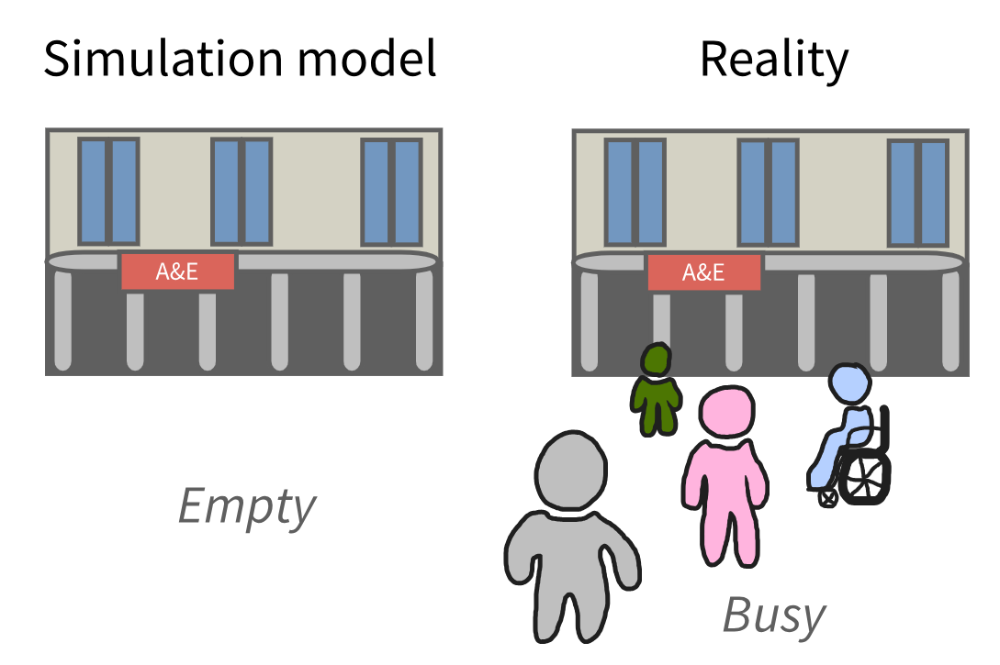

:::: {.pale-blue}

**Learning objectives:**

* Understand **initialisation bias** and know options for handling it.
* Add a **warm-up period** to a model.

**Pre-reading:**

This page continues on from: [Entity processing](../model/process.qmd).

> *Entity generation → Entity processing → Initialisation bias*

::::

:::: {.very-pale-blue}

**Required packages:**

These should be available from environment setup on the [Structuring as a package](/pages/guide/setup/package.qmd) page.

::: {.python-content}

```{python}
import numpy as np
import simpy
from sim_tools.distributions import Exponential
```

:::

::: {.r-content}

```{r}
#| output: false
library(dplyr)
library(simmer)
```

:::

::::

## Initialisation bias

**Initialisation bias** happens in discrete event simulation when the model starts in an "empty" state that does not match how the real system normally operates.

For systems that naturally begin empty (like a clinic opening each morning), this is fine. However, for many systems that are usually already busy, such as an Accident and Emergency (A&E) department (also known as just an Emergency Department (ED)), starting empty skews the results at the beginning of a run. For example, making waiting times, queue lengths or resource use look lower than they would be in reality.



It is important to address this bias as part of your model experimentation validation (see [verification and validation](../verification_validation/verification_validation.qmd#experimentation-validation) page). There are two main strategies for addressing initialisation bias:

* **Initial conditions:** Start the model with some entities or resources already presents (e.g., a certain number of patients already waiting). This can be difficult though, as it requires relevant data for determining an appropriate starting state.
* **Warm-up periods:** Run the model for a while until it reaches a steady state, then begin collecting results from that point onwards.

Since finding suitable initial conditions can be complicated, this book will focus on the warm-up method.

## Adding a warm-up period to the model

<div class="h3-tight"></div>

::: {.python-content}

### Parameter class

The `run_length` parameter has been replaced by two new parameters:

* `warm_up_period`
* `data_collection_period`

*Bold lines show where the code has changed since the previous version. The highlight may correspond to a change anywhere on that line, not necessarily to the entire line.*

```{python}
class Parameters:
    """
    Parameter class.

    Attributes
    ----------
    interarrival_time : float
        Mean time between arrivals (minutes).
    consultation_time : float
        Mean length of doctor's consultation (minutes).
    number_of_doctors : int
        Number of doctors.
    warm_up_period : int#<<
        Duration of the warm-up period (minutes).#<<
    data_collection_period : int#<<
        Duration of the data collection period (minutes).#<<
    verbose : bool
        Whether to print messages as simulation runs.
    """
    def __init__(
        self, interarrival_time=5, consultation_time=10,
        number_of_doctors=3, warm_up_period=30, data_collection_period=40,#<<
        verbose=True
    ):
        """
        Initialise Parameters instance.

        Parameters
        ----------
        interarrival_time : float
            Time between arrivals (minutes).
        consultation_time : float
            Length of consultation (minutes).
        number_of_doctors : int
            Number of doctors.
        warm_up_period : int#<<
            Duration of the warm-up period (minutes).#<<
        data_collection_period : int#<<
            Duration of the data collection period (minutes).#<<
        verbose : bool
            Whether to print messages as simulation runs.
        """
        self.interarrival_time = interarrival_time
        self.consultation_time = consultation_time
        self.number_of_doctors = number_of_doctors
        self.warm_up_period = warm_up_period#<<
        self.data_collection_period = data_collection_period#<<
        self.verbose = verbose
```

### Patient class

The new attribute `period` stores a marker which we can use in `print()` messages to more easily distinguish patients who arrive in the warm-up (🔸 WU) v.s. the data collection period (🔹 DC).

```{python}
class Patient:
    """
    Represents a patient.

    Attributes
    ----------
    patient_id : int
        Unique patient identifier.
    period : str#<<
        Arrival period (warm up or data collection) with emoji.#<<
    arrival_time : float
        Time patient entered the system (minutes).
    """
    def __init__(self, patient_id, period, arrival_time):#<<
        """
        Initialises a new patient.

        Parameters
        ----------
        patient_id : int
            Unique patient identifier.
        period : str#<<
            Arrival period (warm up or data collection) with emoji.#<<
        arrival_time : float
            Time patient entered the system (minutes).
        """
        self.patient_id = patient_id
        self.period = period#<<
        self.arrival_time = arrival_time
```

### Model class

The changes to `Model` are explained below...

```{python}
class Model:
    """
    Simulation model.

    Attributes
    ----------
    param : Parameters
        Simulation parameters.
    run_number : int
        Run number for random seed generation.
    env : simpy.Environment
        The SimPy environment for the simulation.
    doctor : simpy.Resource
        SimPy resource representing doctors.
    patients : list
        List of Patient objects.
    arrival_dist : Exponential
        Distribution used to generate random patient inter-arrival times.
    consult_dist : Exponential
        Distribution used to generate length of a doctor's consultation.
    """
    def __init__(self, param, run_number):
        """
        Create a new Model instance.

        Parameters
        ----------
        param : Parameters
            Simulation parameters.
        run_number : int
            Run number for random seed generation.
        """
        self.param = param
        self.run_number = run_number

        # Create SimPy environment
        self.env = simpy.Environment()

        # Create resource
        self.doctor = simpy.Resource(
            self.env, capacity=self.param.number_of_doctors
        )

        # Create a random seed sequence based on the run number
        ss = np.random.SeedSequence(self.run_number)
        seeds = ss.spawn(2)

        # Set up attributes to store results
        self.patients = []

        # Initialise distributions
        self.arrival_dist = Exponential(mean=self.param.interarrival_time,
                                        random_seed=seeds[0])
        self.consult_dist = Exponential(mean=self.param.consultation_time,
                                        random_seed=seeds[1])

    def generate_arrivals(self):
        """
        Process that generates patient arrivals.
        """
        while True:
            # Sample and pass time to next arrival
            sampled_iat = self.arrival_dist.sample()
            yield self.env.timeout(sampled_iat)

            # Check whether arrived during warm-up or data collection#<<
            if self.env.now < self.param.warm_up_period:#<<
                period = "\U0001F538 WU"#<<
            else:#<<
                period = "\U0001F539 DC"#<<

            # Create a new patient
            patient = Patient(patient_id=len(self.patients)+1,
                              period=period,#<<
                              arrival_time=self.env.now)
            self.patients.append(patient)

            # Print arrival time
            if self.param.verbose:
                print(f"{patient.period} Patient {patient.patient_id} " +#<<
                      f"arrives at time: {patient.arrival_time:.3f}")

            # Start process of consultation
            self.env.process(self.consultation(patient))

    def consultation(self, patient):
        """
        Process that simulates a consultation.

        Parameters
        ----------
        patient :
            Instance of the Patient() class representing a single patient.
        """
        # Patient requests access to a doctor (resource)
        with self.doctor.request() as req:
            yield req

            if self.param.verbose:
                print(f"{patient.period} Patient {patient.patient_id} " +#<<
                      f"starts consultation at: {self.env.now:.3f}")

            # Sample consultation duration and pass time spent with doctor
            time_with_doctor = self.consult_dist.sample()
            yield self.env.timeout(time_with_doctor)

            # Record end time
            if self.param.verbose:
                print(f"{patient.period} Patient {patient.patient_id} " +#<<
                      f"leaves at: {self.env.now:.3f}")

    def reset_results(self):#<<
        """#<<
        Reset results.#<<
        """#<<
        self.patients = []#<<

    def warmup(self):#<<
        """#<<
        Reset result collection after the warm-up period.#<<
        """#<<
        if self.param.warm_up_period > 0:#<<
            # Delay process until warm-up period has completed#<<
            yield self.env.timeout(self.param.warm_up_period)#<<
            # Reset results variables#<<
            self.reset_results()#<<
            if self.param.verbose:
                print(f"Warm up period ended at time: {self.env.now}")#<<

    def run(self):
        """
        Run the simulation.
        """
        # Schedule arrival generator and warm-up#<<
        self.env.process(self.generate_arrivals())
        self.env.process(self.warmup())#<<

        # Run the simulation
        self.env.run(until=(self.param.warm_up_period +#<<
                            self.param.data_collection_period))#<<
```

#### Explaining changes to the Model class...

```{.python}
# Check whether arrived during warm-up or data collection
if self.env.now < self.param.warm_up_period:
    period = "\U0001F538 WU"
else:
    period = "\U0001F539 DC"

# Create a new patient
patient = Patient(patient_id=len(self.patients)+1,
                  period=period,
                  arrival_time=self.env.now)
self.patients.append(patient)

# Print arrival time
if self.param.verbose:
    print(f"{patient.period} Patient {patient.patient_id} arrives " +
          f"at time: {patient.arrival_time:.3f}")

...

if self.param.verbose:
    print(f"{patient.period} Patient {patient.patient_id} " +
          f"starts consultation at: {self.env.now:.3f}")
...
if self.param.verbose:
    print(f"{patient.period} Patient {patient.patient_id} " +
            f"leaves at: {self.env.now:.3f}")
```

When a patient arrives, we now check whether this occurred during the warm-up period (`self.env.now < self.param.warm_up_period`). Each patient is then labelled as either warm-up (🔸 WU) or data collection (🔹 DC), stored as an attribute.

The label is used when printing times, helpful for debugging and verifying event sequencing.

<br>

```{.python}
def reset_results(self):
    """
    Reset results.
    """
    self.patients = []
```

The `reset_results()` method clears the `self.patients` list once the length of the warm-up period has elapsed, so that arrivals during that time do not contribute to the results.

<br>

```{.python}
def warmup(self):
    """
    Reset result collection after the warm-up period.
    """
    if self.param.warm_up_period > 0:
        # Delay process until warm-up period has completed
        yield self.env.timeout(self.param.warm_up_period)
        # Reset results variables
        self.reset_results()
        if self.param.verbose:
            print(f"Warm up period ended at time: {self.env.now}")
```

The `warmup()` process waits until the length of the warm-up period has elapsed, and then calls `reset_results()` to clear patient records. This ensures that data collection starts fresh.

<br>

```{.python}
def run(self):
    """
    Run the simulation.
    """
    # Schedule arrival generator and warm-up
    self.env.process(self.generate_arrivals())
    self.env.process(self.warmup())

    # Run the simulation
    self.env.run(until=(self.param.warm_up_period +
                        self.param.data_collection_period))
```

In the `run()` method, there were two changes:

* Adding `warmup()` as a SimPy process using `self.env.process()`.
* The total run time is now the sum of `warm_up_period` and `data_collection_period`.

### Run the model

```{python}
param = Parameters()
model = Model(param=param, run_number=0)
model.run()
```

:::

::: {.r-content}

### Parameter function

The `run_length` parameter has been replaced by two new parameters:

* `warm_up_period`
* `data_collection_period`

Also, `verbose` is now set as `FALSE` as warmup we don't do on those we do on results so focusing on that

*Bold lines show where the code has changed since the previous version. The highlight may correspond to a change anywhere on that line, not necessarily to the entire line.*

```{r}
#' Generate parameter list.
#'
#' @param interarrival_time Numeric. Time between arrivals (minutes).
#' @param consultation_time Numeric. Mean length of doctor's
#'   consultation (minutes).
#' @param number_of_doctors Numeric. Number of doctors.
#' @param warm_up_period Numeric. Duration of the warm-up period (minutes).#<<
#' @param data_collection_period Numeric. Duration of the data collection#<<
#'   period (minutes).#<<
#' @param verbose Boolean. Whether to print messages as simulation runs.
#'
#' @return A named list of parameters.
#' @export

create_params <- function(
  interarrival_time = 5L,
  consultation_time = 10L,
  number_of_doctors = 3L,
  warm_up_period = 30L, #<<
  data_collection_period = 40L, #<<
  verbose = FALSE#<<
) {
  list(
    interarrival_time = interarrival_time,
    consultation_time = consultation_time,
    number_of_doctors = number_of_doctors,
    warm_up_period = warm_up_period, #<<
    data_collection_period = data_collection_period, #<<
    verbose = verbose#<<
  )
}
```

### Model function

Add `get_mon_arrivals()` and `get_mon_resources()`.

```{r}
#' Run simulation.
#'
#' @param param List. Model parameters.
#' @param run_number Numeric. Run number for random seed generation.
#'
#' @importFrom simmer add_generator add_resource get_mon_arrivals #<<
#' @importFrom simmer get_mon_resources release run seize simmer timeout #<<
#' @importFrom simmer trajectory
#'
#' @return Named list with tables `arrivals` and `resources`. #<<
#' @export

model <- function(param, run_number) {

  # Set random seed based on run number
  set.seed(run_number)

  # Create simmer environment
  env <- simmer("simulation", verbose = param[["verbose"]])

  # Define the patient trajectory
  patient <- trajectory("consultation") |>
    seize("doctor", 1L) |>
    timeout(function() {
      rexp(n = 1L, rate = 1L / param[["consultation_time"]])
    }) |>
    release("doctor", 1L)

  env <- env |>
    # Add doctor resource
    add_resource("doctor", param[["number_of_doctors"]]) |>
    # Add patient generator
    add_generator("patient", patient, function() {
      rexp(n = 1L, rate = 1L / param[["interarrival_time"]])
    }) |>
    # Run the simulation
    simmer::run(until = (param[["warm_up_period"]] +
                           param[["data_collection_period"]]))

  # Extract information on arrivals and resources from simmer environment #<<
  result <- list( #<<
    arrivals = get_mon_arrivals(env, per_resource = TRUE, ongoing = TRUE), #<<
    resources = get_mon_resources(env) #<<
  ) #<<
  result #<<
}
```

### Run the model

We now get two tables returned:

* `arrivals` which records the start, end and activity time of each patient with each resource.
* `resources` which records when the doctor resources transition between being available and unavailable.

```{r}
param <- create_params()
result <- model(param = param, run_number = 1L)
result
```

### Warm-up function

To implement a warm-up period in `simmer`, we need to modify these output dataframes. We have produced a function to do this - `filter_warmup()`:

```{r}
#' Filters arrivals and resources to remove warm-up results.
#'
#' @param result Named list with two tables: monitored arrivals & resources.
#' @param warm_up_period Length of warm-up period.
#'
#' @importFrom dplyr arrange filter group_by mutate n slice ungroup
#' @importFrom rlang .data
#'
#' @return The named list `result`, but with the tables (`arrivals` and
#' `resources`) filtered to remove warm-up results.
#' @export

filter_warmup <- function(result, warm_up_period) {
  # Skip filtering if the warm-up period is zero
  if (warm_up_period == 0L) return(result)

  # Arrivals: Keep only patients who came during the data collection period
  result[["arrivals"]] <- result[["arrivals"]] |>
    group_by(.data[["name"]]) |>
    filter(all(.data[["start_time"]] >= warm_up_period)) |>
    ungroup()

  # Resources: Filter to resource events in the data collection period
  dc_resources <- filter(result[["resources"]],
                         .data[["time"]] >= warm_up_period)

  if (nrow(dc_resources) > 0L) {

    # For each resource, get the last even during warm-up, and replace time
    # for that event with the start time of the data collection period
    last_usage <- result[["resources"]] |>
      filter(.data[["time"]] < warm_up_period) |>
      arrange(.data[["time"]]) |>
      group_by(.data[["resource"]]) |>
      slice(n()) |>
      mutate(time = warm_up_period) |>
      ungroup()

    # Set that last event of the resource/s as the first row of the dataframe
    # else calculations would assume all resources were idle at the start of
    # the data collection period
    result[["resources"]] <- rbind(last_usage, dc_resources)

  } else {
    # No events after warm-up; use filtered resource table as is
    result[["resources"]] <- dc_resources
  }

  result
}
```

#### Explaining the warm-up function...

```{.r}
#' Filters arrivals and resources to remove warm-up patients.
#'
#' @param result Named list with two tables: monitored arrivals & resources.
#' @param warm_up_period Length of warm-up period.
#'
#' @importFrom dplyr arrange filter group_by mutate n slice ungroup
#' @importFrom rlang .data
#'
#' @return The named list `result`, but with the tables (`arrivals` and
#' `resources`) filtered to remove warm-up patients.
#' @export

filter_warmup <- function(result, warm_up_period) {
```

The function accepts two inputs: `result` and `warm_up_period`.

```{.r}
# Skip filtering if the warm-up period is zero
if (warm_up_period == 0L) return(result)
```

If `warm_up_period` is zero, the function instantly returns the original results list unchanged, as no filtering is needed.

<br>

```{.r}
# Arrivals: Keep only patients who came during the data collection period
result[["arrivals"]] <- result[["arrivals"]] |>
  group_by(.data[["name"]]) |>
  filter(all(.data[["start_time"]] >= warm_up_period)) |>
  ungroup()
```

The `arrivals` table is filtered to remove patients who arrived during the warm-up period (even if they have activity times after warm-up).

<br>

```{.r}
# Resources: Filter to resource events in the data collection period
dc_resources <- filter(result[["resources"]],
                       .data[["time"]] >= warm_up_period)
```

The `resources` table is filtered so it only includes events that occurred after the warm-up period.

<br>

```{.r}
if (nrow(dc_resources) > 0L) {

  # For each resource, get the last even during warm-up, and replace time
  # for that event with the start time of the data collection period
  last_usage <- result[["resources"]] |>
    filter(.data[["time"]] < warm_up_period) |>
    arrange(.data[["time"]]) |>
    group_by(.data[["resource"]]) |>
    slice(n()) |>
    mutate(time = warm_up_period) |>
    ungroup()

  # Set that last event of the resource/s as the first row of the dataframe
  # else calculations would assume all resources were idle at the start of
  # the data collection period
  result[["resources"]] <- rbind(last_usage, dc_resources)

} else {
  # No events after warm-up; use filtered resource table as is
  result[["resources"]] <- dc_resources
}

return(result)
```

The `resources` table requires an extra change: we add a row for each resource representing their last known state (i.e., number of resources occupied) from the warm-up period, settings its timestamp to the start of data collection.

Without this step, any statistics (e.g., utilisation) would falsely assume the resources were unused at the beginning of the data collection window. This adjustments preserves the true initial state of each resource at that timepoint.

### Run `filter_warmup()`

Our warm-up period is 30:

```{r}
param[["warm_up_period"]]
```

We can see that both tables now have no `start_time` or `time` before 30.

We can also see the first row in `resources` setting the state at the start of the data collection period.

```{r}
filter_warmup(result = result, warm_up_period = param[["warm_up_period"]])
```

:::

## Explore the example models

<div class="h3-tight"></div>

### Nurse visit simulation

:::: {.python-content}



::: {.blue-table}
| | |
| - | - |
| **Key file** | `simulation/param.py`<br>`simulation/model.py` |
| **What to look for?** | The model has a 27-day warm-up period. The implementation of a warm-up period is like our example above, with a `warm_up_complete()` function that triggers a function `init_results_variables()` to clear results when the warm-up period has passed. |
: {tbl-colwidths="[20,80]"}
:::

::::

:::: {.r-content}



::: {.blue-table}
| | |
| - | - |
| **Key file** | `R/parameters.R`<br>`R/model.R`<br>`R/warmup.R` |
| **What to look for?** | The model has a 27-day warm-up period. The implementation is consistent with above - with a `filter_warmup()` function applied to the results. |
: {tbl-colwidths="[20,80]"}
:::

::::

### Stroke pathway simulation

:::: {.python-content}



::: {.blue-table}
| | |
| - | - |
| **Key file** | `simulation/parameters.py`<br>`simulation/model.py` |
| **What to look for?** | The model has a 3-year warm-up period. The implementation is again consistent with above - with a `warm_up()` function that triggers the function `reset_results()` to clear results when the warm-up period has passed. |
: {tbl-colwidths="[20,80]"}
:::

::::

:::: {.r-content}



::: {.blue-table}
| | |
| - | - |
| **Key file** | `R/parameters.R`<br>`R/model.R`<br>`R/warmup.R` |
| **What to look for?** | The model has a 3-year warm-up period. The implementation of the warm-up period is simpler than above, as this model only uses the dataframe from `get_mon_arrivals()` (and not `get_mon_resources()`), so the `filter_warmup()` function is much shorter! |
: {tbl-colwidths="[20,80]"}
:::

::::

## Test yourself

If you haven't already, try adding a warm-up period to your model.

**Task:**

* Copy over the modifications above and run the model.

* Try changing the `warm_up_period` and `data_collection_period` parameters - how does this affect which patients are included in results?

<br><br>
