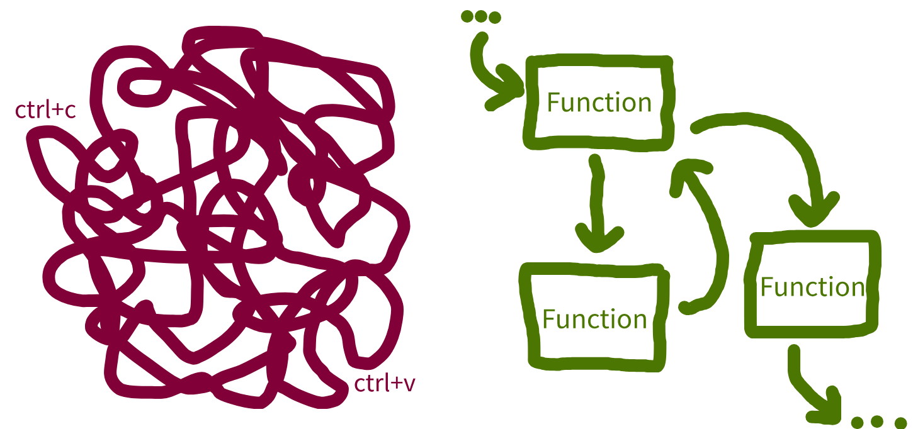
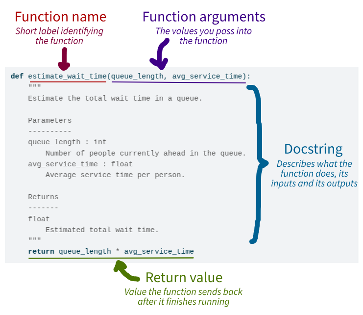
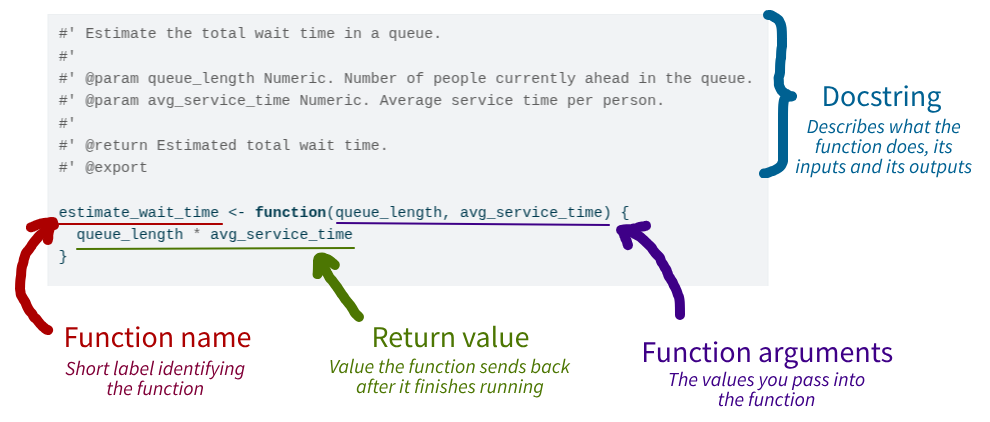
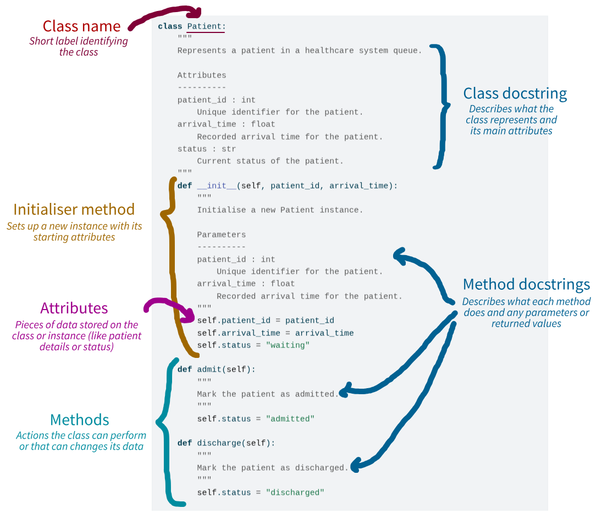

:::: {.pale-blue}

**Learning objectives:**

::: {.python-content}

* Understand why **reusing code** through functions and classes improves modularity and maintainability.
* Learn **how to write functions and classes**.
* Recognise how functions and classes fit into different **programming paradigms**.

:::

::: {.r-content}

* Understand why **reusing code** through functions improves modularity and maintainability.
* Learn **how to write functions**.

:::

**Relevant reproducibility guidelines:**

* STARS Reproducibility Recommendations: Minimise code duplication.
* NHS Levels of RAP (🥈): Reusable functions and/or classes are used where appropriate.

::::

:::: {.python-content}

::: {.very-pale-blue}

**Required packages:**

The following imports are required. These should be available from environment setup on the [Structuring as a package](/pages/guide/setup/package.qmd) page.

```{python}
import pandas as pd
```

:::

::::

<br>

On the previous [Structuring as a package](/pages/guide/setup/package.qmd) page, you organised your project into folders and modules so that code can be imported cleanly between files. This page now focuses on how to structure the code *inside* those modules using small, reusable functions and classes.

## Reusing code

It might seem convenient to write all your code in a **single script** and simply **copy-and-paste** sections when you need to reuse code. However, this approach quickly becomes unmanageable as your project grows.

::: {.python-content}

The main tools you can use to **organise** your code are **functions** and **classes**.

These allow you to break your code into **modular** components, each focused on a specific task. Modular code is easier to manage, test, and reuse - and these functions or classes can then be stored in **separate files** (modules) inside the package structure you set up on the previous page, so that other parts of your project can import and reuse them.

Using functions and classes has several benefits:

:::

::: {.r-content}

You can organise your code using **functions**.

These allow you to break your code into **modular** components, each focused on a specific task. Modular code is easier to manage, test, and reuse - and these functions can then be stored in **separate files** (modules) inside the package structure you set up on the previous page, so that other parts of your project can import and reuse them.

Using functions has several benefits:

:::

* **Easier to read and collaborate on**. Code is clearer and easier to understand for you and others.
* **Simpler to maintain with fewer errors**. Complex processes are broken into manageable parts. This makes them easier to update, test, and debug.
* **No duplication**. Writing reusable code means changes only need to be made in one place, such as when you are updating or fixing a bug. In contrast, duplicated code requires updates everywhere it appears, and you may miss some.

{fig-alt="Illustration representing differences between messy and modular code."}

## Writing modular code

<div class="h3-tight"></div>

### Functions

Functions group code into reusable blocks that perform a specific task. You define inputs (parameters), a sequence of steps (the function body), and outputs (return values).

Functions are ideal when you want to reuse actions to perform an operation or calculation.

Here, estimation of wait time based on the queue length and average service time:

::: {.python-content}

```{python}
def estimate_wait_time(queue_length, avg_service_time):
    """
    Estimate the total wait time in a queue.

    Parameters
    ----------
    queue_length : int
        Number of people currently ahead in the queue.
    avg_service_time : float
        Average service time per person.

    Returns
    -------
    float
        Estimated total wait time.
    """
    return queue_length * avg_service_time


# There are 4 patients ahead, average service time is 15 minutes
print(estimate_wait_time(queue_length=4, avg_service_time=15))
```

Below, we identify the different components of the function:

{fig-alt="Annotated python function identifying function name, arguments, docstring and return value."}

:::

::: {.r-content}

```{r}
#' Estimate the total wait time in a queue.
#'
#' @param queue_length Numeric. Number of people currently ahead in the queue.
#' @param avg_service_time Numeric. Average service time per person.
#'
#' @return Estimated total wait time.
#' @export

estimate_wait_time <- function(queue_length, avg_service_time) {
  queue_length * avg_service_time
}

# There are 4 patients ahead, average service time is 15 minutes
print(estimate_wait_time(queue_length = 4L, avg_service_time = 15L))
```

Below, we identify the different components of the function:

{fig-alt="Annotated R class identifying function name, arguments, docstring and return value."}

:::

:::: {.python-content}

### Classes

Classes bundle together data ("**attributes**") and behaviour ("**methods**"). They become useful when you:

* **Need to keep track of state**. This means you want to remember information about an object over time. For example, if you have a `Patient` class, each patient object can keep track of its patient ID, patient type, etc. You can update or check these attributes whenever you want.
* **Have several related functions that operate on the same kind of data**. Instead of writing separate functions that all work on the same data, you can put these inside a class as methods. This keeps your code organised and easier to use.

You first initialise the class with a special method called `__init__`. This methods runs when you create an object from the class. You pass parameters to it to set-up the initial attributes for that object.

You then have methods, which are like mini functions inside the class. They can access and change the class attributes, and can also accept additional inputs.

You create an instance of the class (called an "object") to use it. Each attribute has its own copy of the attributes and can use the methods to work with its own data.

Example:

```{python}
class Patient:
    """
    Represents a patient in a healthcare system queue.

    Attributes
    ----------
    patient_id : int
        Unique identifier for the patient.
    arrival_time : float
        Recorded arrival time for the patient.
    status : str
        Current status of the patient.
    """
    def __init__(self, patient_id, arrival_time):
        """
        Initialise a new Patient instance.

        Parameters
        ----------
        patient_id : int
            Unique identifier for the patient.
        arrival_time : float
            Recorded arrival time for the patient.
        """
        self.patient_id = patient_id
        self.arrival_time = arrival_time
        self.status = "waiting"

    def admit(self):
        """
        Mark the patient as admitted.
        """
        self.status = "admitted"

    def discharge(self):
        """
        Mark the patient as discharged.
        """
        self.status = "discharged"


alice = Patient(patient_id=1, arrival_time=3)
print(alice.status)
```

```{python}
alice.admit()
print(alice.status)
```

Below, we identify the different components of the class:

{fig-alt="Annotated python class identifying class name, class docstring, initialiser method, attributes, methods and method docstrings."}

<br>

**Are you new to classes?** Checkout this video from [2MinutesPy](https://www.youtube.com/@2MinutesPy) on YouTube for a more detailed explanation:



### Subclasses and inheritance

A **subclass** (or "child class") is a class that inherits from another class (the "parent" or "superclass"). Subclasses can **reuse or extend** the behaviour of their parent.

Here, an emergency patient with an extra attribute (`severity`) and method (`triage()`).

```{python}
class EmergencyPatient(Patient):
    """
    Represents an emergency patient with severity-based triage.

    Inherits from `Patient` and adds severity information to determine
    treatment priority.

    Attributes
    ----------
    patient_id : int
        Unique identifier for the patient.
    arrival_time : float
        Recorded arrival time of the patient.
    status : str
        Current status of the patient, inherited from `Patient`.
    severity : int
        Severity score of the patient.
    """
    def __init__(self, patient_id, arrival_time, severity):
        """
        Initialise a new EmergencyPatient instance.

        Parameters
        ----------
        patient_id : int
            Unique identifier for the patient.
        arrival_time : float
            Recorded arrival time of the patient.
        severity : int
            Severity score of the patient.
        """
        super().__init__(patient_id, arrival_time)
        self.severity = severity

    def triage(self):
        """
        Determine treatment priority based on severity level.
        """
        if self.severity > 7:
            return "High priority"
        return "Standard priority"


ben = EmergencyPatient(patient_id=2, arrival_time=5, severity=9)
print(ben.status)
```

```{python}
print(ben.triage())
```

<br>

**Are you new to inheritance?** Checkout this video from [Bro Code](https://www.youtube.com/@BroCodez) on YouTube for a more detailed explanation:



<br>

::: {.callout-note title="When should you use inheritance?"}

Inheritance is most useful when you have several types that are all variations of the same thing, and they share behaviour that you want to implement once in a common base class (e.g. `Patient`, with `EmergencyPatient`, `ElectivePatient`, etc. as special cases).

In these cases, each subclass is a more specific version of the parent class (an emergency patient *is* a patient), and you mainly add small bits of extra data or behaviour such as `severity` and `triage()` rather than rewriting everything.

If you find yourself just trying to reuse code between unrelated things, or needing lots of different combinations of behaviours, it is usually better to keep a single class and use composition (one object has a reference to another) instead of inheritance.

:::

### Programming paradigms

Now that you've seen how functions and classes help structure your code, we can step back and look at what broader **programming paradigms** these patterns reflect.

A **programming paradigm** is a general style or approach to organising and structuring code. The most common paradigms in Python are:

* Using functions - **procedural** or **functional** programming.
* Using classes - **object-oriented** programming (OOP).

::: {.callout-note collapse="true"}

## Click here to find out more about programming paradigms...

This table provides a brief overview of the programming paradigms.

| Paradigm | Main object used | Key characteristics |
| - | - | --- |
| **Procedural programming** | Functions | •  Code runs **step-by-step** using functions, often passing data between them<br>• Data structures (like lists) are usually **mutable** (i.e. they can be changed directly).<br>• Use **loops** like `for` and `while` to repeat actions. |
| **Functional programming** | Functions | • Uses **pure functions**, which always return the same output for same input, and do not alter anything outside themselves (only effect is to return value/s).<br>• Functions are values - they can be saved in variables, passed to other functions, or returned just like other data types.<br>• Data structures are **immutable**, meaning they can't be changed directly - instead, a new version is created when a change is needed.<br>• Often replaces loops with **recursion** (a function calling itself) and **higher-order functions** (like Python's `map` or R's `sapply`).<br>•These features tend to make code more predictable, easier to debug, and more maintainable than procedural approaches. |
| **Object-oriented programming (OOP)** | Classes/Objects | • Organises code using **objects** - instances of classes that combine data (attributes) and behaviour (methods).<br>• Supports **encapsulation** - combining related data and functions, and hiding internal details when needed.<br>• Enables **inheritance**, where one class can build on another.<br>• Supports **polymorphism**, allowing different objects to respond differently to the same operation depending on their type. |

Functional programming is well-suited to analyses where you pass inputs in and get results, without needing to keep track of state between calls (like the simple queue example in this chapter).

Object-oriented programming is helpful when you need to manage evolving state and related operations together, such as a queue object that can be run, summarised, and extended with extra methods as your simulation grows.

If you want to find out more, check out the following:

* ["Introduction to Programming Paradigms"](https://www.datacamp.com/blog/introduction-to-programming-paradigms) by Samuel Shaibu (Datacamp, 2024).
* ["OOP vs Functional vs Procedural"](https://www.scaler.com/topics/java/oop-vs-functional-vs-procedural/) (Scaler Topics, 2022).

:::

Normally, a mix of programming paradigms will be used.

::::

## Test yourself

<div class="h3-tight"></div>

### Quiz

```{r}
#| echo: false
library(webexercises) # nolint: library_call_linter
```

:::: {.python-content}

::: {.callout-note}

## Why do we recommend using functions and classes, instead of copying and pasting code?

```{r}
#| output: asis
#| echo: false
cat(longmcq(c(
  answer = paste0(
    "Because small, reusable functions/classes make code more modular, ",
    "easier to read, test, and maintain, and avoid duplication."
  ),
  paste0(
    "Because as long as logic is in functions or classes, it doesn't matter ",
    "if there is a lot of duplicated code."
  )
)))
```

:::

::: {.callout-note}

## In the Python `Patient` class, what is the purpose of the `__init__` method?

```{r}
#| output: asis
#| echo: false
cat(longmcq(c(
  "To automatically run every hour and update all patients in the system.",
  answer = paste0(
    "It initialises a new `Patient` object by setting attributes such as ",
    "`patient_id`, `arrival_time`, and the initial `status`."
  ),
  "To delete the patient from the queue when they arrive at the hospital."
)))
```

:::

::::

:::: {.r-content}

::: {.callout-note}

## Why do we recommend using functions, instead of copying and pasting code?

```{r}
#| output: asis
#| echo: false
cat(longmcq(c(
  answer = paste0(
    "Because small, reusable functions make code more modular, ",
    "easier to read, test, and maintain, and avoid duplication."
  ),
  paste0(
    "Because as long as logic is in functions, it doesn't matter ",
    "if there is a lot of duplicated code."
  )
)))
```

:::

::: {.callout-note}

## In the R `estimate_wait_time` example, what does the function return?

```{r}
#| output: asis
#| echo: false
cat(longmcq(c(
  "A list containing duration, status, and a vector of results.",
  answer = "A single numeric value: the estimated total wait time.",
  "A data frame with one row per patient and their individual wait time."
)))
```

:::

::::

### Activity

::: {.python-content}

**Task: Refactor the provided script into a function or class and put it on GitHub**. To do this, you should:

* **Copy the script into a version controlled folder** (e.g. `des-rap-python/` created on the [Version control](../setup/version.qmd) page) and push to GitHub. This means you keep a record of the original version, and can easily compare it against changes you make.
* **Turn the code into either a function or class** - see below if you want some hints on how to do this.
* **Push the new version** of the script to GitHub.

:::

::: {.r-content}

**Task: Refactor the provided script into a function and put it on GitHub**. To do this, you should:

* **Copy the script into a version controlled folder** (e.g. `des-rap-r/` created on the [Version control](../setup/version.qmd) page) and push to GitHub. This means you keep a record of the original version, and can easily compare it against changes you make.
* **Turn the code into a function** - see below if you want some hints on how to do this.
* **Push the new version** of the script to GitHub.

:::

If you get completely stuck, a solution is provided below - but have a go yourself first!

::: {.python-content}

```{python}
# Input data
patient_arrivals = [1, 3, 4, 10, 12]  # in minutes
service_times = [5, 7, 3, 4, 6]       # in minutes
arrival_ids = list(range(1, len(patient_arrivals) + 1))

# Initialise tracking variables
start_times = [0] * len(patient_arrivals)
end_times = [0] * len(patient_arrivals)
waiting_times = [0] * len(patient_arrivals)

# Simulate each patient's start and end time
for i, arrival in enumerate(patient_arrivals):
    if i == 0:
        start_times[i] = arrival
    else:
        # Next patient starts when they arrive or when previous is done
        start_times[i] = max(arrival, end_times[i - 1])

    end_times[i] = start_times[i] + service_times[i]
    waiting_times[i] = start_times[i] - arrival

# Combine into a DataFrame
results = pd.DataFrame({
    'id': arrival_ids,
    'arrival': patient_arrivals,
    'start': start_times,
    'end': end_times,
    'waiting': waiting_times
})

print(results)
```

:::

::: {.r-content}

```{r}
# Input parameters
patient_arrivals <- c(1L, 3L, 4L, 10L, 12L)  # in minutes
service_times <- c(5L, 7L, 3L, 4L, 6L)       # in minutes
arrival_ids <- seq_along(patient_arrivals)

# Initialise tracking variables
start_times <- numeric(length(patient_arrivals))
end_times <- numeric(length(patient_arrivals))
waiting_times <- numeric(length(patient_arrivals))

# Simulate each patient's start and end time
for (i in seq_along(patient_arrivals)) {
  if (i == 1L) {
    start_times[i] <- patient_arrivals[i]
  } else {
    # Next patient starts when they arrive or when previous is done
    start_times[i] <- max(patient_arrivals[i], end_times[i - 1L])
  }
  end_times[i] <- start_times[i] + service_times[i]
  waiting_times[i] <- start_times[i] - patient_arrivals[i]
}

# Combine into a data frame
results <- data.frame(
  id = arrival_ids,
  arrival = patient_arrivals,
  start = start_times,
  end = end_times,
  waiting = waiting_times
)

print(results)
```

:::

:::: {.callout-tip title="Hints"}

::: {.python-content}

**Function:**

:::

* You could name the function `simulate_queue` (or similar).
* The inputs to the function are `patient_arrivals` and `service_times`.
* Your function should return the dataframe.
* You can otherwise just copy in the code for simulating the queue as provided - no changes needed!
* You can try running your function with the provided list of arrival and service times, and see if results are consistent.

::: {.python-content}

**Class:**

* You could name the class `Queue` (or similar).
* You can create an `__init__` method which accepts two arguments: `patient_arrivals` and `service_times`. These can be stored as attributes.
* You could then create a `run()` method containing the code for simulating the queue. It should return the dataframe. Don't forget to use `self.` when referring to `patient_arrivals` or `service_times`.
* You can try running your class with the provided list of arrival and service times, and see if results are consistent.
* Don't forget to include `self` when defining the methods (e.g. `def __init__(self, ...)`, `def run(self)...`).

:::

::::

:::: {.callout-tip title="Click to view solutions" collapse="true"}

::: {.python-content}

**Function:**

```{python}
def simulate_queue(patient_arrivals, service_times):
    """
    Simulate a single-server queue with deterministic arrivals and service.

    Parameters
    ----------
    patient_arrivals : list
        Arrival times in minutes.
    service_times : list
        Service times in minutes.

    Returns
    -------
    pandas.DataFrame
        Table with id, arrival, start, end, and waiting time.
    """
    # Generate list of arrival IDs
    arrival_ids = list(range(1, len(patient_arrivals) + 1))

    # Initialise tracking variables
    start_times = [0] * len(patient_arrivals)
    end_times = [0] * len(patient_arrivals)
    waiting_times = [0] * len(patient_arrivals)

    # Simulate each patient's start and end time
    for i, arrival in enumerate(patient_arrivals):
        if i == 0:
            start_times[i] = arrival
        else:
            # Next patient starts when they arrive or when previous is done
            start_times[i] = max(arrival, end_times[i - 1])

        end_times[i] = start_times[i] + service_times[i]
        waiting_times[i] = start_times[i] - arrival

    # Combine into a DataFrame
    return pd.DataFrame({
        'id': arrival_ids,
        'arrival': patient_arrivals,
        'start': start_times,
        'end': end_times,
        'waiting': waiting_times
    })


simulate_queue(patient_arrivals=[1, 3, 4, 10, 12],
               service_times=[5, 7, 3, 4, 6])
```

**Class:**

```{python}
class Queue:
    """
    Simulate a single-server queue with deterministic arrivals and service.

    Attributes
    ----------
    patient_arrivals : list
        Arrival times in minutes.
    service_times : list
        Service times in minutes.
    """
    def __init__(self, patient_arrivals, service_times):
        """
        Initialise a new Queue instance.

        Parameters
        ----------
        patient_arrivals : list
            Arrival times in minutes.
        service_times : list
            Service times in minutes.
        """
        self.patient_arrivals = patient_arrivals
        self.service_times = service_times

    def run(self):
        """
        Run the queue simulation.

        Returns
        -------
        pandas.DataFrame
            Table with id, arrival, start, end, and waiting time.
        """
        # Generate list of arrival IDs
        arrival_ids = list(range(1, len(self.patient_arrivals) + 1))

        # Initialise tracking variables
        start_times = [0] * len(self.patient_arrivals)
        end_times = [0] * len(self.patient_arrivals)
        waiting_times = [0] * len(self.patient_arrivals)

        # Simulate each patient's start and end time
        for i, arrival in enumerate(self.patient_arrivals):
            if i == 0:
                start_times[i] = arrival
            else:
                # Next patient starts when they arrive or when previous is done
                start_times[i] = max(arrival, end_times[i - 1])

            end_times[i] = start_times[i] + self.service_times[i]
            waiting_times[i] = start_times[i] - arrival

        # Combine into a DataFrame
        return pd.DataFrame({
            'id': arrival_ids,
            'arrival': self.patient_arrivals,
            'start': start_times,
            'end': end_times,
            'waiting': waiting_times
        })


queue = Queue(patient_arrivals=[1, 3, 4, 10, 12],
              service_times=[5, 7, 3, 4, 6])
queue.run()
```

:::

::: {.r-content}

```{r}
#' Simulate a single-server queue with deterministic arrivals and service.
#'
#' @param patient_arrivals List. Arrival times in minutes.
#' @param service_times List. Service times in minutes.
#'
#' @return Data frame with id, arrival, start, end and waiting time.
#' @export

simulate_queue <- function(patient_arrivals, service_times) {
  arrival_ids <- seq_along(patient_arrivals)

  # Initialise tracking variables
  start_times <- numeric(length(patient_arrivals))
  end_times <- numeric(length(patient_arrivals))
  waiting_times <- numeric(length(patient_arrivals))

  # Simulate each patient's start and end time
  for (i in seq_along(patient_arrivals)) {
    if (i == 1L) {
      start_times[i] <- patient_arrivals[i]
    } else {
      # Next patient starts when they arrive or when previous is done
      start_times[i] <- max(patient_arrivals[i], end_times[i - 1L])
    }
    end_times[i] <- start_times[i] + service_times[i]
    waiting_times[i] <- start_times[i] - patient_arrivals[i]
  }

  # Combine into a data frame
  data.frame(
    id = arrival_ids,
    arrival = patient_arrivals,
    start = start_times,
    end = end_times,
    waiting = waiting_times
  )
}


simulate_queue(patient_arrivals = c(1L, 3L, 4L, 10L, 12L),
               service_times = c(5L, 7L, 3L, 4L, 6L))
```

:::

::::

<br><br>
