::: {.pale-blue}

**Learning objectives:**

This page introduces workflows for version control using GitHub.

* **Version control:** What it is and why it matters.
* **Git:** How it works and common platforms.
* **Setting up a GitHub repository:** How to create one from scratch.
* **Cloning the repository:** How to copy a repository to your local machine.
* **Working with Git from your development environment:** An alternative to using the command line.
* **Creating a branch and pushing changes:** How to work on a branch and sync changes.
* **GitHub organisations:** What they are, why use them, and how to set one up.

**Relevant reproducibility guidelines:**

* NHS Levels of RAP (🥉): Code is version controlled.

:::

## Version control

**Version control** is a way to track changes to your documents over time. You can...

* **Track** changes to files: see what changes, when it changed, and who changed it.
* "**Roll back**" to earlier versions of your files if something goes wrong.
* Work **simultaneously** with others without overwriting each other.
* Try **new ideas** without risking your main work.
* **Back up and share** work online using platforms like GitHub.

This is super handy, whether you're working **by yourself** or **in a team**!

> 💡 **Recommendation:** Use version control from the start of the project.

## Git

The most popular version control system is **Git**.

When using Git, we refer to our work as a **repository**. This is simply a folder containing your project files, as well as a special hidden `.git/` folder which stores all the version history.

We take snapshots of the files at specific points in time, and these are called **commits**.

Git can just be used on your local computer, but most people will use an online platform to store their repositories. The most popular options are:

* **GitHub** - <https://github.com/>.
* **GitLab** - <https://gitlab.com/>.
* **BitBucket** - <https://bitbucket.org/>.

This tutorial will focus on **GitHub** as it is the most widely used and beginner-friendly.

## Setting up a GitHub repository

<div class="h3-tight"></div>

### 1. Create an account

Go to <https://github.com/signup> and sign up with your email and a username.

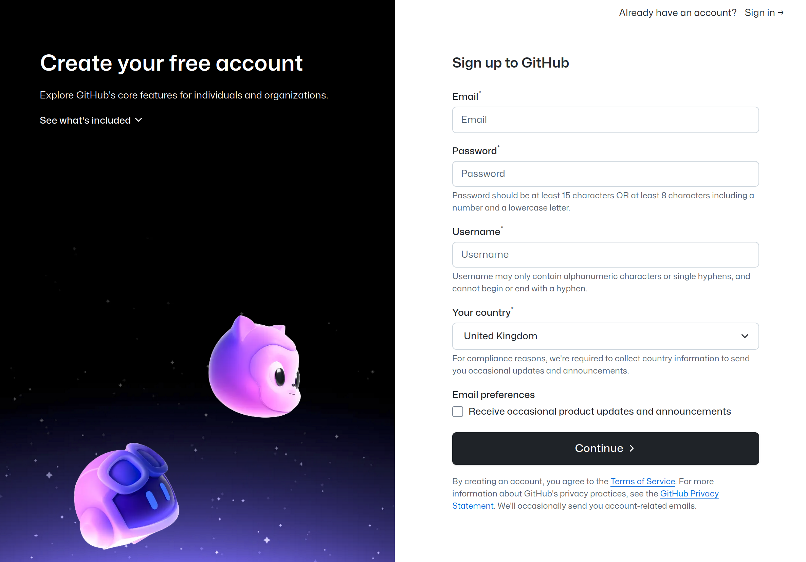{fig-alt="Screenshot of GitHub sign up page."}

<br>

### 2. Create a new repository

Click the "+" button in the top right corner, and select "New repository".

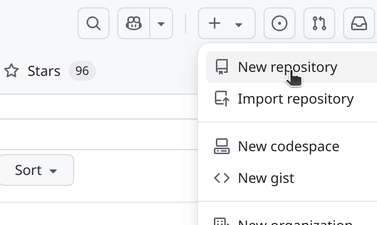{fig-align="center" width=70% fig-alt="Screenshot of 'New repository' button."}

Next, fill out the form to create your repository.

It's best to create a **separate repository for each project** to keep your code organised and easy to manage. For instance, if you're experimenting with both Python and R tutorials, set up a different repository for each one. Similarly, when developing models for different systems - such as one predicting emergency department wait times and another analysing the impact of a vaccination programme - it's best to keep each in its own repository.

A simple, illustrative example is shown below:

::: {.python-content}
* **Repository name:**  e.g. *des-rap-python*
:::
::: {.r-content}
* **Repository name:**  e.g. *des-rap-r*
:::

* **Description**: e.g. *Repository for working through examples from the des-rap-book.*

* **Visibility:** Choose whether to make the repository public  (anyone can see it) or private (only visible to you and people you invite).

* **README:** Select "Add a README file", which will create a blank README we can populate later (see the [documentation](../style_docs/documentation.qmd) page).

::: {.python-content}

* **.gitignore:** Select the python .gitignore template. This will create a `.gitignore` file in your repository that tells Git which files not to track.

:::

::: {.r-content}

* **.gitignore:** Select the R .gitignore template. This will create a `.gitignore` file in your repository that tells Git which files not to track.

:::

* **Licence:** Select an appropriate licence for your repository (see the [licensing](../sharing/licence.qmd) page for more information and advice).

::: {.python-content}

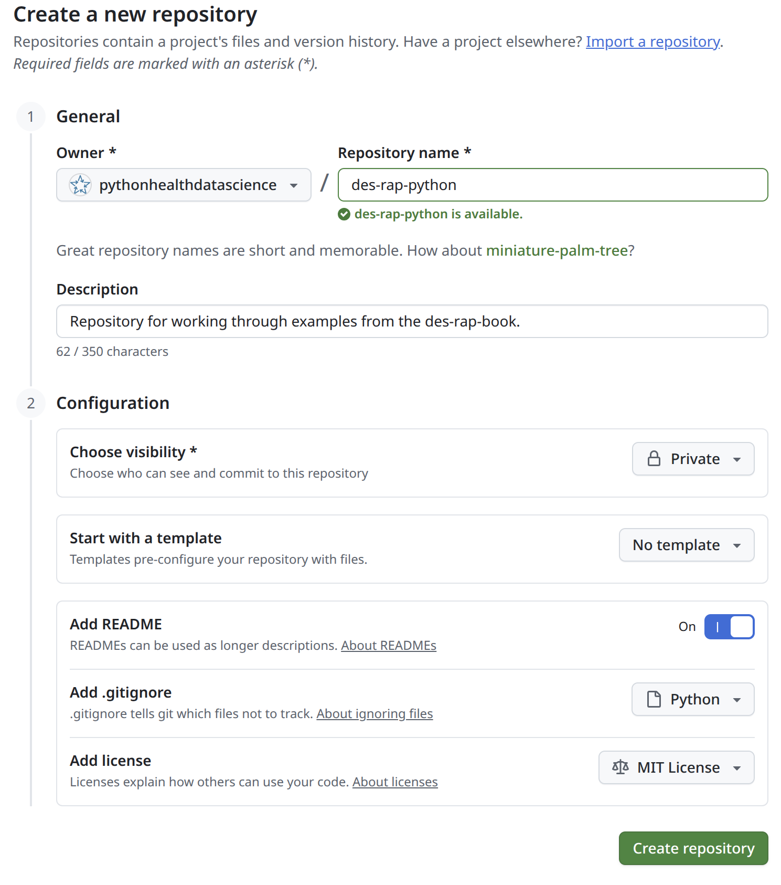{fig-alt="Screenshot of 'Create a new repository' page."}

:::

::: {.r-content}

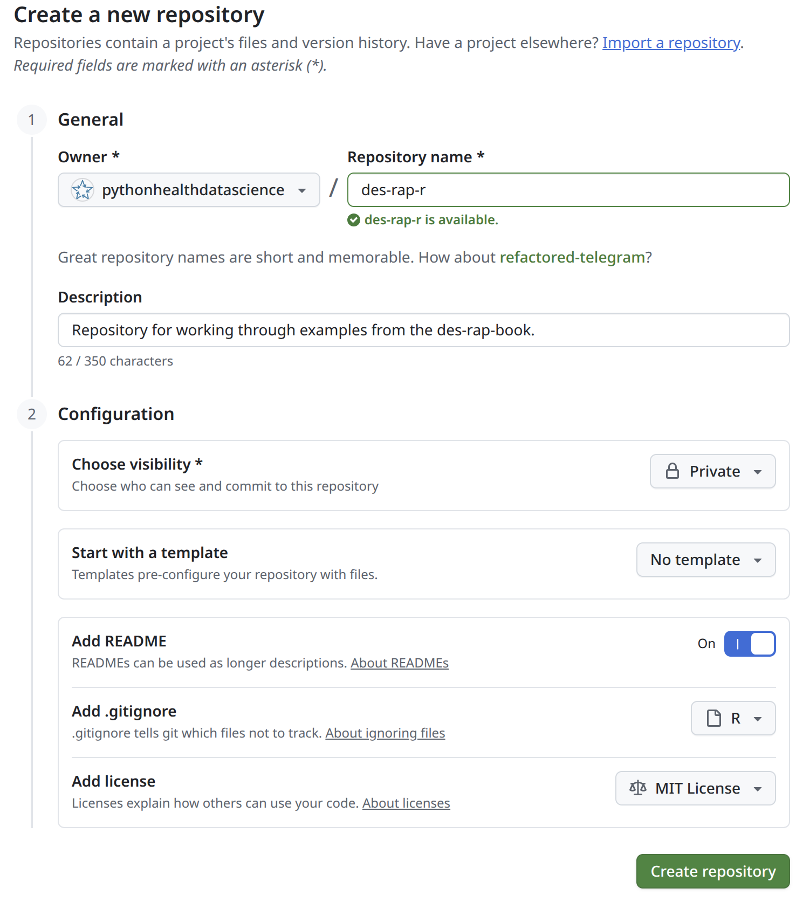{fig-alt="Screenshot of 'Create a new repository' page."}

:::

::: {.callout-tip}

## Sharing your work openly

We would encourage you to make your work open access - i.e. creating a public GitHub repository, and using a permissive open licence (e.g. MIT). As described by [The Turing Way](https://book.the-turing-way.org/reproducible-research/open/open-access), benefits to making your work open include:

* **Sharing:** Easy to reference and share in papers and presentations.
* **Transparency:** Clearly shows how you conducted your analyses.
* **Reproducibility:** Others can verify and reproduce your results.
* **Quality:** Knowing it's public encourages good practice.
* **Reuse and learning**: Others can learn from and build on your work, reducing research waste.
* **Extends impact**: Your work can continue to have impact after the project ends. This could include for you, if you change jobs, and want to be able to look back on old code!
* **Collaboration:** Creates opportunities for collaboration, if others come across your code and are interested in working together.
* **Funder requirements:** For research projects, some grants now mandate open code.

Including a [license](../sharing/licence.qmd) and [citation instructions](../sharing/citation.qmd) enables others to use your code while giving you credit.

That said, it's your code and your choice - if you have specific concerns or proprietary work, a private repository is always an option.

:::

## Cloning the repository

You have created a remote repository on GitHub - we now want to clone it, which means we create a local copy on your computer, and can sync between the local and remote repositories.

### 1. Get the url

On the main page of you repository, click the &nbsp;[<> Code]{style="background: #597341; color: #fff; border-radius:4px; padding:2px 8px; font-family:monospace; font-weight:bold; font-size:90%;"}&nbsp; button, then copy the HTTPS url.

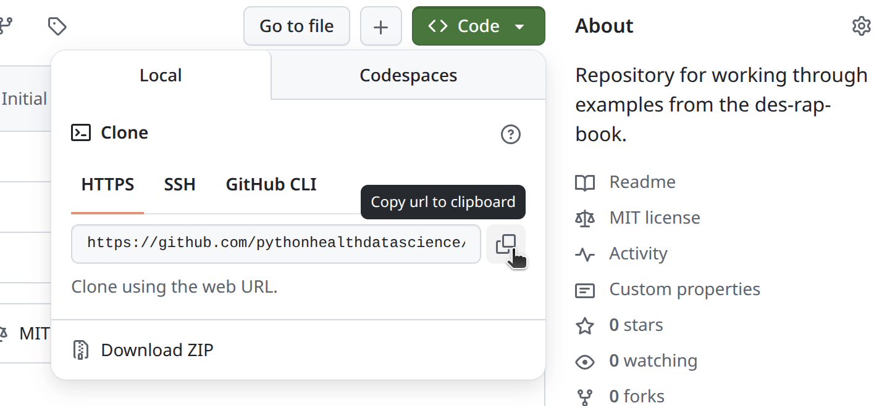{fig-alt="Screenshot of 'Copy url to clipboard'."}

### 2. Open up a terminal or Git Bash

To clone the repository, we will open a terminal window. This is just a simple text window where you type commands (instead of clicking buttons and menus). You don't need to know lots of commands for this guide - we will tell you exactly what to type, starting with the Git commands needed to clone your repository.

We have provided a few examples of where you might find this, depending on your chosen integrated development environment (e.g. VSCode, RStudio) or operating system - but there are many other options too.

::: {.python-content}

#### Opening the terminal in VS Code

In VS Code, open your project folder, then choose **View → Terminal** (or **View → Integrated Terminal**, depending on your version).

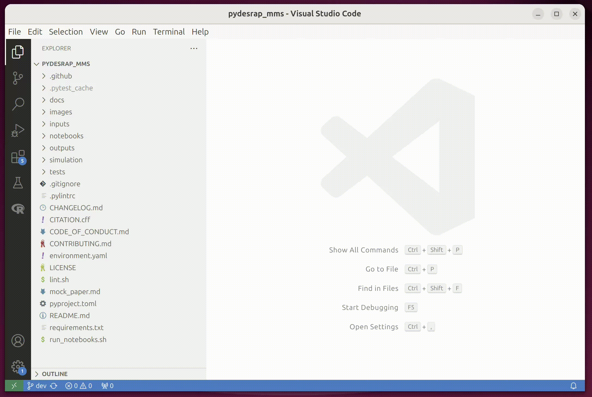{fig-alt="Recording of VS Code, showing how to open the terminal"}

:::

::: {.r-content}

#### Opening the terminal in RStudio

In RStudio, look for the **Terminal** tab next to the **Console** tab and click it; this will open a terminal session.

If you cannot see the Terminal tab, go to **Tools → Terminal → New Terminal** (or **Move Focus to Terminal**) to make it appear.

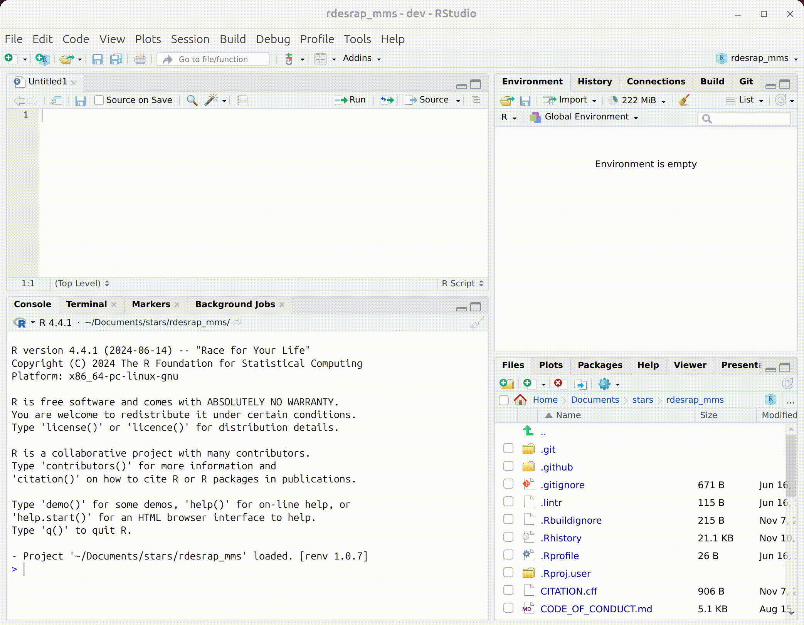{fig-alt="Recording of RStudio, showing how to open the terminal"}

:::

#### Opening Git Bash on Windows

On Windows, open the Start menu, search for "**Git Bash**", and click it to open a terminal window where you can run Git commands.

Git Bash is a small application that gives you a terminal plus Git, so you can type commands like git clone and git status. If you're new to Git Bash, check out [4-minute video tutorial on installing Git Bash](https://youtu.be/cweFdzKMeS0?si=U2cJ_LnJ_uJvqetT).

### 3. Clone the repository

Navigate to the folder where you want the project to be stored.

You can see your current working directory by running:

```{.bash}
pwd
```

You can view a list of files in that directory:

```{.bash}
ls
```

You can then change directories using the `cd` command (short for "change directory"). The text after `cd` is the path to the folder you want to move into, for example:

```{.bash}
cd Documents/myproject/
```

To move up a folder (to the parent directory), you can use:

```{.bash}
cd ..
```

> If you are using Windows Command Prompt (not Git Bash), use `cd` instead of `pwd` and `dir` instead of `ls`.

Once you are in the folder where you want to store your project (e.g., `Documents/`), you can run the following (using your copied url):

```{.bash}
git clone https://github.com/your-username/your-repo-name.git
```

For example:

::: {.python-content}
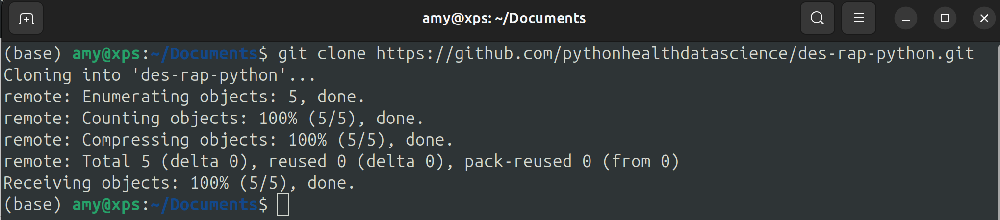{fig-alt="Screenshot of git clone command having run from the terminal."}
:::
::: {.r-content}
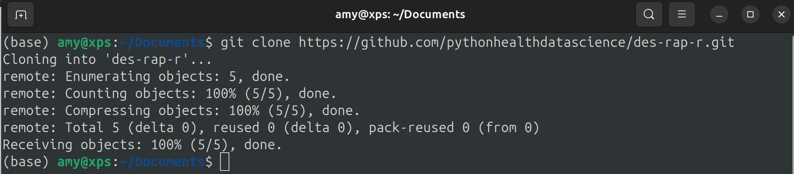{fig-alt="Screenshot of git clone command having run from the terminal."}
:::

This will create a local copy of your repository.

## Working with Git from your development environment

Once you've cloned your repository, you can manage Git directly from your development environment, instead of using the command line for every step.

::: {.python-content}

For example, **VSCode** is a popular option in Python which offers built-in Git integration. To view the Git options, click on "Source Control" in the activity bar.

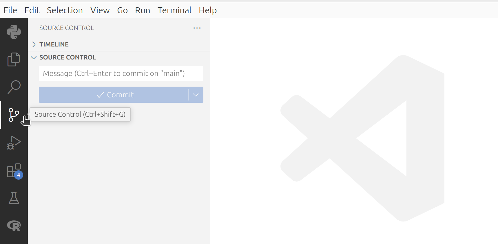{fig-alt="Screenshot of VSCode Source Control."}

From here you can view commit files, view diffs, change branches, and push/pull to GitHub without leaving VSCode.

:::

::: {.r-content}

For example, **RStudio** is a popular option in R which offers built-in Git integration. When you open a folder connected to a Git repository in RStudio, a **Git** tab appears in the top-right pane.

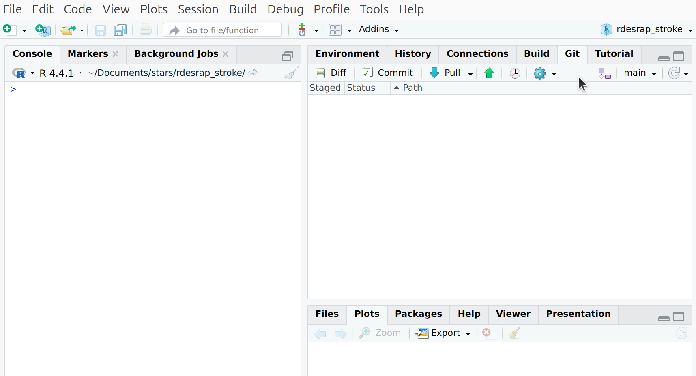{fig-alt="Screenshot of RStudio Git tab."}

From here you can view commit files, view diffs, change branches, and push/pull to GitHub without leaving RStudio.

:::

**Note:** In the examples below, we'll show the **command line** approach as it is universally applicable for most Git operations. However, when it comes to merging branches, we use the GitHub website as it enables us to use the pull request workflow. You are always welcome to use your preferred development environment for staging, committing, and pushing—these all use the same underlying Git process.

::: {.python-content}

**Need help?** Check out this [15-minute tutorial on using git and GitHub in VSCode](https://youtu.be/z5jZ9lrSpqk?si=2IcSNArDXvEileM8).

:::

::: {.r-content}

**Need help?** Check out this [10-minute tutorial walks through connecting an RStudio project to git and GitHub](https://youtu.be/bUoN85QvC10?si=oI2FR5zAzDED1YS8).

:::

## Basic workflow: solo development

When learning Git or working alone, the simplest approach is to work directly 
on the main branch. This workflow is simple:

### 1. Make some changes

This could be any changes to code, documentation or other artefacts in the repository. So we can test this out, let's make a simple change to our README -

Before:

::: {.python-content}
```{.md}
# des-rap-python
Repository for working through examples from the des-rap-book.
```
:::
::: {.r-content}
```{.md}
# des-rap-r
Repository for working through examples from the des-rap-book.
```
:::

After:

::: {.python-content}
```{.md}
# DES RAP Python

Repository for working through examples from the des-rap-book:

> Heather, A., Monks, T., Mustafee, N., Harper, A., Alidoost, F., Challen, R., & Slater, T. (2025). DES RAP Book: Reproducible Discrete-Event Simulation in Python and R. https://github.com/pythonhealthdatascience/des_rap_book. https://doi.org/10.5281/zenodo.17094155.
```
:::
::: {.r-content}
```{.md}
# DES RAP R

Repository for working through examples from the des-rap-book:

> Heather, A., Monks, T., Mustafee, N., Harper, A., Alidoost, F., Challen, R., & Slater, T. (2025). DES RAP Book: Reproducible Discrete-Event Simulation in Python and R. https://github.com/pythonhealthdatascience/des_rap_book. https://doi.org/10.5281/zenodo.17094155.
```
:::

### 2. Commit and push the changes

To save this new version of our file to Git, we need to commit the changes.   

We use `git add` to choose which files to commit, followed by the files you want to include, for example:

```{.bash}
git add README.md
```

You can use `git add .` which stages all new and modified files in the current folder and its subfolder. However, this can accidentally include files that you did not intend to commit (e.g., large data, temporary outputs). We recommend listing files or directories explicitly with `git add <filename>` or `git add <directory>` so you stay more in control of exactly what goes into each commit.

We then write a descriptive commit message using `git commit`:

```{.bash}
git commit -m "docs(README): add des-rap-book citation"
```

We can view our staged commits (i.e., set of files selected with `git add` and ready to be pushed) by running:

```{.bash}
git status
```

Finally, we push the changes using `git push`:

```{.bash}
git push
```

<br>

::: {.callout-tip title="Writing commit messages"}

Clear, consistent commit messages make it easier to understand the project's history, trace bugs, and review progress over time.

To keep commit messages structured and readable, we follow the [Conventional Commits](https://www.conventionalcommits.org/en/v1.0.0/) specification. It is a simple standardised format where commit messages are structured as:

```
<type>(optional scope): <description>
```

Common types include:

* `feat` - a new feature
* `fix` - a bug fix
* `docs` - documentation changes
* `refactor` - code change that doesn't alter behaviour
* `style` - formatting or style-only changes
* `test` - adding or updating tests

Examples:

* `feat(model): add patient routing logic`
* `fix(test): add correct path to input data`
* `docs(README): update citation link`

:::

## Collaborative workflow: using branches

Above, you were working on the main branch. But what is a branch?

A **branch** is a separate workspace where you can safely experiment with changes without affecting your main project. Think of it as a parallel copy of your repository that you can work on independently. You can name branches whatever you like - the default branch is called `main`.

**When collaborating with others**, branches become essential. They allow you to work in parallel on different features, enable code review through pull requests, and prevent conflicts when multiple people edit the same files.

**For solo development**, branches are also beneficial. They allow you to keep a stable version on main while experimenting with new features on separate branches. This is especially useful if you have GitHub Actions (or similar) running automated tests on pushes to main - you can test experimental code on branches before merging to main, ensuring your main branch always contains working code.

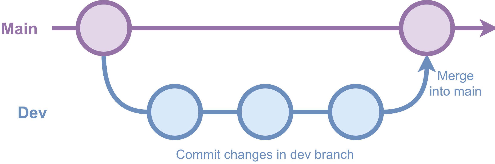{fig-alt="Illustration showing how we can create a branch off of main, commit changes on the branch, and then merge back into main"}

To work in a branch and push changes...

### 1. Create a branch

Open your terminal or Git Bash (as explained above), and make sure your current working directory is your Git repository.

To create a new branch (here, named `dev`), then run:

```{.bash}
git branch dev
```

To move into this branch:

```{.bash}
git checkout dev
```

You should see a message "Switched to branch 'dev'".

We can add this branch to the remote GitHub repository by running:

```{.bash}
git push -u origin dev
```

### 2. Commit and push changes

This is the same as for the solo workflow - `git commit` and `git push`!

### 3. Merge the changes

Once you've finished committing changes to your branch (e.g. `dev`), the next step is to merge those changes into the `main` branch. There are two main ways to do this:

* **Using the GitHub website** - recommended for beginners and team workflows.
* **Using the command line** - useful if you are comfortable with Git or working independently.

#### Merging using the GitHub website

The easiest and most common way to merge is via a **pull request** on GitHub. A pull request is a way to propose merging changes from one branch into another. This lets you review your changes in a user-friendly interface, and gives others an opportunity to review and discuss them before they are added to the main project.

The process is summarised in this diagram:

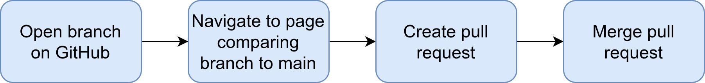{fig-alt="Summarises steps for merging using GitHub"}

:::: {.callout-note title="Click to view step-by-step instructions from merging using the GitHub website" collapse="true"}

To create and merge a pull request, you should first go to your repository on GitHub. You should see that you now have multiple branches. **Click on your new branch** (e.g. `dev`) to switch to it.

::: {.python-content}
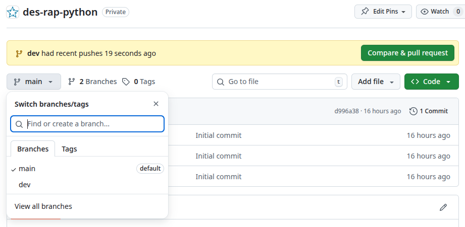{fig-alt="Screenshot of GitHub repository showing branches that could switch to."}
:::
::: {.r-content}
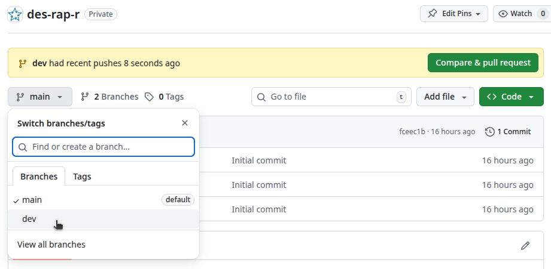{fig-alt="Screenshot of GitHub repository showing branches that could switch to."}
:::

<br>

Navigate to **page comparing branch to main**. You can do this by clicking either:

* This branch is <span style="color: #3366cc; text-decoration: underline">X commits ahead of</span> <span style="background: #e6f2fa; ">main</span>.
* &nbsp;[Compare & pull request]{style="background: #597341; color: #fff; border-radius:4px; padding:2px 8px; font-family:monospace; font-weight:bold; font-size:90%;"}&nbsp;

::: {.python-content}
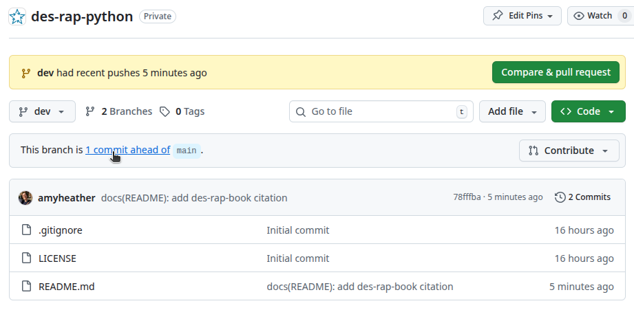{fig-alt="Screenshot of GitHub dev branch, showing cursor hovering over 'X commits ahead of main'."}
:::
::: {.r-content}
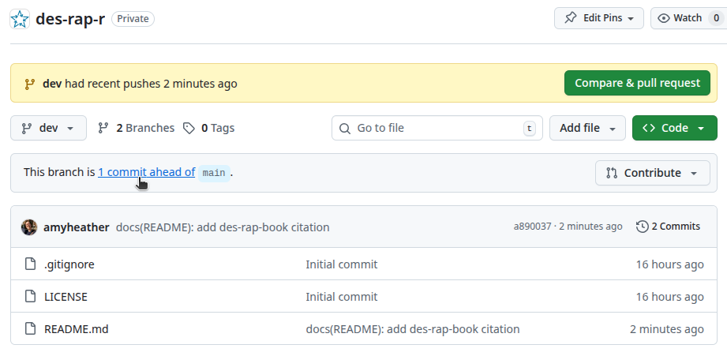{fig-alt="Screenshot of GitHub dev branch, showing cursor hovering over 'X commits ahead of main'."}
:::

<br>

You will be able to see **side-by-side changes** in the files you have modified. To create a pull request, click on the button: &nbsp;[Create pull request]{style="background: #597341; color: #fff; border-radius:4px; padding:2px 8px; font-family:monospace; font-weight:bold; font-size:90%;"}&nbsp;.

::: {.python-content}
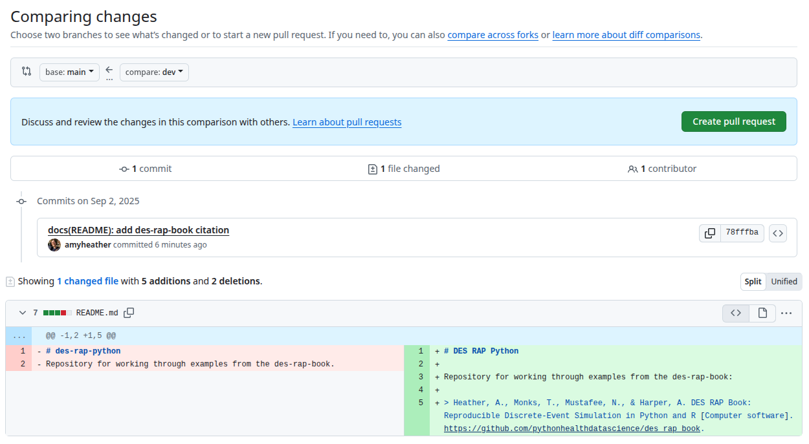{fig-alt="Screenshot of GitHub 'comparing changes' page."}
:::
::: {.r-content}
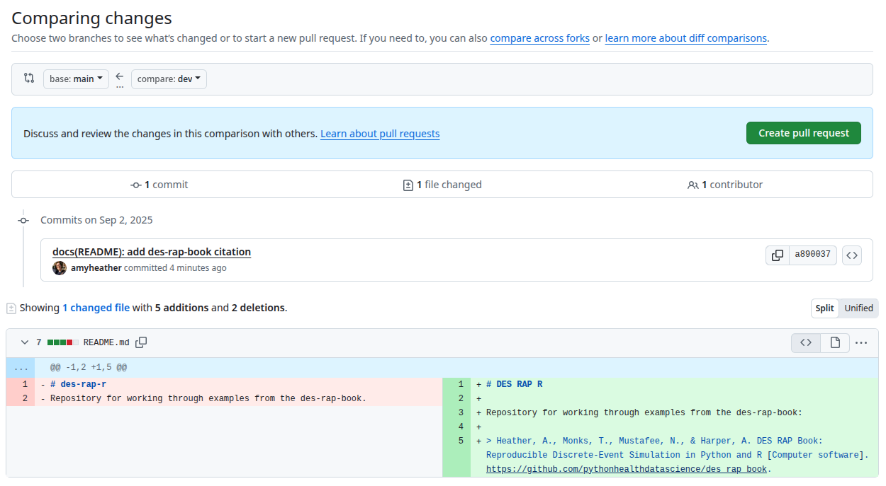{fig-alt="Screenshot of GitHub 'comparing changes' page."}
:::

<br>

We can modify the message or just leave as is.

Then, again, you need to click &nbsp;[Create pull request]{style="background: #597341; color: #fff; border-radius:4px; padding:2px 8px; font-family:monospace; font-weight:bold; font-size:90%;"}&nbsp;.

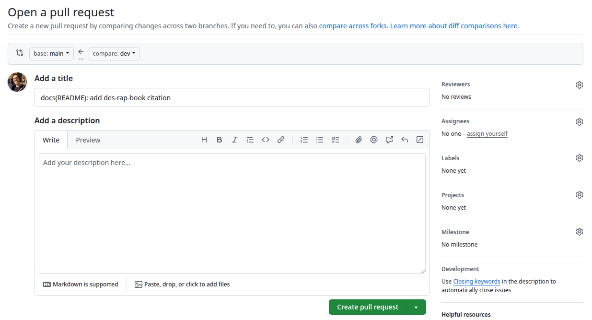{fig-alt="Screenshot of GitHub 'open a pull request' section."}

<br>

If new changes have been made to the main branch since you created your branch (e.g., new commits, merges from other branches, or contributions from other collaborators) and you've modified the same files, you may encounter merge conflicts that need to be resolved.

If not though, you can just select &nbsp;[Merge pull request]{style="background: #597341; color: #fff; border-radius:4px; padding:2px 8px; font-family:monospace; font-weight:bold; font-size:90%;"}&nbsp; and then &nbsp;[Confirm merge]{style="background: #597341; color: #fff; border-radius:4px; padding:2px 8px; font-family:monospace; font-weight:bold; font-size:90%;"}&nbsp;.

::::

#### Merging using the command line

Alternatively, if you prefer to work from command line, you can also merge from the terminal or Git Bash. It's important to note that this will **skip some of the important benefits of pull requests**. Working from the command line:

* Changes are merged without feedback or approval from others.
* There is less transparency (as pull requests have clear discussion threads / rationale for changes).
* There are no automated checks (whilst pull requests can run tests or require approvals before merging).
* Harder to track as changes are less visible in the project history.

The process is summarised in this diagram:

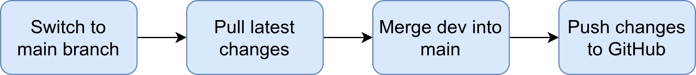{fig-alt="Summarises steps for merging using command line."}

::: {.callout-note title="Click to view step-by-step instructions from merging using the command line" collapse="true"}

To merge from the command line, you will first need to switch to the `main` branch:

```{.bash}
git checkout main
```

Pull the latest changes from GitHub:

```{.bash}
git pull origin main
```

Merge in your branch (e.g. `dev`):

```{.bash}
git merge dev
```

If there are no conflicts, the changes will merge successfully. You can then push the updated `main` branch to GitHub:

```{.bash}
git push origin main
```

:::

### 4. Delete your branch

We can now delete the branch from the remote repository -

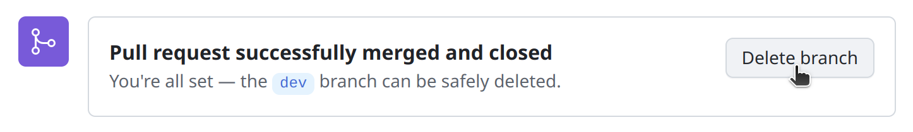{fig-alt="Screenshot of GitHub 'Pull request successfully merged and closed' - 'Delete branch' button."}

We also need to delete the branch locally. We can do this using the terminal or Git Bash.

First, switch back to `main`:

```{.bash}
git checkout main
```

Then pull the updated `main` branch, which now contains our merged changes:

```{.bash}
git pull
```

We can then delete our local branch:

```{.bash}
git branch -d dev
```

Finally, update our local view of the remote repository by removing any references to branches that no longer exist on the remote:

```{.bash}
git remote prune origin
```

To continue working in the repository, simply **create a new branch** and continue as above.

<br>

::: {.callout-note title="What does `prune` do?"}

When a branch is deleted on the remote, Git does not automatically remove its reference locally. `git remote prune origin` cleans up these stale references, keeping your branch list accurate and uncluttered.

:::

## Switching between repositories

::: {.python-content}

When working across multiple repositories, we'd recommend opening each repository in a separate window (e.g., a separate VS Code window).

:::

::: {.r-content}

When working across multiple repositories, we'd recommend opening each repository in a separate window (e.g., different `.Rproj` in separate RStudio windows).

:::

Each window will maintain it's own terminal session and Git context.

## GitHub organisations

> **Note:** This section is mainly for team projects; if you are working alone (e.g., if you are a student working an independent assignment or DES project), you can skim or skip this for now.

When creating a GitHub repository, by default, it will set the owner to be your personal user account. While this works well for personal projects, you will often find it better to create repositories within a **GitHub organisation** instead.

A GitHub organisation acts like a shared account which multiple people can own, access and collaborate on. Advantages of this are:

* **One place for each project/team.** Related repositories are grouped into one organisation. For example, you could have different organisations for different teams or projects, with all the relevant repositories for each.
* **Shared ownership**. Multiple people can have administrative access.
* **Continuity.** If you leave a project, repositories remain accessible to and owned by the team.
* **Professional branding.** Repositories appear under the organisation name rather than your personal username.

To create a GitHub organisation...

### 1. Open settings

In the top-right corner, select your profile photo, then click "Settings".

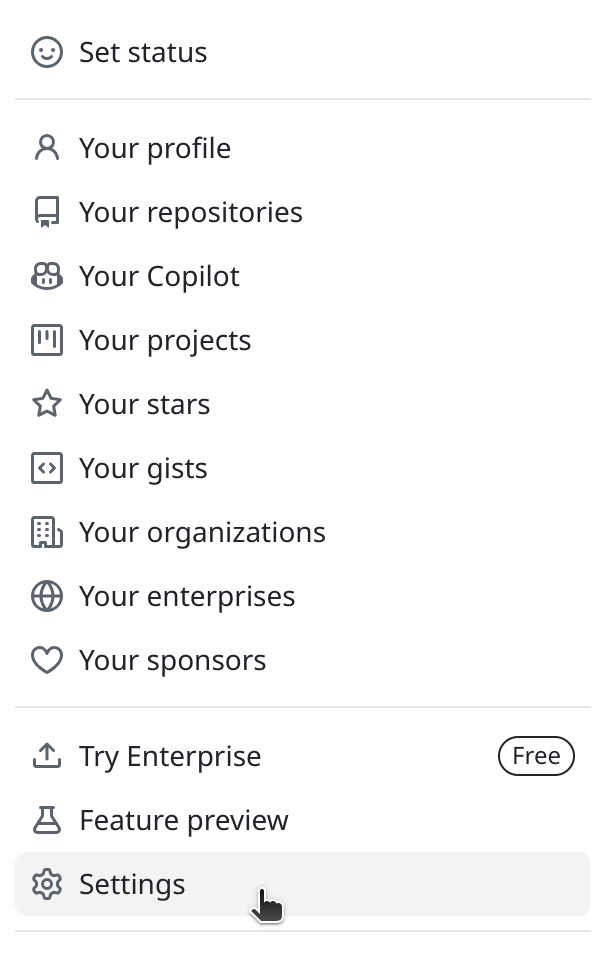{fig-align="center" width=50% fig-alt="Screenshot with cursor hovering over Settings button."}

Then select "Organizations" under the Access section in the sidebar.

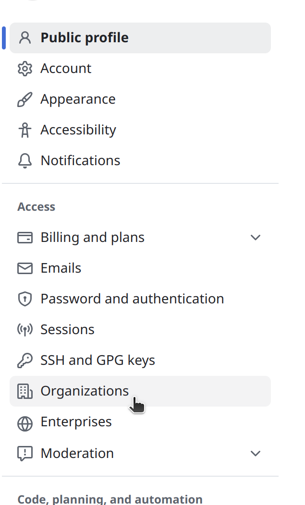{fig-align="center" width=60% fig-alt="Screenshot with cursor hovering over Organizations button."}

### 2. Make new organisation

In the top-right corner, select "New organization".

### 3. Choose a plan

For example, simply select the Free plan.

### 4. Enter your organisation details

It will ask for a name and contact email. You can typically then select that the organisation belongs to your personal account. Follow the prompts to create the organisation. You can then add other GitHub users as owners or collaborators.

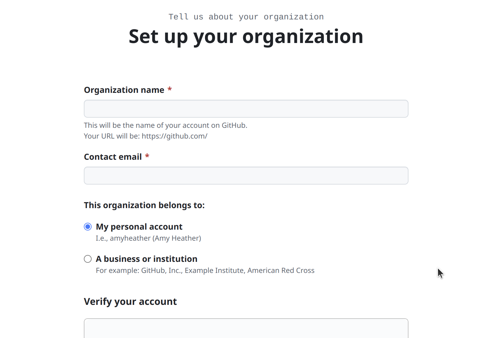{fig-alt="Screenshot of 'Set up your organization' page on GitHub."}

## Test yourself

If you haven't already, **have a go at setting up a GitHub repository** to use when working through this book.

We will provide examples in both Python and R - following along in your own repository helps build understanding and practial skills.

### Steps to practice

::: {.python-content}
1. **Create a repository** (e.g. `des-rap-python`) with `README.md`, `.gitignore` and `LICENSE`.
:::
::: {.r-content}
1. **Create a repository** (e.g. `des-rap-r`) with `README.md`, `.gitignore` and `LICENSE`.
:::

2. **Clone the repository**.

3. **Create and switch to a branch**.

4. **Make a commit**. For example, edit your `README.md`.

5. **Merge changes**.

6. **Delete the branch**.

<br>

::: {.callout-tip}

If you plan to explore both languages, make separate repositories for each, as their project structures and workflows differ.

:::

::: {.callout-note title="Need help?"}

Refer back to the examples and guidance in the tutorial above.

:::

## Further information

* [git documentation](https://git-scm.com/doc)

  *Includes some great introductory videos on git and version control.*

* ["Creating and managing repositories"](https://docs.github.com/en/repositories/creating-and-managing-repositories) in the GitHub documentation.

<br><br>
