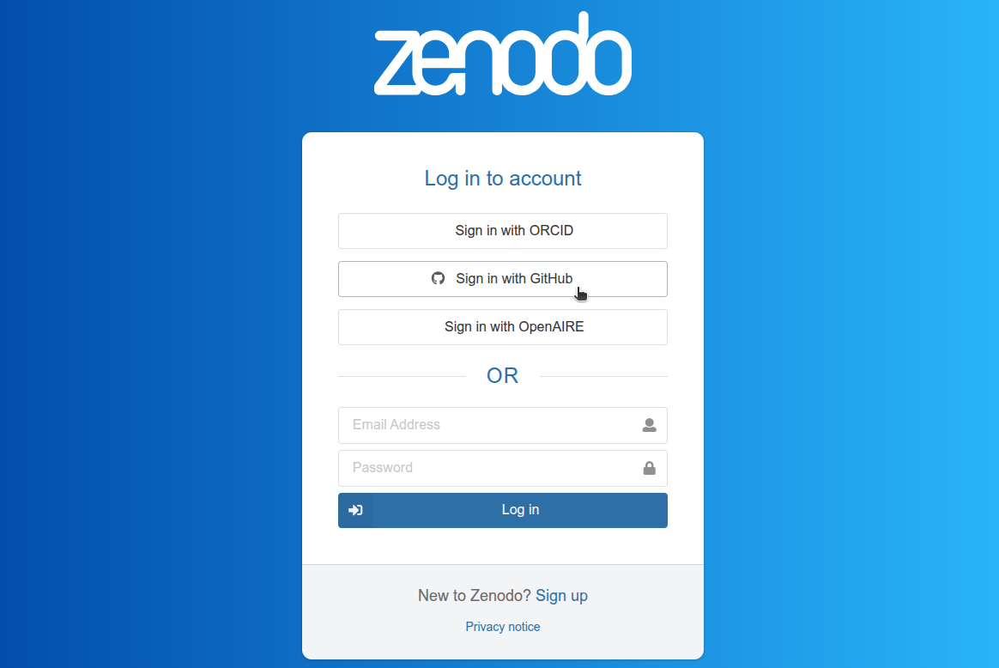
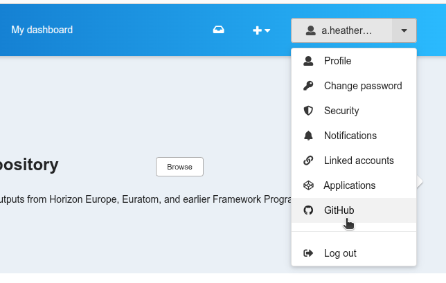
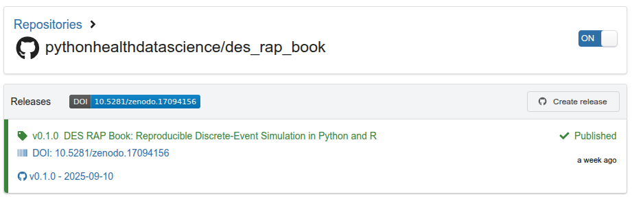
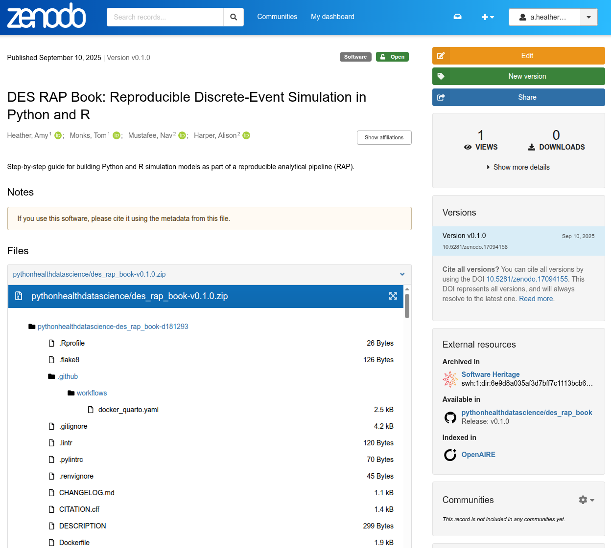
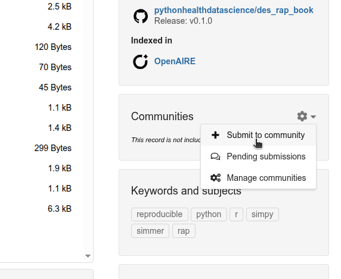
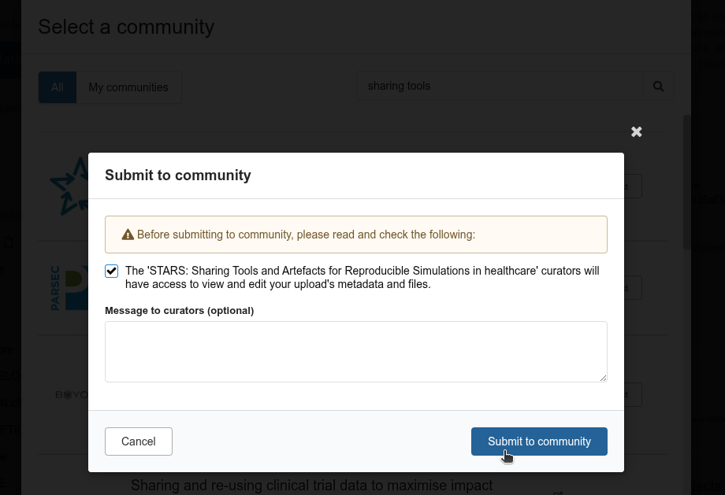
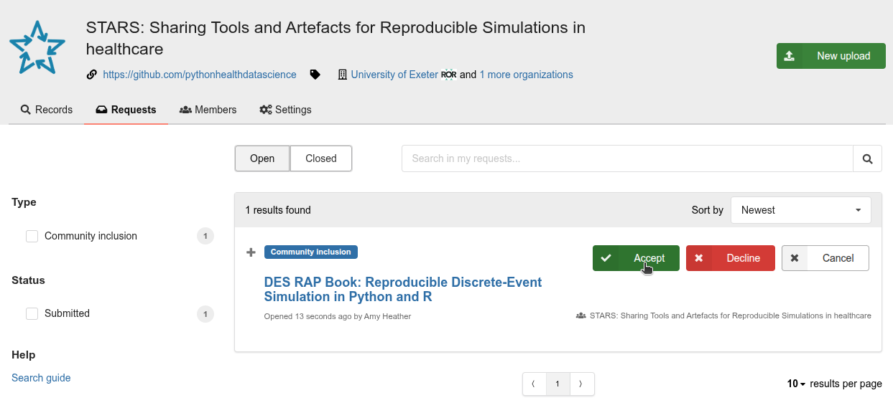

::: {.pale-blue}

**Learning objectives:**

* Identify suitable methods for sharing your simulation code.
* Learn about reporting and sharing guidelines.
* Understand how to archive repository on Zenodo via GitHub releases.

**Relevant reproducibility guidelines:**

* NHS Levels of RAP (🥉): Code is published in the open and linked to & from accompanying publication (if relevant).

:::

## Sharing your simulation model

In our recent review, we explored whether and how healthcare discrete-event simulation (DES) models have been shared over the last few years:

> Monks, T., & Harper, A. (2023). **Computer model and code sharing practices in healthcare discrete-event simulation: a systematic scoping review**. Journal of Simulation, 19(1), 108–123. <https://doi.org/10.1080/17477778.2023.2260772>.

Here are some key take-homes from that study...

<br>

::: {.pale-green}

<div class="h3-tight"></div>

### 1. Share your model

:::

**Any sharing is better than nothing**.

Our review found only 8.3% (n=47/564) of healthcare DES studies shared their model.

You may consider including a data availability statement such as "the materials used within this study are available from the corresponding author on reasonable request". However, we do **not recommend** relying on this approach. Studies show these statements are rarely upheld, even if well intentioned to begin with - often because projects and staff move on, and code gets lost. For example, a large review by [Janssen et al. (2020)](https://doi.org/10.1016/j.envsoft.2020.104873) found that less than 1% of authors responded - and of those, fewer still shared code.

Instead, you should aim to share as much as possible directly - ideally, providing complete materials, from input data (see [Input data management](../inputs/input_data.qmd) page for details), through to the code needed to generate figures and tables.

<br>

::: {.pale-green}

<div class="h3-tight"></div>

### 2. Use effective sharing platforms

:::

**How you share matters.** Better platforms make it easier for others to access, review, and reuse your work.

Although it is possible to share code files as journal/report supplementary materials, we do **not recommend** this as a primary method. Supplementary files are often converted into awkward formats (such as PDF or Word), which strips away features like syntax highlighting and makes it difficult to run or modify the code. These files also lack support for collaborative tools like version control, issue tracking, and automated testing.

A better approach is to use dedicated code-sharing platforms like **GitHub** (the most popular for DES models in our review). These platforms are specifically designed for open sharing, allow version control, and make it easy for others to follow changes, contribute or raise issues.

::: {.callout-tip}

For a tutorial on setting up GitHub, see the [Version control](../setup/version.qmd) page.

:::

For even better long-term access, you should *also* deposit your code and materials in a **digital archive**. This ensures your code is preserved and citable over time. See the archiving section below for more details.

<br>

::: {.pale-green}

<div class="h3-tight"></div>

### 3. Don't leave sharing to the end of your project

:::

In our review, we found DES GitHub repositories with only one or a few commits, indicating that model code was uploaded only at the very end of the project. When sharing is left until the end, there's often less time to ensure quality: important elements like documentation, licenses, and usage instructions are frequently missing or rushed.

It's much better to plan for sharing from the outset - ideally by using version control from the start of your project. This makes it easier to keep track of changes, gradually improve documentation, and make sure everything is ready for when you're ready to publish.

<br>

::: {.pale-green}

<div class="h3-tight"></div>

### 4. Follow guidelines

:::

**Reporting guidelines** can help make sure you document your model clearly. Only 12.8% of the models in our review mentioned using a simulation reporting guideline or general checklist. For DES, relevant guidelines include:

| Reporting guideline | Citation | Focus |
| - | - | - |
| Strengthening the reporting of empirical simulation studies-DES (STRESS-DES) | [Monks et al. (2019)](https://doi.org/10.1080/17477778.2018.1442155) | Reporting all necessary information for **replication** of **DES** models |
| Generic reporting checklist | [Zhang et al. (2020)](https://doi.org/10.1016/j.jval.2020.01.005) | **DES** model **quality** |
| International Society for Pharmacoeconomics and Outcomes Research - Society for Medical Decision Making (ISPOR-SMDM) Good Research Practices Task Force reports | [Various](https://journals.sagepub.com/toc/mdm/32/5) | Health economic and decision modelling best practices |
| TRAnsparent and Comprehensive model Evaluation (TRACE) | [Grimm et al. (2014)](https://doi.org/10.1016/j.ecolmodel.2014.01.018) | Transparent documentation and evaluation of models |
| The Overview, Design concepts and Details (ODD) protocol for describing Individual- and Agent-Based Models (ABMs) | [Grimm et al. (2020)](http://doi.org/10.18564/jasss.4259) | Protocol for describing agent-based models (not designed for DES) |
: {tbl-colwidths="[50, 20, 30]"}

<br>

**Sharing guidelines** focus on how you share your code, data and supporting materials - and what you share!

| Sharing guideline | Citation | Focus |
| - | - | - |
| STARS framework | [Monks et al. (2024)](https://doi.org/10.1080/17477778.2024.2347882) | **DES** model sharing and **reuse** |
| STARS reproducibility recommendations | [Heather et al. (2025)](https://doi.org/10.1080/17477778.2025.2552177) | **DES** model **reproducibility** |
| NHS "Levels of RAP" Maturity Framework | [NHS RAP Community of Practice](https://nhsdigital.github.io/rap-community-of-practice/introduction_to_RAP/levels_of_RAP/) | Developing **reproducible analytical pipelines** in **NHS** analyses |
| Open Modelling Foundation (OMF) Standards | [OMF Community](https://www.openmodelingfoundation.org/) | Model accessibility, documentation and reusability (in future, plan to include interoperability standards) |
: {tbl-colwidths="[50, 20, 30]"}

## Journal sharing requirements

If you are publishing a paper about your model, you may come across journal sharing requirements. These policies are becoming more common, and may affect how you prepare your code and data for submission.

Requirements can include:

* **Badges or recognition:** Many journals award open science badges to articles with shared code or data.
* **Mandatory code sharing:** Some journals *require* that you publicly share your code.

Some journals go further by reviewing the code your submit, with requirements like:

* Open licenses
* Clear documentation
* Complete materials
* Details on the environment used
* Runnable materials

## Archives

Whilst platforms like GitHub are great for sharing code, they provide no guarantees on how long the code will be stored. For this reason, we recommend *also* depositing your code in an open science archive.

Open science archives will **provide long-term storage guarantees** ensuring future access to your work. They will create a **digital object identifier (DOI)** (a persistent identifier for your code).

Archives should adhere to recognised principles like [TRUST (Transparency, Responsibility, User focus, Sustainability, and Technology)](https://doi.org/10.1038/s41597-020-0486-7) and the [FORCE11 standards](https://doi.org/10.7717/peerj-cs.86)

Archives can be generalist (for any research discipline), subject-specific, or institutional (hosted by a particular university or research institute). Examples include:

* [Zenodo](https://zenodo.org/)
* [Figshare](https://figshare.com/)
* [The Open Science Framework (OSF)](https://osf.io/)
* [The Computational Modeling in the Social and Ecological Sciences Network (CoMSES Net)](https://www.comses.net/)

If choosing between generalist repositories, the Generalist Repository Ecosystem Initiative (GREI) has resources to support you in choosing an appropriate repository summarised [here](https://doi.org/10.5281/zenodo.13987726), with examples including:

* [Generalist Repository Comparison Chart](https://doi.org/10.5281/zenodo.3946719)
* [Generalist Repository Selection Flowchart](https://doi.org/10.5281/zenodo.11105429)

## How to archive your repository on Zenodo

This tutorial shows how to archive a GitHub repository using Zenodo, chosen for its simplicity and direct integration with GitHub. For more details, see the official [GitHub Zenodo documentation](https://docs.github.com/en/repositories/archiving-a-github-repository/referencing-and-citing-content).

<br>

**1. Login to Zenodo**. Go to <https://zenodo.org/login/>, and login or sign-up to Zenodo with your **GitHub account**.

{fig-align="center"}

<br>

**2. Go to Zenodo GitHub page**. Click on the arrow in the top right corner, and select "GitHub".

{fig-align="center"}

<br>

**3. Sync your repository.** On this page, you should see a list of your repositories. For the repository you want to archive on Zenodo, toggle the switch from "OFF" to "ON".

::: {.callout-tip}

**Can't find your repository?**

* Click the "Sync now" button to update your repository list.

* Make sure your repository is public, else Zenodo cannot access it.

* If your repository is part of a GitHub organisation, you may need to approve access for the Zenodo application in the organisation settings.

:::

<br>

**4. Prepare your GitHub repository.** Before archiving, ensure your repository contains:

* A licence.
* A `CITATION.cff` file (this supplies key metadata like title, authors, and version for Zenodo's record).

<br>

**5. Create a GitHub release.** To trigger Zenodo archiving, create a new release in your repository. For details on how to do this, see the [Changelog](changelog.qmd) page.

<br>

**6. View your Zenodo entry.** Click the repository name in Zenodo to view its releases, metadata, and related issues. If all goes well, you should see a new release and DOI listed - for example:

{fig-align="center"}

<br>

Clicking the DOI (for example: [10.5281/zenodo.17094156](https://doi.org/10.5281/zenodo.17094156)) opens the permanent archived version of our repository in Zenodo:

{fig-align="center"}

### Zenodo communities

The "Communities" feature in Zenodo is useful for grouping related archived repositories in one place (e.g., those from the same project or research group). It's also valuable for collaborative work, as community members can be granted edit access to manage and update shared records. 

To set-up a community, visit <https://zenodo.org/communities> and select &nbsp;[+ New community]{style="background: #597341; color: #fff; border-radius:4px; padding:2px 8px; font-family:monospace; font-weight:bold; font-size:90%;"}&nbsp;

Once your community is set up, go to your Zenodo record/s and scroll down to "Communities", then click "+ Submit to community".

{fig-align="center"}

<br>

Search for your community, give appropriate permissions, and submit.

{fig-align="center"}

<br>

From the "Requests" tab of your community dashboard, you can then accept this submission to add it to the community.

{fig-align="center"}

## Explore the example models

::: {.python-content}





:::

::: {.r-content}





:::

These repositories are shared on GitHub (since the start of development) and are archived on Zenodo.

## Test yourself

```{r}
#| echo: false
library(webexercises) # nolint: library_call_linter
```

:::{.callout-note}

## Why is it risky to rely only on "code available on request" statements when sharing a simulation model?

```{r}
#| output: asis
#| echo: false
cat(longmcq(c(
  paste0("This will not meet the requirements of all journals - they all ",
         "require direct code sharing now."),
  answer = paste0("Code is often lost or unavailable, and most requests",
                  " are not fulfilled."),
  paste0("Code doesn't need to be shared if the results are clearly ",
         "described in the publication.")
)))
```

:::

:::{.callout-note}

## When is the best time to start using version control and planning for sharing in a simulation project?

```{r}
#| output: asis
#| echo: false
cat(longmcq(c(
  answer = "From the very start of the project.",
  "When you begin drafting your paper or report.",
  "Only if a reviewer or manager asks for it."
)))
```

:::

:::{.callout-note}

## What do open science archives provide that GitHub does not?

```{r}
#| output: asis
#| echo: false
cat(longmcq(c(
  "Better tools for collaboration.",
  "More colorful web interfaces.",
  answer = "Long-term guarantees and a digital object identifier (DOI)."
)))
```

:::

<br>

**Ready to put this into practice?** Try archiving your simulation repository - even if it's just an early version or draft!

<br><br>
