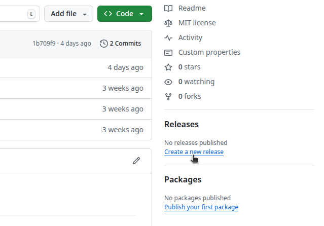
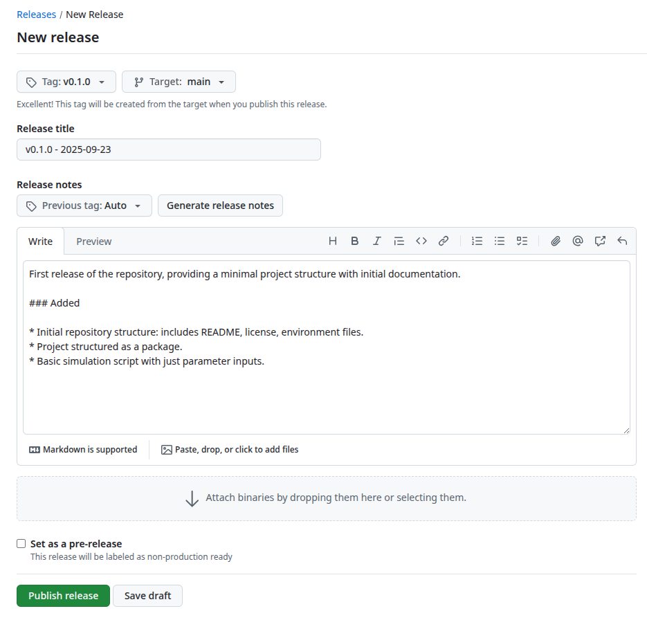
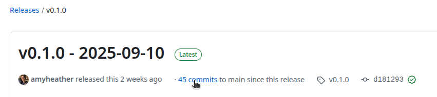

::: {.pale-blue}

**Learning objectives:**

* Understand **purpose** of a changelog.
* Learn **semantic versioning** conventions.
* Learn how to **write a changelog**.
* Learn how to create **GitHub releases**.

**Relevant reproducibility guidelines:**

* STARS Reproducibility Recommendations: Link publication to a specific version of the code.
* NHS Levels of RAP (🥇): Changes to the RAP are clearly signposted. E.g. a changelog in the package, releases etc.

:::

## What is a changelog?

A **changelog** is a document that records changes to a project over time. It's purpose is to make clear what has changed between versions of code and when those changes happened. They serve as an easier-to-read record of what's changed, than scrolling through commit logs!

::: {.python-content}

Changelogs are typically stored in a `CHANGELOG.md` file.

:::

::: {.r-content}

Changelogs are typically stored in a `CHANGELOG.md` file. For R packages, the convention is a `NEWS.md` file.

:::

Changelogs help make projects more **reproducible**. For example:

* When [sharing code for review](peer_review.qmd), a changelog makes it clear which version your reviewer should look at, and you can also show what changed before and after the review.

* When updating a report, or responding to feedback on a journal submission, you can link each manuscript to a specific version of the code. This ensures a clear record of what was changed after feedback (e.g., between a pre-print and accepted publication).

* When someone tries to reproduce your results, they can run the exact version of your code that you used, even if the project has moved on. The latest commit might not match your work anymore.

When working with software as an installed package, users will typically refer to the installed version number to know which features and changes are available.

## Versioning

Projects use **semantic versioning** to structure version numbers. The rules are defined at <https://semver.org/>:

> Given a version number MAJOR.MINOR.PATCH, increment the:
>
> 1. MAJOR version when you make incompatible API changes
> 2. MINOR version when you add functionality in a backward compatible manner
> 3. PATCH version when you make backward compatible bug fixes

*Semantic Versioning 2.0.0. <https://semver.org/>. CC BY 3.0.*

Projects commonly start at version `0.1.0`, with `0.y.z` versions considered "unstable". The SemVer guidance suggests incrementing the **minor** version as development progresses (i.e., `0.2.0`, `0.3.0`), and moving to major version changes when the project feels more stable - even if things are still evolving - such as when the basic core of the simulation model is in place and the code is no longer just an initial experiment or rough draft.

::: {.r-content}

For R packages, development versions often begin at `0.0.0.9000`. When ready for the first release, they increment to `0.1.0`. Some developers skip the `.9000` approach though and begin directly at `0.1.0`.

:::

Although semantic versioning has it's roots in software development, it's still equally valuable in research projects and analytic pipelines, like simulation development.

## Structuring a changelog

The most widely used convention is [Keep a Changelog](https://keepachangelog.com/en/1.1.0/). Their approach involves:

* A heading with the **version number** and **date**.
* Short **summary** sentence/s for the version.
* Bullet points organised under the following sub-headings:

> * `Added` for new features.
> * `Changed` for changes in existing functionality.
> * `Deprecated` for soon-to-be removed features.
> * `Removed` for now removed features.
> * `Fixed` for any bug fixes.
> * `Security` in case of vulnerabilities.
>
> *<https://keepachangelog.com/en/1.1.0/>. MIT licence. Olivier Lacan.*

Example:

```{.markdown}
# Changelog

All notable changes to this project will be documented in this file.

The format is based on [Keep a Changelog](https://keepachangelog.com/en/1.1.0/),
and this project adheres to [Semantic Versioning](https://semver.org/spec/v2.0.0.html). Dates formatted as YYYY-MM-DD as per [ISO standard](https://www.iso.org/iso-8601-date-and-time-format.html).

## v0.2.0 - 2025-10-01

This release adds basic discrete event simulation capability, improves documentation, and corrects a key input parameter.

### Added

* Basic simulation that generates arrivals.

### Changed

* Improved the README for clarity and guidance.

### Fixed

* Fixed a bug where the default value for `service_rate` was incorrectly set to 0.5 instead of 1.0, which caused unrealistic queue times in the single-server example.

## v0.1.0 - 2025-09-23

First release of the repository, providing a minimal project structure with initial documentation.

### Added

* Initial repository structure: includes README, license, environment files.
* Project structured as a package.
* Basic simulation script with just parameter inputs.
```

::: {.r-content}

### Alternative: `NEWS.md`

For R packages, you may wish to instead create a `NEWS.md` file. You can create this easily with:

```{.r}
usethis::use_news_md()
```

Convention is for each top‑level heading to include the package name and version number, with an optional date and a short summary line. Changes are then listed as bullets under sub‑headings. For example:

* [r-pkgs.org](https://r-pkgs.org/other-markdown.html#sec-news) suggests "Major changes" and "Bug fixes".
* [Tidyverse style guide](https://style.tidyverse.org/news.html) suggests "Breaking changes", "New features", and "Minor improvements and fixes"

Example:

```{.markdown}
# DES 0.2.0 2025-10-01

This release adds basic discrete event simulation capability, improves documentation, and corrects a key input parameter.

## New features

* Basic simulation that generates arrivals.

## Minor improvements and fixes

* Improved the README for clarity and guidance.
* Fixed a bug where the default value for `service_rate` was incorrectly set to 0.5 instead of 1.0, which caused unrealistic queue times in the single-server example.

# DES 0.1.0 2025-09-23

First release of the repository, providing a minimal project structure with initial documentation.

## New features

* Initial repository structure: includes README, license, environment files.
* Project structured as a package.
* Basic simulation script with just parameter inputs.
```

:::

## GitHub releases

A GitHub release is a snapshot of your repository linked to a specific version. When you create a release, GitHub generates `zip` and `tar.gz` containing the repository contents at that point in time.

Releases and changelogs go hand-in-hand. Each release is linked to a changelog entry for that version. This gives a clear, reliable record of what changed in each version, and provides users with an easy and reliable way to download specific versions of the code.

::: {.callout-tip}

GitHub releases can be used to easily archive work to Zenodo - see the [Sharing and archiving](archive.qmd) page for more details!

:::

### How to make a release

1. Write your changelog entry

2. Update the version number anywhere it is listed (e.g., `CITATION.cff`, `README.md`).

3. In the right sidebar under "Releases", click **Create a new release**

{fig-alt="Screenshot of GitHub repository with cursor hovering over 'Create a new release'."}

On the new release page, enter a version tag (e.g., `v0.1.0`), copy in your release title and entry from the changelog, then click &nbsp;[Publish release]{style="background: #597341; color: #fff; border-radius:4px; padding:2px 8px; font-family:monospace; font-weight:bold; font-size:90%;"}&nbsp;. For example:

{fig-alt="Screenshot of GitHub new release page."}

## Using GitHub commits when writing a changelog

When writing a changelog, it is helpful to **look over your GitHub commits** to remember recent changes.

> This is why it's important to write clear, descriptive commit messages - they make it easier to recall what was changed and why.

If you have already created some releases, click on your latest release on GitHub and then **X commits to main since this release** to see all recent commits:

{fig-alt="Screenshot of GitHub release with cursor hovering over 'X commits to main since this release'."}

You should aim to summarise the main updates in a human-readable way. While tiny details/tweaks don't need to be listed, **all notable changes** should be included in the changelog so it can serve as a reliable and comprehensive summary.

## Explore the example models

::: {.python-content}





These repositories have a `CHANGELOG.md` file and GitHub releases.

:::

::: {.r-content}





These repositories have a `NEWS.md` file and GitHub releases.

:::

## Test yourself

**Try making your own changelog and release:**

::: {.python-content}

1. **Write a changelog entry** summarising changes to your repository since creation (or since your last version).

:::

::: {.r-content}

1. **Write a changelog entry** (or NEWS.md) summarising changes to your repository since creation (or since your last version).

:::

2. **Update the version number** where it appears (e.g., `CITATION.cff`, `README.md`, package metadate).

3. **Use GitHub to create a new releas**e: in the right sidebar under "Releases", click *Create a new release*, add your version tag (e.g., `v0.1.0`), and copy in your changelog entry.

::: {.callout-tip}

Not set up with GitHub yet? See the [Version control](../setup/version.qmd) for how to get started.

:::

::: {.callout-note}

If you'r using GitLab, Bitbucket, or another code hosting service, you can adapt these steps using their release/tag features.

:::

<br><br>
