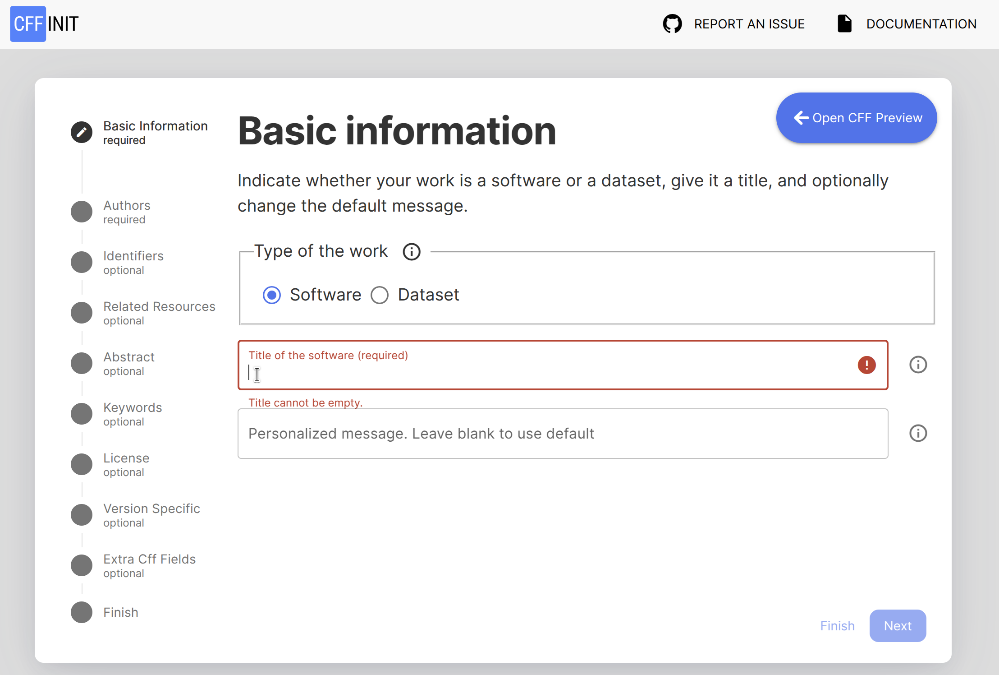
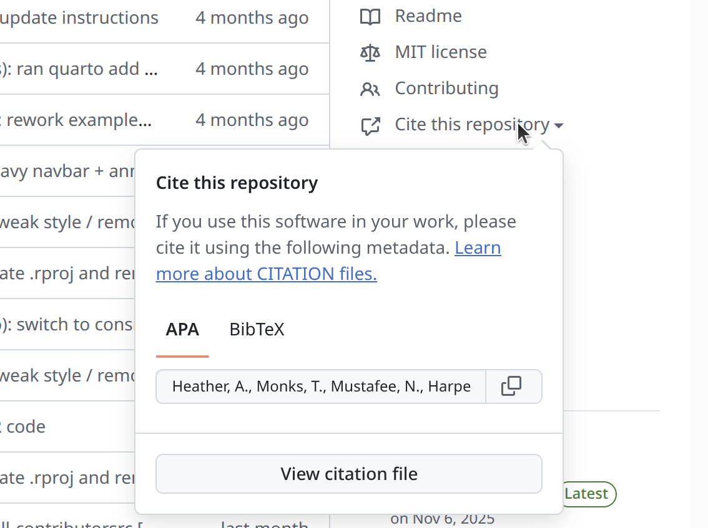
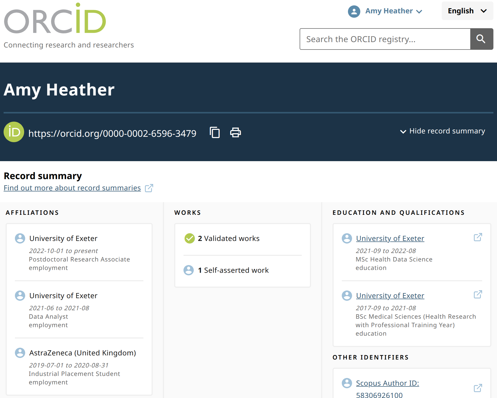

<style>
pre code {
  white-space: pre-wrap;
  word-break: break-word;
}
</style>

::: {.pale-blue}

**Learning objectives:**

This page explains why and how to provide citation instructions in your simulation repository.

* Understand **why** providing citation information is important.
* Learn **how** to include clear citation instructions in a repository.
* Use **multiple methods** to make citation details easy to find.
* Recognise the importance of citing and **acknowledging** others.

:::


## Why provide citation information?

**Protects yourself and collaborators**

> Make sure you (and your collaborators) are recognised as the primary creators of the work.

**Encourages others to cite you**

> When you make citation details easy to find and follow, others are more likely to cite your work. It makes it easier for them to do. Also, many people may not realise that non-traditional research outputs like software should be cited, so including explicit guidance helps educate and encourage users to give you credit.

**Ensures accurate citation**

> Without citation instructions, others may only know your GitHub username. Therefore, it is important to provide all the correct details for a complete and accurate citation: full names, institution, ORCID iDs, software title, DOIs, etc.

**Provides contact information**

> Including your name and contact details in the citation information makes it easy for others to reach you. This can lead to new opportunities for collaboration, feedback, or questions about your work.

**Recognises contributors**

> Explicitly list and acknowledge everyone who played a role in the project (including minor contributions). There are structured frameworks which can be used to specify roles, like the [Contributor Role Taxonomy (CRediT)](https://credit.niso.org/) for research projects.

For `CITATION.cff` files...

**Used when archiving**

> If you [archive](archive.qmd) your work using Zenodo, it will use the metadata from your `CITATION.cff` file to populate the archived record.

🔗 **Integrates with reference managers**

> A `CITATION.cff` file can be converted to BibTeX or directly imported into reference managers like Zotero.

## How to provide citation information

<div class="h3-tight"></div>

### `CITATION.cff`

A `CITATION.cff` file is a plain text file with a standard structure to share citation metadata for software or datasets.

The easiest way to create this file is using the [cffinit](https://citation-file-format.github.io/cff-initializer-javascript/#/) web application. It will guide you through the required information, and generate a `CITATION.cff` file at the end.



As an example, the `CITATION.cff` from the repository for this book:

:::{.pale-grey}
```{.text}

```
:::

`CITATION.cff` files are supported by Zenodo, Zotero and GitHub.

* **Zenodo:** If use [Zenodo-GitHub integration to archive on Zenodo](archive.qmd), Zenodo will use the information in `CITATION.cff` to populate the archive entry.

* **Zotero:** The Zotero reference manager uses `CITATION.cff` when importing the repository as a reference.

* **GitHub:** Adds a "Cite this repository" button to the sidebar, which provides APA and BibTeX citations (based on the `CITATION.cff` file), and links to the file. For example:



### `README.md`

You should include clear citation instructions in your documentation - typically in your `README.md`. There are two common approaches:

**1. Point to a citation files** (e.g. `CITATION.cff` or files within the package).

:::{.pale-grey}
```{.text}
## Citation

To cite this work, see the `CITATION.cff` file in this repository or use the "Cite this repository" button on GitHub.
```
:::

**2. Provide citation details directly**. Example for DES RAP Book (as of 6th January 2026):

:::{.pale-grey}
```{.text}
## Citation

To cite this work, use:

Heather, A., Monks, T., Mustafee, N., Harper, A., & Alidoost, F. (2026). DES RAP Book: Reproducible Discrete-Event Simulation in Python and R (Version 0.4.0) [Computer software]. https://github.com/pythonhealthdatascience/des_rap_book
```
:::

### Within the package

If you have [structured your model as a package](../setup/package.qmd), then you can include some citation instructions within the package.

:::{.python-content}
Depending on your package manager, you can include citation and author details in several ways...

<br>

**Flit:** Our tutorial used this as it is a very basic minimalist package manager. It had `__init.py` and `pyproject.toml` files. We can amend the `pyproject.toml` to add some citation information as follows:

```{.bash}
[build-system]
requires = ["flit"]
build-backend = "flit_core.buildapi"

[project]
name = "simulation"
dynamic = ["version", "description"]
authors = [
  { name = "First Last", email = "firstname.lastname@example.com" }
]
```

<br>

**Poetry:** Another popular manager, this has project details within `pyproject.toml` like so:

```{.bash}
[tool.poetry]
name = "simulation"
version = "0.1.0"
authors = ["First Last <firstname.lastname@example.com>"]
readme = "README.md"
```
:::

:::{.r-content}
The `DESCRIPTION` file can include the author full names, emails and roles using the `Authors@R` field. Example:

:::{.pale-grey}
```{.text}
Authors@R: c(
    person(
      "First", "Last",
      email = "firstname.lastname@example.com",
      role = c("aut", "cre")
    )
  )
```
:::

You can also create a `CITATION` file within the `inst/` directory by running `usethis::use_citation()`. This will create a blank file:

:::{.pale-grey}
```{.text}
bibentry(
  bibtype  = "Article",
  title    = ,
  author   = ,
  journal  = ,
  year     = ,
  volume   = ,
  number   = ,
  pages    = ,
  doi      =
)

```
:::

We can then populate it with citation information for our project - for example:

:::{.pale-grey}
```{.text}
bibentry(
  bibtype    = "Manual",
  title      = "Discrete-Event Simulation Model for XYZ",
  author     = person("First", "Last", email = "firstname.lastname@example.com", role = c("aut", "cre"), comment = "ORCID: 0000-0000-0000-0000"),
  organization = "Example Institute",
  year       = 2025,
  note       = "Version 0.1.0. A discrete-event simulation (DES) model template for the XYZ system or process.",
  url        = "https://github.com/example/des-xyz-model"
)
```
:::

When users run `citation("yourpackagename")`, this information gets displayed.

:::{.callout-tip}

The [cffr](https://github.com/ropensci/cffr) package can be handy if you are maintaining a `CITATION.cff`.

* `cffr::cff_write()`: creates `CITATION.cff` based on your `DESCRIPTION` and `CITATION` files.
* `cffr::cff_gha_update()`: installs a GitHub action which will keep the `CITATION.cff` up-to-date.

:::

:::

### ORCID iDs

An ORCID iD (Open Researcher and Contributor ID) is a unique persistent identifier for researchers and contributors. It **distinguishes** you from others with similar names and ensures your work is **correctly attributed** to you, even with name changes, different name formats, or moves between institutions. You can register for an iD at <https://orcid.org/>.



You can then include the ORCID iDs of contributors to your project within your citation files (e.g. `CITATION.cff`) - and within your `README.md`. This ensures all contributors are uniquely and accurately identified, and links to their scholarly profiles.

In your `README.md`, you can display ORCID iDs using badges, icons, or simple links. For example, using a badge:

:::{.pale-grey}
```{.text}
[](https://orcid.org/0000-0002-6596-3479)
```
:::

Which renders as:

[](https://orcid.org/0000-0002-6596-3479)

## Using multiple citation methods

We've described several ways to provide citation information to users. We recommend using several of these methods. This is because different users look for citation information in different places. For example:

* GitHub users may be familiar with `CITATION.cff` files and the sidebar "Cite this repository" button.

* Many people look for citation details directly in the `README.md`.

:::{.r-content}
* R users often expect a `CITATION` file.
:::

If you're concerned about duplication, you can maintain a single up-to-date source (such as `CITATION.cff`) and simply direct users to it from your `README.md` or other documentation.

:::{.r-content}
For R packages, tools like **cffr** can automate the creation and maintenance of a `CITATION.cff` file.
:::

Since many users are still unsure how (or even whether) to cite software, making citation information visible in multiple places increases the likelihood your work will be credited properly.

## Citing and acknowledging others

<div class="h3-tight"></div>

### Within your code

When writing your simulation and analysis code, it's **common - and encouraged - to use or adapt code from other sources**. Proper attribution is good practice and often required by open source licenses.

Before using code from others, you should check the licence is **open and compatible** with your project. For example, code under the GPL licence requires your project to also be GPL-licensed if you copy or adapt it directly.

According to guidance from [The Turing Way](https://book.the-turing-way.org/reproducible-research/licensing/licensing-compatibility.html) and the [R Packages book](https://r-pkgs.org/license.html), you only need to change your project's license if you embed code from another package (i.e. copy+and+paste code), or if it is distributed as a binary with the work (i.e. bundled
and stored with the work). Merely importing and using packages from conda/PyPI/CRAN does not make your work a derivative, so you can use a permissive license if you wish.

To attribute code, you should follow the [Creative Commons TASL approach](https://wiki.creativecommons.org/wiki/Recommended_practices_for_attribution):

* **Title**: Name of the work (e.g. repository name).
* **Author**: Original author(s).
* **Source**: Where it can be found (e.g. GitHub URL).
* **Licence**: Licence used by the authors.

You should specify if the code is an exact **copy** or if it has been **adapted**. Optionally, you can include further details like the version, commit has, or retrieval date.

You should include attributions alongside the code - for example, **in a function/class docstring**. For very small snippets, in-line comments may suffice. If lots of code uses the same source, you could include it as a **module docstring**, and then refer back to it in the class docstrings.

:::{.python-content}

In this example from [pydesrap_mms](https://github.com/pythonhealthdatascience/pydesrap_mms), we have used a module docstring which we refer to from our class docstrings:

```{.python}
"""
MonitoredResource.

Acknowledgements#<<
----------------#<<
The MonitoredResource class is based on Tom Monks, Alison Harper and Amy#<<
Heather (2025) An introduction to Discrete-Event Simulation (DES) using Free#<<
and Open Source Software#<<
(https://github.com/pythonhealthdatascience/intro-open-sim/tree/main)#<<
(MIT Licence). They based it on the method described in Law. Simulation#<<
Modeling and Analysis 4th Ed. Pages 14 - 17.#<<
"""

from simpy import Resource


class MonitoredResource(Resource):
    """
    Subclass of simpy.Resource used to monitor resource usage during the run.

    Calculates resource utilisation and the queue length during the model run.

    Attributes
    ----------
    time_last_event : list
        Time of last resource request or release.
    area_n_in_queue : list
        Time that patients have spent queueing for the resource
        (i.e. sum of the times each patient spent waiting). Used to
        calculate the average queue length.
    area_resource_busy : list
        Time that resources have been in use during the simulation
        (i.e. sum of the times each individual resource was busy). Used
        to calculated utilisation.

    Notes#<<
    -----#<<
    Class adapted from Monks, Harper and Heather 2025.#<<
    """

    def __init__(self, *args, **kwargs):
        """
        ...
```
:::

:::{.r-content}

Example from [rdesrap_mms](https://github.com/pythonhealthdatascience/rdesrap_mms):

```{.r}
#' Calculate the resource utilisation
#'
#' ...
#' 
#' Credit: The utilisation calculation is adapted from the#<<
#' `plot.resources.utilization()` function in simmer.plot 0.1.18, which is#<<
#' shared under an MIT Licence (Ucar I, Smeets B (2023). simmer.plot:#<<
#' Plotting Methods for 'simmer'. https://r-simmer.org#<<
#' https://github.com/r-simmer/simmer.plot.).#<<
#'
#' ...
calc_utilisation <- function(resources, groups = NULL, summarise = TRUE) {
  # ...
}
```
:::

You can also add an "Acknowledgements" or "Attributions" section in your `README.md` (or other documentation/a dedicate file), listing sources and where their code is used.

:::{.python-content}

In this example from [pydesrap_mms](https://github.com/pythonhealthdatascience/pydesrap_mms), we used a table to present the sources and files containing code from those sources:

:::{.pale-grey}
**Acknowledgements:**

This repository was developed with thanks to several others sources. These are acknowledged throughout in the relevant notebooks/modules/functions, and also summarised here:

| Source | Find out more about how it was used... |
| - | - |
| ... | |
| NHS Digital (2024) RAP repository template (<https://github.com/NHSDigital/rap-package-template>) (MIT Licence) | `simulation/logging.py`<br>`docs/nhs_rap.md` |
| Sammi Rosser and Dan Chalk (2024) HSMA - the little book of DES (<https://github.com/hsma-programme/hsma6_des_book>) (MIT Licence) | `simulation/model.py`<br>`simulation/patient.py`<br>`simulation/runner.py`<br>`notebooks/choosing_cores.ipynb` |
| ... | |
:::
:::

:::{.r-content}

In this example from [rdesrap_mms](https://github.com/pythonhealthdatascience/rdesrap_mms), we used a table to present the sources and files containing code from those sources:

:::{.pale-grey}
**Acknowledgements:**

This repository was developed with thanks to a few others sources. These are acknowledged throughout in the relevant scipts, and also summarised here:

| Source | Find out more about how it was used... |
| - | - |
| Ucar I, Smeets B (2023). simmer.plot: Plotting Methods for 'simmer'. <https://r-simmer.org>. <https://github.com/r-simmer/simmer.plot>. | `R/get_run_results.R` |
| Tom Monks (2021) sim-tools: fundamental tools to support the simulation process in python (<https://github.com/TomMonks/sim-tools>) (MIT Licence).<br> Who themselves cite Hoad, Robinson, & Davies (2010). Automated selection of the number of replications for a discrete-event simulation (<https://www.jstor.org/stable/40926090>), and Knuth. D "The Art of Computer Programming" Vol 2. 2nd ed. Page 216. | `R/choose_replications.R` |
:::
:::

### Within your reports

The [FORCE11 Software Citation Principles](https://doi.org/10.7717/peerj-cs.86) recommend that software citations should:

* Be treated with the same importance as other research products (e.g. papers, data).
* Give credit and attribution to software authors and contributors.
* Include unique, persistent identifiers (such as DOIs) and version information.
* Make the software findable and accessible.
* Specify exactly which version was used, for reproducibility.

You don't need to cite every single package or dependency - these will be listed in your [environment files](../setup/environment.qmd) in your repository. You should however cite the main software/resources used for your analysis.

The software authors will likely provide citation instructions in their documentation or a citation file. If none are provided, you should include:

* Software name
* Version number
* Authors or project team
* Year of release
* Persistent identifier (DOI or archive) (if available)
* Repository URL (e.g. GitHub, GitLab)
* Access date (if no version or release date is available)

For example:

:::{.python-content}
:::{.pale-grey}
The simulation was developed in Python X.X.X [cite] using SimPy X.X.X [cite], with the model and analysis structured based on examples from the DES RAP Book [cite].
:::
:::

:::{.r-content}
:::{.pale-grey}
The simulation was developed in R X.X.X [cite] using simmer X.X.X [cite], with the model and analysis structured based on examples from the DES RAP Book [cite].
:::
:::

## Explore the example models

::: {.python-content}





These repositories have `CITATION.cff` files and citation details in the `README.md`, with ORCID iDs provided. Author names are provided within the `pyproject.toml` file. Where relevant, acknowledgements are provided within the README and code.

:::

::: {.r-content}





These repositories have `CITATION.cff` files and citation details in the `README.md`, with ORCID iDs provided. Author names are provided within the `DESCRIPTION` file. Where relevant, acknowledgements are provided within the README and code.

:::

## Test yourself

```{r}
#| echo: false
library(webexercises)
```

::: {.callout-note}

## If citation instructions are missing from your codebase, what might happen when others try to reference your software?

```{r}
#| output: asis
#| echo: false
cat(longmcq(c(
  "They will always use a journal reference.",
  "They will cite the instution's name.",
  answer = paste0("They may only use the repository owner's username or ",
                  "incomplete information.")
)))
```

:::

::: {.callout-note}

## A benefit of supplying structured citation metadata like `CITATION.cff` is:

```{r}
#| output: asis
#| echo: false
cat(longmcq(c(
  answer = paste0("It facilitates direct import to reference managers ",
                  "and supports BibTeX conversion."),
  "It makes the work look more professional.",
  "It replaces the need for citation details elsewhere."
)))
```

:::

::: {.callout-note}

## How does providing your name and contact information in citation details benefit your project?

```{r}
#| output: asis
#| echo: false
cat(longmcq(c(
  "It leads to unwanted attention.",
  answer = "It makes collaboration, feedback, and questions easier for others.",
  "It replaces project documentation."
)))
```

:::

<br>

**Try it out for yourself!** Have a go at adding citation information to your codebase. For example, visit [cffinit](https://citation-file-format.github.io/cff-initializer-javascript/#/) to create a `CITATION.cff` file and add it to your repository.

## Further information

* ["What is a CITATION.cff file?"](https://citation-file-format.github.io/) from Stephan Druskat 2023.

  *Official CITATION.cff website.*

* ["Software citation principles"](https://doi.org/10.7717/peerj-cs.86) by Smith et al. 2016.

  *Publication describing recommendations from the FORCE11 Software Citation Working Group.*

* ["Making Research Objects Citable"](https://book.the-turing-way.org/communication/citable) from the Turing Way Community.

  *Chapter from the Turing Way about making sure people can cite your research.*

<br><br>
