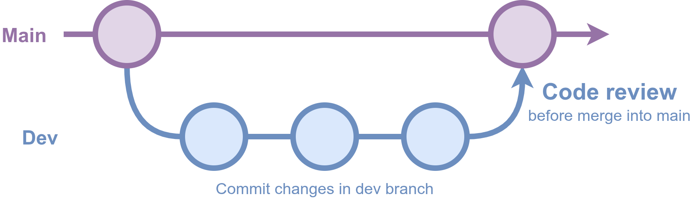
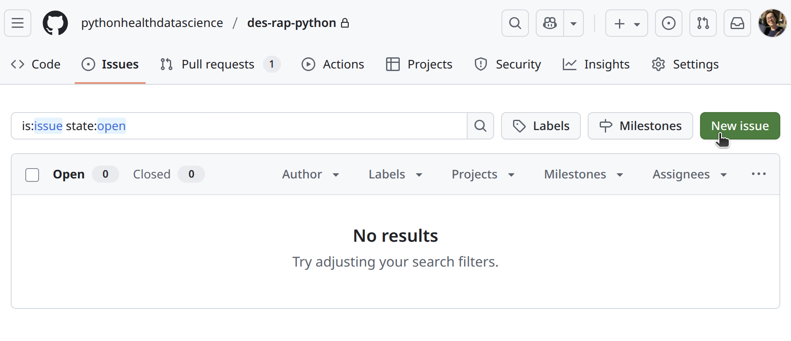
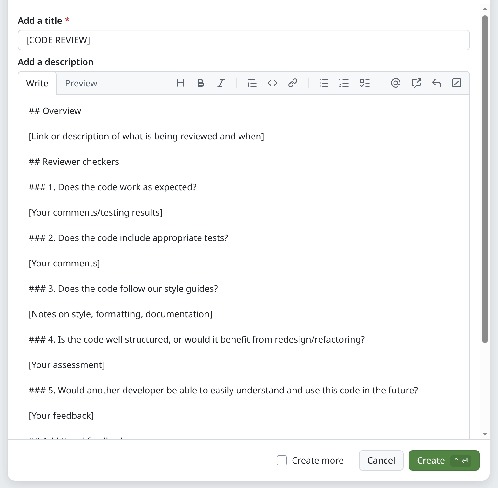
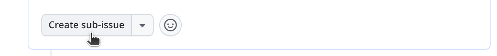
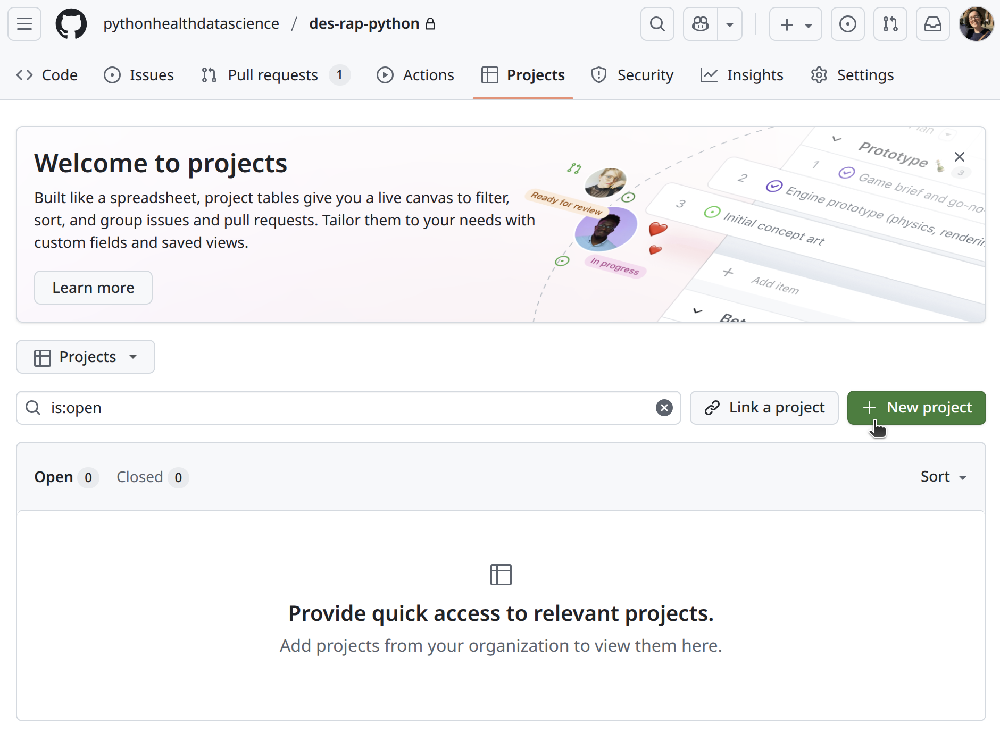
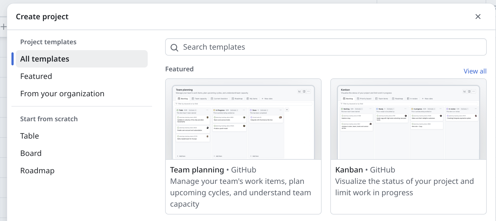

::: {.pale-blue}

**Learning objectives:**

* Understand the **purpose** of code review.
* Identify **when** to use code review, **tools** for doing it, **who** should be involved, and **what** it should cover.

**Pre-reading:**

You may find it helpful to read the [Version control](../setup/version.qmd) page, as tools like GitHub pull requests are common for code review.

**Relevant reproducibility guidelines:**

* NHS Levels of RAP (🥉): Code has been peer reviewed.

:::

## What is code review and why do it?

**Code review (or "peer review")** involves having another person examine your code. 

This can be used to check **reproducibility**: can the reviewer set up your environment, run your code and get the same results? Providing automated tests gives reviewers a straightforward way to confirm that your code produces consistent results in different setups (for more on setting up tests, see the [Tests](../verification_validation/tests.qmd) page).

It'll also improve code **quality**. Reviewers can identify errors, bugs, and logic problems so these can be fixed before results are published or used by others. They suggest missing features, possible improvements or alternative approaches. It can form part of the model [verification and validation](../verification_validation/verification_validation.qmd) (with peer review of code as part of "desk checking" verification).

When **team members** review code, it increases shared understanding of the codebase and can also allow them to gain new insights by seeing different coding styles and approaches. Regular review also makes it much easier to hand projects over when staff join, leave, or change roles, since more people are familiar with how the code works.

## When to do code review?

**During development.** The earlier you catch issues, the easier they are to fix. If you leave review until the end of the project and find a deep issue, it can be painful.

**Regularly.** If you do it little and often, review is usually quicker and can go into more detail than if reviewers are faced with the entire codebase all at once.

That said, this approach is often more ideal than realistic. In research, work doesn't always follow tidy steps, and it's common to end up with just one or two big review moments instead of regular check-ins. Even so, any review - whether early, late, or somewhere in between - helps strengthen your code.

## Structures and tools for review

<div class="h3-tight"></div>

### Pull requests

In research software, peer review most often happens through pull requests ([Eisty and Carver 2022](https://doi.org/10.1007/s10664-021-10053-x)). As explained on the [Version control](../setup/version.qmd) page, a pull request is created when you merge a branch back into the main codebase.

This is a natural point for peer review, and platforms like GitHub make it easy to request feedback from others. For example, you can request **reviewers**, who will be notified to look over your changes.

It's also a good point to run automated tests with GitHub Actions, checking your code before it's merged (see the [GitHub actions](../style_docs/github_actions.qmd) page for details).

\

<br>

You can use pull requests with just main and dev branches, but that approach often means either not reviewing every merge, or letting branches grow large and unwieldy over time.

{width="80%" fig-align="center" fig-alt="Diagram showing review of changes in dev branch before merge into main."}

A more flexible and common setup, inspired by **"Gitflow"**, uses main, dev, and feature branches. Team members work on feature branches that merge into dev, with reviews at merge points, or as changes are merged into main. This keeps branches focused and helps avoid accumulating too many changes in one place.

{fig-alt="Diagram showing review of changes in feature branch before merge into dev."}

<br>

These are recommendations, and its rare to follow them perfectly in research. If you only have time for occasional peer review, you might:

* **Target reviews for specific pull requests** into main, rather than every change.
* **Invite reviewers to create a fork**, make suggestions and changes there, and then **submit a pull request** including their feedback.

When reviews are less frequent, more informal methods like GitHub issues can also be a good option.

### GitHub issues

**GitHub issues** are discussion threads attached to a repository. They offer a flexible, informal way to talk about code without being linked to specific sets of changes. They are not just limited to code review though - for example, another important use is in [debugging](../verification_validation/verification_validation.qmd), as you can record bugs in GitHub issues as they arise, so you don't forget about them and so you have a record for future reference.

To start one, just click &nbsp;[New issue]{style="background: #597341; color: #fff; border-radius:4px; padding:2px 8px; font-family:monospace; font-weight:bold; font-size:90%;"}&nbsp; on the GitHub repository and fill in the details.

{fig-alt="GitHub screenshot of creating a new issue."}

Issues work well for more occasional reviews, letting you track comments and discussions over time. If review happens elsewhere (like email or in person), **writing a summary in an issue** helps keep a transparent record in one place, making it easy to refer back later.

You can also create **templates** for GitHub issues. A template provides a pre-set structure, making reviews more consistent and easier to follow. You can set them up by going to the repository **⚙ Settings**, then scrolling down to **Features** and selecting &nbsp;[Set up templates]{style="background: #597341; color: #fff; border-radius:4px; padding:2px 8px; font-family:monospace; font-weight:bold; font-size:90%;"}&nbsp;.

{fig-alt="Screenshot of GitHub settings 'Set up templates'."}

You can then select **Custom template**, then **Preview and edit**, and the pencil symbol ✎ to edit the template. When you're ready, you can propose and commit changes to add the template to the repository.

{fig-alt="Screenshot of GitHub template draft example."}

Now, when reviewers select &nbsp;[New issue]{style="background: #597341; color: #fff; border-radius:4px; padding:2px 8px; font-family:monospace; font-weight:bold; font-size:90%;"}&nbsp;, they are prompted to choose between starting a blank issue or using a template. Selecting the template will open a draft issue with the template questions/structure you created.

{fig-alt="Screenshot of GitHub issues showing new template in list of options."}

{fig-alt="Screenshot of GitHub creating an issue using the template."}

<br>

#### Tip: Checklists (GitHub tasklists)

Checklists can be used to break down complex issues into actionable steps. To add a checklist using Markdown:

```{.markdown}
* [ ] First task
* [ ] Another task to complete
* [x] Completed task
```

Checklists are interactive, so anyone with write access can mark items as complete or re-order them.

If a task mentions an issue or pull request (e.g., `* [ ] #123`) the box will update automatically when those linked items are completed.

[→ Find out more about tasklists](https://docs.github.com/en/get-started/writing-on-github/working-with-advanced-formatting/about-tasklists)

<br>

#### Tip: Sub-issues

Sub-issues are great for more detailed actions.

You can create sub-issues from existing checklist items, or by scrolling to the bottom of an existing issue and clicking **Create sub-issue**:

{fig-alt="GitHub screenshot of 'Create sub-issue' button."}

The new sub-issue will be nested as part of the larger task.

[→ Find out more about sub-issues](https://docs.github.com/en/issues/tracking-your-work-with-issues/using-issues/adding-sub-issues)

<br>

#### Tip: GitHub projects

GitHub Projects help organize issues, pull requests, checklists, and sub-issues visually. You can set-up a project using the **Project** tab:

{fig-alt="Screenshot of GitHub Projects tab."}

GitHub provide several templates for projects. A common example is a board with columns like "To review", "In progress", or "Done".

{fig-alt="Screenshot of GitHub project templates page."}

[→ Find out more about GitHub Projects.](https://docs.github.com/en/issues/planning-and-tracking-with-projects/learning-about-projects/about-projects)

### Conversations

**Meeting in person or virtually** to talk through code can help clarify questions, resolve confusion, and share knowledge within the team.

Afterwards, you could add a summary of the discussion to a GitHub issue to keep a clear record for future reference.

## Who should review your code?

It's helpful to have reviewers with knowledge of the research area, project context, and coding experience. They **don't have to be experts** though; different perspectives can spot different issues, so involving **more than one person** is ideal.

If you don't have anyone internal who can review your code, there are other options:

* **Generative AI tools:** These can provide automated feedback, but have limits. They may miss context, give false positives, and you must check internal policies on AI use and avoid sharing sensitive information.

:::: {.callout-note title="Example prompts for generative AI tools" collapse="true"}

* "Identify any issues with this code."

* "How could this code be improved?"

::: {.python-content}

* "Check this python code follows PEP-8 and uses NumPy-style docstrings."

* "This python code should just use double quotes for strings - identify any single quotes."

:::

::: {.r-content}

* "Check this R code has complete roxygen2 comments for all functions."

* "Check this R code follows tidyverse style."

:::

For more ideas, check out the "**what should reviewers look for?**" section below.

::::

* **Online communities:** Communities for researchers using Python or R might have channels for sharing and reviewing code. You may be able to arrange peer review swaps, like "you review for me, I'll review for you".

The key is to find someone willing to try out your code and give honest feedback - even informal review is valuable.

<br>

::: {.callout-tip title="NHS-only: RAP Code Review Buddies Network"}

If you work in the NHS, you can make use of the **RAP Code Review Buddies Network**.

This is an initiative run by The Strategy Unit which pairs up people who code in the NHS, to arrange to meet up online and talk through some code you have written.

You can [find out more here](https://github.com/The-Strategy-Unit/RAP_Drop_In/wiki/Code-Review-Buddies-Network).

:::

## What should reviewers look for?

Reviewers don't need to check everything at once. The most important starting point is to see if the code can be set up, run, and produce the expected results. From there, you can look for improvements in quality, structure, and reproducibility.

A useful way to approach review is to draw ideas from existing checklists and guidance, such as the [UK Government Analytical Community's Quality Assurance of Code](https://best-practice-and-impact.github.io/qa-of-code-guidance/) for Analysis and Research and the [NHS RAP Community of Practice](https://nhsdigital.github.io/rap-community-of-practice/implementing_RAP/workflow/code-review/).

### Ideas from the NHS RAP Community of Practice

The [NHS Community of Practice]((https://nhsdigital.github.io/rap-community-of-practice/implementing_RAP/workflow/code-review/)) guidance on code review suggests reviewers start with the following questions:

* Does the code work as expected?
* Does the work actually meet the acceptance criteria in the user story?
* Is the code well structured or would it benefit from redesign/refactoring?
* Could the code be made simpler? Is this level of complexity justified?
* Would another developer be able to easily understand and use this code when they come across it in the future?
* Does the code include appropriate tests?
* Does the code follow our style guides?

They also provide a more detailed [quality assurance checklist](https://nhsdigital.github.io/rap-community-of-practice/implementing_RAP/workflow/quality-assuring-analytical-outputs/
).

*(© 2025 Crown Copyright (NHS England). Content under the Open Government Licence v3.0.)*

### Ideas from the UK Government Analytical Community's Quality Assurance of Code

Within their book, the [UK Government Analytical Community](https://best-practice-and-impact.github.io/qa-of-code-guidance/) provide three detailed quality assurance checklists covering different levels (lower, moderate and higher quality).

::: {.callout-note title="Example: View the lower quality assurance checklist" collapse="true"}

```{.markdown}
## Quality assurance checklist

Quality assurance checklist from [the quality assurance of code for analysis and research guidance](https://best-practice-and-impact.github.io/qa-of-code-guidance/intro.html).

### Modular code

- [ ] Individual pieces of logic are written as functions. Classes are used if more appropriate.
- [ ] Repetition in the code is minimalised. For example, by moving reusable code into functions or classes.

### Good coding practices

- [ ] Names used in the code are informative and concise.
- [ ] Code logic is clear and avoids unnecessary complexity.
- [ ] Code follows a standard style, e.g. [PEP8 for Python](https://www.python.org/dev/peps/pep-0008/) and [Google](https://google.github.io/styleguide/Rguide.html) or [tidyverse](https://style.tidyverse.org/) for R.

### Project structure

- [ ] A clear, standard directory structure is used to separate input data, outputs, code and documentation.

### Code documentation

- [ ] Comments are used to describe why code is written in a particular way, rather than describing what the code is doing.
- [ ] Comments are kept up to date, so they do not confuse the reader.
- [ ] Code is not commented out to adjust which lines of code run.
- [ ] All functions and classes are documented to describe what they do, what inputs they take and what they return.
- [ ] Python code is [documented using docstrings](https://www.python.org/dev/peps/pep-0257/). R code is [documented using `roxygen2` comments](https://cran.r-project.org/web/packages/roxygen2/vignettes/roxygen2.html).

### Project documentation

- [ ] A README file details the purpose of the project, basic installation instructions, and examples of usage.
- [ ] Where appropriate, guidance for prospective contributors is available including a code of conduct.
- [ ] If the code's users are not familiar with the code, desk instructions are provided to guide lead users through example use cases.
- [ ] The extent of analytical quality assurance conducted on the project is clearly documented.
- [ ] Assumptions in the analysis and their quality are documented next to the code that implements them. These are also made available to users.
- [ ] Copyright and licenses are specified for both documentation and code.
- [ ] Instructions for how to cite the project are given.

### Version control

- [ ] Code is [version controlled using Git](https://git-scm.com/).
- [ ] Code is committed regularly, preferably when a discrete unit of work has been completed.
- [ ] An appropriate branching strategy is defined and used throughout development.
- [ ] Code is open-sourced. Any sensitive data are omitted or replaced with dummy data.

### Configuration

- [ ] Credentials and other secrets are not written in code but are configured as environment variables.
- [ ] Configuration is clearly separated from code used for analysis, so that it is simple to identify and update.
- [ ] The configuration used to generate particular outputs, releases and publications is recorded.

### Data management

- [ ] Published outputs meet [accessibility regulations](https://analysisfunction.civilservice.gov.uk/area_of_work/accessibility/).
- [ ] All data for analysis are stored in an open format, so that specific software is not required to access them.
- [ ] Input data are stored safely and are treated as read-only.
- [ ] Input data are versioned. All changes to the data result in new versions being created, or [changes are recorded as new records](https://en.wikipedia.org/wiki/Slowly_changing_dimension).
- [ ] All input data is documented in a data register, including where they come from and their importance to the analysis.
- [ ] Outputs from your analysis are disposable and are regularly deleted and regenerated while analysis develops. Your analysis code is able to reproduce them at any time.
- [ ] Non-sensitive data are made available to users. If data are sensitive, dummy data is made available so that the code can be run by others.
- [ ] Data quality is monitored, as per [the government data quality framework](https://www.gov.uk/government/publications/the-government-data-quality-framework/the-government-data-quality-framework).

### Peer review

- [ ] Peer review is conducted and recorded near to the code. Merge or pull requests are used to document review, when relevant.

### Testing

- [ ] Core functionality is unit tested as code. See [`pytest` for Python](https://docs.pytest.org/en/stable/) and [`testthat` for R](https://testthat.r-lib.org/). 
- [ ] Code based tests are run regularly, ideally being automated using continuous integration.
- [ ] Bug fixes include implementing new unit tests to ensure that the same bug does not reoccur.
- [ ] Informal tests are recorded near to the code.
- [ ] Stakeholder or user acceptance sign-offs are recorded near to the code.

### Dependency management

- [ ] Required passwords, secrets and tokens are documented, but are stored outside of version control.
- [ ] Required libraries and packages are documented, including their versions.
- [ ] Working operating system environments are documented.
- [ ] Example configuration files are provided.

### Logging

- [ ] Misuse or failure in the code produces informative error messages.
- [ ] Code configuration is recorded when the code is run.

### Project management

- [ ] The roles and responsibilities of team members are clearly defined.
- [ ] An issue tracker (e.g GitHub Project, Trello or Jira) is used to record development tasks.
- [ ] New issues or tasks are guided by users' needs and stories.
- [ ] Acceptance criteria are noted for issues and tasks. Fulfilment of acceptance criteria is recorded.
- [ ] Quality assurance standards and processes for the project are defined. These are based around [the quality assurance of code for analysis and research guidance document](https://best-practice-and-impact.github.io/qa-of-code-guidance/intro.html).
```

*(UK Government Analytical Community. 2020. Quality assurance of code for analysis and research (version 2025.1). Office for National Statistics, Analytical Standards and Pipelines hub. Content under the Open Government Licence v3.0.)*

:::

## Test yourself

```{r}
#| echo: false
library(webexercises)
```

::: {.callout-note}

## When is the best time to do code review?

```{r}
#| output: asis
#| echo: false
cat(longmcq(c(
  "Only at the very end of the project.",
  "After publishing results.",
  answer = "Early and regularly during development."
)))
```

:::

::: {.callout-note}

## Which tool is commonly used for managing code reviews in collaborative research projects?

```{r}
#| output: asis
#| echo: false
cat(longmcq(c(
  answer = "GitHub pull requests.",
  "Slack chat threads.",
  "Emails."
)))
```

:::

::: {.callout-note}

## Why is peer code review important for teams?

```{r}
#| output: asis
#| echo: false
cat(longmcq(c(
  "It avoids the need for documentation.",
  answer = paste0("It makes projects easier to hand over and increases ",
                  "shared knowledge."),
  "It means you don't need automated testing."
)))
```

:::

## Further information

* [Quality assurance of code for analysis and research](https://best-practice-and-impact.github.io/qa-of-code-guidance/) from the UK Government Analytical Community 2020

    *Comprehensive detailed resource on quality assurance for analysis and research, with Python and R examples.*

* [Ten simple rules for scientific code review](https://doi.org/10.1371/journal.pcbi.1012375) from Ariel Rokem 2024

    *Article providing some clear helpful advice on code review.*

* [Code Review for Research Code](https://www.carolinemorton.co.uk/blog/code-review-for-research-code/) by Caroline Morton 2024.

    *Beginner friendly explanation on using pull requests for research code review.*

* [Developers perception of peer code review in research software development](https://doi.org/10.1007/s10664-021-10053-x) by Eisty and Carver 2022

    *Study that interviewed research software developers about their code review practices.*

* [Recommendations for Peer Code Review in Research Software Development](https://bssw.io/blog_posts/recommendations-for-peer-code-review-in-research-software-development) by Nasir Eisty 2022

    *Blog post based on the Eisty and Carver paper that helps clearly summarise key points.*

<br><br>
