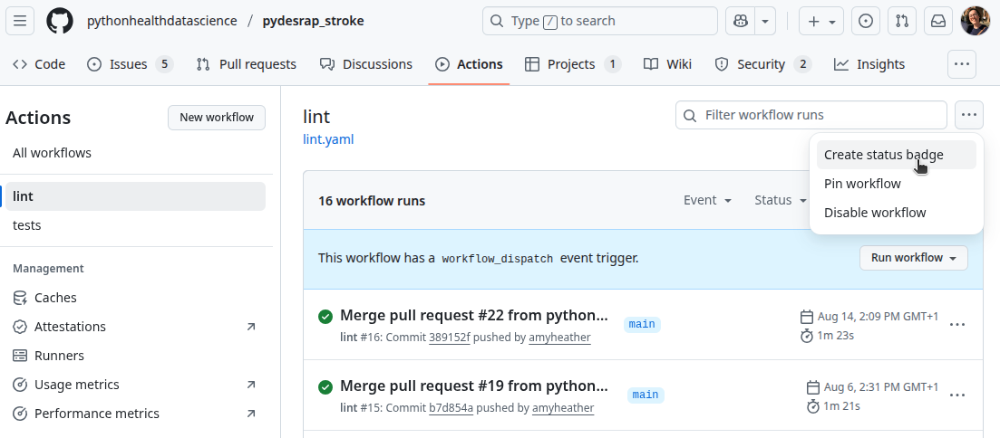
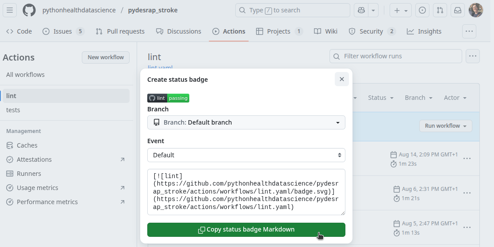
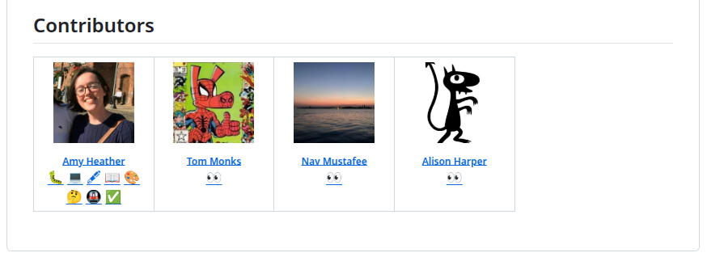

:::: {.pale-blue}

**Learning objectives:**

* Recognise different forms of code documentation.
* Understand what `README.md` and `CONTRIBUTING.md` should contain.
* Explore options for creating documentation websites.

**Relevant reproducibility guidelines:**

* STARS Reproducibility Recommendations: Include run instructions.
* STARS Reproducibility Recommendations: State run times and machine specifications.
* NHS Levels of RAP (🥉): Repository includes a README.md file (or equivalent) that clearly details steps a user must follow to reproduce the code (use NHS Open Source Policy section on Readmes as a guide).
* NHS Levels of RAP (🥈): Code is well-documented including user guidance, explanation of code structure & methodology and docstrings for functions.

::::

<br>

**Code documentation** consists of written explanations that describe and clarify code - its purpose, how it works, and how to use it. **Comments** and **docstrings** are embedded within the code itself (see [Docstrings page](docstrings.qmd)), but many forms of documentation are separate. These include:

* **README files** - project overviews and usage instructions - covered below.
* **CONTRIBUTING guides** - how to set up and contribute to the project - covered below.
* **Project documentation websites** - comprehensive reference and user guides - covered below.
* **CHANGELOGs** - record of updates and version changes - see [Changelog page](../sharing/changelog.qmd).
* **LICENSE files** - terms for using and sharing the code - see [Licensing page](../sharing/licence.qmd).

## README file

A README is the bare minimum documentation that every project should have. It is a markdown file (`README.md`) and is often the first document that anyone looks at when viewing a project/repository.

::: {.r-content}

You can create a basic template in one step with:

```{.r}
usethis::use_readme_md()
```

This sets up `README.md` and reminds you to fill in key sections like installation and usage.

:::

We have compiled some suggestions for what your README should ideally include:

::: {.cream}

* ✔️ &nbsp;&nbsp; **Title**

* ✔️ &nbsp;&nbsp; **Summary** - describe project purpose and context.

* ✔️ &nbsp;&nbsp; **Authors** - named contributors, their ORCIDs, and contact details.

* ✔️ &nbsp;&nbsp; **Installation** - steps for setting up the environment.

* ✔️ &nbsp;&nbsp; **How to run the model** - basic instructions for executing the simulation.

* ✔️ &nbsp;&nbsp; **Reproduction instructions** - specific instructions on how to generate results from your report/publication.

* ✔️ &nbsp;&nbsp; **Inputs** - description of the input data (as specified on the [Input data management page](../inputs/input_data.qmd)).

* ✔️ &nbsp;&nbsp; **Project structure** - brief guide to main files and folders.

* ✔️ &nbsp;&nbsp; **Run time and machine specifications** - typical simulation duration (with computer requirements where relevant).

* ✔️ &nbsp;&nbsp; **Citation** - instructions for citing the project/repository.

* ✔️ &nbsp;&nbsp; **Licence** - state the license used and point to the [LICENSE file](../sharing/licence.qmd).

* ✔️ &nbsp;&nbsp; **Funding and affiliations** - relevant sources of funding, support and affiliation.

* ✔️ &nbsp;&nbsp; **Acknowledgements** - credit external code or resources used, inspiration from other projects, and any assistance from individuals, large language models (e.g., ChatGPT, Perplexity) or tools that contributed to the work.

:::

If no other documentation exists, the README should also provide additional details including an explanation of the code structure and methodology; a clear description of the simulation model; and information on validation, testing, assumptions, and limitations.

In the following sections, we include some suggestions that can help with formatting your README.

### Markdown badges

Badges are  a quick, visual way to include key project information at the start of your README.

<br>

The website [shields.io](https://shields.io/) is a great resource for creating badges. You can make your own custom badges using this syntax:

```{.md}
https://img.shields.io/badge/label-text-colour?&labelColor=colour
```

Control the text and the background colours by replacing `label`, `text` and `colour` with your desired values. Shields.io also supports different badge styles, such as the *for-the-badge* style. See the documentation for further [customisation options](https://shields.io/badges).

You can also hyperlink the badges (by encasing them: `[badge](url)`) so that clicking the badge opens up your desired URL.

Examples:

| | |
| - | - |
| {fig-alt="Example badge (default style)"} | `` |
| {fig-alt="Example badge (for-the-badge style)"} | `` |
| [{fig-alt="Example badge (with hyperlink)"}](https://pythonhealthdatascience.github.io/des_rap_book/pages/style_docs/documentation.html) | `[](https://pythonhealthdatascience.github.io/des_rap_book)` |
: {tbl-colwidths="[30,70]"}

<br>

You can also add "workflow status" badges which show the status of your [GitHub actions](github_actions.qmd). You can create these by going to your repository actions, choosing a workflow, then selecting the "..." button in the top right and clicking "Create a status badge".



It will then provide you with the required markdown for your badge.



<br>

These are examples of some badges that might be relevant for your simulation README:

| Badge | Markdown |
| - | - |
| [](https://github.com/pythonhealthdatascience/des_rap_book/blob/main/LICENSE) | `[](https://github.com/pythonhealthdatascience/des_rap_book/`<br>`blob/main/LICENSE)` |
| [](https://doi.org/10.5281/zenodo.17094155) | `[](https://doi.org/10.5281/zenodo.17094155)` |
| [](https://orcid.org/0000-0002-6596-3479) | `[](https://orcid.org/0000-0002-6596-3479)` |
|  | `` |
|  | `` |
| [](https://github.com/pythonhealthdatascience/pydesrap_stroke/actions/workflows/lint.yaml) | `[](https://github.com/pythonhealthdatascience/pydesrap_stroke/`<br>`actions/workflows/lint.yaml)` |
: {tbl-colwidths="[30,70]"}

### Collapsible sections

If your README is very long or busy, you could consider putting some information into multiple markdown files (e.g., user guide, contributing) or building a full documentation website. If you choose to keep everything in one README, collapsible sections can be useful for organising information and making it easier to read.

These are created using the HTML `<details>` and `<summary>` tags. For example:

```{.md}
<details>

<summary>View collapsed section</summary>

Contents of the collapsed section.

</details>
```

<details>

<summary>View collapsed section</summary>

Contents of the collapsed section.

</details>

### All-contributors

If you are using GitHub, everyone who has made commits will be listed as a contributor in the repository's right-hand pane. However, people may contribute in other ways - for example, [code review](../sharing/peer_review.qmd) without committing any changes - and it is important to acknowledge them.

You can list contributors manually in Markdown, but a fun way to enhance this is to use [All Contributors](https://allcontributors.org/). This GitHub bot adds a grid of contributors and their roles at the end of your README. For set-up and usage instructions, check out their documentation: <https://allcontributors.org/docs/en/bot/overview>.

Example from [this book's README](https://github.com/pythonhealthdatascience/des_rap_book) (as of October 2025):



## CONTRIBUTING guide

A `CONTRIBUTING.md` file is typically about contributing to an open-source package, but for a simulation repository it can be a great place for storing detailed set-up and workflow information, beyond that covered in the README.

This can be handy for recording some of the more technical information on working with the repository - for people who might join you in working on the code, using the code, and for yourself in the future.

As an example, here are some of the things this documentation could cover:  

:::{.cream}

* ✔️ &nbsp;&nbsp; **Tests** - how to run tests.

* ✔️ &nbsp;&nbsp; **Code style** - what style guide(s) are followed.

* ✔️ &nbsp;&nbsp; **Linting** - how and which linters to run.

* ✔️ &nbsp;&nbsp; **Releases** - if keeping a changelog and making releases,  
  instructions on how to do that, what to update for a new release, etc.

* ✔️ &nbsp;&nbsp; **Contributing** - if people come across the repository and wish to contribute or make suggestions, explain how (e.g., GitHub issue, fork, email, etc.).

:::

For more on `CONTRIBUTING.md` files, check out ["Wrangling Web Contributions: How to Build a CONTRIBUTING.md"](https://mozillascience.github.io/working-open-workshop/contributing/) from mozilla Science Lab.

## Documentation websites

Creating a small website to accompany your repository can be a really clear and accessible way to document your model.

::: {.python-content}

There are many tools available. We would recommend **Quarto** as a modern, versatile tool with support for multiple programming language - we used it to create this website.

Some older solutions include Jupyter Book, Sphinx and MkDocs.

:::

::: {.r-content}

If your work is structured as a package, then **pkgdown** is a classic choice. You can set it up very quickly with:

```{.r}
usethis::use_pkgdown()
usethis::use_pkgdown_github_pages()
```

This builds a reference website directly from your existing package assets (README, function documentation, vignettes) and publishes it via GitHub Pages.

Another great option is **Quarto**, particularly if you want more than just function and vignette documentation. It works well for research projects where you want richer narrative content on the site (e.g., tutorials, methodological notes, case studies, blog posts, mixed-language examples) plus more control over layout and structure.

:::

We haven't created websites for the example models in this book, mostly because this website contains a lot of additional explanation already! However, here are some examples of simulation models with accompanying websites you can explore:

* **stars-simpy-example-docs:** A [Jupyter Book website](https://pythonhealthdatascience.github.io/stars-simpy-example-docs/) documents this Python `simpy` treatment centre discrete-event simulation model. The website source files are in the [GitHub repository](https://github.com/pythonhealthdatascience/stars-simpy-example-docs).
* **stars-ciw-example:** A [Quarto website](https://pythonhealthdatascience.github.io/stars-ciw-example/) documents this Python `ciw` discrete-event simulation model of an urgent care call centre. The website source files are in the [GitHub repository](https://github.com/pythonhealthdatascience/stars-ciw-example).

Both examples are hosted on GitHub Pages, which is free and easy to set up with GitHub. The latter example is published automatically using GitHub Actions, making deployment even simpler (this approach can also be used with Jupyter Book).

### stars-simpy-example-docs

<iframe style="display: block; margin: auto;" src="https://pythonhealthdatascience.github.io/stars-simpy-example-docs" height=500 width=100% ></iframe> 

### stars-ciw-example

<iframe style="display: block; margin: auto;" src="https://pythonhealthdatascience.github.io/stars-ciw-example/" height=500 width=100% ></iframe> 

## Explore the example models

::: {.python-content}





Both repositories have `README.md` and `CONTRIBUTING.md` files.

:::

::: {.r-content}





Both repositories have `README.md` and `CONTRIBUTING.md` files.

:::

## Test yourself

Do you have a README file? If not, create one! Edit your README to include clear information about the project and your model.

Explore the example models and links above for inspiration on effective documentation.

<br><br>
