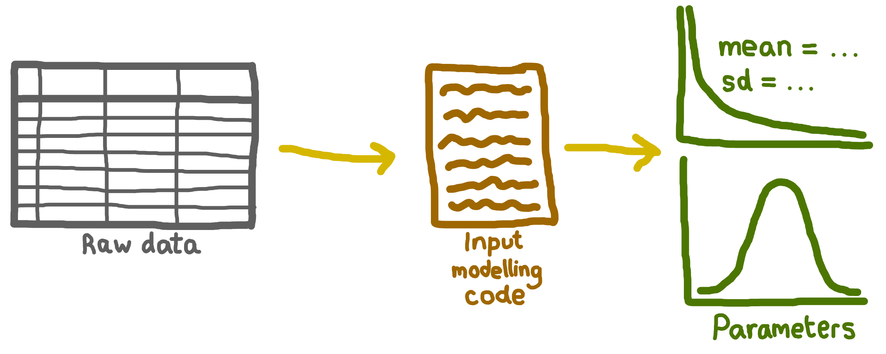
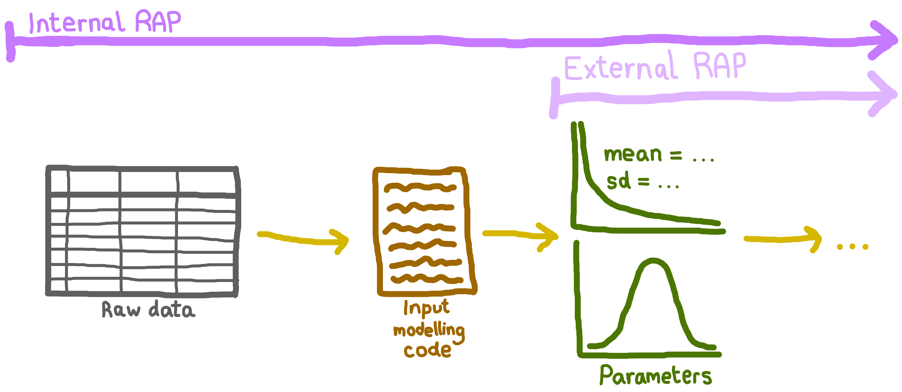

<!-- Hide as no python-content or r-content blocks -->
<style>
      #quarto-announcement {
        display: none !important;
      }
</style>

::: {.pale-blue}

**Learning objectives:**

* Recognise where a **reproducible analytical pipeline** begins, and what data is included.
* Learn recommended practices for **storing and sharing raw data, input modelling code, and parameters**.
* Understand how **private and public versions** of a model could be maintained when there is sensitive data.

:::

## 🧾 Input data

When managing input data in your RAP, there are three key files:

* **Raw data:** The original data reflecting the system you will simulate.
* **Input modelling code:** Code/scripts used to estimate parameters or fit distributions.
* **Parameters:** Numerical values used by your model (e.g., arrival rates, service times).



## 📦 What is included in a RAP?

Your reproducible analytical pipeline (RAP) should begin with the **earliest data you access**. This could be:

* **Raw data** (if you estimate parameters yourself), or-
* **Pre-defined parameters** (if these are already supplied).

Keep in mind that, especially in sensitive areas like healthcare, you may not be able to share your full RAP outside your team or organisation. Even so, it's crucial to **maintain a complete RAP internally** so your work remains fully reproducible. For example:



> **Why is this important?** By starting at the source, you make your work transparent and easy to repeat. For instance, if new raw data becomes available, it's important you have your input modelling code so that you can check your distributions are still appropriate, re-estimate your model parameters, and re-run your analysis.

## 🗃️ Raw data

This is data which reflects system you will be simulating. It is used to estimate parameters and fit distributions for your simulation model. For example:

::: {.grey-table}

| ARRIVAL_DATE | ARRIVAL_TIME | SERVICE_DATE | SERVICE_TIME | DEPARTURE_DATE | DEPARTURE_TIME |
|--------------|--------------|--------------|--------------|----------------|----------------|
| 2025-01-01   | 0001         | 2025-01-01   | 0007         | 2025-01-01     | 0012           |
| 2025-01-01   | 0002         | 2025-01-01   | 0004         | 2025-01-01     | 0007           |
| 2025-01-01   | 0003         | 2025-01-01   | 0010         | 2025-01-01     | 0030           |
| 2025-01-01   | 0007         | 2025-01-01   | 0014         | 2025-01-01     | 0022           |

:::

### 📋 Checklist: Managing your raw data

:::{.cream}

🗂️ **Always**

* **Keep copies of your raw data**<br>Or, if you can't export it, document how to access it (e.g. database location, required permissions).

* **Record metadata**<br>Include: data source, date obtained, time period covered, number of records, and any known issues.

* **Keep copy of the data dictionary**<br>If none exists, create one to explain your data's structure and variables.

<br>

🔓 **If you can share the data:**

* **Make the data openly available**<br>Follow the [FAIR principles]((https://open-science-training-handbook.github.io/Open-Science-Training-Handbook_EN/02OpenScienceBasics/02OpenResearchDataAndMaterials.html)): Findable, Accessible, Interoperable, Reusable.

* **Deposit in a trusted archive**<br>Use platforms like Zenodo, Figshare, GitHub or GitLab.

* **Add an open data licence**<br>Examples: CC0, CC-BY.

* **Provide a citation or DOI**<br>Make it easy for others to reference your dataset.

<br>

🔒 **If you cannot share the data:**

* **Describe the dataset**<br>Include details in your documentation.

* **Share the data dictionary**<br>If allowed, to help others understand the data structure.

* **Consider providing a synthetic dataset**<br>Create a sample with the same structure (but no sensitive information) so that others can understand the data layout and test run code.

* **Explain access restrictions**<br>State why sharing isn't possible and provide contact information for access requests.

:::

#### Example metadata

> "Data sourced from the XYZ database. Copies are available in this repository, or, to access directly, log in to the XYZ database and navigate to [path/to/data].
>
> Data covers January 2012 to December 2017, with [number] records. Note: [details on missing data, known issues, etc.].
>
> A copy of the data dictionary is available in the repository or online at [URL]."
>
> Access to the dataset is restricted due to patient confidentiality. Researchers interested in accessing the data must submit a data access request to the XYZ Data Governance Committee. For more information, contact data.manager@xyz.org.

#### Example data dictionary

A data dictionary describes each field, its format, units, and any coding schemes used. Several resources exist to provide guidance on their creation, like ["How to Make a Data Dictionary"](https://help.osf.io/article/217-how-to-make-a-data-dictionary) from OSF Support.

Example data dictionary:

::: {.grey-table}

| Field          | Field name                  | Format           | Description                                           |
|----------------|----------------------------|------------------|-------------------------------------------------------|
| ARRIVAL_DATE   | CLINIC ARRIVAL DATE        | Date(CCYY-MM-DD) | The date on which the patient arrived at the clinic   |
| ARRIVAL_TIME   | CLINIC ARRIVAL TIME        | Time(HH:MM)      | The time at which the patient arrived at the clinic   |
| DEPARTURE_DATE | CLINIC DEPARTURE DATE      | Date(CCYY-MM-DD) | The date on which the patient left the clinic         |
| DEPARTURE_TIME | CLINIC DEPARTURE TIME      | Time(HH:MM)      | The time at which the patient left the clinic         |
| SERVICE_DATE   | NURSE SERVICE START DATE   | Date(CCYY-MM-DD) | The date on which the nurse consultation began        |
| SERVICE_TIME   | NURSE SERVICE START TIME   | Time(HH:MM)      | The time at which the nurse consultation began        |

:::

#### Obtaining a DOI

If you’re able to openly share the data, you can include it directly in your GitHub repository alongside your code and documentation for convenience and reproducibility. For longer-term access, public citation, or larger datasets, it’s often better to deposit the data in a separate and/or specialised repository, and then simply link from your code to the archive record.

As described in the ["The Research Data Management Workbook"](https://caltechlibrary.github.io/RDMworkbook/), when choosing where to store data, you should consider the available data repository types:

* **Disciplinary:** Designed for a specific research field.
* **Institutional:** Provided by a university, funder, or research centre.
* **Generalist:** Accepts any data type.

Some recommendations for generalist repositories are available:

* ["Recommended Repositories"](https://journals.plos.org/plosone/s/recommended-repositories) from PLOS.
* ["Accessing Scientific Data - Generalist Repositories"](https://grants.nih.gov/policy-and-compliance/policy-topics/sharing-policies/accessing-data/scientific#generalist-repositories) from NIH Grants & Funding.

Instructions for Zenodo archiving are provided on our [sharing and archiving](../sharing/archive.qmd) page.

## 📜 Input modelling code

[Input modelling code](input_modelling.qmd#input-modelling) refers to the scripts used to define and fit the statistical distributions that represent the uncertain inputs for a simulation model.

These scripts are often not shared, but are an essential part of your simulation RAP. Sharing them ensures transparency in how distributions were chosen and allows you (or others) to re-run the process if new data or assumptions arise.

### 📋 Checklist: Managing your input modelling code

:::{.cream}

🔓 **If you can share the code:**

* **Include the input modelling code in your repository**<br>Store it alongside your simulation code and other relevant scripts.

<br>

🔒 **If you cannot share the code:**

* **For internal use:**
  * Store the code securely and ensure it is accessible to your team or organisation - avoid saving it only on a personal device.
  * Use version control (e.g. a private GitHub repository) to track changes and maintain access.
* **For external documentation:**
  * Clearly describe the input modelling process.
  * Explain why the code cannot be shared (e.g. it contains sensitive or proprietary logic).

:::

## ⚙️ Parameters

Parameters are the numerical values used in your model, like the arrival rates, service times or probabilities.

### 📋 Checklist: Managing your parameters

:::{.cream}

🗂️ **Always**

* **Keep a structured parameter file**<br>Store all model parameters in a clearly structured format like a [CSV file](parameters_file.qmd) or a [script](parameters_script.qmd).

* **Document each parameter**<br>Include a data dictionary or documentation describing each parameter, its meaning, units, and any abbreviations or codes used.

* **Be clear how parameters were determined**.<br> If you calculated them, link to the input modelling code or describe the calculation steps (as above). If they were supplied to you, then clearly state the source of the parameters and any known processing or transformation.

<br>

🔓 **If you can share the parameters:**

* **Include parameter files in your repository**<br>Store parameter files alongside your model code and documentation.

<br>

You must share some parameters with your model so that it is possible for others to run it. Parameters are often less sensitive than raw data, so sharing is usually possible. However-

🔒 **If you cannot share the parameters:**

* **Provide synthetic parameters**<br>Supply artifical values for each parameter, clearly labelled as synthetic.

* **Describe how synthetic parameters were generated**<br>Document the process or basis for generating synthetic values (e.g. totally artifical, based on published ranges, expert opinion).

* **Explain access restrictions**<br>State why real parameters cannot be shared and provide contact information fore requests, if appropriate.

:::

## 🔐 Maintaining a private and public version of your model

It's common to have data and/or code that cannot be shared publicly. **Both your private and public components should be [version controlled](../setup/version.qmd)**, but you cannot split a single GitHub repository into public and private sections. The suggested solution is to use two separate repositories: **one public, one private**.

The way you might set these up depends on whether you are allowed to share the real simulation parameter files.

### Scenario 1: Allowed to share real parameters

* **Public repository:** Contains everything needed to reproduce your model except sensitive raw data and input modelling scripts.

* **Private repository:** Contains the sensitive raw data, input modelling scripts, and anything else that cannot be publicly released.

* **Workflow:**
  1. Do all input modelling (parameter estimation) on real data in your private repository.
  2. Copy the resulting real parameter files to the public repository.
  3. Run your model and share code/results publicly - users can fully reproduce your analysis using the real parameters.

### Scenario 2: Only sharing fake/synthetic parameters

* **Public repository:** Contains only synthetic/fake parameter files, synthetic/example data, analysis code, and documentation describing how these synthetic values were generated.

* **Private repository:** Contains the sensitive raw data and real parameter files, plus scripts for analysis with the real values.

* **Shared simulation package (in it's own repository or part of the public repository):** All analysis code is [developed as a package](../setup/package.qmd) that can be installed and used by both the public and private repositories. This greatly reduces code duplication.

* **Workflow:**
  1. Estimate parameters using real data in your private repository - store these securely.
  2. Generate synthetic parameter files for the public repository, documenting the generation process.
  3. Use the shared simulation package in both repositories.
  4. Run and share the full workflow in public with synthetic parameters; run the actual analysis in private with the real parameters.

## 🧪 Test yourself

```{r}
#| echo: false
library(webexercises) # nolint: library_call_linter
```

:::{.callout-note}

## If your raw (e.g. patient-level) data cannot be shared, which of the following is recommended?

```{r}
#| output: asis
#| echo: false
cat(longmcq(c(
  "Do not share or describe anything.",
  answer = paste0(
    "Describe the dataset, and if possible also share a data dictionary and a",
    " synthetic dataset."
  )
)))
```

:::

:::{.callout-note}

## Even if it cannot be shared publicly, input modelling code be retained so parameters can be re-estimated if new data or assumptions arise.

```{r}
#| output: asis
#| echo: false
cat(longmcq(c(
  answer = "True",
  "False"
)))
```

:::

:::{.callout-note}

## What is a good strategy when maintaining a public and private version of a model?

```{r}
#| output: asis
#| echo: false
cat(longmcq(c(
  "Duplicate all simulation code across both repositories.",
  answer = paste(
    "Develop the simulation code as a package so it can be shared across ",
    "repositories without code duplication."
  )
)))
```

:::

## 📎 Further information

* ["How to Make a Data Dictionary"](https://help.osf.io/article/217-how-to-make-a-data-dictionary) from OSF Support.

  *Simple guide on creating a data dictionary*.

* ["Open Research Data and Materials"](https://open-science-training-handbook.github.io/Open-Science-Training-Handbook_EN/02OpenScienceBasics/02OpenResearchDataAndMaterials.html) from the Open Science Training Handbook.

  *Explains principles like FAIR, as well as other guidance on sharing data*.

* ["The Research Data Management Workbook"](https://caltechlibrary.github.io/RDMworkbook/) from Kristin Briney 2024.

  *Comprehensive workbook full of advice on research data management including: documentation, file organisation and naming, storage, management plans, sharing and archiving*.

<br><br>
