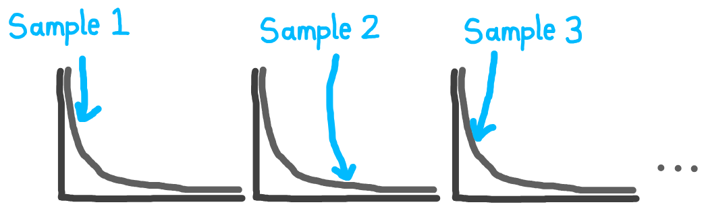

<!-- Hide as no python-content or r-content blocks -->
<style>
      #quarto-announcement {
        display: none !important;
      }
</style>

::: {.pale-blue}

**Learning objectives:**

* Understand what DES models are, how they work, and when to use them.
* Learn the core building blocks of DES models.
* Recognise the range of applications for DES in healthcare.

:::

## What is discrete-event simulation?

A **simulation** is a computer model that mimics a real-world system. It allows us to test different scenarios and see how the system behaves. One of the most common simulation types in healthcare is **discrete-event simulation (DES)**.

In DES models, time progresses only when **specific events** happen. Unlike a continuous system where time flows smoothly, DES jumps forward between events. For example, in a clinic model, events might include a patient arriving, receiving treatment, and leaving.

Between events, the system state remains unchanged - nothing happens until the next event occurs. This makes DES well-suited for modeling systems where entities (patients, prescriptions, ambulances) move through processes and wait for resources.


## Core components of DES models

All DES models share common building blocks:

::: {.blue-table}
| | |
| - | - |
| **Entities** | The objects that flow through the system. In healthcare, these are typically patients, but they could be other things like prescriptions, test samples, ambulances, etc. Each entity can have attributes (e.g., age, condition severity, arrival time) which affect how they move through the system. |
| **Resources** | The people, equipment, or facilities required to serve entities. Examples include doctors, nurses, beds, operating theatres, or diagnostic equipment. Resources have limited capacity and may serve multiple entities over time. |
| **Queues** | Queues form when entities wait for resources to become available. In DES models, we often track queue lengths and waiting times. |
| **Activities** or **processes** | The tasks that entities take part in. For example, this could include a 3-7 minute registration and then a 10-20 minute consultation. |
| **Events** | When the system changes state - e.g. a patient arrives or leaves, and an activity starts or ends. |
: {tbl-colwidths="[20,80]"}
:::

## Randomness

Real-world systems are unpredictable: patients don’t arrive at exactly the same time, and service durations vary from person to person. To capture this uncertainty, DES models use **randomness** (also called **stochasticity**) throughout the simulation.​

Instead of assigning fixed values, DES models **sample from statistical distributions** to determine when events happen and how long activities take.

This randomness means that every run of a DES model can produce different results, just like real life. By running the simulation many times, you can see the range of possible outcomes and understand how the system performs under different scenarios—good days, bad days, and everything in between.



## Applications of DES

@Serrano2021 conducted a review of DES in healthcare, analysing over 200 published studies.

They found that the majority of studies focused on emergency departments (38.9%), medical centres (21.8%), and specific clinical conditions (13%). Other settings included clinics, intensive care units, laboratories, operating rooms, orthopaedics, pathology, paediatrics, pharmacy, radiology, and dental services.

Nearly half of the studies (49.4%) investigated time and efficiency improvements, while others addressed resource and scheduling allocation (21.2%) or financial and cost savings (12.3%).

@Forbus2022 also did a systematic review of healthcare DES, including over 300 studies. They found that healthcare DES models could be categorised as focusing on one of four areas:

* Health care systems operations.
* Disease progression modelling.
* Screening modelling.
* Health behaviour modelling.

## Test yourself

```{r}
#| echo: false
library(webexercises)
```

:::{.callout-note}

## In discrete-event simulation (DES), how does time progress?

```{r}
#| output: asis
#| echo: false
cat(longmcq(c(
  "Continuously at fixed time steps",
  answer = "In jumps from one event to the next"
)))
```

:::

:::{.callout-note}

## What do resources represent in a DES model?

```{r}
#| output: asis
#| echo: false
cat(longmcq(c(
  "Random factors influencing system timing",
  answer = "The people, equipment, or facilities that serve entities",
  "The time intervals between events"
)))
```

:::

:::{.callout-note}

## Why is randomness important in DES models?

```{r}
#| output: asis
#| echo: false
cat(longmcq(c(
  answer = "It reflects real-world variability in arrivals and service times",
  "It removes uncertainty from the system",
  "It ensures all entities behave identically in each run"
)))
```

:::

## References

::: {#refs}
:::

<br><br>
