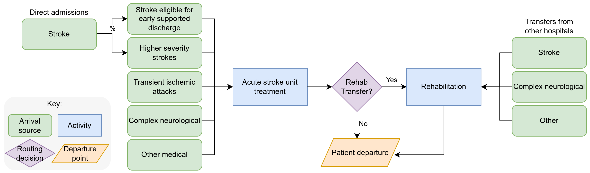

<!-- Hide as no python-content or r-content blocks -->

::: {.pale-blue}

🎯 **Objectives**

This page introduces two models:

* **🩺 Nurse visit simulation:** Simple M/M/s queueing model.
* **🧠 Stroke pathway simulation:** Patient flow model based on a published study.

:::

 

We have developed two example simulation models, each **implemented in both Python and R**, and openly shared as public repositories.

Each model serves as an **illustrative example following the covered concepts in this book**, and they are included as examples throughout the book.

## 🩺 Nurse visit simulation

::: {.blue}

This model simulates a clinic where patients arrive randomly, wait to see a nurse, receive care, then leave. It is designed to help analyse resource utilisation and patient wait times.

:::

#### Code repositories

* [Python version](https://github.com/pythonhealthdatascience/pydesrap_mms)
* [R version](https://github.com/pythonhealthdatascience/rdesrap_mms)

#### Process flow diagram

 

#### Model summary

::: {.grey-table}

| Aspect | Description |
| - | --- |
| **Type** | Discrete-event simulation of a multi-server queue (M/M/s system). |
| **Arrivals** | Patients arrive at random intervals, following a Poisson process (memoryless/inter-arrival times are exponential). |
| **Service** | Each nurse serves one patient at a time; service times are exponentially distributed. Multiple nurses operate in parallel. |
| **Inputs** | Patient arrival rate, nurse service time, number of nurses. |

:::

:::: {.callout-note collapse="true" title="Find out more about M/M/s models"}

#### How it works

This model follows an **M/M/s queueing structure** - a widely used model in healthcare operations. M/M/s stands for:

* Markovian (Poisson) arrivals
* Markovian (exponential) service times
* s servers (nurses) in parallel

#### Why Poisson arrivals?

Patients tend to arrive independently and randomly; this is well-represented by a Poisson process, where:

* The number of arrivals in a period follows the Poisson distribution.
* The time between arrivals follows the exponential distribution.

#### Applications

This model structure can be used for a variety of healthcare and service settings, such as:

::: {.grey-table}

| Queue | Server/Resource |
| - | - |
| Patients in a waiting room | Doctor or nurse consultations |
| Patients waiting for ICU transfer | ICU beds |
| Prescriptions to be processed | Pharmacists |

:::

#### Further information on M/M/s models

* Ganesh, A. (2012). Simple queueing models. University of Bristol. <https://people.maths.bris.ac.uk/~maajg/teaching/iqn/queues.pdf>.
* Green, L. (2011). Queueing theory and modeling. In *Handbook of Healthcare Delivery Systems*. Taylor & Francis. <https://business.columbia.edu/faculty/research/queueing-theory-and-modeling>.

::::

## 🧠 Stroke pathway simulation

::: {.blue}

This model is based on a published study of stroke care. It simulates patient flow through acute stroke and rehabilitation units to support capacity planning and estimate the likelihood of admission delays for different patient groups.

:::

It is described in:

> Monks T, Worthington D, Allen M, Pitt M, Stein K, James MA. A modelling tool for capacity planning in acute and community stroke services. BMC Health Serv Res. 2016 Sep 29;16(1):530. doi: [10.1186/s12913-016-1789-4](https://doi.org/10.1186/s12913-016-1789-4). PMID: 27688152; PMCID: PMC5043535.

The original study implemented the model using SIMUL8 software. Based on the published description of the model's logic and parameters, we have recreated it in both Python and R.

#### Code repositories

* [Python repository](https://github.com/pythonhealthdatascience/pydesrap_stroke)
* [R repository](https://github.com/pythonhealthdatascience/rdesrap_stroke)

#### Process flow diagram

 

{.lightbox}

#### Model summary

::: {.grey-table}

| Aspect | Description |
| - | --- |
| **Type** | Discrete-event simulation of a patient pathway. |
| **Arrivals** | Multiple patient classes (e.g., stroke, TIA, complex neurological, other) each have their own arrival processes to the acute stroke unit and rehabilitation unit, with inter-arrival times drawn from specified distributions. |
| **Service** | Patients experience lengths of stay in each unit based on distributions specific to their class and care type (e.g., lognormal for length of stay). |
| **Routing** | After acute care, patients are routed to rehabilitation, early supported discharge, or exit the system, according to probabilities defined for each patient class. |
| **Resources** | The model assumes infinite capacity for both acute and rehabilitation beds (i.e., no explicit queueing). |

:::

  
