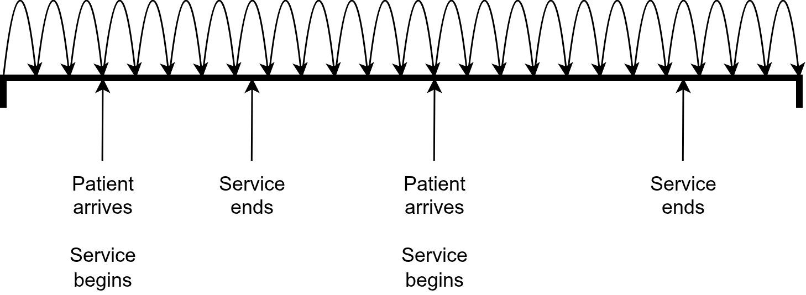
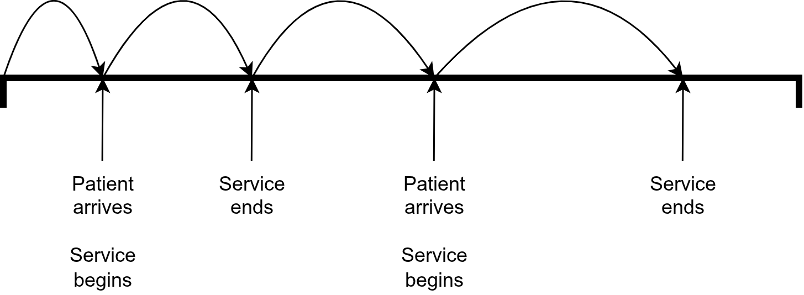
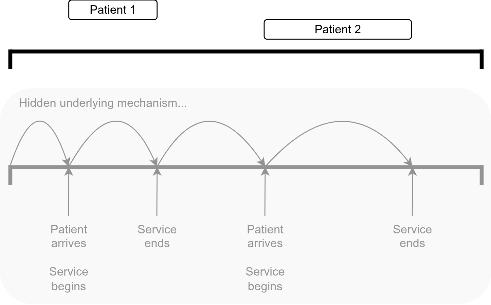
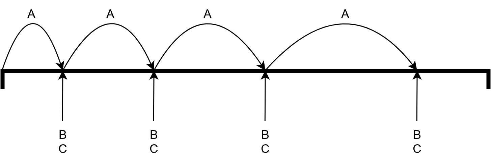

<!-- Hide as no python-content or r-content blocks -->
<style>
      #quarto-announcement {
        display: none !important;
      }
</style>

## What is discrete-event simulation?

A **simulation** is a computer model that mimics a real-world system. It allows us to test different scenarios and see how the system behaves. One of the most common simulation types in healthcare is **discrete-event simulation (DES)**.

In DES models, time progresses only when **specific events** happen. Unlike a continuous system where time flows smoothly, DES jumps forward between events. For example, in a clinic model, events might include a patient arriving, receiving treatment, and leaving.

Between events, the system state remains unchanged - nothing happens until the next event occurs. This makes DES well-suited for modeling systems where entities (patients, prescriptions, ambulances) move through processes and wait for resources.


## Core components of DES models

All DES models share common building blocks:

::: {.blue-table}
| | |
| - | - |
| **Entities** | The objects that flow through the system. In healthcare, these are typically patients, but they could be other things like prescriptions, test samples, ambulances, etc. Each entity can have attributes (e.g., age, condition severity, arrival time) which affect how they move through the system. |
| **Resources** | The people, equipment, or facilities required to serve entities. Examples include doctors, nurses, beds, operating theatres, or diagnostic equipment. Resources have limited capacity and may serve multiple entities over time. |
| **Queues** | Queues form when entities need a resource that is currently busy and must wait for it to become available. In DES models, we often track queue lengths and waiting times. |
| **Activities** or **processes** | The tasks that entities take part in. For example, this could include a 3-7 minute registration and then a 10-20 minute consultation. |
| **Events** | When the system changes state - e.g. a patient arrives or leaves, and an activity starts or ends. |
: {tbl-colwidths="[20,80]"}
:::

## Randomness

Real-world systems are unpredictable: patients don't arrive at exactly the same time, and service durations vary from person to person. To capture this uncertainty, DES models use **randomness** (also called **stochasticity**) throughout the simulation.​

Instead of assigning fixed values, DES models **sample from statistical distributions** to determine when events happen and how long activities take.

This randomness means that every run of a DES model can produce different results, just like real life. By running the simulation many times, you can see the range of possible outcomes and understand how the system performs under different scenarios—good days, bad days, and everything in between.


In the plot below, each point shows the value of a performance measure from one independent run of the same simulation model, and the labels ("Run 1", "Run 2", ...) identify which run it came from. The horizontal axis has two different performance measures (for example, average waiting time and resource utilisation), and you can see that even though the model is unchanged, the values jump around from run to run because of randomness in arrivals, service times, and other processes. This mirrors what happens in real systems: some days are "good" (short waits, lower utilisation), others are "bad" (long waits, higher utilisation), and we need multiple runs to understand both the typical performance and how much it varies.

```{r}
#| echo: false
#| output: false
# For illustrative plot only, code hidden
library(ggplot2)
```

```{r}
#| echo: false
set.seed(9L)

df <- data.frame(
  Category = rep(c("Performance measure 1", "Performance measure 2"),
                 each = 7L),
  Value = runif(14L, min = 0L, max = 1L),
  Run = rep(paste("Run", 1L:7L), 2L),
  stringsAsFactors = FALSE
)

ggplot(df, aes(x = Category, y = Value)) +
  geom_point(size = 3L) +
  geom_text(aes(label = Run), vjust = -1L, size = 3L) +
  labs(x = NULL, y = "Value") +
  theme_minimal() +
  theme(axis.text.x = element_text(size = 12L))
```

Because each run is influenced by randomness, a single simulation run is rarely enough to understand how the system performs on average or how variable it is. By running **many replications** of the same model (with different random seeds), you can estimate averages, variability, and uncertainty in key outputs, such as mean waiting times or resource utilisation.

Multiple replications are also essential when comparing interventions, because they help you distinguish genuine performance improvements from differences that arose purely by chance.

## How DES models advance time and handle events

As mentioned above, DES models the world as a series of events, jumping from one event to the next. When creating the model, there are several options for deciding *how* the simulation decides when the next event occurs and what actions to take. These are referred to as "world views" or "conceptual approaches" for building a DES model.

These definitions are based on 3.1.2 World Views from the book "Discrete-Event System Simulation" by Banks, Carson, Nelson and Nicol 2005.

### Activity-based approach

The simulation advances in fixed increments (e.g., every minute). At each time step, it checks every activity to see if it can now begin (e.g., patient is waiting AND doctor is now free).

If the chosen time unit is too small, the simulation runs very slowly because it checks conditions constantly. If the chosen time unit is too large, you may miss events or lose accuracy, with activities starting late or skipped over.

<br>



### Event-based approach

The simulation maintains a list of scheduled events ordered by time, known as the **Future Event List (FEL)**. The clock jumps directly to the next scheduled event (e.g., "patient arrives at 10:15") and executes it. After handling each event, the simulation adds any new future events to the list.

If no activities can happen right now (e.g., all doctors are busy, so the next possible event is "doctor becomes free at 10:30"), the simulation simply jumps forward in time to the next scheduled event. If the event list ever becomes empty (no future events), that's the simulation's signal to finish.

This approach uses **variable time advancement**, which is when the simulation clock jumps to the next scheduled event (rather than ticking forward in regular steps).

<br>



### Process-based approach

A "process" is defined for each entity. This process describes the sequence of events and activities the entity goes through. This differs from the event-based approach, as we are defining the whole journey of each entity (instead of just having a list of events).

The underlying mechanism for this approach is similar to event-based (building an FEL and using variable time advancement), but these technical details are hidden from you. Hence, process-based tools let you focus on the high-level actions and flows, without worrying about scheduling raw events manually.

This is the approach in the simulation packages used in the book - SimPy (Python) and simmer (R).

> SimPy: "SimPy is a **process-based** discrete-event simulation framework based on standard Python." ([SimPy documentation](https://simpy.readthedocs.io/en/latest/))
>
> simmer: "simmer is a DES package for R which enables high-level **process-oriented** modelling, in line with other modern simulators." ([Ucar, Smeets and Azcorra 2019](https://doi.org/10.18637/jss.v090.i02))

<br>



### Three-phase approach

This approach classes activities as either **B-activities** (bound to happen, scheduled events) or **C-activities** (conditional, depending on system state).

The simulation repeats three phases in sequence:

1. **Phase A (advance time):** Find the next scheduled B-event and advance clock to that time.

2. **Phase B (execute B-events):** Run all the B-events schedules for this time. This might free up resources or change system state.

3. **Phase C (check C-activities):** Scan the conditions for all C-activities. If they can begin, activate them.

This approach improves efficiency by only scanning for conditional activities at times when something has actually changed (after B-events complete), rather than scanning at every tiny time increment.

<br>



## Applications of DES

@Serrano2021 conducted a review of DES in healthcare, analysing over 200 published studies.

They found that the majority of studies focused on emergency departments (38.9%), medical centres (21.8%), and specific clinical conditions (13%). Other settings included clinics, intensive care units, laboratories, operating rooms, orthopaedics, pathology, paediatrics, pharmacy, radiology, and dental services.

Nearly half of the studies (49.4%) investigated time and efficiency improvements, while others addressed resource and scheduling allocation (21.2%) or financial and cost savings (12.3%).

@Forbus2022 also did a systematic review of healthcare DES, including over 300 studies. They found that healthcare DES models could be categorised as focusing on one of four areas:

* Health care systems operations.
* Disease progression modelling.
* Screening modelling.
* Health behaviour modelling.

## Test yourself

```{r}
#| echo: false
library(webexercises)
```

:::{.callout-note}

## In discrete-event simulation (DES), how does time progress?

```{r}
#| output: asis
#| echo: false
cat(longmcq(c(
  "Continuously at fixed time steps",
  answer = "In jumps from one event to the next"
)))
```

:::

:::{.callout-note}

## What do resources represent in a DES model?

```{r}
#| output: asis
#| echo: false
cat(longmcq(c(
  "Random factors influencing system timing",
  answer = "The people, equipment, or facilities that serve entities",
  "The time intervals between events"
)))
```

:::

:::{.callout-note}

## Why is randomness important in DES models?

```{r}
#| output: asis
#| echo: false
cat(longmcq(c(
  answer = "It reflects real-world variability in arrivals and service times",
  "It removes uncertainty from the system",
  "It ensures all entities behave identically in each run"
)))
```

:::

## References

::: {#refs}
:::

<br><br>
