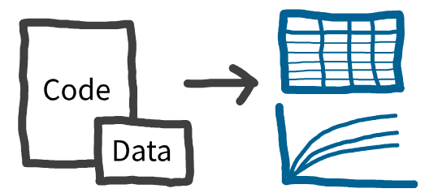
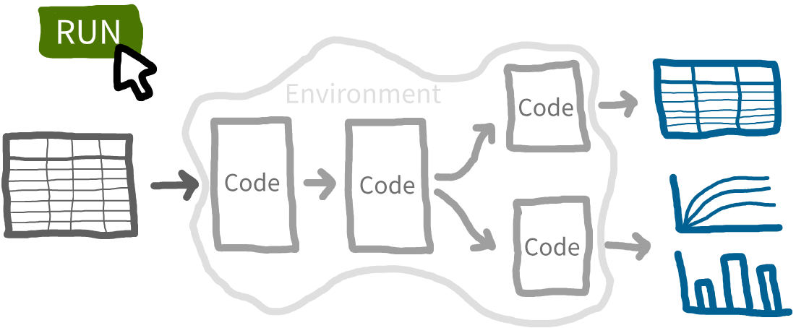

<!-- Hide as no python-content or r-content blocks -->
<style>
      #quarto-announcement {
        display: none !important;
      }
</style>

## Reproducibility

:::{.blue}
**Reproducibility** is the ability to regenerate the published simulation results - such as tables and figures - by running the provided model code and data.
:::



> It's helpful to distinguish reproducibility from related concepts:
>
> * **Reusability** means the model code can be adapted for new simulation projects or different settings (for example, using a hospital model developed for Hospital A to study patient flow in Hospital B).
> * **Replicability** is when independent researchers, using only your published description (not your code), can build their own version of the model and get similar results for the same objectives and case study.

### Why does reproducibility matter?

<div class="h4-tight"></div>

#### Advantages for you (the original author)

* ✅ **Reuse**. Reproducibility makes it much easier for you to revisit and reuse your own code, whether you're updating outputs or conducting new analyses.

> **Example: Peer review.** The mean time from submission to publication in biomedical research ranges from 27 to 639 days ([Andersen et al. 2021](https://doi.org/10.1080/03007995.2021.1905622)) - so it's crucial that your code remains functional and understandable long after it's initial execution.

* ✅ **Quality**. Aiming for reproducibility encourages you to structure code clearly and document your workflow thoroughly. This will help reduce the risk of errors and ambiguities, and improve code quality.

* ✅ **Time**. Even if you retain access to your code, failure to record exact parameters for every scenario or document the computational environment used, for example, could make the code non-reproducible when revisited, even if only a few months later. Troubleshooting non-reproducible code can be **time-consuming** or even **impossible** if required information is lost.

Many of these advantages apply regardless of whether code is shared publicly or remains proprietary.

#### Advantages for others

* ✅ **Trust**. If work is reproducible, it builds trust, as others can independently confirm your results and see that your methods are transparent.

* ✅ **Reuse**. When others are able to reproduce your work, it confirms that the code runs correctly as intended. This enables confident reuse and adaption for new contexts and projects.

## Reproducible analytical pipelines (RAP)

:::{.blue}
**Reproducible analytical pipeline (RAP)** = systematic approach to data analysis and modelling in which every step of the process (end-to-end) is transparent, automated, and repeatable.
:::

Rather than relying on manual processes or undocumented decisions, a RAP ensures that **the entire workflow** - from data ingestion and cleaning, to modelling, and through to analysis (and sometimes also reporting) - is **scripted, documented, and reproducible**.

There should be no (or minimal) manual intervention required to generate the results. The requirements of a RAP are outlined in the [NHS RAP Maturity Framework](/pages/frameworks/levels_of_rap.qmd). 



## Reproducible work v.s. RAPs

You can do reproducible work without building a full RAP - but a RAP takes things further. Reproducible analysis may still involve **manual steps, selective re-running of scripts, or undocumented decisions**. This leaves room for human error and inefficiency, and makes it harder to check and re-run the work.

A RAP is distinct because it automates the entire workflow, **minimising manual intervention** and using **software engineering best practices** like version control, peer review, and modular code. This makes your analysis more **efficient and robust**, and **easier** to re-run and review.

## Focus of this book

This book does both!

* It aims to make your work **reproducible**, drawing on recommendations from [Heather et al. (2025) for reproducible discrete-event simulation (DES)](/pages/frameworks/stars_reproducibility.qmd).
* It also guides you through building a full **RAP**, following the [NHS "Levels of RAP" maturity framework](/pages/frameworks/levels_of_rap.qmd).

## Test yourself

```{r}
#| echo: false
library(webexercises)
```

:::{.callout-note}

## Reproducibility means:

```{r}
#| output: asis
#| echo: false
cat(longmcq(c(
  "Independently rebuilding the model without using the original code.",
  "Adapting code for new projects.",
  answer = "Regenerating results using the original code and data."
)))
```

:::

:::{.callout-note}

## An advantage of making work reproducible is:

```{r}
#| output: asis
#| echo: false
cat(longmcq(c(
  "It removes the need for documentation.",
  "It prevents others from trusting the results.",
  answer = "It makes code easier to revisit and reuse, improves quality, saves
  time, and builds trust."
)))
```

:::

:::{.callout-note}

## A reproducible analytical pipeline (RAP) is:

```{r}
#| output: asis
#| echo: false
cat(longmcq(c(
  "A set of undocumented manual steps.",
  answer = "An automated, scripted and transparent end-to-end workflow.",
  "A tool only for cleaning data."
)))
```

:::

<br><br>
