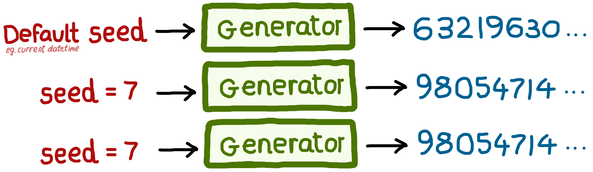



::: {.pale-blue}

🎯 **Objectives**

This page covers:

* **🎲 Randomness:** sampling and pseudorandom number generators.
* **🛠️ Tools for random sampling:**
* **⛓️‍💥 Independent random number streams:**
* **👨‍💻 Adding random sampling to your simulation:**

[🔗](../intro/guidelines.qmd) **Reproducibility guidelines**

This page helps you meet reproducibility criteria from:

* Heather et al. 2025: Control randomness.

:::

::: {.python-content}

```{python}
# Import required packages
import numpy as np
from sim_tools.distributions import Exponential, Normal
```

:::

## 🎲 Randomness

When simulating real-world systems (e.g. patients arriving, prescriptions queueing), using fixed values is unrealistic. Instead, **discrete-event simulations rely on randomness**: they generate event times and outcomes by sampling randomly from probability distributions.


However, computers can't generate "true" randomness. Instead, they use **pseudorandom number generators (PRNGs)**: algorithms which produce a sequence of numbers that apopear random, but are in fact completely determined by an initial starting point called a **seed**. If you use the same seed, you’ll get the same random sequence every time - a crucial feature for reproducibility in research and development.

By default, most software PRNGs initialise the seed based on something that changes rapidly and unpredictably, such as the current system time. This ensures a unique sequence with every fresh run. But for **reproducible experiments**, you should manually set the seed yourself, allowing you and others to exactly recreate simulation results.



## 🛠️ Introducing tools for random sampling

:::::: {.python-content}

<div class="h3-tight"></div>

### NumPy

NumPy is a widely used Python package for generating random numbers. Since NumPy version 1.17, the recommended approach for random sampling is through the new Generator API.

To start, create a **generator object** using `np.random.default_rng()`. This generator is an independent random number source and manages its own random state.
It offers methods for generating random samples from many distributions, such as normal, exponential, and uniform.

For example, to generate 3 samples from an exponential distribution (with a mean of 17):

```{python}
rng = np.random.default_rng()
rng.exponential(scale=17, size=3)
```

To ensure the same results everytime the code runs, initialise with a fixed seed:

::::: {.columns}

:::: {.column width="47.5%"}

```{python}
rng = np.random.default_rng(20)
rng.exponential(scale=17, size=3)
```

::::

:::: {.column width="5%"}
::::

:::: {.column width="47.5%"}

```{python}
rng = np.random.default_rng(20)
rng.exponential(scale=17, size=3)
```

::::

:::::


#### Legacy API (not recommended for new code)

You might encounter older code using NumPy's legacy random number API. This approach sets a **global** seed and samples using functions like `np.random.exponential()`:

```{python}
np.random.seed(20)
np.random.exponential(scale=17, size=3)
```

### sim-tools

The [sim-tools](https://github.com/TomMonks/sim-tools) package (developed by Prof. Tom Monks) provides an object-oriented approach to sampling from a variety of statistical distributions.

`sim-tools` builds on NumPy's random number generator and distributions. This means you get the same reliable, well-tested methods, with a convenient object-oriented interface. The package also includes some additional distribution types and tools for simulation.

To use `sim-tools`, you import the class for the distribution you need, specify parameters, and then use the instance to generate samples. Each object has its own seed and random state.

For example:

```{python}
# Create an Exponential distribution object with mean 6 and seed 3
exp = Exponential(mean=6, random_seed=3)

# Generate 3 random samples
samples = exp.sample(size=3)
print(samples)
```

::::::

:::::: {.r-content}

In R, random sampling is typically done with functions from the `stats` package. To ensure reproducibility, set a global random seed with `set.seed()`. Then use the appropriate function for your desired distribution.

For example, the exponential distribution is sampled with `rexp()` which requires the rate parameter (the inverse of the mean). To generate 3 samples from an exponential distribution with a mean of 6, you would use:

```{r}
set.seed(3)
rexp(n=3L, rate=1L/6L)
```

::::::

## ⛓️‍💥 Independent random number streams

In your simulation, you often have **multiple distinct processes** that involve random sampling (e.g. patients arriving, consultation lengths, routing decisions).

If these processes share the **same random number generator**, changes in one part of your model (like altering the number of samples drawn for arrivals) can unintentionally **affect the random numbers used elsewhere**. This can introduce subtle, hard-to-detect errors, making your simulation **harder to debug and compare across scenarios**.

To demonstrate this problem, we will simulate two queues: arrivals and processing times.

:::: {.python-content}

### Problem: Shared generators

```{python}
rng = np.random.default_rng(1)
arrivals = rng.exponential(scale=3, size=3)
processing = rng.normal(loc=10, scale=2, size=3)

print(f"Arrivals: {arrivals}\nProcessing: {processing}")
```

Change to five arrivals samples:

```{python}
rng = np.random.default_rng(1)
arrivals = rng.exponential(scale=3, size=5)
processing = rng.normal(loc=10, scale=2, size=3)

print(f"Arrivals: {arrivals}\nProcessing: {processing}")
```

::: {.pale-red}

⚠️ Processing samples have changed, despite no changes to their sampling code! This is because they share a generator: drawing more arrival samples moves the random number sequence forward, so the processing draws start from a different place.

:::

### Solution: Independent generators

```{python}
rng_a = np.random.default_rng(1)
rng_p = np.random.default_rng(2)
arrivals = rng_a.exponential(scale=3, size=3)
processing = rng_p.normal(loc=10, scale=2, size=3)

print(f"Arrivals: {arrivals}\nProcessing: {processing}")
```

```{python}
rng_a = np.random.default_rng(1)
rng_p = np.random.default_rng(2)
arrivals = rng_a.exponential(scale=3, size=5)
processing = rng_p.normal(loc=10, scale=2, size=3)

print(f"Arrivals: {arrivals}\nProcessing: {processing}")
```

::: {.pale-green}

✅ Processing samples remain the same.

:::

### sim-tools

The same rule applies for `sim-tools`: use one object per process, each with it's own seed.

```{python}
arrivals_exp = Exponential(mean=3, random_seed=1)
processing_norm = Normal(mean=10, sigma=2, random_seed=2)

arrivals = arrivals_exp.sample(3)
processing = processing_norm.sample(3)

print(f"Arrivals: {arrivals}\nProcessing: {processing}")
```

```{python}
arrivals_exp = Exponential(mean=3, random_seed=1)
processing_norm = Normal(mean=10, sigma=2, random_seed=2)

arrivals = arrivals_exp.sample(5)
processing = processing_norm.sample(3)

print(f"Arrivals: {arrivals}\nProcessing: {processing}")
```

### Which package to use?

We've used `sim-tools` for sampling in the example models in this book. This is because, with `sim-tools`, you're encouraged to use independent random number streams by design, as each distribution gets its own instance of a distribution class, each with its own parameters and random seed.

You can still use NumPy directly if you prefer - you'll just need to remember to deliberately create separate random generators, as it's not "enforced". If you don't explicitly create one per stream, it's easy to accidentally fall back on using a single generator. 

::::

:::: {.r-content}

### Problem

```{r}
set.seed(1)
arrivals <- rexp(n=3L, rate=1L/3L)
processing <- rnorm(n=3L, mean=10L, sd=2L)

print(arrivals)
print(processing)
```

Change to five arrivals samples:

```{r}
set.seed(1)
arrivals <- rexp(n=5L, rate=1L/3L)
processing <- rnorm(n=3L, mean=10L, sd=2L)

print(arrivals)
print(processing)
```

::: {.pale-red}

⚠️ Processing samples have changed, despite no changes to their sampling code! This is because they share a generator: drawing more arrival samples moves the random number sequence forward, so the processing draws start from a different place.

:::

### Solution

This section is adapted from https://pythonhealthdatascience.github.io/stars-treat-simmer/02_model/03_r_sampling.html.

By default, R's stats package uses a single random number stream and does not support managing multiple, independent streams.

The [`simEd`](https://cran.r-project.org/web/packages/simEd/index.html) package, last updated in 2023, provides equivalent functions that allow separate random number streams. The package is described in:

> B. Lawson and L. M. Leemis, “An R package for simulation education,” 2017 Winter Simulation Conference (WSC), Las Vegas, NV, USA, 2017, pp. 4175-4186, doi: 10.1109/WSC.2017.8248124 <https://ieeexplore.ieee.org/document/8248124>.

We did not use `simEd` in this work because it slowed down model execution.

However, as an example of how it works:

ALTERNATIVELY just link to https://pythonhealthdatascience.github.io/stars-treat-simmer/02_model/03_r_sampling.html#using-the-simed-package if don't want to / have issues addin g it to the dependencies

```{r}
```

<!--TODO: for python and r, need to explain, it's not a big deal too, like, its ok-->

::::
