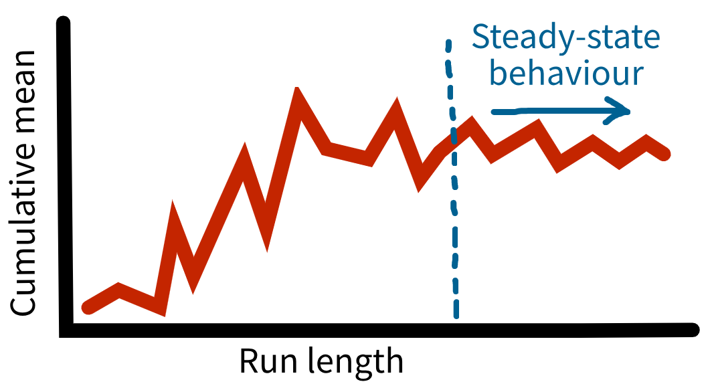



```{python}
#| echo: false
# pylint: disable=undefined-variable,unused-import
```

:::: {.pale-blue}

**Learning objectives:**

* Learn about the time series inspection approach.
* Understand how to implement this approach.

**Pre-reading:**

This page continues on from: [Replications](replications.qmd).

> *Entity generation → Entity processing → Initialisation bias → Performance measures → Replications → Length of warm-up*

**Required packages:**

These should be available from environment setup in the "Test yourself" section of [Environments](../setup/environment.qmd). 

::: {.python-content}

```{python}
import os

from IPython.display import HTML
from itables import to_html_datatable
import numpy as np
import pandas as pd
import plotly.express as px
import plotly.graph_objects as go
import scipy.stats as st
import simpy
from sim_tools.distributions import Exponential
```

```{python}
#| echo: false
# To ensure renders correctly in quarto
import plotly.io as pio  # pylint: disable=ungrouped-imports
pio.renderers.default = "plotly_mimetype"
```

:::

::: {.r-content}

```{r}
#| output: false
library(dplyr)
library(ggplot2)
library(gridExtra)
library(knitr)
library(R6)
library(simmer)
library(tidyr)
```

:::

::: {.python-content}

**Acknowledgements:** Code for choice of warm-up period was adapted from Tom Monks (2024) [HPDM097 - Making a difference with health data](https://github.com/health-data-science-OR/stochastic_systems) (MIT Licence).

:::

::::

## Determining a suitable length of warm-up

A **warm-up period** helps address initialisation bias, which occurs when a simulation begins in an "empty" state that doesn’t reflect how the real system usually operates. In this early phase, performance measures can be unusually high or low because the system hasn't yet settled into typical conditions. Running the model for a warm-up period before collecting results allows it to reach **steady-state behaviour** - a stage where performance measures are stable and represent typical, ongoing behaviour.

Many different methods have been proposed for **determining a suitable length of warm-up** - the simplest is the **time series inspection approach**. This involves **looking at performance measures over time** to identify when the system is exhibiting steady state behaviour *(even though the system will never truly reach a "steady state")*.

We could plot mean results over time, but this would fluctuate too much. Instead, we plot the **cumulative mean** of the performance measures over time. We then look for the point where this **smoothes out and stabilises** - this indicates where your warm-up period should end (@Robinson2007).



When determining your warm-up period, you should:

* Run the model with **multiple replications** (at least five) (@Robinson2007).
* Use a **long run length** (e.g., 5-10 times your planned simulation length).
* Use your **base case parameters** (and, if these changes, re-assess the appropriate warm-up period).

## Implementing the time series inspection approach

<div class="h3-tight"></div>

### Simulation code

The simulation being used is that from the [Replications](replications.qmd) page.

So far, it has intentionally just had a very short duration. However, this is unrealistic of an actual simulation of a healthcare system, and will produce great variability (requiring very long warm-up / large number of replications for stable results).

On this page, we assume that the desired simulation run length is 2 weeks (20,160 minutes) - and so run our time inspection approach for 100,000 minutes.

```{python}
#| echo: false






```

```{r}
#| echo: false
#| file: replications_resources/create_params.R
```

```{r}
#| echo: false
#| file: replications_resources/filter_warmup.R
```

```{r}
#| echo: false
#| file: replications_resources/calc_arrivals.R
```

```{r}
#| echo: false
#| file: replications_resources/calc_mean_wait.R
```

```{r}
#| echo: false
#| file: replications_resources/get_run_results.R
```

```{r}
#| echo: false
#| file: replications_resources/model.R
```

```{r}
#| echo: false
#| file: replications_resources/runner.R
```

### Time series inspection function

::: {.python-content}

We have a new `time_series_inspection` function for this analysis.

```{python}
def time_series_inspection(result, file_path, warm_up=None):
    """
    Time series inspection method for determining length of warm-up.

    Find the cumulative mean results and plot over time (overall and per run).

    Parameters
    ----------
    result : pd.DataFrame
        Patient-level result output by Runner.run_reps().
    file_path : str
        Path to save figure to.
    warm_up : int
        Location on X axis to plot vertical red line indicating chosen warm-up
        period. Defaults to None, which will not plot a line.
    """
    # Sort by run and arrival time
    result = result.sort_values(["run", "arrival_time"])

    # Cumulative mean for each run (replication)
    result["cumulative_mean"] = (
        result
        .groupby("run")["wait_time"]
        .expanding()
        .mean()
        .reset_index(level=0, drop=True)
    )

    # Overall cumulative mean (across all runs)
    result_overall = result.sort_values("arrival_time")
    result_overall["overall_cumulative_mean"] = (
        result_overall["wait_time"].expanding().mean()
    )

    # Plot: all individual runs as light lines, overall as dark line
    fig = go.Figure()

    for run, df_run in result.groupby("run"):
        fig.add_trace(go.Scatter(
            x=df_run["arrival_time"],
            y=df_run["cumulative_mean"],
            mode="lines",
            line={"color": "lightblue", "width": 1},
            opacity=0.7,
            name=f"Run {run}",
            showlegend=False
        ))

    fig.add_trace(go.Scatter(
        x=result_overall["arrival_time"],
        y=result_overall["overall_cumulative_mean"],
        mode="lines",
        line={"color": "darkblue", "width": 3},
        name="Overall"
    ))

    # Optional vertical line for warm-up period (manually as add_vline not
    # showing on the plot for some reason)
    ymin = min(result["cumulative_mean"].min(),
               result_overall["overall_cumulative_mean"].min())
    ymax = max(result["cumulative_mean"].max(),
               result_overall["overall_cumulative_mean"].max())
    if warm_up is not None:
        fig.add_shape(
            type="line",
            x0=warm_up,
            y0=ymin,
            x1=warm_up,
            y1=ymax,
            line={"color": "red", "width": 2, "dash": "dash"},
            xref="x",
            yref="y"
        )
        fig.add_annotation(
            x=warm_up,
            y=ymax,
            text="Suggested warm-up length",
            showarrow=False,
            font={"color": "red"},
            yanchor="top",
            xanchor="left"
        )

    fig.update_layout(
        xaxis_title="Run time (minutes)",
        yaxis_title="Cumulative mean wait_time",
        showlegend=False,
        template="simple_white"
    )

    # Save as static image
    fig.write_image(file_path)

    return fig
```

This function is just plotting one metric, but you could adapt it for a model with multiple metrics.

Mean wait time and time in system will both be in the patient dataframe.

Time-weighted metrics (utilisation, queue length, patients in system) all record a list of timepoints and running record of metric at that time. Hence, these can be used if you just extract the lists of times and metrics from the model.

:::

::: {.r-content}

We have a new `time_series_inspection` function for this analysis, which is explained line-by-line below.

```{r}
#' Time series inspection method for determining length of warm-up.
#'
#' Find the cumulative mean results and plot over time (overall and per run).
#'
#' @param result Named list with `arrivals` containing output from
#' `get_mon_arrivals()` and `resources` containing output from
#' `get_mon_resources()` (`per_resource = TRUE` and `ongoing = TRUE`).
#' @param file_path Path to save figure to.
#' @param warm_up Location on X axis to plot vertical red line indicating the
#' chosen warm-up period. Defaults to NULL, which will not plot a line.
#'
#' @importFrom dplyr rename
#' @importFrom ggplot2 ggplot geom_line aes_string labs theme_minimal
#' @importFrom ggplot2 geom_vline annotate ggsave
#' @importFrom gridExtra marrangeGrob
#'
#' @export

time_series_inspection <- function(result, file_path, warm_up = NULL) {

  # Set up lists
  plot_list <- list()
  metrics <- list()

  # Wait time of each patient at each time point
  metrics[[1L]] <- result[["arrivals"]] |>
    rename(time = serve_start) |> # nolint
    dplyr::select(all_of(c("replication", "time", "wait_time")))

  # Loop through all the dataframes in df_list
  for (i in seq_along(metrics)) {

    # Get name of the metric
    metric <- setdiff(names(metrics[[i]]), c("time", "replication"))

    # Calculate cumulative mean for the current metric
    cumulative <- metrics[[i]] |>
      arrange(.data[["replication"]], .data[["time"]]) |>
      group_by(.data[["replication"]]) |>
      mutate(cumulative_mean = cumsum(.data[[metric]]) /
               seq_along(.data[[metric]])) |>
      ungroup()

    # Repeat calculation, but including all replications in one
    overall_cumulative <- metrics[[i]] |>
      arrange(.data[["time"]]) |>
      mutate(cumulative_mean = cumsum(.data[[metric]]) /
               seq_along(.data[[metric]])) |>
      ungroup()

    # Create plot
    p <- ggplot() +
      geom_line(data = cumulative,
                aes(x = time, y = cumulative_mean, group = replication), # nolint
                color = "lightblue", alpha = 0.8) +
      geom_line(data = overall_cumulative,
                aes(x = time, y = cumulative_mean),
                color = "darkblue") +
      labs(x = "Run time (minutes)", y = paste("Cumulative mean", metric)) +
      theme_minimal()

    # Add line to indicate suggested warm-up length if provided
    if (!is.null(warm_up)) {
      p <- p +
        geom_vline(xintercept = warm_up, linetype = "dashed", color = "red") +
        annotate("text", x = warm_up, y = Inf,
                 label = "Suggested warm-up length",
                 color = "red", hjust = -0.1, vjust = 1L)
    }
    # Store the plot
    plot_list[[i]] <- p
  }

  # Arrange plots in a single column
  combined_plot <- marrangeGrob(plot_list, ncol = 1L, nrow = length(plot_list),
                                top = NULL)

  # Save to file
  ggsave(file_path, combined_plot, width = 8L, height = 4L * length(plot_list))

  # View plot
  combined_plot
}
```

#### Explaining the time series inspection function

```{.r}
#' Time series inspection method for determining length of warm-up.
#'
#' Find the cumulative mean results and plot over time (overall and per run).
#'
#' @param result Named list with `arrivals` containing output from
#' `get_mon_arrivals()` and `resources` containing output from
#' `get_mon_resources()` (`per_resource = TRUE` and `ongoing = TRUE`).
#' @param file_path Path to save figure to.
#' @param warm_up Location on X axis to plot vertical red line indicating the
#' chosen warm-up period. Defaults to NULL, which will not plot a line.
#'
#' @importFrom dplyr rename
#' @importFrom ggplot2 ggplot geom_line aes_string labs theme_minimal
#' @importFrom ggplot2 geom_vline annotate ggsave
#' @importFrom gridExtra marrangeGrob
#'
#' @export

time_series_inspection <- function(result, file_path, warm_up = NULL) {
```

The function has three inputs:

* **result** - the output from `runner()`.
* **file_path** - a path to save the figure to.
* **warm_up** - chosen warm-up period - initially run set to `NULL`, then can amend with decision of warm-up length so this is add to the plot.

<br>

```{.r}
  # Set up lists
  plot_list <- list()
  metrics <- list()

  # Wait time of each patient at each time point
  metrics[[1L]] <- result[["arrivals"]] |>
    rename(time = serve_start) |> # nolint
    dplyr::select(all_of(c("replication", "time", "wait_time")))
```

The function begins by setting up empty lists to store plots and metrics.

It then creates a dataframe for each metric to be inspected. It renames the time column (so consistent between `arrivals`/`resources`/etc.) and then selects the columns `replication`, `time` and the metric (`wait_time` in this example).

Our simple model just has arrivals (which is not applicable) and wait time. However, if you had other metrics like utilisation, you could add those to the `metrics` list at this step.

<br>

```{.r}
  # Loop through all the dataframes in df_list
  for (i in seq_along(metrics)) {

    # Get name of the metric
    metric <- setdiff(names(metrics[[i]]), c("time", "replication"))

    # Calculate cumulative mean for the current metric
    cumulative <- metrics[[i]] |>
      arrange(.data[["replication"]], .data[["time"]]) |>
      group_by(.data[["replication"]]) |>
      mutate(cumulative_mean = cumsum(.data[[metric]]) /
                seq_along(.data[[metric]])) |>
      ungroup()

    # Repeat calculation, but including all replications in one
    overall_cumulative <- metrics[[i]] |>
      arrange(.data[["time"]]) |>
      mutate(cumulative_mean = cumsum(.data[[metric]]) /
                seq_along(.data[[metric]])) |>
      ungroup()
```

Next, the functions loops over the metrics (currently just one) and calculates:

* **Cumulative mean per replication**
* **Overall cumulative mean**

<br>

```{.r}
    # Create plot
    p <- ggplot() +
      geom_line(data = cumulative,
                aes(x = time, y = cumulative_mean, group = replication), # nolint
                color = "lightblue", alpha = 0.8) +
      geom_line(data = overall_cumulative,
                aes(x = time, y = cumulative_mean),
                color = "darkblue") +
      labs(x = "Run time (minutes)", y = paste("Cumulative mean", metric)) +
      theme_minimal()

    # Add line to indicate suggested warm-up length if provided
    if (!is.null(warm_up)) {
      p <- p +
        geom_vline(xintercept = warm_up, linetype = "dashed", color = "red") +
        annotate("text", x = warm_up, y = Inf,
                  label = "Suggested warm-up length",
                  color = "red", hjust = -0.1, vjust = 1L)
    }
    # Store the plot
    plot_list[[i]] <- p
  }
```

This section creates the plot, which overlays the cumulative mean lines per replication (light blue) and the overall cumulative mean (dark blue). If a warm-up period is chosen, a vertical dashed red line and label are added at the chosen time to visually communicate the suggested cutoff.

<br>

```{.r}
  # Arrange plots in a single column
  combined_plot <- marrangeGrob(plot_list, ncol = 1L, nrow = length(plot_list),
                                top = NULL)

  # Save to file
  ggsave(file_path, combined_plot, width = 8L, height = 4L * length(plot_list))

  # View plot
  combined_plot
}
```

The plots are then arranged vertically in a single figure using `marrangeGrob()`, saved to a file using `ggsave()`, and returned by the function.

:::

### Running the approach

If you've already built warm-up logic into your model (as we have done), make sure the **warm-up period is set to 0** for this assessment (`warm_up_period = 0`).

As mention above, we have used multiple replications (`number_of_runs = 5`) and a long run length (`data_collection_period = 100000`).

::: {.python-content}

```{python}
# Run model with base parameters for 5 replications with no warm-up and
# long data collection period, keeping the patient-level results
param = Parameters(warm_up_period=0,
                   data_collection_period=100000,
                   number_of_runs=5)
runner = Runner(param)
results = runner.run_reps()["patient"]

# Provide to time_series_inspection() function
time_series_inspection(
  result=results,
  file_path=os.path.join("length_warmup_resources",
                         "python_length_warmup.png"),
  warm_up=15000
)
```

The selection of a warm-up period is **subjective**. In this example, we have suggested a value of 15,000, but this choice could be changed subject to discussion and evaluation of other metrics.

:::

::: {.r-content}

```{r}
#| warning: false

# Run model with base parameters for 5 replications with no warm-up and
# long data collection period
param <- create_params(warm_up_period = 0L,
                       data_collection_period = 100000L,
                       number_of_runs = 5L)
results <- runner(param = param)

# Provide to time_series_inspection() function
time_series_inspection(
  result = results,
  file_path = file.path("length_warmup_resources", "r_length_warmup.png"),
  warm_up = 15000L
)
```

The selection of a warm-up period is **subjective**. In this example, we have suggested a value of 15,000, but this choice could be changed subject to discussion and evaluation of other metrics.

:::

## Explore the example models

<div class="h3-tight"></div>

### Nurse visit simulation

:::: {.python-content}



::: {.blue-table}
| | |
| - | - |
| **Key files** | `simulation/param.py`<br>`simulation/model.py`<br>`simulation/runner.py`<br>`notebooks/choosing_warmup.ipynb` |
| **What to look for?** | This example currently determines warm-up differently. It uses an audit, so during the simulation run at specified intervals it records the metrics at that time. These are then used to determine warm-up length. |
| **Why it matters?** | There is no one way of doing something! Depending on your set-up, one of the other may be the simplest option. We have included the method on this page and the different one in the example, to illustrate some of the options for this analysis. |
: {tbl-colwidths="[20,80]"}
:::

::::

:::: {.r-content}



::: {.blue-table}
| | |
| - | - |
| **Key files** | `rmarkdown/choosing_warmup.md`<br>`R/choose_warmup.R`<br>`R/get_run_results.R` |
| **What to look for?** | Uses time series inspection approach as above, but has extra metric: utilisation. This requires the `calc_utilisation()` function to accept a `groups` parameter, and to set `summarise` to False. |
: {tbl-colwidths="[20,80]"}
:::

::::

### Stroke pathway simulation

Not relevant - replicating an existing model described in a paper, so just used the length of warmup stated by the authors.

## Test yourself

Try using/adapting the `time_series_inspection()` for your own simulation and identify a suitable length of warm-up.

If you track additional performance metrics like resource utilisation or queue length, extend the function to run with these metrics also.

## References

::: {#refs}
:::

<br><br>