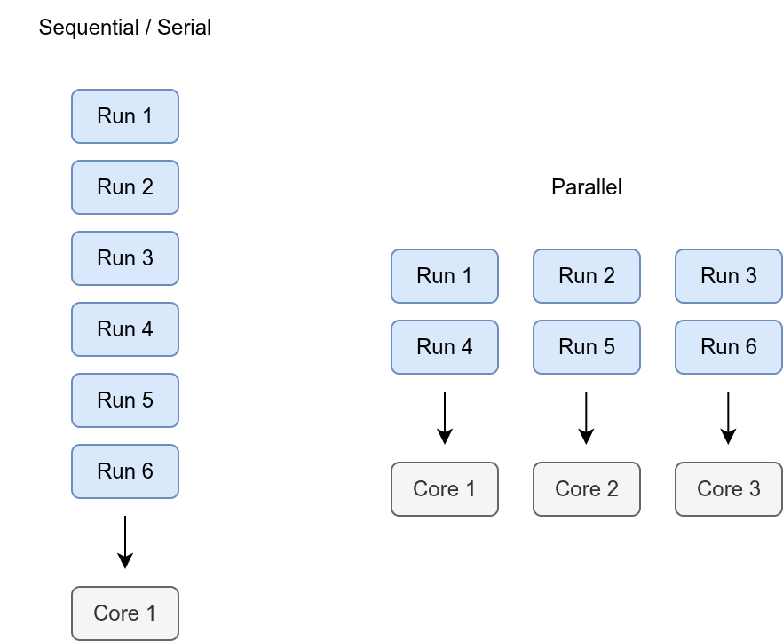



```{python}
#| echo: false
# pylint: disable=unused-import,undefined-variable
```

:::: {.pale-blue}

**Learning objectives:**

* Learn how to implement **parallel processing**.
* Understand how to choose an appropriate **number of cores**.

**Relevant reproducibility guidelines:**

* STARS Reproducibility Recommendations: Optimise model run time.

**Pre-reading:**

This page continues on from: [Number of replications](n_reps.qmd).

> *Entity generation → Entity processing → Initialisation bias → Performance measures → Replications → Length of warm-up → Number of replications → Parallel processing*

**Required packages:**

These should be available from environment setup in the "Test yourself" section of [Environments](../setup/environment.qmd). 

::: {.python-content}

```{python}
import time

from IPython.display import HTML
from itables import to_html_datatable
from joblib import Parallel, delayed, cpu_count
import numpy as np
import pandas as pd
import plotly.express as px
import scipy.stats as st
import simpy
from sim_tools.distributions import Exponential
```

```{python}
#| echo: false
# To ensure renders correctly in quarto
import plotly.io as pio  # pylint: disable=ungrouped-imports
pio.renderers.default = "plotly_mimetype"
```

:::

::: {.r-content}

```{r}
#| output: false
library(data.table)
library(dplyr)
library(future)
library(future.apply)
library(ggplot2)
library(knitr)
library(plotly)
library(simmer)
library(tidyr)
```

:::

::::

<br>

A computer's processor has multiple cores. Each core is like a worker that can do tasks.

Normally, when you run a program, it only uses one core, so only one worker is doing the job. This is referred to as serial or sequential processing.

**Parallel processing** means telling the computer to use more than one core at the same time. With more workers sharing the tasks, the work can be done **faster**.

{fig-align="center" width=75%}

## How to add parallel processing

:::: {.python-content}

On this page, we are making changes to the simulation code from the [Replications](replications.qmd) page - but the `Parameters` class has been updated based on the determined [length of warm-up](length_warmup.qmd), a data collection period of 2 weeks (20,160 minutes), and the determined [number of replications](n_reps.qmd). <!--TODO: check length of warm-up here in python v.s. R v.s. result from warm-up page-->

### Parameter class

A new attribute `cores` is used to record the number of CPU cores to use for parallel execution. If set to `-1`, it will use all available cores. If set to `1`, it will run sequentially.

We have also updated `number_of_runs` based on the [number of replications](n_reps.qmd) page.

```{python}

```

### Patient class

No changes required.

::: {.callout title="▶&nbsp;&nbsp; Patient class" collapse="true" style="minimal"}

```{python}

```

:::

### Monitored resource class

No changes required.

::: {.callout title="▶&nbsp;&nbsp; Monitored resource class" collapse="true" style="minimal"}

```{python}

```

:::

### Model class

No changes required.

::: {.callout title="▶&nbsp;&nbsp;Model class" collapse="true" style="minimal"}

```{python}

```

:::

### Summary statistics function

No changes required.

::: {.callout title="▶&nbsp;&nbsp; Summary statistics" collapse="true" style="minimal"}

```{python}

```

:::

### Runner class

The modified `run_reps()` method now distinguishes between sequential and parallel execution modes using the `cores` attribute from the parameters.

If `cores` is 1, simulations run sequentially.

For parallel execution, the code first checks if the requested number of cores is valid: allowing values of -1 (use all CPUs) or any integer between 1 and the total CPU count minus one. If valid, the code uses `joblib`'s `Parallel` and `delayed` to distribute simulation runs across the specified number of cores

```{python}

```

::::

:::: {.r-content}

<div class="h3-tight"></div>

<!--TODO: add similar statement to python version of page about what model code this is building on-->

### Parameter function

A new attribute `cores` is used to record the number of CPU cores to use for parallel execution. If set to `-1`, it will use all available cores. If set to `1`, it will run sequentially.

```{r}
#' Generate parameter list.
#'
#' @param interarrival_time Numeric. Time between arrivals (minutes).
#' @param consultation_time Numeric. Mean length of doctor's
#'   consultation (minutes).
#' @param number_of_doctors Numeric. Number of doctors.
#' @param warm_up_period Numeric. Duration of the warm-up period (minutes).
#' @param data_collection_period Numeric. Duration of the data collection
#'   period (minutes).
#' @param number_of_runs Numeric. The number of runs (i.e., replications).
#' @param cores Numeric. Number of CPU cores to use for parallel execution.#<<
#' @param verbose Boolean. Whether to print messages as simulation runs.
#'
#' @return A named list of parameters.
#' @export

create_params <- function(
  interarrival_time = 5L,
  consultation_time = 10L,
  number_of_doctors = 3L,
  warm_up_period = 30L,
  data_collection_period = 40L,
  number_of_runs = 5L,
  cores = 1L, #<<
  verbose = FALSE
) {
  list(
    interarrival_time = interarrival_time,
    consultation_time = consultation_time,
    number_of_doctors = number_of_doctors,
    warm_up_period = warm_up_period,
    data_collection_period = data_collection_period,
    number_of_runs = number_of_runs,
    cores = cores, #<<
    verbose = verbose
  )
}
```

### Warm-up function

No changes required.

::: {.callout title="▶&nbsp;&nbsp;Warm-up function" collapse="true" style="minimal"}

```{r}
#| file: replications_resources/filter_warmup.R
```

:::

### Arrivals function

No changes required.

::: {.callout title="▶&nbsp;&nbsp;Arrivals function" collapse="true" style="minimal"}

```{r}
#| file: replications_resources/calc_arrivals.R
```

:::

### Wait time function

No changes required.

::: {.callout title="▶&nbsp;&nbsp;Wait time function" collapse="true" style="minimal"}

```{r}
#| file: replications_resources/calc_mean_wait.R
```

:::

### Run results function

No changes required.

::: {.callout title="▶&nbsp;&nbsp;Run results function" collapse="true" style="minimal"}

```{r}
#| file: replications_resources/get_run_results.R
```

:::

### Model function

A new option (`set_seed`) controls whether to set a random seed based on the `run_number`. This is not optional as, for parallel reproducibility, we wil need to handle seed management using the runner rather than within `model()` itself.

```{r}
#' Run simulation.
#'
#' @param param List. Model parameters.
#' @param run_number Numeric. Run number for random seed generation.
#' @param set_seed Boolean. Whether to set seed within the model function.#<<
#'
#' @importFrom dplyr left_join mutate
#' @importFrom rlang .data
#' @importFrom simmer add_generator add_resource get_mon_arrivals
#' @importFrom simmer get_mon_resources now release run seize set_attribute
#' @importFrom simmer simmer timeout trajectory
#' @importFrom tidyr pivot_wider
#'
#' @return Named list with tables `arrivals`, `resources` and `run_results`.
#' @export

model <- function(param, run_number, set_seed = TRUE) {#<<

  # Set random seed based on run number
  if (set_seed) {#<<
    set.seed(run_number)
  }#<<

  # Create simmer environment
  env <- simmer("simulation", verbose = param[["verbose"]])

  # Define the patient trajectory
  patient <- trajectory("consultation") |>
    seize("doctor", 1L) |>
    # Record time resource is obtained
    set_attribute("doctor_serve_start", function() now(env)) |>
    timeout(function() {
      rexp(n = 1L, rate = 1L / param[["consultation_time"]])
    }) |>
    release("doctor", 1L)

  env <- env |>
    # Add doctor resource
    add_resource("doctor", param[["number_of_doctors"]]) |>
    # Add patient generator (mon=2 so can get manual attributes)
    add_generator("patient", patient, function() {
      rexp(n = 1L, rate = 1L / param[["interarrival_time"]])
    }, mon = 2L) |>
    # Run the simulation
    simmer::run(until = (param[["warm_up_period"]] +
                           param[["data_collection_period"]]))

  # Extract information on arrivals and resources from simmer environment
  result <- list(
    arrivals = get_mon_arrivals(env, per_resource = TRUE, ongoing = TRUE),
    resources = get_mon_resources(env)
  )

  # Get the extra arrivals attributes
  extra_attributes <- get_mon_attributes(env) |>
    dplyr::select("name", "key", "value") |>
    # Add column with resource name, and remove that from key
    mutate(resource = gsub("_.+", "", .data[["key"]]),
           key = gsub("^[^_]+_", "", .data[["key"]])) |>
    pivot_wider(names_from = "key", values_from = "value")

  # Merge extra attributes with the arrival data
  result[["arrivals"]] <- left_join(
    result[["arrivals"]], extra_attributes, by = c("name", "resource")
  )

  # Filter to remove results from the warm-up period
  result <- filter_warmup(result, param[["warm_up_period"]])

  # Replace "replication" value with appropriate run number
  result[["arrivals"]] <- mutate(result[["arrivals"]],
                                 replication = run_number)
  result[["resources"]] <- mutate(result[["resources"]],
                                  replication = run_number)

  # Calculate wait time for each patient
  result[["arrivals"]] <- result[["arrivals"]] |>
    mutate(wait_time = .data[["serve_start"]] - .data[["start_time"]])

  # Calculate the average results for that run
  result[["run_results"]] <- get_run_results(result, run_number)

  result
}
```

### Runner function

The modified `runner` function now distinguishes between sequential and parallel execution modes using the `cores` attribute from parameters.

When working with `future`, it is recommended to set `future.seed = seed`. This creates independent random number streams for each worker and guarantees reproducible results across different platforms and cluster sizes.

We have provided the option of using the run number as a seed. This matches the logic in `model()`, allowing for direct comparison and debugging. However, this method does not comply with parallel RNG standards and can lead to correlated or overlapping streams, loss of reproducibility, or statistical artifacts if worker assignment or hardware changes. As stated in the [future documentation](https://www.rdocumentation.org/packages/future/versions/1.6.1/topics/future_lapply): "*Note that `as.list(seq_along(x))` is not a valid set of such `.Random.seed` values.*"

For most cases, use the `runner` and set `number_of_runs = 1` for single runs. Always use future-based seeding, regardless of whether executing sequentially or in parallel, for reliable results.

```{r}
#' Run simulation for multiple replications.
#'
#' @param param Named list of model parameters.
#' @param use_future_seeding Logical. If TRUE, uses the recommended future
#' seeding (`future.seed = seed`), though results will not match `model()`.
#' If FALSE, seeds each run with its run number (like `model()`), though this
#' is discourage by future_lapply documentation.
#'
#' @importFrom future plan multisession sequential
#' @importFrom future.apply future_lapply
#' @importFrom dplyr bind_rows
#'
#' @return List with three tables: arrivals, resources and run_results.
#' @export

runner <- function(param, use_future_seeding = TRUE) {#<<
  # Determine the parallel execution plan#<<
  if (param[["cores"]] == 1L) {#<<
    plan(sequential)  # Sequential execution#<<
  } else {#<<
    if (param[["cores"]] == -1L) {#<<
      cores <- future::availableCores() - 1L#<<
    } else {#<<
      cores <- param[["cores"]]#<<
    }#<<
    plan(multisession, workers = cores)  # Parallel execution#<<
  }#<<

  # Set seed for future.seed#<<
  if (isTRUE(use_future_seeding)) {#<<
    # Recommended option. Base seed used when making others by future.seed#<<
    custom_seed <- 123456L#<<
  } else {#<<
    # Not recommended (but will allow match to model())#<<
    # Generates list of pre-generated seeds set to the run numbers (+ offset)#<<
    create_seeds <- function(seed) {#<<
      set.seed(seed)#<<
      .Random.seed#<<
    }#<<
    custom_seed <- lapply(#<<
      1L:param[["number_of_runs"]] + param[["seed_offset"]], #<<
      create_seeds#<<
    )#<<
  }#<<

  # Run simulations (sequentially or in parallel)#<<
  # Mark set_seed as FALSE as we handle this using future.seed(), rather than#<<
  # within the function, and we don't want to override future.seed#<<
  results <- future_lapply(#<<
    1L:param[["number_of_runs"]], #<<
    function(i) {#<<
      model(run_number = i, #<<
            param = param, #<<
            set_seed = FALSE)#<<
    }, #<<
    future.seed = custom_seed#<<
  )#<<

  # If only one replication, return without changes
  if (param[["number_of_runs"]] == 1L) {
    return(results[[1L]])
  }

  # Combine results from all replications into unified tables
  all_arrivals <- do.call(
    rbind, lapply(results, function(x) x[["arrivals"]])
  )
  all_resources <- do.call(
    rbind, lapply(results, function(x) x[["resources"]])
  )

  # run_results may have missing data - use bind_rows to fill NAs automatically
  all_run_results <- dplyr::bind_rows(
    lapply(results, function(x) x[["run_results"]])
  )

  # Return a list containing the combined tables
  return(
    list(
      arrivals = all_arrivals,
      resources = all_resources,
      run_results = all_run_results
    )
  )
}
```

::::

## Choosing an appropriate number of cores

If choosing to run your simulation in parallel, the **maximum number of cores may not be the most efficient**.

This is due to **overhead** in managing processes, passing data between them, and setting up the execution environment.

To determine how many to choose, try running your model with a varying number of cores and record how long each took. For example:

::: {.python-content}

<!--We don't actually run to avoid issues with parallel / quarto / github pages / etc. The results shown are copied from those found when run locally.-->

```{.python}
speed = []

# Run for 1 to 4 cores
for i in range(1, 5):
    # Start timer and run replications
    start_time = time.time()
    experiment = Runner(param = Parameters(cores=i))
    experiment.run_reps()
    # Find run time
    run_time = time.time() - start_time
    speed.append({"cores": i, "run_time": run_time})

# Convert times to dataframe
timing_results = pd.DataFrame(speed)
HTML(to_html_datatable((timing_results)))
```

```{python}
#| echo: false
timing_results = pd.DataFrame({
    "cores": [1, 2, 3, 4],
    "run_time": [0.005306, 0.953398, 0.975153, 1.022335]
})
HTML(to_html_datatable((timing_results)))
```

```{python}
# Plot time by number of cores
fig = px.line(timing_results, x="cores", y="run_time")
fig.update_layout(
    xaxis={"dtick": 1},
    xaxis_title="Number of cores",
    yaxis_title="Run time",
    template="plotly_white"
)
```

:::

::: {.r-content}

<!--We don't actually run to avoid issues with parallel / quarto / github pages / etc. The results shown are copied from those found when run locally.-->

```{.r}
speed <- list()

# Run for 1 to 4 cores
for (i in 1L:4L){
  # Start timer and run replications
  start_time = Sys.time()
  runner(param = create_params(cores = i))
  # Find run time
  run_time = Sys.time() - start_time
  speed[[i]] <- list(cores = i, run_time = run_time)
}

# Convert to dataframe
speed_df = rbindlist(speed)
kable(speed_df)
```

```{r}
#| echo: false
speed_df <- data.frame(
  cores = 1L:4L,
  run_time = c(0.3739345, 1.3090684, 1.5790362, 1.8546638)
)
kable(speed_df)
```

```{r}
p <- ggplot(speed_df, aes(x = .data[["cores"]], y = .data[["run_time"]])) +
  geom_line() +
  labs(x = "Cores", y = "Run time") +
  theme_minimal()
ggplotly(p)
```

:::

With this example, the **sequential (single-core) run is actually faster** than the parallel versions. This happens because the overhead of creating and coordinating multiple processes outweighs the benefits for such a small simulation.

For larger-scale simulations, parallelisation will often bring performance improvements, but it is always worth running a quick benchmark to determine the most efficient number of cores for your case.

## Explore the example models

<div class="h3-tight"></div>

### Nurse visit simulation

:::: {.python-content}



::: {.blue-table}
| | |
| - | - |
| **Key files** | `simulation/param.py`<br>`simulation/runner.py`<br>`notebooks/choosing_cores.ipynb` |
| **What to look for?** | The repository currently uses parallel processing, with the default set to use the maximum number of available cores (`-1`). |
| **Why it matters?** | Although this model runs quickly for small examples, performance can vary when running many replications or larger experiments. For lightweight analyses, the difference may not exceed a minute, but for heavier workloads, choosing an appropriate number of cores can make a significant impact on overall efficiency. |
: {tbl-colwidths="[20,80]"}
:::

::::

:::: {.r-content}



::: {.blue-table}
| | |
| - | - |
| **Key files** | `R/parameters.R`<br>`R/model.R`<br>`R/runner.R`<br>`rmarkdown/choosing_cores.Rmd` |
| **What to look for?** | The repository is set up to allow parallel processing, but currently defaults to running sequentially (`cores = 1`). |
| **Why it matters?** | Although this model runs quickly for small examples, performance can vary when running many replications or larger experiments. For lightweight analyses, the difference may not exceed a minute, but for heavier workloads, choosing an appropriate number of cores can make a significant impact on overall efficiency. |
: {tbl-colwidths="[20,80]"}
:::

::::

### Stroke pathway simulation

:::: {.python-content}



::: {.blue-table}
| | |
| - | - |
| **Key files** | `simulation/parameters.py`<br>`simulation/runner.py` |
| **What to look for?** | The repository is set up to allow parallel processing, but currently defaults to running sequentially (`cores=1`). |
| **Why it matters?** | For this example the model is quick to run, so leaving it sequential keeps things simpler. |
: {tbl-colwidths="[20,80]"}
:::

::::

:::: {.r-content}



::: {.blue-table}
| | |
| - | - |
| **Key files** | `R/parameters.R`<br>`R/model.R`<br>`R/runner.R` |
| **What to look for?** | The repository is set up to allow parallel processing, but currently defaults to running sequentially (`cores = 1`). |
| **Why it matters?** | For this example the model is quick to run, so leaving it sequential keeps things simpler. |
: {tbl-colwidths="[20,80]"}
:::

::::

## Test yourself

Try adapting the model to use parallel processing and experiment with different numbers of cores:

* Edit the parameters and model set up so parallelism is enabled.

* Run the model using different values for the number of cores.

* Record and plot the run times for each configuration to see how performance changes, and note whether there were any benefits to running in parallel.

* When you increase the number of replications or the overall run time, do you notice greater benefits from parallel execution?

<br><br>
