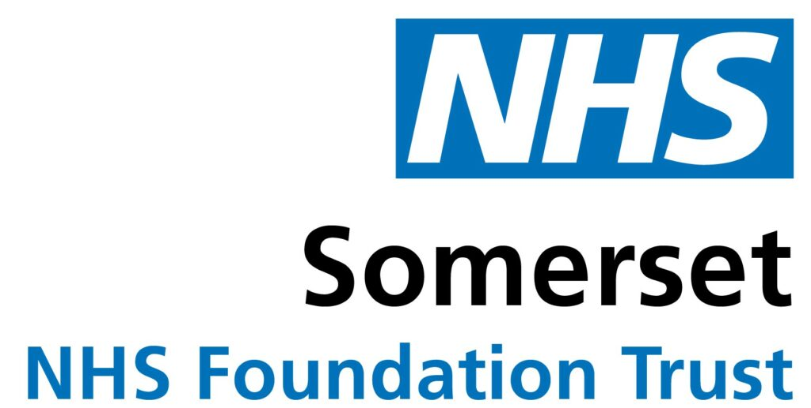

<!-- Hide as no python-content or r-content blocks -->

::: {.pale-blue}

🎯 **Objectives**

This page introducts the STARS project, its context, and activities.

* **⭐ STARS:** Overview of project aims.
* **🔁 Reproducible, ➡️ Reusable, and 📋 Replicable:** Describes project activities, as centered around three important qualitites for simulation models.
* **👥 Project team and support:** Team members, affiliations and funding.

:::

## ⭐ STARS

This website is a research output from the project **STARS: Sharing Tools and Artefacts for Reproducible Simulations in healthcare**.

The project tackles the challenges of sharing, reusing, and reproducing discrete event simulation (DES) models in healthcare. Our goal is to create open resources using the two most popular open-source languages for DES: Python and R.

We have been developing tutorials, code examples, and tools to help researchers and practitioners develop, validate, and share DES models more effectively.

The work has been centred around three important qualities for shared models - that they can be:

* **Reproducible** - running code regenerates the published results - which verifies code is working as expected and increases trust.
* **Reusable** - code can be adapted and used in new contexts - which saves time and increases impact.
* **Replicable** - new code based on described methods produces consistent results - which gives confidence in results, their validity and reliability.

## 🔁 Reproducible

We attempted to reproduce the outputs from eight Python and R DES models. From this experience, we developed a set of recommendations to support both model reproduction and effective troubleshooting when reproducing published simulation studies. This work is described in:

> Heather, A., Monks, T., Harper, A., Mustafee, N., & Mayne, A. (2025). **On the reproducibility of discrete-event simulation studies in health research: an empirical study using open models**. arxiv. <https://doi.org/10.48550/arXiv.2501.13137>.

Building on this work, we created this website and book to demonstrate practical approaches for making DES models reproducible in Python (SimPy) and R (simmer). All examples follow our reproducibility recommendations and are organised as reproducible analytical pipelines. Complete implementations of an M/M/s queueing model and an applied stroke simulation model are also provided.

> Heather, A., Monks, T., Mustafee, N., & Harper, A. (2025). **DES RAP Book: Reproducible Discrete-Event Simulation in Python and R**. <https://github.com/pythonhealthdatascience/des_rap_book>.
>
> * Python examples: [M/M/s](https://github.com/pythonhealthdatascience/pydesrap_mms) and [stroke](https://github.com/pythonhealthdatascience/pydesrap_stroke).
> * R examples: [M/M/s](https://github.com/pythonhealthdatascience/rdesrap_mms) and [stroke](https://github.com/pythonhealthdatascience/rdesrap_stroke).

## ➡️ Reusable

We conducted a systematic review of sharing practices for healthcare DES models (any language or software). This review identified common barriers to model reuse, and identified a need for better frameworks and tools to support reusable simulation models.

> Monks, T., & Harper, A. (2023). **Computer model and code sharing practices in healthcare discrete-event simulation: a systematic scoping review**. Journal of Simulation, 19(1), 108–123. <https://doi.org/10.1080/17477778.2023.2260772>.

Following this review, we developed the STARS framework, which provides essential and optional guidance to help make shared models more reusable. Details and three Python examples are in:

> Monks, T., Harper, A., & Mustafee, N. (2024). **Towards sharing tools and artefacts for reusable simulations in healthcare**. Journal of Simulation, 1–20. <https://doi.org/10.1080/17477778.2024.2347882>.
>
> * Python examples: [1](), [2](), and [3]().
> * We have since created examples in R too: [1](), [2](), and [3]()

We have also applied the STARS framework to an oncology cost-effectiveness model developed by PenTAG and collaborates for the NICE Pathways Pilot appraisal.

> Lee, D., Muthukumar, M., Lovell, A., Farmer, C., Burns, D., Matthews, J., Coelho, H., O'Toole, B., Trigg, L., Snowsill, T., Barnish, M., Nikoglou, T., Brand, A., Ahmad, Z., Abdelsabour, A., Robinson, S., Heather, A., Wilson, E., & Melendez-Torres, G. J. (2024). **Exeter Oncology Model: RCC edition**. <https://github.com/pythonhealthdatascience/stars-eom-rcc>. <https://doi.org/10.5281/zenodo.13969124>.

## 📋 Replicable

Whilst previously working at the University of Southampton, Tom was involved in developing the Strengthening The Reporting of Empirical Simulation Studies (STRESS) guidelines. They are a 20-item checklist (with guidelines for discrete-event simulation, agent-based simulation, and system dynamics) which outline the details authors should include about their model in their reports/publications.

> Monks, T., Currie, C. S. M., Onggo, B. S., Robinson, S., Kunc, M., & Taylor, S. J. E. (2018). **Strengthening the reporting of empirical simulation studies: Introducing the STRESS guidelines**. Journal of Simulation, 13(1), 55–67. <https://doi.org/10.1080/17477778.2018.1442155>.

A review and update of the STRESS guidelines is currently underway.

## 👥 Project team and support

The project team is affiliated with the University of Exeter Medical School, University of Exeter Business School, and the Somerset NHS Foundation Trust.

:::: {.columns}

::: {.column width='50%'}

{width=90% fig-align="center"}

:::

::: {.column width='50%'}

{width=80% fig-align="center"}

:::

::::

The STARS project is supported by the Medical Research Council [grant number MR/Z503915/1].

 

Project team members:

::::: {.columns}

:::: {.column width='32%'}

::: {.callout}

{height=150 fig-align="center"}

**Dr. Thomas Monks**

Principal Investigator.

Associate Professor of Health Data Science at University of Exeter Medical School.

ORCID: [0000-0003-2631-4481](http://orcid.org/0000-0003-2631-4481)

:::

::::

:::: {.column width='2%'}

::::

:::: {.column width='32%'}

::: {.callout}

{height=150 fig-align="center"}

**Dr. Alison Harper**

Co-Investigator.

Lecturer in Business Analytics at the University of Exeter Business School.

ORCID: [0000-0001-5274-5037](https://orcid.org/0000-0001-5274-5037)

:::

::::

:::: {.column width='2%'}

::::

:::: {.column width='32%'}

::: {.callout}

{height=150 fig-align="center"}

**Navonil Mustafee**

Co-Investigator.

Professor of Analytics and Operations Management at the University of Exeter Business School.

ORCID: [0000-0002-2204-8924](https://orcid.org/0000-0002-2204-8924)

:::

::::

:::::

::::: {.columns}

:::: {.column width='32%'}

::: {.callout}

{height=150 fig-align="center"}

**Andy Mayne**

Co-Investigator.

Chief Scientist - Data, Operational Research & Artificial Intelligence, at Somerset NHS Foundation Trust.

ORCID: [0000-0003-1263-2286](http://orcid.org/0000-0003-1263-2286)

:::

::::

:::: {.column width='2%'}

::::

:::: {.column width='32%'}

::: {.callout}

{height=150 fig-align="center"}

**Amy Heather**

Researcher.

Postdoctoral Research Associate at the University of Exeter Medical School.

ORCID: [0000-0002-6596-3479](https://orcid.org/0000-0002-6596-3479)

:::

::::

:::::

  
