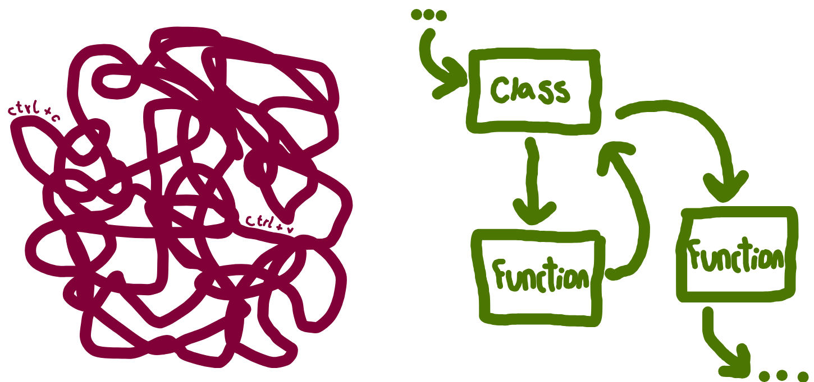



:::: {.pale-blue}

**Learning objectives:**

* Understand why **reusing code** through functions and classes improves modularity and maintainability.
* Learn **how to write functions and classes**.
* Recognise how functions and classes fit into different **programming paradigms**.

**Relevant reproducibility guidelines:**

* STARS Reproducibility Recommendations: Minimise code duplication.
* NHS Levels of RAP (🥈): Reusable functions and/or classes are used where appropriate.

::::

:::: {.very-pale-blue}

**Required packages:**

These should be available from environment setup in the "Test yourself" section of [Environments](../setup/environment.qmd).

::: {.python-content}

```{python}
import numpy as np
import pandas as pd
```

:::

::: {.r-content}

```{r}
library(R6)
```

:::

::::

## Reusing code

It might seem convenient to write all your code in a **single script** and simply **copy-and-paste** sections when you need to reuse code. However, this approach quickly becomes unmanageable as your project grows.

The main tools you can use to **organise** your code are **functions** and **classes**. These allow you to break your code into **modular** components, each focused on a specific task. Modular code is easier to manage, test, and reuse - and these functions or classes can then be stored in **separate files**.

Using functions and classes has has several benefits:

* **Easier to read and collaborate on**. Code is clearer and easier to understand for you and others.
* **Simpler to maintain with fewer errors**. Complex processes are broken into manageable parts. This makes them easier to update, test, and debug.
* **No duplication**. Writing reusable code (like functions and classes) means changes only need to be made in one place, such as when you are updating or fixing a bug. In contrast, duplicated code requires updates everywhere it appears, and you may miss some.



## Functions

Functions group code into reusable blocks that perform a specific task. You define inputs (parameters), a sequence of steps (the function body), and outputs (return values).

Functions are ideal when you want to reuse actions to perform an operation or calculation.

Here, estimation of wait time based on the queue length and average service time:

::: {.python-content}

```{python}
def estimate_wait_time(queue_length, avg_service_time):
    """
    Estimate the total wait time in a queue.

    Parameters
    ----------
    queue_length : int
        Number of people currently ahead in the queue.
    avg_service_time : float
        Average service time per person.

    Returns
    -------
    float
        Estimated total wait time.
    """
    return queue_length * avg_service_time


# There are 4 patients ahead, average service time is 15 minutes
print(estimate_wait_time(queue_length=4, avg_service_time=15))
```
:::

::: {.r-content}

```{r}
#' Estimate the total wait time in a queue.
#'
#' @param queue_length Numeric. Number of people currently ahead in the queue.
#' @param avg_service_time Numeric. Average service time per person.
#'
#' @return Estimated total wait time.
#' @export

estimate_wait_time <- function(queue_length, avg_service_time) {
  queue_length * avg_service_time
}

# There are 4 patients ahead, average service time is 15 minutes
print(estimate_wait_time(queue_length = 4L, avg_service_time = 15L))
```

:::

## Classes

Classes bundle together data ("**attributes**") and behaviour ("**methods**"). They become useful when you:

* **Need to keep track of state**. This means you want to remember information about an object over time. For example, if you have a `Patient` class, each patient object can keep track of its patient ID, patient type, etc. You can update or check these attributes whenever you want.
* **Have several related functions that operate on the same kind of data**. Instead of writing separate functions that all work on the same data, you can put these inside a class as methods. This keeps your code organised and easier to use.

You first initialise the class with a special method called `__init__`. This methods runs when you create an object from the class. You pass parameters to it to set-up the initial attributes for that object.

You then have methods, which are like mini functions inside the class. They can access and change the class attributes, and can also accept additional inputs.

You create an instance of the class (called an "object") to use it. Each attribute has its own copy of the attributes and can use the methods to work with its own data.

::: {.python-content}

Example:

```{python}
class Patient:
    """
    Represents a patient in a healthcare system queue.

    Attributes
    ----------
    patient_id : int
        Unique identifier for the patient.
    arrival_time : float
        Recorded arrival time for the patient.
    status : str
        Current status of the patient.
    """
    def __init__(self, patient_id, arrival_time):
        """
        Initialise a new Patient instance.

        Parameters
        ----------
        patient_id : int
            Unique identifier for the patient.
        arrival_time : float
            Recorded arrival time for the patient.
        """
        self.patient_id = patient_id
        self.arrival_time = arrival_time
        self.status = "waiting"

    def admit(self):
        """
        Mark the patient as admitted.
        """
        self.status = "admitted"

    def discharge(self):
        """
        Mark the patient as discharged.
        """
        self.status = "discharged"


alice = Patient(patient_id=1, arrival_time=3)
print(alice.status)
```

```{python}
alice.admit()
print(alice.status)
```

<br>

**Are you new to classes?** Checkout this video from [2MinutesPy](https://www.youtube.com/@2MinutesPy) on YouTube for a more detailed explanation:



:::

::: {.r-content}
Classes are less common in R than functions, but they are used sometimes for complex or structure tasks. R supports multiple classes systems:

* **S3** - the most informal (few rules and very little enforced structure), used widely in base R.
* **S4** - stricter (has rules and have to formally declare class and properties) and used in some packages like `Bioconductor`.
* **R6** - a newer system that allows reference-style classes (edits modify the object "in place", unlike most R objects which use a "copy-on-modify" approach where edits create new copies) and works more like Python classes.

The example below uses **R6**, since this style is closest to how Python handles classes, making it easier to draw parallels between the two languages.

```{r}
#' @title Patient class
#'
#' Represents a patient in a healthcare system queue.
#'
#' @field patient_id Numeric. Unique identifier for the patient.
#' @field arrival_time Numeric. Recorded arrival time for the patient.
#' @field status Character. Current status of the patient.

Patient <- R6Class("Patient",  # nolint: object_name_linter
  public = list(
    patient_id = NULL,
    arrival_time = NULL,
    status = NULL,

    initialize = function(patient_id, arrival_time) {
      self$patient_id <- patient_id
      self$arrival_time <- arrival_time
      self$status <- "waiting"
    },

    #' @description
    #' Mark the patient as admitted.
    admit = function() {
      self$status <- "admitted"
    },

    #' @description
    #' Mark the patient as discharged.
    discharge = function() {
      self$status <- "discharged"
    }
  )
)


alice <- Patient$new(patient_id = 1L, arrival_time = 3L)
print(alice$status)
```

```{r}
alice$admit()
print(alice$status)
```

<br>

**Are you new to R6 classes?** Checkout this introduction from Winston Chang in a video from [Posit PBC](https://www.youtube.com/@PositPBC) on YouTube (starts at 5.07):



:::

### Subclasses and inheritance

A **subclass** (or "child class") is a class that inherits from another class (the "parent" or "superclass"). Subclasses can **reuse or extend** the behaviour of their parent.

Here, an emergency patient with an extra attribute (`severity`) and method (`triage()`).

::: {.python-content}

```{python}
class EmergencyPatient(Patient):
    """
    Represents an emergency patient with severity-based triage.

    Inherits from `Patient` and adds severity information to determine
    treatment priority.

    Attributes
    ----------
    patient_id : int
        Unique identifier for the patient.
    arrival_time : float
        Recorded arrival time of the patient.
    status : str
        Current status of the patient, inherited from `Patient`.
    severity : int
        Severity score of the patient.
    """
    def __init__(self, patient_id, arrival_time, severity):
        """
        Initialise a new EmergencyPatient instance.

        Parameters
        ----------
        patient_id : int
            Unique identifier for the patient.
        arrival_time : float
            Recorded arrival time of the patient.
        severity : int
            Severity score of the patient.
        """
        super().__init__(patient_id, arrival_time)
        self.severity = severity

    def triage(self):
        """
        Determine treatment priority based on severity level.
        """
        if self.severity > 7:
            return "High priority"
        return "Standard priority"


ben = EmergencyPatient(patient_id=2, arrival_time=5, severity=9)
print(ben.status)
```

```{python}
print(ben.triage())
```

<br>

**Are you new to inheritance?** Checkout this video from [Bro Code](https://www.youtube.com/@BroCodez) on YouTube for a more detailed explanation:



:::

::: {.r-content}

```{r}
#' @title Emergency patient class
#'
#' Represents an emergency patient with severity-based triage. Inherits from
#' `Patient` and adds severity information to determine treatment priority.
#'
#' @field patient_id Numeric. Unique identifier for the patient.
#' @field arrival_time Numeric. Recorded arrival time for the patient.
#' @field status Character. Current status of the patient.
#' @field severity Numeric. Severity score of the patient.

EmergencyPatient <- R6Class("EmergencyPatient",  # nolint: object_name_linter
  inherit = Patient,
  public = list(
    severity = NULL,

    initialize = function(patient_id, arrival_time, severity) {
      super$initialize(patient_id, arrival_time)
      self$severity <- severity
    },

    #' @description
    #' Determine treatment priority based on severity level.
    triage = function() {
      if (self$severity > 7L) {
        "High priority"
      } else {
        "Standard priority"
      }
    }
  )
)


ben <- EmergencyPatient$new(patient_id = 2L, arrival_time = 5L, severity = 9L)
print(ben$status)
print(ben$triage())
```

<br>

**Are you new to inheritance?** Checkout this video from [DataCamp](https://www.youtube.com/@DataCamp) on YouTube for a more detailed explanation:



:::

## Programming paradigms

Now that you've seen how functions and classes help structure your code, we can step back and look at what broader **programming paradigms** these patterns reflect.

A **programming paradigm** is a general style or approach to organising and structuring code. The most common paradigms in Python and R are:

* Using functions - **procedural** or **functional** programming.
* Using classes - **object-oriented** programming (OOP).

:::{.callout-note collapse="true"}

## Click here to find out more about programming paradigms...

This table provides a brief overview of the programming paradigms.

| Paradigm | Main object used | Key characteristics |
| - | - | --- |
| **Procedural programming** | Functions | •  Code runs **step-by-step** using functions, often passing data between them<br>• Data structures (like lists) are usually **mutable** (i.e. they can be changed directly).<br>• Use **loops** like `for` and `while` to repeat actions. |
| **Functional programming** | Functions | • Uses **pure functions**, which always return the same output for same input, and do not alter anything outside themselves (only effect is to return value/s).<br>• Functions are values - they can be saved in variables, passed to other functions, or returned just like other data types.<br>• Data structures are **immutable**, meaning they can't be changed directly - instead, a new version is created when a change is needed.<br>• Often replaces loops with **recursion** (a function calling itself) and **higher-order functions** (like Python's `map` or R's `sapply`).<br>•These features tend to make code more predictable, easier to debug, and more maintainable than procedural approaches. |
| **Object-oriented programming (OOP)** | Classes/Objects | • Organises code using **objects** - instances of classes that combine data (attributes) and behaviour (methods).<br>• Supports **encapsulation** - combining related data and functions, and hiding internal details when needed.<br>• Enables **inheritance**, where one class can build on another.<br>• Supports **polymorphism**, allowing different objects to respond differently to the same operation depending on their type. |

If you want to find out more, check out the following:

* ["Introduction to Programming Paradigms"](https://www.datacamp.com/blog/introduction-to-programming-paradigms) by Samuel Shaibu (Datacamp, 2024).
* ["OOP vs Functional vs Procedural"](https://www.scaler.com/topics/java/oop-vs-functional-vs-procedural/) (Scaler Topics, 2022).

:::

Normally, a mix of programming paradigms will be used.

In this book, you'll see both **functions and classes** used, depending on what made sense for the task. Generally, we've used **more classes in Python** and **more functions in R** - as is typical, since R code often relies less on classes - but neither approach is exclusive, and often either could have been used. The choice is mostly a matter of language style, clarity, and what fits best for the problem at hand.

## Test yourself

**Task:** Refactor the script into a function or class and put it on GitHub.

**Steps:**

::: {.python-content}
* Copy the script into a version controlled folder (e.g. `des-rap-python/` created on the [Version control](../setup/version.qmd) page) and push to GitHub.

  * This will mean you can easily compare your refactored version against the old version!
:::
::: {.r-content}
* **Copy the script into a version controlled folder** (e.g. `des-rap-r/` created on the [Version control](../setup/version.qmd) page) and push to GitHub.

  * This will mean you can easily compare your refactored version against the old version!
:::

* **Turn the code into either**:

  * A **function** e.g. `simulate_queue(arrivals, service_times)` that returns the results table.

  * A **class** e.g. a `Patient` class and/or a `Clinic` class that runs the simulation.


* **Push the new version** of the script to GitHub.

::: {.python-content}

```{python}
# Set seed for reproducibility
np.random.seed(123)

# Input data
patient_arrivals = [1, 3, 4, 10, 12]  # in minutes
service_times = [5, 7, 3, 4, 6]       # in minutes
arrival_ids = list(range(1, len(patient_arrivals) + 1))

# Initialize tracking variables
start_times = [0] * len(patient_arrivals)
end_times = [0] * len(patient_arrivals)
waiting_times = [0] * len(patient_arrivals)

# Simulate service
for i, arrival in enumerate(patient_arrivals):
    if i == 0:
        start_times[i] = arrival
    else:
        # Next patient starts when they arrive or when previous is done
        start_times[i] = max(arrival, end_times[i - 1])

    end_times[i] = start_times[i] + service_times[i]
    waiting_times[i] = start_times[i] - arrival

# Combine into a DataFrame
results = pd.DataFrame({
    'id': arrival_ids,
    'arrival': patient_arrivals,
    'start': start_times,
    'end': end_times,
    'waiting': waiting_times
})

print(results)
```

:::

::: {.r-content}

```{r}
set.seed(123L)

# Input parameters
patient_arrivals <- c(1L, 3L, 4L, 10L, 12L)  # in minutes
service_times <- c(5L, 7L, 3L, 4L, 6L)       # in minutes
arrival_ids <- seq_along(patient_arrivals)

# Simulation tracking variables
start_times <- numeric(length(patient_arrivals))
end_times <- numeric(length(patient_arrivals))
waiting_times <- numeric(length(patient_arrivals))

# Simulate each patient's start and end time
for (i in seq_along(patient_arrivals)) {
  if (i == 1L) {
    start_times[i] <- patient_arrivals[i]
  } else {
    # Next patient starts after previous is done — or when they arrive,
    # whichever is later
    start_times[i] <- max(patient_arrivals[i], end_times[i - 1L])
  }
  end_times[i] <- start_times[i] + service_times[i]
  waiting_times[i] <- start_times[i] - patient_arrivals[i]
}

# Combine into a data frame
results <- data.frame(
  id = arrival_ids,
  arrival = patient_arrivals,
  start = start_times,
  end = end_times,
  waiting = waiting_times
)

print(results)
```

:::

<br><br>
