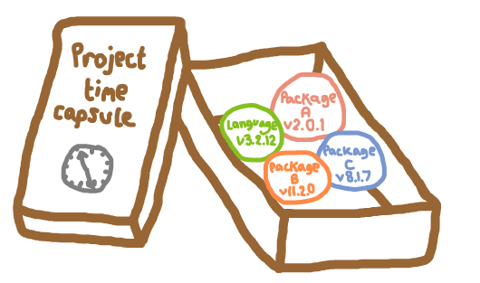
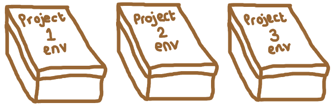
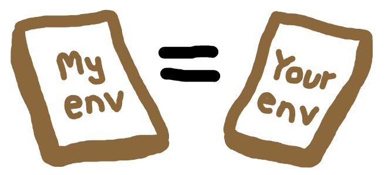
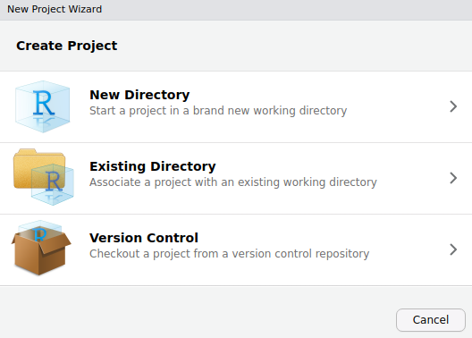
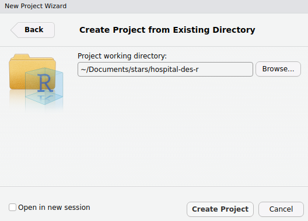
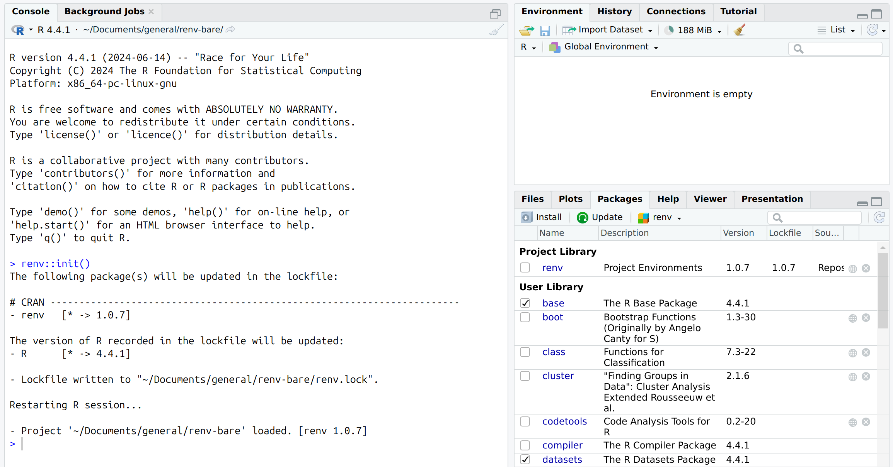
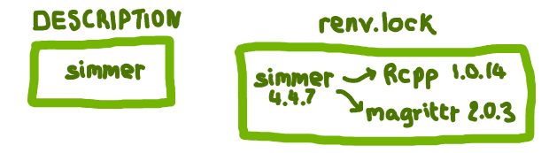

:::: {.pale-blue}

🎯 **Objectives**

::: {.python-content}

This page will guide you through the essentials of managing Python environments.

* 🌎 **Environments:** What python environments are and why they matter.
* 🧰 **Tools**: Comparison of tools for managing environments.
* 🔄 **Version:** Switching between versions of python.
* 📦 **Packages:** Dependency management using `conda`.
* ⚙️ **Other:** Other tools and approaches for versions and packages.
* 🛠️ **Recreate & troubleshoot:** Restoring environments and common fixes.
* 📚 **Further ideas:** Advanced tools and workflows for managing python environments.

:::

::: {.r-content}

This page will guide you through the essentials of managing R environments.

* 🌎 **Environments:** What R environments are and why they matter.
* 🧰 **Tools**: Comparison of tools for managing environments.
* 🔄 **Version:** Switching between versions of R.
* 📦 **Packages:** Dependency management using `renv`.
* ⚙️ **Other:** Other tools, plus advice on handling system libraries and project settings.
* 🛠️ **Recreate & troubleshoot:** Restoring environments and common fixes.
* 📚 **Further ideas:** Advanced tools and workflows for managing R environments.

:::

[🔗](../intro/guidelines.qmd) **Reproducibility guidelines**

This page helps you meet reproducibility criteria from:

* STARS Reproducibility Recommendations: List dependencies and versions.
* NHS Levels of RAP (🥈): Repository includes dependency information.

::::

## 🌎 Environments

:::: {.python-content}

A python environment is the complete computational context required to run a python project. It includes:

* The **version of Python** itself.
* All **python packages** (and their versions) used in your analysis.

::::

:::: {.r-content}

An R environment is the complete computational context required to run an R project. It includes:

* The **version of R** itself.
* All **R packages** (and their versions) used in your analysis.
* **System libraries** required by some R packages.
* **Project-specific settings** (e.g., `.Rproj`, .`Rprofile`).

::::

### Keeping track of your environment

Recording the environment used acts like a **time capsule**, allowing you to return to a project later and run it with the exact same packages and versions, reproducing the results generated previously.

{fig-align="center" width=70%}

Managing dependencies allows you to **isolate environments for different projects**. Each project can maintain its own set of packages and R version, preventing conflicts between projects and making it effortless to switch between them without worrying about version mismatches.

{fig-align="center" width=70%}

Consistent environments are important for collaboration. Ensuring everyone on the team uses the same setup prevents issues caused by differing packages or versions.

{fig-align="center" width=70%}

## 🧰 Tools

:::: {.python-content}

In Python, there are several popular tools for environment management. We'd recommend using a tool that can both:

* **Install and switch between different versions of Python**, and-
* **Install required packages and dependencies**.

As outlined in the table below, there are several tools that can achieve this - `conda`, `mamba` and `uv`. However, there are other factors to consider - for example:

* **Environment location** - by default, are environments created in the project folder (local) or in a central cache (shared across projects)? Can the location be customised?
* **Dependency files** - does the tool maintain a list of top-level packages (i.e. those you explicitly request) or a fully snapshot (i.e. including all transitive dependencies and pinned versions)?
* **Packaging** - can the tool build Python packages for distribution? If you are [structuring your research as a package](package.qmd), you may wish to use one tool - or separate tools - for dependency management and creation of your package.

::: {.grey-table}
| Tool | Python versions | Env location | Custom location | Package source | Config file | Speed | Build + publish package |
| - | - | - | - | - | - | - | - |
| `venv` | ❌ No | Project folder | ✅ Yes | PyPI | `requirements.txt` *(top-level only)* | ⚡ Fast | ❌ No |
| `conda` | ✅ Yes | Central | ✅ Yes | Conda / PyPI | `environment.yml` *(top-level or snapshot)* | 🐢 Slow | ❌ No |
| `mamba` | ✅ Yes | Central | ✅ Yes | Conda / PyPI | `environment.yml` *(top-level or snapshot)* | ⚡ Fast | ❌ No |
| `poetry` | ⚠️ Partial | Central | ✅ Yes | PyPI | `pyproject.toml` *(top-level)* + `poetry.lock` *(snapshot)* | ⚡ Fast | ✅ Yes |
| `uv` | 	✅ Yes | Project folder | ❌ No | PyPI | `pyproject.toml` *(top-level)* + `uv.lock` *(snapshot)* | 🚀 Very fast | ✅ Yes |
:::

⚠️ Partial: `Poetry` can select among installed versions of Python, but cannot install new Python versions itself

::: {.callout-note collapse="true" title="Find out more about each tool"}

| **venv** (2012)
| 🔗 <https://docs.python.org/3/library/venv.html>
Part of Python's standard library (from 3.3+), `venv` quickly replaced `pyvenv` and `virtualenv` as the standard way of managing virtual environments. It is included as part of the standard Python library, and so requires no installation. No support for Python version switching.

| **conda** (2012)
| 🔗 <https://github.com/conda/conda>
Comes with Anaconda/Miniconda or can be installed separately. It can install and manage multiple Python versions, and non-Python dependencies (e.g. R, Node.js, compilers and system libraries).

| **mamba** (2020)
| 🔗 <https://github.com/mamba-org/mamba>
A drop-in replacement for `conda` written in C++. It offers faster installs and clearer conflict messages.

| **poetry** (2019)
| 🔗 <https://github.com/python-poetry/poetry>
An all-in-one tool for dependency management and packaging. Supports reproducible environments via `poetry.lock`, and can build/distribute your project as a Python package. Cannot install Python versions itself, but allows selecting from those available on your system.

| **uv** (2024)
| 🔗 <https://github.com/astral-sh/uv>
A modern tool written in Rust. It is designed to be very fast - 10-100x faster than `pip` or `conda`. It combines features of `pip`, `venv` and `poetry`, managing python versions and supporting packaging. It is an emerging all-in-one solution.

:::

::::

:::: {.r-content}

In R, managing your project environment typically requires multiple, specialised tools rather than a single all-in-one solution. The current solutions are:

::: {.grey-table}
| Tool | Install + switch between R versions? | Package management? | Description |
| - | - | - |
| `rig` | ✅ Yes | ❌ No |
| `renv` | ❌ No | ✅ Yes |
| `rv` (in development) | ❌ No | ✅ Yes |
:::

### Legacy tools

**R version management:** Before `rig`, users had to install and switch R versions using platform-specific tools (e.g. RSwitch on Mac, CRAN installer on Windows, Homebrew or manual compilation on Linux). These approaches are more involved and prone to inconsistencies.

**R package management:** `packrat` used to be the most popular package manager, but was superseded by `renv` which is simpler to use and more robust.

::::

## 🔄 Version

:::: {.python-content}

This book and its examples use `conda`/`mamba`, as they are **established** tools for package management that can also install **specific versions of Python**, enabling you to easily switch between versions for different projects.

You can choose between them - **`mamba` is just a drop-in replacement for `conda`** that is faster and has clearer error messages.

### How will we work?

For reproducibility and universal applicability, all `conda`/`mamba` instructions in this book will be run from the **command line**. These commands should be run from the **terminal** on Linux or macOS, or **Git Bash** (or **Anaconda Prompt**) on Windows. This approach gives you full control, works in any environment, and aligns with best practices used in collaborative and professional settings.

However, there is also **Anaconda Navigator** - an application bundled with the Anaconda Distribution. Navigator allows you to manage environments and install packages using a point-and-click interface. If you're curious about using Anaconda Navigator instead, you can follow along with this walkthrough: [How to Create Virtual Environment in Anaconda Navigator | Python](https://youtu.be/D9ppWlkO-dI?si=zyzEUOICWeIn8LoX).

### Install `conda`/`mamba`

Refer to the documentation for the latest instructions on installing `conda`/`mamba` for your operating system:

* [Conda installation instructions](https://docs.conda.io/projects/conda/en/latest/user-guide/install/index.html).
* [Mamba installation instructions](https://mamba.readthedocs.io/en/latest/installation/mamba-installation.html).

### Create an environment file

In the main project folder, create a file called `environment.yaml`. For example, your folder structure might look like:

```
project-name/
├── .git/
├── environment.yaml
├── LICENSE
└── README.md
```

Within `environment.yaml`, we add three sections:

* **Name**. The environment name.
* **Channels**. Where to find packages (e.g. `conda-forge`).
* **Dependencies**. The packages you need.

When first creating our environment, we just want to specify the version of python used. For example:

```{.bash}
name: envname
channels:
  - conda-forge
dependencies:
  - python=3.13
```

::: {.callout-note}

## Conda channels

**Channels** are locations where conda stores and retrieves packages. You can choose which channel to use, and can a select a few with an order of priority.

We have used `conda-forge` which is a community-maintained channel run by volunteers. It offers a wide range of packages and is a popular choice for many users.

Other main channels include:

* `default` and `anaconda` - Maintained by Anaconda's engineers and designed for high security and stability. Organisations with 200 or more employees have to pay to use this channel (excluding students and non-commercial research at universities)
* `bioconda` - Volunteer-run, offers bioinformatics-related packages.

:::

### Build and activate the environment

In the command line, run either set of commands to:

* Create your environment.
* Activate it (replacing `envname` with your environment name).
* List the packages in your environment.

Using `conda`:

```{.bash}
conda env create --file environment.yaml
conda activate envname
conda list
```

Using `mamba`:

```{.bash}
mamba env create --file environment.yaml
mamba activate envname
mamba list
```

When you run the `list` command, you should see a list of packages, versions, builds and channels, similar to:

```
# packages in environment at /home/amy/mambaforge/envs/testenv:
#
# Name                    Version                   Build  Channel
_libgcc_mutex             0.1                 conda_forge    conda-forge
_openmp_mutex             4.5                       2_gnu    conda-forge
bzip2                     1.0.8                h4bc722e_7    conda-forge
ca-certificates           2025.7.14            hbd8a1cb_0    conda-forge
icu                       75.1                 he02047a_0    conda-forge
ld_impl_linux-64          2.44                 h1423503_1    conda-forge
libexpat                  2.7.0                h5888daf_0    conda-forge
libffi                    3.4.6                h2dba641_1    conda-forge
libgcc                    15.1.0               h767d61c_3    conda-forge
libgcc-ng                 15.1.0               h69a702a_3    conda-forge
libgomp                   15.1.0               h767d61c_3    conda-forge
liblzma                   5.8.1                hb9d3cd8_2    conda-forge
libmpdec                  4.0.0                hb9d3cd8_0    conda-forge
libsqlite                 3.50.2               hee844dc_2    conda-forge
libstdcxx                 15.1.0               h8f9b012_3    conda-forge
libstdcxx-ng              15.1.0               h4852527_3    conda-forge
libuuid                   2.38.1               h0b41bf4_0    conda-forge
libzlib                   1.3.1                hb9d3cd8_2    conda-forge
ncurses                   6.5                  h2d0b736_3    conda-forge
openssl                   3.5.1                h7b32b05_0    conda-forge
pip                       25.1.1             pyh145f28c_0    conda-forge
python                    3.13.5          hec9711d_102_cp313    conda-forge
python_abi                3.13                    7_cp313    conda-forge
readline                  8.2                  h8c095d6_2    conda-forge
tk                        8.6.13          noxft_hd72426e_102    conda-forge
tzdata                    2025b                h78e105d_0    conda-forge
```

::::

:::: {.r-content}

For most users, the best way to manage R versions is to use [`rig`](https://github.com/r-lib/rig). It is a tool that allows you to easily install, list and switch between R versions on Windows, Mac and Linux.

### Install `rig`

Follow the installation instructions for your operating system on the [rig GitHub](https://github.com/r-lib/rig) page. After installation, check that it works by running:

```{.bash}
rig --version
```

### View available R versions

List all R versions installed on your machine:

```{.bash}
rig list
```

Example output:

```{.bash}
* name   version  aliases
------------------------------------------
  3.6.0           
  4.2.2           
  4.3.1           
  4.4.1           
  4.5.0  
```

### Add a new R version

To install a specific R version:

```{.bash}
rig add 4.1.2
```

Or simply add the latest version:

```{.bash}
rig add
```

### Set the active R version

Choose which R version should be active (for example, when you open RStudio):

```{.bash}
rig default 4.1.2
```

This makes the selected version the default for new R sessions. (**Note:** If you later change versions manually or with other tools, you may need to reset this.)

::::

## 📦 Packages

The processing of tracking and controlling the packages your project uses, including their versions, is called **dependency management**.

:::: {.python-content}

### Using `conda`/`mamba`

<div class="h4-tight"></div>

#### Setup environment

This book and its examples use `conda`/`mamba`. If you haven't already, follow the instructions in **🔄 Version** to set-up an environment with just your chosen version of python.

#### Adding packages to the environment

Add packages to the environment by modifying the `environment.yaml` file. For example, to add `simpy`:

```{.bash}
name: envname
channels:
  - conda-forge
dependencies:
  - python=3.13
  - simpy
```

With the environment active (i.e. after running `conda activate envname`), you can then run the following command to update it. Activating the environment before updating ensures that the changes are applied to the correct environment, rather than unintentionally modifying the `base` environment.

```{.bash}
conda env update --file environment.yaml --prune
```

You should **specify the exact package versions** in you `environment.yaml`. If you're starting from scratch, you may not know which versions you need, so you can leave them out initially, as we did above. However, now that we have built our environment (which used the latest versions as none were specified), it is important to then record your versions in the `environment.yaml`. These are the versions you can see by running `conda list`.

Example `environment.yaml` file:

```{.bash}
name: envname
channels:
  - conda-forge
dependencies:
  - python=3.13.3
  - simpy=4.1.1
```

When working on a project from scratch, you will often build up your environment organically and iteratively as you find more packages you want to use.

To set-up an environment that will work for running the examples in this book, see the "**🧪 Test yourself**" section.

::::

:::: {.r-content}

In R, the most popular tool for managing dependencies is [`renv`](https://github.com/rstudio/renv).

### Creating an `renv` environment

#### 1. Install renv

If you haven't already, install `renv` from CRAN:

```{.r}
install.packages("renv")
```

#### 2. Create an R project

It's best to use `renv` within an R project. R projects are commonly created and managed by RStudio.

In RStudio, select "File > New Project..." and choose "Existing Directory".



Navigate to your project directory, then select "Create Project".



This will create :

* `.Rproj`: project file (contains some settings for the project).
* `.Rproject.user/`: hidden folder with temporary project files (e.g. auto-saved source documents).

If you are not using RStudio, R projects can be difficult to set-up, as they have to be created manually. It is possible to use `renv` *without* an R project though, as discussed in [this GitHub issue](https://github.com/rstudio/renv/issues/460). This can be done using `setwd()` to set your repository as the current working directory, and then continuing with the steps below.

#### 3. Initialise `renv`

In your R console, run:

```{.r}
renv::init()
```

This creates:

* `renv/`: stores packages for the project.
* `renv.lock`: records packages and the exact versions used.
* `.Rprofile`: ensures `renv` activates when the project opens.

Example `renv.lock` containing only `renv`:

```{.r}
{
  "R": {
    "Version": "4.4.1",
    "Repositories": [
      {
        "Name": "CRAN",
        "URL": "https://packagemanager.posit.co/cran/latest"
      }
    ]
  },
  "Packages": {
    "renv": {
      "Package": "renv",
      "Version": "1.0.7",
      "Source": "Repository",
      "Repository": "CRAN",
      "Requirements": [
        "utils"
      ],
      "Hash": "397b7b2a265bc5a7a06852524dabae20"
    }
  }
}
```

When you initialise `renv`, you project gets its own **project library** - a private folder (`renv/library/`) where packages are installed just for this project. This means package versions are isolated and recorded for each project, so updating a package in one project won't break others. This makes collaboration and reproducibility much easier.

This is different from the **user library**, which is the default shared location where R installs packages used by all your R projects. See the "Packages" section on RStudio, which will show your project v.s. user library:



Some further information relevant when initialising `renv`:

::: {.callout-note collapse="true" title="Implicit or explicit mode"}

If a `DESCRIPTION` file is present, `renv` will prompt you to choose how dependencies are discovered:

* **Implicit mode:** `renv` will scan you project files for any packages used in your code.
* **Explicit mode:** `renv` will use only the packages listed in your `DESCRIPTION` file (under "Imports").

We recommend choosing implicit mode for most projects, as it ensures that all packages actually used in your code are detected and managed, even if you forget to list them in `DESCRIPTION`.

*We'll explain more about `DESCRIPTION` files and these modes in the section on adding packages to the environment.*

:::

::: {.callout-note collapse="true" title="Initialising a bare environment"}

By default, `renv::init()` will scan and install packages into your project library. If your directory is empty or contains no code using packages, only `renv` itself will be installed.

If you want to initialise `renv` without installing any packages, you can use:

```{.r}
renv::init(bare = TRUE)
```

This will create `renv/` and `.Rprofile` but not `renv.lock` or a project library.

However, when you later run `renv::snapshot()`, `renv` will scan and install packages at that point. If you use implicit mode, it will detect and install all packages used in your code - even if you started with a bare environment.

*We'll explain more about snapshots and implicit mode in the section on adding packages to the environment.*

:::

### Adding packages to the `renv` environment

It is possible to simply install packages directly using commands like:

```{.r}
renv::install("packagename")
install.packages("packagename")
```

However, we recommend using a `DESCRIPTION` file. This is a file listing only the **main packages** your project directly depends on - i.e. those you might have add using `renv::install()`.

This differs from `renv.lock` which records **all packages** needed to recreate your environment, including every main package and all their dependencies, plus the exact versions used.



The benefit of using a `DESCRIPTION` file when adding packages is:

* 📝 **Clear requirements.** The `DESCRIPTION` file gives a simple, readable summary of your project’s main packages. It’s much easier to read than `renv.lock`.
* 📦 **Consistency with package development**. If your project is (or might become) an R package, the `DESCRIPTION` file is the standard way to declare dependencies.
* 🔄 **Alternative for environment recreation**. While `renv.lock` is the primary tool for restoring an `renv` environment, having a `DESCRIPTION` file is a valuable backup. If you encounter issues with `renv.lock`, you can use `DESCRIPTION` to reinstall the main dependencies.
* 🎯 **Explicit snapshots**. If you want precise control over what's included in `renv.lock`, you can use an "explicit" snapshot. This means only the packages listed in `DESCRIPTION` (and their dependencies) are recorded.


#### 1. Create a `DESCRIPTION` file

Create a blank file named `DESCRIPTION` and copy in the template below. You can customise some of the meta-data (e.g. package, title, authors, description).

This is a standard template. You can create an identical file with `usethis` by running `usethis::use_description()`. However, we can just create it from scratch, which helps to minimise our dependencies.

```{.r}
Package: packagename
Title: What the Package Does (One Line, Title Case)
Version: 0.0.0.9000
Authors@R: 
    person("First", "Last", , "first.last@example.com", role = c("aut", "cre"))
Description: What the package does (one paragraph).
License: `use_mit_license()`, `use_gpl3_license()` or friends to pick a
    license
Encoding: UTF-8
Roxygen: list(markdown = TRUE)
RoxygenNote: 7.0.0
```

#### 2. List dependencies

Dependencies can be listed as:

* `Imports` (required packages).
* `Suggests` (optional/development packages).

For non-package projects, it's simplest to list all dependencies under `Imports`, which will be identified by `renv` (whilst those under `Suggests` may not unless used in scripts).

`Suggests` is more relevant when constructing a package, as it distinguishes packages necessary only for optional features, vignettes or testing, from those required within the package itself.

**Note:** In the [R Packages](https://r-pkgs.org/description.html) book, they recommend that - in `DESCRIPTION` - no versions are specified, or a minimum version is specified if you know that an older version of specific package/s would break the code. This is why it is important to also create an `renv.lock` file (as below), so you do have a record of the exact versions used.

Example `DESCRIPTION` with packages `dplyr` and `future`:

```{.r}
Package: example
Title: Example DESCRIPTION
Version: 0.0.0.9000
Authors@R: 
    person("Amy", "Heather", , "a.heather2@exeter.ac.uk", role = c("aut", "cre"))
Description: This is an example DESCRIPTION, used for environment management.
License: MIT + file LICENSE
Encoding: UTF-8
Roxygen: list(markdown = TRUE)
RoxygenNote: 7.0.0
Imports:
    dplyr
    future
```

At the very beginning of your project, your `DESCRIPTION` file might only include a few packages. As your project develops and you find yourself using additional packages, simply **add each new dependency to the `Imports` section** of your `DESCRIPTION` file.

To set-up an environment that will work for running the examples in this book, see the "**🧪 Test yourself**" section.

#### 3. Install packages from `DESCRIPTION`

Install packages listed in `DESCRIPTION` (and their dependencies) with:

```{.r}
renv::install()
```

This will only install packages listed under "Imports" - those under "Suggests" have to be installed manually.

#### 4. Update `renv.lock`

Take a snapshot of your environment and update `renv.lock`:

```{.r}
renv::snapshot()
```

This will update the lock file with a full list of the exact packages and dependencies, including the **versions** you have installed.

There are three snapshot types:

* **Implicit** (default): Records packages in `DESCRIPTION` Imports section (not the Suggests section) *and* those used in your code.
* **Explicit**: Only records packages listed in `DESCRIPTION` Imports section (not the Suggests section).
* **All**: Records all packages in your environment.

We recommend using the default (implicit) to ensure all used packages are captured, even if not listed in `DESCRIPTION`. However, you should remove unused scripts to avoid capturing unnecessary packages. 

If you are using a `DESCRIPTION` file with "Imports" and "Suggests", you may wish to use the "all" snapshot, as otherwise renv will only include packages in imports or used in the code in the lockfile.

To check your current snapshot type:

```{.r}
renv::settings$snapshot.type()
```

To change it if needed:

```{.r}
renv::settings$snapshot.type("implicit")
renv::settings$snapshot.type("explicit")
renv::settings$snapshot.type("all")
```

### Deleting an `renv` environment

To remove `renv` from a project, run:

```{.r}
renv::deactivate(clean = TRUE)
```

This will remove the renv auto-loaded, the `renv/` directory, and the `renv.lock` file in one step, and restart the R session.

::::

## ⚙️ Other

:::: {.python-content}

If you're interested in using one of the other tools for dependency management, we’ve provided some brief information on each below, and direct you to other sources for a more detailed explanation of how to use them.

::: {.callout-note collapse="true" title="`venv`"}

**Installation**

As `venv` is included with the standard Python library, you do not need to install it.

<br>

**Environment creation**

To create a virtual environment, we use the `python -m venv <name>` command. Typically the environment is just named `venv` - and so, we just execute:

```{.bash}
python -m venv venv
```

You should execute this from within your project folder. It will create a new folder named `venv/` to store the environment within.

```
venv
├── bin/
├── include/
├── lib/
├── lib64/
└── pyvenv.cfg
```

It is not recommend to add `venv` to GitHub. The [default Python `.gitignore` file](https://github.com/github/gitignore/blob/main/Python.gitignore) includes `venv/` to ignore the entire folder.

Activation of the virtual environment will differ depending on your operating system.

```{.bash}
# Linux or MacOS
source venv/bin/activate
# Windows (from cmd.exe)
venv\Scripts\activate
# Windows (from PowerShell)
venv\Scripts\Activate.ps1
```

Once activated, the shell prompt changes to indicate that the environment is active - for example:

```
(venv) (base) amy@xps:~/Documents/stars/venv_test$
```

<br>

**Choosing python version**

`venv` cannot control which python version is used, it will just use one on system. You can check what this is by running:

```{.bash}
venv/bin/python --version
```

<br>

**Adding packages**

To add packages, create a `requirements.txt` file. Within this, list the required packages and their versions.

```{.bash}
nbqa==1.9.0
simpy==4.1.1
```

To install these, with our environment active, run:

```{.bash}
pip install -r requirements.txt
```

<br>

**Further information**

For more guidance on using `venv`, check out the [venv documentation](https://docs.python.org/3/library/venv.html).

:::

::: {.callout-note collapse="true" title="`poetry`"}

**Installation**

Install poetry following the [instructions for your operating system](https://python-poetry.org/docs/). For example, on Linux:

```{.bash}
curl -sSL https://install.python-poetry.org | python3 -
```

After installation, check that Poetry is available:

```{.bash}
poetry --version
```

<br>

**Environment creation**

From our project directory, we can create a new poetry project by running:

```{.bash}
poetry init
```

This will guide you through a series of prompts to create a `pyproject.toml` file. You can answer these or just press "Enter" to accept the default values. For example, accepting the defaults can produce something similar to:

```
[project]
name = "poetry-test"
version = "0.1.0"
description = ""
authors = [
    {name = "amyheather",email = "a.heather2@exeter.ac.uk"}
]
readme = "README.md"
requires-python = ">=3.10"
dependencies = [
]


[build-system]
requires = ["poetry-core>=2.0.0,<3.0.0"]
build-backend = "poetry.core.masonry.api"
```

When first add a package, the environment will be created.

<br>

**Choosing python version**

To use a specific version of python:

```{.bash}
poetry env use 3.11
poetry install
```

However, it cannot install specific versions for you - this is only choosing between versions already on your machine.

<br>

**Adding packages**

To add dependencies, use the `poetry add` command (rather than editing `pyproject.toml` directly). This will install the package, update `pyproject.toml` and generate a `poetry.lock` file if one does not already exist.

For example, to add SimPy:

```{.bash}
poetry add simpy
```

This updates `pyproject.toml`:

```
[project]
name = "poetry-test"
version = "0.1.0"
description = ""
authors = [
    {name = "amyheather",email = "a.heather2@exeter.ac.uk"}
]
readme = "README.md"
requires-python = ">=3.10"
dependencies = [
    "simpy (>=4.1.1,<5.0.0)"
]


[build-system]
requires = ["poetry-core>=2.0.0,<3.0.0"]
build-backend = "poetry.core.masonry.api"
```

And creates/updates `poetry.lock` to record the exact package version installed:

```
# This file is automatically @generated by Poetry 2.1.3 and should not be changed by hand.

[[package]]
name = "simpy"
version = "4.1.1"
description = "Event discrete, process based simulation for Python."
optional = false
python-versions = ">=3.8"
groups = ["main"]
files = [
    {file = "simpy-4.1.1-py3-none-any.whl", hash = "sha256:7c5ae380240fd2238671160e4830956f8055830a8317edf5c05e495b3823cd88"},
    {file = "simpy-4.1.1.tar.gz", hash = "sha256:06d0750a7884b11e0e8e20ce0bc7c6d4ed5f1743d456695340d13fdff95001a6"},
]

[metadata]
lock-version = "2.1"
python-versions = ">=3.10"
content-hash = "53e967cadef99331a7f895f64ccb1bd8680e6fe09253335b9d88bd4cb3d6d793"
```

To install a specific version of a package, specify it when adding:

```{.bash}
poetry add nbqa==1.9.0
```

<br>

**Further information**

For more guidance on using `poetry`, check out the [poetry documentation](https://python-poetry.org/docs/).

:::

::: {.callout-note collapse="true" title="`uv`"}

**Installation**

[Install](https://docs.astral.sh/uv/getting-started/installation/) for your operating system - for example, on linux:

```{.bash}
curl -LsSf https://astral.sh/uv/install.sh | sh
```

Can check it has installed by running:

```{.bash}
uv version
```

<br>

**Environment creation**

To set up your repository as a uv project, run:

```{.bash}
uv init
```

This creates:

```
.
├── .python-version
├── README.md
├── main.py
└── pyproject.toml
```

When you run the python file, it will create the environment:

```{.bash}
uv run main.py

>> Using CPython 3.10.14 interpreter at: /home/amy/mambaforge/bin/python3.10
>> Creating virtual environment at: .venv
>> Hello from uv-test!
```

Whenever you execute `uv run`, it checks that everything is up-to-date: lockfile matches pyproject.toml, environment matches lockfile. To manually update though, can run:

```{.bash}
uv sync
```

<br>

**Choosing python version**

To change the python version, open the `.python-version` file (e.g. `nano .python-version`), then edit the listed version, save, and run `uv sync`. It will install the specified version of python.

<br>

**Adding packages**

To add packages, run `uv add`, and can specify versions:

```{.bash}
uv add simpy
uv add nbqa==1.9.0
```

The config files are:

* `pyproject.toml` - a simple list of the packages you add with `uv add`, including any specified versions.
* `uv.lock` - full details on every package in the environment.

Example `pyproject.toml`:

```
[project]
name = "uv-test"
version = "0.1.0"
description = "Add your description here"
readme = "README.md"
requires-python = ">=3.10"
dependencies = [
    "nbqa==1.9.0",
    "pytest>=8.3.5",
    "simpy>=4.1.1",
]
```

Example `uv.lock`:

```
version = 1
revision = 2
requires-python = ">=3.10"
resolution-markers = [
    "python_full_version >= '3.11'",
    "python_full_version < '3.11'",
]

[[package]]
name = "asttokens"
version = "3.0.0"
source = { registry = "https://pypi.org/simple" }
sdist = { url = "https://files.pythonhosted.org/packages/4a/e7/82da0a03e7ba5141f05cce0d302e6eed121ae055e0456ca228bf693984bc/asttokens-3.0.0.tar.gz", hash = "sha256:0dcd8baa8d62b0c1d118b399b2ddba3c4aff271d0d7a9e0d4c1681c79035bbc7", size = 61978, upload-time = "2024-11-30T04:30:14.439Z" }
wheels = [
    { url = "https://files.pythonhosted.org/packages/25/8a/c46dcc25341b5bce5472c718902eb3d38600a903b14fa6aeecef3f21a46f/asttokens-3.0.0-py3-none-any.whl", hash = "sha256:e3078351a059199dd5138cb1c706e6430c05eff2ff136af5eb4790f9d28932e2", size = 26918, upload-time = "2024-11-30T04:30:10.946Z" },
]

...
```

**Further information**

For more guidance on using `uv`, check out the [uv documentation](https://docs.astral.sh/uv/).

:::

::::

:::: {.r-content}

<div class="h3-tight"></div>

### Other tools for environment management

If you're interested in using one of the other tools for dependency management, we’ve provided some brief information on `rv` below, and direct you to other sources for a more detailed explanation of how to use it.

::: {.callout-note collapse="true" title="`rv`"}

This section provides more information on `rv`.

Using `rv`, you can declare an R version up-front and, whilst it will not automate installation or switching of R versions, it will warn/error if you try to use a different version.

It requires all dependencies to be specified before installation, rather than taking snapshots as you go along like with `renv`. These dependencies are saved in an `rproject.toml file`.

**Installation**

Follow the [installation instructions](https://github.com/A2-ai/rv/blob/main/docs/installation.md) for your operating system. For example, on linux:

```{.bash}
curl -sSL https://raw.githubusercontent.com/A2-ai/rv/refs/heads/main/scripts/install.sh | bash
```

We can then check it has installed by running:

```{.bash}
rv --version
```

**Setting up the project with a particular version of R**

To set up rv project, execute from terminal `rv init`. However, if you wish to use a particular version of R, you should also specify this when setting up the project.

Whilst rv will not install new versions of R for you, you can fix each project to a particular version of R, and it will then warn/error if the running version of R does not match this.

For example, setting up a project fixed to R 4.5:

```{.bash}
rv init --r-version 4.5
```

This will create:

```
.
├── .Rprofile
├── rproject.toml
└── rv/
    ├── .gitignore
    └── scripts/
        ├── activate.R
        └── rvr.R
```

You can view a summary of the environment by running:

```{.bash}
rv summary
```

If you try to do this without that version of R installed, the project will initialise successfully, but running `rv summary` you will see an error message similar to:

```
Failed to get R version

Caused by:
    Specified R version (4.5) does not match any available versions found on the system (3.6.0, 4.2.2, 4.3.1, 4.4.1)
```

**Setting repositories**

When we ran `rv init`, we got an error message:

```
WARNING: Could not set default repositories. Set with your company preferred package URL or public url (i.e. `https://packagemanager.posit.co/cran/latest`)
```

To resolve this, we opened `rproject.toml` and amended the repositories section to list CRAN:

```
repositories = [
    {alias = "CRAN", url = "https://cran.r-project.org", force_source = true}
]
```

Without this change, it was not possible to install packages (would "fail to resolve all dependencies").

**Adding packages**

To add packages, simply run `rv add <package>`. This will install the specified package, and update the `rproject.toml` file to list it as a dependency, and add all installed packages to an `rv.lock` file. For example, if we run:

```{.bash}
rv add simmer
```

The `rproject.toml` dependencies section updates to:

```
dependencies = [
    "simmer",
]
```

An `rv.lock` file is created:

```
# This file is automatically @generated by rv.
# It is not intended for manual editing.
version = 2
r_version = "4.5"

[[packages]]
name = "Rcpp"
version = "1.0.14"
source = { repository = "https://cran.r-project.org/" }
force_source = true
dependencies = []

[[packages]]
name = "codetools"
version = "0.2-20"
source = { builtin = true }
force_source = false
dependencies = []

[[packages]]
name = "magrittr"
version = "2.0.3"
source = { repository = "https://cran.r-project.org/" }
force_source = true
dependencies = []

[[packages]]
name = "simmer"
version = "4.4.7"
source = { repository = "https://cran.r-project.org/" }
force_source = true
dependencies = [
    "Rcpp",
    "magrittr",
    "codetools",
    { name = "Rcpp", requirement = "(>= 0.12.9)" },
]
```

**Adding specific versions of packages**

Currently, `rv` requires this is done by editing the `rproject.toml` file and then running:

```{.bash}
rv sync
```

I found this a bit hit-or-miss - several packages I tried failed to install due to issues fetching dependencies like `glue`. However, these two examples of using simmer 4.4.6.4 (instead of the latest 4.4.7) worked fine - either installing from CRAN or GitHub:

```
dependencies = [
    {name = "simmer", url = "https://cran.r-project.org/src/contrib/Archive/simmer/simmer_4.4.6.4.tar.gz"},
]
```

```
dependencies = [
    {name = "simmer", git = "https://github.com/r-simmer/simmer.git", tag = "v4.4.6.4"},
]
```

**Further information**

Check out the [rv GitHub repository](https://github.com/A2-ai/rv/tree/main) for more advice on using this tool, and the latest instructions (as this package is still in active development).

:::

### System libraries and project-specific settings

Besides the packages and R version used, your R environment will also include **system libraries** (external software required by some packages) and **project-specific settings** (e.g. `.Rproj`, `.Rprofile`).

The exact system libraries required will depend on which packages you use, what operating system you have, and whether you have used R before. If system libraries are missing, package installation may fail, even if you have the correct R package versions. For example, working on Ubuntu, we found that we had to install the following system dependencies for `igraph`:

```{.bash}
sudo apt install build-essential gfortran
sudo apt install libglpk-dev libxml2-dev
```

Most researchers handle these components by:

* Documenting required system libraries in the project's README or set-up instructions.
* Including project files (like `.Rproj` and `.Rprofile`) in version control (e.g., Git).

::::

## 🛠️ Recreate & troubleshoot

<div class="h3-tight"></div>

::: {.python-content}

### 1. Identify or create environment file

Begin by identifying any existing files that list the necessary details: python version, required packages, and their versions. If these files fully specify the environment, use them directly to set-up the environment.

If information is missing, fill in the gaps as follows, creating your own `environment.yml` (or similar) with the details gathered:

* **Python version:** Look for explicit version info in documentation or project materials. If unavailable, estimate based on project dates or use the latest release.
* **Packages:** Check documentation for a list of packages, or inspect code for import statements to determine what's needed.
* **Package versions:** Search for version details in documentation, or estimate based on project's age; otherwise, consider installing the latest compatible versions.

### 2. Build environment

Install the environment using your chosen tool (ideally one that controls the python version, like `conda`). If you encounter **installation errors** (e.g. `could not find a version that satisified the requirement...`):

* Check if Python version is supported by the package.
* Try alternative sources (PyPI v.s. conda, different conda channels).
* Ensure package name has no typos, and that the version number is valid.

After installation, test your code. If problems arise due to **incompatible package versions** (e.g. latest versions causing changes or errors):

* Downgrade affected packages, and update your environment file with the versions required.

:::

:::: {.r-content}

### 1. Identify R version, packages and their required versions

Start by looking for files that define the environment, like `renv.lock` or `DESCRIPTION`. If such files are missing or don't specify versions:

* **R version:** Look for explicit version info in documentation or project materials. If unavailable, estimate based on project dates or use the latest release.
* **Packages:** Check documentation for a list of packages, or inspect code for import statements (`library()`, `require()`) to determine what's needed.
* **Package versions:** Search for version details in documentation, or estimate based on project's age; otherwise, consider installing the latest compatible versions.

### 2. Build R environment

The required R version can be switched to using `rig`.

If an `renv.lock` file exists, use `renv::restore()` to create the exact previous environment. This will match package versions exactly, and prompt you to use the appropriate R version. However, if you encounter problems, you may wish to switch to a `DESCRIPTION` file.

If you are working from a provided `DESCRIPTION` file, or have deduced the required packages, then `renv::install()` can be used.

* For the latest versions, just list the packages in `DESCRIPTION` (with no pinned dependencies) and run `renv::install()`.
* For specific versions, the simplest method can be to individually install these using `renv::install("pkg@version")`, record the package in `DESCRIPTION`, and then ensure the version is recorded by runing `renv::snapshot()`.

<br>

::: {.callout-note title="Backwards compatability in R"}

In theory, the R ecosystem aspires to maintain backwards compatibility, meaning that code written for older package versions should continue to work with newer ones. However, in practice, there is no strict guarantee of backward compatibility in R, either for the core language or for contributed packages.

As discussed in the [R packages](https://r-pkgs.org/lifecycle.html) book:

> "If we're being honest, most R users don’t manage package versions in a very intentional way. Given the way `update.packages()` and `install.packages()` work, it’s quite easy to upgrade a package to a new major version without really meaning to, especially for dependencies of the target package. This, in turn, can lead to unexpected exposure to breaking changes in code that previously worked. This unpleasantness has implications both for users and for maintainers."

Hence, using a lockfile like `renv.lock` is the only reliable way to ensure that your environment is recreated exactly as it was - but `DESCRIPTION` can serve as a valuable back-up when this doesn't work, and otherwise just as a handy summary of the main packages.

:::

### 3. Troubleshooting

Restoring an R environment can often run into issues, especially with older projects or system differences. Below are common problems and solutions.

#### Unavailable packages

When recreating environments with older R versions or package versions, you may encounter errors if those packages are no longer available for your chosen R version. CRAN often archives older packages, and support for very old R versions is limited.

**Symptoms:**

* Errors stating that a package or a specific version cannot be found or installed.
* Installation fails even though the package exists for newer R versions.

**Solutions:**

* If exact reproducibility is not required, consider updating to a more recent R version and/or newer package versions.
* For legacy work, search for archived source tarballs or consult the CRAN archive, but success isn't guaranteed.

<br>

#### Backdating

If you set up your environment with the latest R and package versions (for example, when no specific versions are listed), you may find your code requires older package versions to work as expected.

**Symptoms:**

* Code relies on functions or behaviors from earlier package versions.
* Latest package versions introduce breaking changes.

**Solutions:**

* Specify minimum or exact versions in your `DESCRIPTION` file.
* Be aware that not all old versions are available for every R version; you may need to adjust your R version or accept a newer package.

To specify a minimum version in `DESCRIPTION`:

```{.r}
Imports:
    dplyr (>= 1.0.0)
```

To install a particular version using `renv` (which will be recorded in `renv.lock` after you call `renv::snapshot()`):

```{.r}
renv::install("dplyr@1.1.2")
```

<br>

#### Missing system dependencies

Some R packages require external system libraries (e.g., C libraries, database clients) not installed by default.

**Symptoms:**

* Package installation fails with errors about missing libraries (e.g., "cannot find -lssl", "libcurl not found", missing `.so` files).

**Solutions:**

* Check the CRAN page for each package for any system requirements (listed beside `SystemRequirements`). The [`openssl`](https://cran.r-project.org/web/packages/openssl/index.html) and [`curl`](https://cran.r-project.org/web/packages/curl/index.html) packages are a common source of these issues.
* Install the required system dependencies and document them in your `README` for others. For example:
  * Ubuntu/Debian: `sudo apt-get install libssl-dev libcurl4-openssl-dev`.
  * Fedora/RHEL: `sudo dnf install openssl-devel libcurl-devel`.
  * MacOS: `brew install openssl curl`.
  * Windows: Follow package documentation or use precompiled binaries.

<br>

#### Legacy user libraries

If R has been installed for a long time, your user library (the default location for installed packages) may contain outdated or conflicting packages. This can interfere with `renv`, sometimes causing silent failures or unpredictable behaviour.

**Symptoms:**

* `renv` commands have no effect or fail with unclear messages.
* Packages are loaded from the user library instead of the project library.

**Solutions:**

* Check `.libPaths()` to confirm the project library is listed first when `renv` is active.
* Temporarily move or rename your user library directory and restart R to see if `renv` works correctly.
* If issues persist, consider reinstalling R or resetting your user library.
* As a last resort, a clean operating system install can resolve deep or persistent conflicts.

::::

## 📚 Further ideas

If you are interested in exploring more advanced or alternative approaches to managing reproducible environments - especially when dealing with complex external dependencies - consider the following tools and resources:

::: {.python-content}

### Docker

Using Docker allows you to encapsulate your entire python environment - including system dependencies, specific Python interpreters, and all packages - inside a container. This approach can solve issues related to external dependencies and ensures that your analysis runs identically across different machines, as it will ensure use of the same operating system.

* There are many different ways you can set up a docker image, depending on your purpose. The first step is to create a `Dockerfile`. Some tutorials include:
  * [VSCode's docker for python tutorial](https://code.visualstudio.com/docs/containers/quickstart-python)
  * [Docker's python tutorial](https://www.docker.com/blog/how-to-dockerize-your-python-applications/)
* Popular starter images include `python:<version>` (<https://hub.docker.com/_/python>), and `continuumio/miniconda3` for conda-based workflows (<https://hub.docker.com/r/continuumio/miniconda3>).

### Other package managers

In this page, we covered some of the popular package managers - `conda`, `mamba`, `venv`, `poetry` and `uv` - but there are many other package managers available! Examples include:

* `Nix` (<https://nixos.org/>) - Unlike `conda` or `pip`, `Nix` environments can strictly pin every dependency (including low-level libraries). You declare every package used - and with `NixOS`, you also can configure your whole operating system (similar to Docker).
* `Hatch` (<https://hatch.pypa.io/latest/>) - A modern, all-in-one Python project manager handling virtual environments, dependency management, and packaging within a unified workflow.
* `Rye` (<https://rye.astral.sh/>) - A new Python tool seeking to unify virtual environment management, dependency resolution, and packaging with simple commands.
* `PDM` (<https://pdm-project.org/en/latest/>) - A package and project manager following the latest Python packaging standards, with strong support for `pyproject.toml`.

### Further reading

These are some nice resources generally covering topics related to python environment management:

* ["An unbiased evaluation of environment management and packaging tools"](https://alpopkes.com/posts/python/packaging_tools/) from Anna-Lena Popkes 2024.
* ["Python dependency management is a dumpster fire"](https://nielscautaerts.xyz/python-dependency-management-is-a-dumpster-fire.html) from Niels Cautaerts 2024.
* ["Is conda free"](https://www.anaconda.com/blog/is-conda-free) from Dave Clements 2023.

:::

::: {.r-content}

### Docker

Using Docker allows you to encapsulate your entire R environment - including system libraries, R versions, and packages - inside a container. This approach can solve issues related to external dependencies and ensures that your analysis runs identically across different machines, as it will ensure use of the same operating system.

* [`dockerfiler`](https://github.com/colinfay/dockerfiler): An R package for programmatically creating Dockerfiles, making it easier to build reproducible R environments with custom dependencies.
* [`rocker`](https://www.rocker-project.org/): A collection of Docker images for R, maintained by the R community, which you can use as a base for your own projects.

### R-universe

[R-universe](https://r-universe.dev/) is an online platform for building, hosting, and distributing R packages—including those not available on CRAN. It can help you:

* Access packages from multiple sources, not just CRAN.
* Set up custom repositories (collections of R packages) for your team or organisation.
* Centralise package management (as repositories can include public, private and experimental).

### Further reading

These are some nice resources generally covering topics related to R environment management:

* ["9. DESCRIPTION" from R Packages](https://r-pkgs.org/description.html) by Hadley Wickham and Jennifer Bryan.
* ["21. Lifecycle" from R Packages](https://r-pkgs.org/lifecycle.html) by Hadley Wickham and Jennifer Bryan.

::::

## 🧪 Test yourself

Let's get started! If you haven't already tried the basic setup by following the instructions above, give it a try now. In this section, we'll set up a dedicated environment for working through this book. Using the complete environment provided below will help ensure everything works as expected.

:::: {.python-content}

**Task:** Set-up the following environment on your machine.

```{.bash}

```

::: {.callout-tip title="Hints" collapse="true"}

1. In your `des-rap-python/` folder, create an `environment.yaml` file and copy in the above text.
2. Build the environment by running `conda env create --file environment.yaml`.
3. Check it by running `conda activate des-rap-book` and `conda list`.

:::

::::

:::: {.r-content}

**Task:** Set-up the following environment on your machine.

```{.bash}

```

::: {.callout-tip title="Hints" collapse="true"}

1. In your `des-rap-r/` folder, set-up an R project.
2. Initialise `renv` by running `renv::init()`. 
3. Create a `DESCRIPTION` file and copy in the above text.
4. Install those packages by running `renv::install()`.
5. Create/update `renv.lock` by running `renv::snapshot()`.

:::

::::

<br><br>
