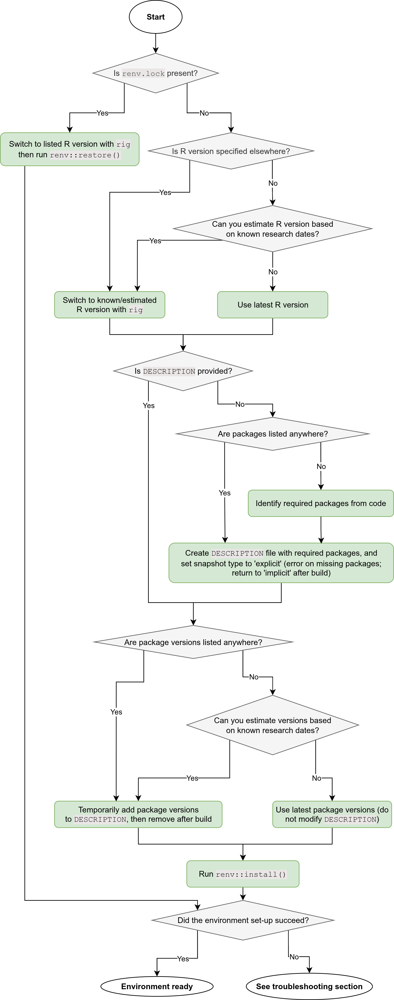

:::: {.pale-blue}

🎯 **Objectives**

::: {.python-content}

This page will guide you through the essentials of managing Python environments.

* 🌎 **Environments:** What python environments are and why they matter.
* 🔄 **Version:** Switching between versions of python.
* 📦 **Packages:** Dependency management using `conda`.
* 🛠️ **Recreate & troubleshoot:** Restoring environments and common fixes.
* 🧪 **Activities:** Have a go at python environment management!
* 📚 **Further ideas:** Advanced tools and workflows for managing python environments.

:::

::: {.r-content}

This page will guide you through the essentials of managing R environments.

* 🌎 **Environments:** What R environments are and why they matter.
* 🔄 **Version:** Switching between versions of R.
* 📦 **Packages:** Dependency management using `renv`.
* ⚙️ **Other:** Handling system libraries and project settings.
* 🛠️ **Recreate & troubleshoot:** Restoring environments and common fixes.
* 🧪 **Activities:** Have a go at R environment management!
* 📚 **Further ideas:** Advanced tools and workflows for managing R environments.

:::

[🔗](../intro/guidelines.qmd) **Reproducibility guidelines**

This page helps you meet reproducibility criteria from:

* Heather et al. 2025: List dependencies and versions.
* NHS Levels of RAP (🥈): Repository includes dependency information.

::::

## 🌎 Environments

:::: {.python-content}

TODO

::::

:::: {.r-content}

An R environment is the complete computational context required to run an R project. It includes:

* The **version of R** itself.
* All **R packages** (and their versions) used in your analysis.
* **System libraries** required by some R packages.
* **Project-specific settings** (e.g., `.Rproj`, .`Rprofile`).

::::

### Keeping track of your environment

Recording the environment used acts like a **time capsule**, allowing you to return to a project later and run it with the exact same packages and versions, reproducing the results generated previously.

{fig-align="center" width=70%}

Managing dependencies allows you to **isolate environments for different projects**. Each project can maintain its own set of packages and R version, preventing conflicts between projects and making it effortless to switch between them without worrying about version mismatches.

{fig-align="center" width=70%}

Consistent environments are important for collaboration. Ensuring everyone on the team uses the same setup prevents issues caused by differing packages or versions.

{fig-align="center" width=70%}

## 🔄 Version

:::: {.python-content}

TODO

::::

:::: {.r-content}

For most users, the best way to manage R versions is to use [`rig`](https://github.com/r-lib/rig). It is a tool that allows you to easily install, list and switch between R versions on Windows, Mac and Linux.

### Install `rig`

Follow the installation instructions for your operating system on the [rig GitHub page](https://github.com/r-lib/rig). After installation, check that it works by running:

```{.bash}
rig --version
```

### View available R versions

List all R versions installed on your machine:

```{.bash}
rig list
```

Example output:

```{.bash}
* name   version  aliases
------------------------------------------
  3.6.0           
  4.2.2           
  4.3.1           
  4.4.1           
  4.5.0  
```

### Add a new R version

To install a specific R version:

```{.bash}
rig add 4.1.2
```

Or simply add the latest version:

```{.bash}
rig add
```

### Set the active R version

Choose which R version should be active (for example, when you open RStudio):

```{.bash}
rig default 4.1.2
```

This makes the selected version the default for new R sessions. (**Note:** If you later change versions manually or with other tools, you may need to reset this.)

### Legacy methods

If you need to know about older or alternative approaches, here are some legacy methods:

* **Mac:** RSwitch, Homebrew
* **Windows:** CRAN installer
* **Linux:** Manual installation, symbolic links

**Note:** These methods can be inconsistent and are generally more complex than rig.

::: {.callout-note collapse="true" title="Manually switching R versions on Linux"}

These are additional instructions on how to manually switch R versions on Linux.

**Installation**

Following instructions from [r-builds](https://github.com/rstudio/r-builds), we first specify the version of R that you want to install ([see available versions](https://cdn.posit.co/r/versions.json)).

```{.bash}
R_VERSION=4.5.0
```

Download the `.deb` package (modifying the url depending on your system - `ubuntu-2004`, `ubuntu-2204`, `ubuntu2404`, `debian-12`).

```{.bash}
curl -O https://cdn.posit.co/r/ubuntu-2204/pkgs/r-${R_VERSION}_1_amd64.deb
```

Install the package:

```{.bash}
sudo gdebi r-${R_VERSION}_1_amd64.deb
```

View installed R versions:

```{.bash}
ls /opt/R/
```

**Switching between versions**

To set the default R version for RStudio and the terminal, you can create symbolic links in `/usr/local/bin` pointing to the desired version under `/opt/R`.

```{.bash}
sudo ln -s /opt/R/${R_VERSION}/bin/R /usr/local/bin/R 
sudo ln -s /opt/R/${R_VERSION}/bin/Rscript /usr/local/bin/Rscript
```

However, a better approach is to use **update-alternatives**. You have to register `R` and `Rscript` for each version of R - for example:

```{.bash}
sudo update-alternatives --install /usr/local/bin/R R /opt/R/3.6.0/bin/R 360
sudo update-alternatives --install /usr/local/bin/Rscript Rscript /opt/R/3.6.0/bin/Rscript 360

sudo update-alternatives --install /usr/local/bin/R R /opt/R/4.4.1/bin/R 441
sudo update-alternatives --install /usr/local/bin/Rscript Rscript /opt/R/4.4.1/bin/Rscript 441

sudo update-alternatives --install /usr/local/bin/R R /opt/R/4.5.0/bin/R 450
sudo update-alternatives --install /usr/local/bin/Rscript Rscript /opt/R/4.5.0/bin/Rscript 450
```

Then run the following commands to switch versions interactively - you'll be prompted to select which version of R to use.

```{.bash}
sudo update-alternatives --config R
sudo update-alternatives --config Rscript
```

When you open RStudio, you should find it has switched to the version of R you chose.

However, if using different versions of R between projects, you will need to change this before opening RStudio for each project.

:::

::::

## 📦 Packages

The processing of tracking and controlling the packages your project uses, including their versions, is called **dependency management**.

:::: {.python-content}

There are several popular tools for managing Python dependencies. Each tool varies in how it handles Python versions, dependency installation, environment isolation, and packaging workflows.

### Comparison of dependency management tools

<div class="h4-tight"></div>

#### Comparison factors

* **Python versions** - can it install and switch between different python versions?
* **Env location** - by default, are environments created in the project folder (local) or in a central cache (shared across projects)?
* **Custom location** - can you manually choose where the environment is stored?
* **Package source**
* **Dependency files** - does the tool maintain a list of top-level packages (i.e. those you explicitly request) or a fully snapshot (i.e. including all transitive dependencies and pinned versions)?
* **Speed**
* **Packaging** - can the tool build Python packages for distribution? If you are [structuring your research as a package](package.qmd), you may wish to use one tool - or separate tools - for dependency management and creation of your package.

#### Tool comparison table

::: {.table-greycol}
| Tool | Python versions | Env location | Custom location | Package source | Config file | Speed | Build + publish package |
| - | - | - | - | - | - | - | - |
| `venv` | ❌ No | Project folder | ✅ Yes | PyPI | `requirements.txt` *(top-level only)* | ⚡ Fast | ❌ No |
| `conda` | ✅ Yes | Central | ✅ Yes | Conda / PyPI | `environment.yml` *(top-level or snapshot)* | 🐢 Slow | ❌ No |
| `mamba` | ✅ Yes | Central | ✅ Yes | Conda / PyPI | `environment.yml` *(top-level or snapshot)* | ⚡ Fast | ❌ No |
| `poetry` | ⚠️ Partial | Central | ✅ Yes | PyPI | `pyproject.toml` *(top-level)* + `poetry.lock` *(snapshot)* | ⚡ Fast | ✅ Yes |
| `uv` | 	✅ Yes | Project folder | ❌ No | PyPI | `pyproject.toml` *(top-level)* + `uv.lock` *(snapshot)* | 🚀 Very fast | ✅ Yes |
:::

⚠️ Partial: `Poetry` can select among installed versions of Python, but cannot install new Python versions itself

#### Tool summaries

| **venv** (2012)
| 🔗 <https://docs.python.org/3/library/venv.html>
Part of Python's standard library (from 3.3+), `venv` quickly replaced `pyvenv` and `virtualenv` as the standard way of managing virtual environments. It is included as part of the standard Python library, and so requires no installation. No support for Python version switching.

| **conda** (2012)
| 🔗 <https://github.com/conda/conda>
Comes with Anaconda/Miniconda or can be installed separately. It can install and manage multiple Python versions, and non-Python dependencies (e.g. R, Node.js, compilers and system libraries).

| **mamba** (2020)
| 🔗 <https://github.com/mamba-org/mamba>
A drop-in replacement for `conda` written in C++. It offers faster installs and clearer conflict messages.

| **poetry** (2019)
| 🔗 <https://github.com/python-poetry/poetry>
An all-in-one tool for dependency management and packaging. Supports reproducible environments via `poetry.lock`, and can build/distribute your project as a Python package. Cannot install Python versions itself, but allows selecting from those available on your system.

| **uv** (2024)
| 🔗 <https://github.com/astral-sh/uv>
A modern tool written in Rust. It is designed to be very fast - 10-100x faster than `pip` or `conda`. It combines features of `pip`, `venv` and `poetry`, managing python versions and supporting packaging. It is an emerging all-in-one solution.

### `conda`/`mamba`: step-by-step usage

This book and its examples use `conda`/`mamba`, as they are established tools and allow Python version management.

#### Install `conda`/`mamba`

Refer to the documentation for the latest instructions on installing `conda`/`mamba` for your operating system (windows, mac or linux).

* [Conda installation instructions](https://docs.conda.io/projects/conda/en/latest/user-guide/install/index.html).
* [Mamba installation instructions](https://mamba.readthedocs.io/en/latest/installation/mamba-installation.html).

#### Create an environment file

In the project root, we create `environment.yaml`.

```{.bash}
touch environment.yaml
```

Within this file, we add three sections:

* **Name**. The environment name.
* **Channels**. Where to find packages (e.g. `conda-forge`).
* **Dependencies**. The packages you need.

When first creating our environment, we just list the dependencies we know we need at this point - we can always add more later! At the start of a project, you might only know one: python.

As an example, we will add `simpy` and python.

```{.bash}
name: des-example
channels:
  - conda-forge
dependencies:
  - python
  - simpy
```

::: {.callout-note}

## Conda channels

**Channels** are locations where conda stores and retrieves packages. You can choose which channel to use, and can a select a few with an order of priority.

We have used `conda-forge` which is a community-maintained channel run by volunteers. It offers a wide range of packages and is a popular choice for many users.

Other main channels include:

* `default` and `anaconda` - Maintained by Anaconda's engineers and designed for high security and stability. Organisations with 200 or more employees have to pay to use this channel (excluding students and non-commercial research at universities)
* `bioconda` - Volunteer-run, offers bioinformatics-related packages.

:::

#### Build and activate the environment

In the command line, run the following to create your environment:

```{.bash}
conda env create --file environment.yaml
```

You can then activate it (replacing `des-example` with your environment name):

```{.bash}
conda activate des-example
```

To confirm your environment contains the expected packages, run:

```{.bash}
conda list
```

This will output a list of packages, versions, builds and channels. For example, it may look similar to:

```
(des-example) amy@xps:~/Documents/hospital-des$ conda list
# packages in environment at /home/amy/mambaforge/envs/des-example:
#
# Name                    Version                   Build  Channel
_libgcc_mutex             0.1                 conda_forge    conda-forge
_openmp_mutex             4.5                       2_gnu    conda-forge
bzip2                     1.0.8                h4bc722e_7    conda-forge
ca-certificates           2025.1.31            hbd8a1cb_1    conda-forge
ld_impl_linux-64          2.43                 h712a8e2_4    conda-forge
libexpat                  2.7.0                h5888daf_0    conda-forge
libffi                    3.4.6                h2dba641_1    conda-forge
libgcc                    14.2.0               h767d61c_2    conda-forge
libgcc-ng                 14.2.0               h69a702a_2    conda-forge
libgomp                   14.2.0               h767d61c_2    conda-forge
liblzma                   5.8.1                hb9d3cd8_0    conda-forge
libmpdec                  4.0.0                h4bc722e_0    conda-forge
libsqlite                 3.49.1               hee588c1_2    conda-forge
libuuid                   2.38.1               h0b41bf4_0    conda-forge
libzlib                   1.3.1                hb9d3cd8_2    conda-forge
ncurses                   6.5                  h2d0b736_3    conda-forge
openssl                   3.5.0                h7b32b05_0    conda-forge
pip                       25.0.1             pyh145f28c_0    conda-forge
python                    3.13.3          hf636f53_101_cp313    conda-forge
python_abi                3.13                    7_cp313    conda-forge
readline                  8.2                  h8c095d6_2    conda-forge
simpy                     4.1.1              pyhd8ed1ab_1    conda-forge
tk                        8.6.13          noxft_h4845f30_101    conda-forge
tzdata                    2025b                h78e105d_0    conda-forge
```

#### Adding packages to the environment

Add packages to the environment by modifying the `environment.yaml` file and then running:

```{.bash}
conda env update --file environment.yaml --prune
```

You should **specify the exact package versions** in you `environment.yaml`. If you're starting from scratch, you may not know which versions you need, so you can leave them out initially, as we did in step 1.

However, now that we have built our environment (which used the latest versions as none were specified), it is important to then record your versions in the `environment.yaml`. These are the versions you saw when running `conda list`. For example:

```{.bash}
name: des-example
channels:
  - conda-forge
dependencies:
  - python=3.13.3
  - simpy=4.1.1
```

### Using other tools (`venv`, `poetry` `uv`)

If you're interested in using one of the other tools for dependency management, we’ve provided some brief information on each below, and direct you to other sources for a more detailed explanation of how to use them.

::: {.callout-note collapse="true" title="`venv`"}

**Installation**

As `venv` is included with the standard Python library, you do not need to install it.

<br>

**Environment creation**

To create a virtual environment, we use the `python -m venv <name>` command. Typically the environment is just named `venv` - and so, we just execute:

```{.bash}
python -m venv venv
```

You should execute this from within your project folder. It will create a new folder named `venv/` to store the environment within.

```
venv
├── bin/
├── include/
├── lib/
├── lib64/
└── pyvenv.cfg
```

It is not recommend to add `venv` to GitHub. The [default Python `.gitignore` file](https://github.com/github/gitignore/blob/main/Python.gitignore) includes `venv/` to ignore the entire folder.

Activation of the virtual environment will differ depending on your operating system.

```{.bash}
# Linux or MacOS
source venv/bin/activate
# Windows (from cmd.exe)
venv\Scripts\activate
# Windows (from PowerShell)
venv\Scripts\Activate.ps1
```

Once activated, the shell prompt changes to indicate that the environment is active - for example:

```
(venv) (base) amy@xps:~/Documents/stars/venv_test$
```

<br>

**Choosing python version**

`venv` cannot control which python version is used, it will just use one on system. You can check what this is by running:

```{.bash}
venv/bin/python --version
```

<br>

**Adding packages**

To add packages, create a `requirements.txt` file. Within this, list the required packages and their versions.

```{.bash}
nbqa==1.9.0
simpy==4.1.1
```

To install these, with our environment active, run:

```{.bash}
pip install -r requirements.txt
```

<br>

**Further information**

For more guidance on using `venv`, check out the [venv documentation](https://docs.python.org/3/library/venv.html).

:::

::: {.callout-note collapse="true" title="`poetry`"}

**Installation**

Install poetry following the [instructions for your operating system](https://python-poetry.org/docs/). For example, on Linux:

```{.bash}
curl -sSL https://install.python-poetry.org | python3 -
```

After installation, check that Poetry is available:

```{.bash}
poetry --version
```

<br>

**Environment creation**

From our project directory, we can create a new poetry project by running:

```{.bash}
poetry init
```

This will guide you through a series of prompts to create a `pyproject.toml` file. You can answer these or just press "Enter" to accept the default values. For example, accepting the defaults can produce something similar to:

```
[project]
name = "poetry-test"
version = "0.1.0"
description = ""
authors = [
    {name = "amyheather",email = "a.heather2@exeter.ac.uk"}
]
readme = "README.md"
requires-python = ">=3.10"
dependencies = [
]


[build-system]
requires = ["poetry-core>=2.0.0,<3.0.0"]
build-backend = "poetry.core.masonry.api"
```

When first add a package, the environment will be created.

<br>

**Choosing python version**

To use a specific version of python:

```{.bash}
poetry env use 3.11
poetry install
```

However, it cannot install specific versions for you - this is only choosing between versions already on your machine.

<br>

**Adding packages**

To add dependencies, use the `poetry add` command (rather than editing `pyproject.toml` directly). This will install the package, update `pyproject.toml` and generate a `poetry.lock` file if one does not already exist.

For example, to add SimPy:

```{.bash}
poetry add simpy
```

This updates `pyproject.toml`:

```
[project]
name = "poetry-test"
version = "0.1.0"
description = ""
authors = [
    {name = "amyheather",email = "a.heather2@exeter.ac.uk"}
]
readme = "README.md"
requires-python = ">=3.10"
dependencies = [
    "simpy (>=4.1.1,<5.0.0)"
]


[build-system]
requires = ["poetry-core>=2.0.0,<3.0.0"]
build-backend = "poetry.core.masonry.api"
```

And creates/updates `poetry.lock` to record the exact package version installed:

```
# This file is automatically @generated by Poetry 2.1.3 and should not be changed by hand.

[[package]]
name = "simpy"
version = "4.1.1"
description = "Event discrete, process based simulation for Python."
optional = false
python-versions = ">=3.8"
groups = ["main"]
files = [
    {file = "simpy-4.1.1-py3-none-any.whl", hash = "sha256:7c5ae380240fd2238671160e4830956f8055830a8317edf5c05e495b3823cd88"},
    {file = "simpy-4.1.1.tar.gz", hash = "sha256:06d0750a7884b11e0e8e20ce0bc7c6d4ed5f1743d456695340d13fdff95001a6"},
]

[metadata]
lock-version = "2.1"
python-versions = ">=3.10"
content-hash = "53e967cadef99331a7f895f64ccb1bd8680e6fe09253335b9d88bd4cb3d6d793"
```

To install a specific version of a package, specify it when adding:

```{.bash}
poetry add nbqa==1.9.0
```

<br>

**Further information**

For more guidance on using `poetry`, check out the [poetry documentation](https://python-poetry.org/docs/).

:::

::: {.callout-note collapse="true" title="`uv`"}

**Installation**

[Install](https://docs.astral.sh/uv/getting-started/installation/) for your operating system - for example, on linux:

```{.bash}
curl -LsSf https://astral.sh/uv/install.sh | sh
```

Can check it has installed by running:

```{.bash}
uv version
```

<br>

**Environment creation**

To set up your repository as a uv project, run:

```{.bash}
uv init
```

This creates:

```
.
├── .python-version
├── README.md
├── main.py
└── pyproject.toml
```

When you run the python file, it will create the environment:

```{.bash}
uv run main.py

>> Using CPython 3.10.14 interpreter at: /home/amy/mambaforge/bin/python3.10
>> Creating virtual environment at: .venv
>> Hello from uv-test!
```

Whenever you execute `uv run`, it checks that everything is up-to-date: lockfile matches pyproject.toml, environment matches lockfile. To manually update though, can run:

```{.bash}
uv sync
```

<br>

**Choosing python version**

To change the python version, open the `.python-version` file (e.g. `nano .python-version`), then edit the listed version, save, and run `uv sync`. It will install the specified version of python.

<br>

**Adding packages**

To add packages, run `uv add`, and can specify versions:

```{.bash}
uv add simpy
uv add nbqa==1.9.0
```

The config files are:

* `pyproject.toml` - a simple list of the packages you add with `uv add`, including any specified versions.
* `uv.lock` - full details on every package in the environment.

Example `pyproject.toml`:

```
[project]
name = "uv-test"
version = "0.1.0"
description = "Add your description here"
readme = "README.md"
requires-python = ">=3.10"
dependencies = [
    "nbqa==1.9.0",
    "pytest>=8.3.5",
    "simpy>=4.1.1",
]
```

Example `uv.lock`:

```
version = 1
revision = 2
requires-python = ">=3.10"
resolution-markers = [
    "python_full_version >= '3.11'",
    "python_full_version < '3.11'",
]

[[package]]
name = "asttokens"
version = "3.0.0"
source = { registry = "https://pypi.org/simple" }
sdist = { url = "https://files.pythonhosted.org/packages/4a/e7/82da0a03e7ba5141f05cce0d302e6eed121ae055e0456ca228bf693984bc/asttokens-3.0.0.tar.gz", hash = "sha256:0dcd8baa8d62b0c1d118b399b2ddba3c4aff271d0d7a9e0d4c1681c79035bbc7", size = 61978, upload-time = "2024-11-30T04:30:14.439Z" }
wheels = [
    { url = "https://files.pythonhosted.org/packages/25/8a/c46dcc25341b5bce5472c718902eb3d38600a903b14fa6aeecef3f21a46f/asttokens-3.0.0-py3-none-any.whl", hash = "sha256:e3078351a059199dd5138cb1c706e6430c05eff2ff136af5eb4790f9d28932e2", size = 26918, upload-time = "2024-11-30T04:30:10.946Z" },
]

...
```

**Further information**

For more guidance on using `uv`, check out the [uv documentation](https://docs.astral.sh/uv/).

:::

::::

:::: {.r-content}

In R, the most popular tool for managing dependencies is [`renv`](https://github.com/rstudio/renv).

### Creating an `renv` environment

#### 1. Install renv

If you haven't already, install `renv` from CRAN:

```{.r}
install.packages("renv")
```

#### 2. Create an R project

It's best to use `renv` within an R project. R projects are commonly created and managed by RStudio.

In RStudio, select "File > New Project..." and choose "Existing Directory".


Navigate to your project directory, then select "Create Project".


This will create :

* `.Rproj`: project file (contains some settings for the project).
* `.Rproject.user/`: hidden folder with temporary project files (e.g. auto-saved source documents).

If you are not using RStudio, R projects can be difficult to set-up, as they have to be created manually. It is possible to use `renv` *without* an R project though, as discussed in [this GitHub issue](https://github.com/rstudio/renv/issues/460). This can be done using `setwd()` to set your repository as the current working directory, and then continuing with the steps below.

#### 3. Initialise `renv`

In your R console, run:

```{.r}
renv::init()
```

This creates:

* `renv/`: stores packages for the project.
* `renv.lock`: records packages and the exact versions used.
* `.Rprofile`: ensures `renv` activates when the project opens.

Example `renv.lock` containing only `renv`:

```{.r}
{
  "R": {
    "Version": "4.4.1",
    "Repositories": [
      {
        "Name": "CRAN",
        "URL": "https://packagemanager.posit.co/cran/latest"
      }
    ]
  },
  "Packages": {
    "renv": {
      "Package": "renv",
      "Version": "1.0.7",
      "Source": "Repository",
      "Repository": "CRAN",
      "Requirements": [
        "utils"
      ],
      "Hash": "397b7b2a265bc5a7a06852524dabae20"
    }
  }
}
```

When you initialise `renv`, you project gets its own **project library** - a private folder (`renv/library/`) where packages are installed just for this project. This means package versions are isolated and recorded for each project, so updating a package in one project won't break others. This makes collaboration and reproducibility much easier.

This is different from the **user library**, which is the default shared location where R installs packages used by all your R projects. See the "Packages" section on RStudio, which will show your project v.s. user library:


Some further information relevant when initialising `renv`:

::: {.callout-note collapse="true" title="Implicit or explicit mode"}

If a `DESCRIPTION` file is present, `renv` will prompt you to choose how dependencies are discovered:

* **Implicit mode:** `renv` will scan you project files for any packages used in your code.
* **Explicit mode:** `renv` will use only the packages listed in your `DESCRIPTION` file.

We recommend choosing implicit mode for most projects, as it ensures that all packages actually used in your code are detected and managed, even if you forget to list them in `DESCRIPTION`.

*We'll explain more about `DESCRIPTION` files and these modes in the section on adding packages to the environment.*

:::

::: {.callout-note collapse="true" title="Initialising a bare environment"}

By default, `renv::init()` will scan and install packages into your project library. If your directory is empty or contains no code using packages, only `renv` itself will be installed.

If you want to initialise `renv` without installing any packages, you can use:

```{.r}
renv::init(bare = TRUE)
```

This will create `renv/` and `.Rprofile` but not `renv.lock` or a project library.

However, when you later run `renv::snapshot()`, `renv` will scan and install packages at that point. If you use implicit mode, it will detect and install all packages used in your code - even if you started with a bare environment.

*We'll explain more about snapshots and implicit mode in the section on adding packages to the environment.*

:::

### Adding packages to the `renv` environment

It is possible to simply install packages directly using commands like:

```{.r}
renv::install("packagename")
install.packages("packagename")
```

However, we recommend using a `DESCRIPTION` file. This is a file listing only the **main packages** your project directly depends on - i.e. those you might have add using `renv::install()`.

This differs from `renv.lock` which records **all packages** needed to recreate your environment, including every main package and all their dependencies, plus the exact versions used.


The benefit of using a `DESCRIPTION` file when adding packages is:

* 📝 **Clear requirements.** The `DESCRIPTION` file gives a simple, readable summary of your project’s main packages. It’s much easier to read than `renv.lock`.
* 📦 **Consistency with package development**. If your project is (or might become) an R package, the `DESCRIPTION` file is the standard way to declare dependencies.
* 🔄 **Alternative for environment recreation**. While `renv.lock` is the primary tool for restoring an `renv` environment, having a `DESCRIPTION` file is a valuable backup. If you encounter issues with `renv.lock`, you can use `DESCRIPTION` to reinstall the main dependencies.
* 🎯 **Explicit snapshots**. If you want precise control over what's included in `renv.lock`, you can use an "explicit" snapshot. This means only the packages listed in `DESCRIPTION` (and their dependencies) are recorded.


#### 1. Create a `DESCRIPTION` file

Create a blank file named `DESCRIPTION` and copy in the template below. You can customise some of the meta-data (e.g. package, title, authors, description).

This is a standard template. You can create an identical file with `usethis` by running `usethis::use_description()`. However, we can just create it from scratch, which helps to minimise our dependencies.

```{.r}
Package: packagename
Title: What the Package Does (One Line, Title Case)
Version: 0.0.0.9000
Authors@R: 
    person("First", "Last", , "first.last@example.com", role = c("aut", "cre"))
Description: What the package does (one paragraph).
License: `use_mit_license()`, `use_gpl3_license()` or friends to pick a
    license
Encoding: UTF-8
Roxygen: list(markdown = TRUE)
RoxygenNote: 7.0.0
```

#### 2. List dependencies

Dependencies can be listed as:

* `Imports` (required packages).
* `Suggests` (optional/development packages).

For non-package projects, it's simplest to list all dependencies under `Imports`, which will be identified by `renv` (whilst those under `Suggests` may not unless used in scripts).

`Suggests` is more relevant when constructing a package, as it distinguishes packages necessary only for optional features, vignettes or testing, from those required within the package itself.

**Note:** In the [R Packages](https://r-pkgs.org/description.html) book, they recommend that - in `DESCRIPTION` - no versions are specified, or a minimum version is specified if you know that an older version of specific package/s would break the code. This is why it is important to also create an `renv.lock` file (as below), so you do have a record of the exact versions used.

Example `DESCRIPTION` with packages `dplyr` and `future`:

```{.r}
Package: example
Title: Example DESCRIPTION
Version: 0.0.0.9000
Authors@R: 
    person("Amy", "Heather", , "a.heather2@exeter.ac.uk", role = c("aut", "cre"))
Description: This is an example DESCRIPTION, used for environment management.
License: MIT + file LICENSE
Encoding: UTF-8
Roxygen: list(markdown = TRUE)
RoxygenNote: 7.0.0
Imports:
    dplyr
    future
```

At the very beginning of your project, your `DESCRIPTION` file might only include a few packages. As your project develops and you find yourself using additional packages, simply **add each new dependency to the `Imports` section** of your `DESCRIPTION` file.

If you are following along with this book, you can use the following `DESCRIPTION` snippet to include all the packages needed to run the provided code in this book:

```{.r}
Imports:
    simmer,
    magrittr,
    dplyr,
    purrr,
    rlang,
    tidyr,
    tidyselect,
    future,
    future.apply,
    ggplot2,
    tibble,
    gridExtra,
    R6
Suggests:
    testthat (>= 3.0.0),
    patrick,
    lintr,
    devtools,
    xtable,
    data.table,
    mockery
Config/testthat/edition: 3
```

#### 3. Install packages from `DESCRIPTION`

Install packages listed in `DESCRIPTION` (and their dependencies) with:

```{.r}
renv::install()
```

#### 4. Update `renv.lock`

Take a snapshot of your environment and update `renv.lock`:

```{.r}
renv::snapshot()
```

This will update the lock file with a full list of the exact packages and dependencies, including the **versions** you have installed.

There are three snapshot types:

* **Implicit** (default): Records packages in `DESCRIPTION` *and* those used in your code.
* **Explicit**: Only records packages listed in `DESCRIPTION`.
* **All**: Records all packages in your environment.

We recommend using the default (implicit) to ensure all used packages are captured, even if not listed in `DESCRIPTION`. However, you should remove unused scripts to avoid capturing unnecessary packages. 

To check your current snapshot type:

```{.r}
renv::settings$snapshot.type()
```

To change it if needed:

```{.r}
renv::settings$snapshot.type("implicit")
renv::settings$snapshot.type("explicit")
renv::settings$snapshot.type("all")
```

### Deleting an `renv` environment

To remove `renv` from a project, run:

```{.r}
renv::deactivate(clean = TRUE)
```

This will remove the renv auto-loaded, the `renv/` directory, and the `renv.lock` file in one step, and restart the R session.

### Other methods

In R, `renv` is the most popular tool for managing dependencies. It replaced and improved upon the previous tool, [`Packrat`](https://github.com/rstudio/packrat).

There is a new tool currently in development called [`rv`](https://github.com/A2-ai/rv) which aims to provide a more modern, declarative workflow. It requires all dependencies to be specified before installation (rather than taking snapshots as you go along like `renv`).

::: {.callout-note collapse="true" title="rv"}

This section provides more information on `rv`.

Using `rv`, you can declare an R version up-front and, whilst it will not automate installation or switching of R versions, it will warn/error if you try to use a different version. **Note:** `renv` currently will warn you if you are using a different R version to that specified in `renv.lock`.

The main difference in `rv` is that it requires all dependencies to be specified before installation, rather than taking snapshots as you go along like with `renv`. These dependencies are saved in an `rproject.toml file`.

**Installation**

Follow the [installation instructions](https://github.com/A2-ai/rv/blob/main/docs/installation.md) for your operating system. For example, on linux:

```{.bash}
curl -sSL https://raw.githubusercontent.com/A2-ai/rv/refs/heads/main/scripts/install.sh | bash
```

We can then check it has installed by running:

```{.bash}
rv --version
```

**Setting up the project with a particular version of R**

To set up rv project, execute from terminal `rv init`. However, if you wish to use a particular version of R, you should also specify this when setting up the project.

Whilst rv will not install new versions of R for you, you can fix each project to a particular version of R, and it will then warn/error if the running version of R does not match this.

For example, setting up a project fixed to R 4.5:

```{.bash}
rv init --r-version 4.5
```

This will create:

```
.
├── .Rprofile
├── rproject.toml
└── rv/
    ├── .gitignore
    └── scripts/
        ├── activate.R
        └── rvr.R
```

You can view a summary of the environment by running:

```{.bash}
rv summary
```

If you try to do this without that version of R installed, the project will initialise successfully, but running `rv summary` you will see an error message similar to:

```
Failed to get R version

Caused by:
    Specified R version (4.5) does not match any available versions found on the system (3.6.0, 4.2.2, 4.3.1, 4.4.1)
```

**Setting repositories**

When we ran `rv init`, we got an error message:

```
WARNING: Could not set default repositories. Set with your company preferred package URL or public url (i.e. `https://packagemanager.posit.co/cran/latest`)
```

To resolve this, we opened `rproject.toml` and amended the repositories section to list CRAN:

```
repositories = [
    {alias = "CRAN", url = "https://cran.r-project.org", force_source = true}
]
```

Without this change, it was not possible to install packages (would "fail to resolve all dependencies").

**Adding packages**

To add packages, simply run `rv add <package>`. This will install the specified package, and update the `rproject.toml` file to list it as a dependency, and add all installed packages to an `rv.lock` file. For example, if we run:

```{.bash}
rv add simmer
```

The `rproject.toml` dependencies section updates to:

```
dependencies = [
    "simmer",
]
```

An `rv.lock` file is created:

```
# This file is automatically @generated by rv.
# It is not intended for manual editing.
version = 2
r_version = "4.5"

[[packages]]
name = "Rcpp"
version = "1.0.14"
source = { repository = "https://cran.r-project.org/" }
force_source = true
dependencies = []

[[packages]]
name = "codetools"
version = "0.2-20"
source = { builtin = true }
force_source = false
dependencies = []

[[packages]]
name = "magrittr"
version = "2.0.3"
source = { repository = "https://cran.r-project.org/" }
force_source = true
dependencies = []

[[packages]]
name = "simmer"
version = "4.4.7"
source = { repository = "https://cran.r-project.org/" }
force_source = true
dependencies = [
    "Rcpp",
    "magrittr",
    "codetools",
    { name = "Rcpp", requirement = "(>= 0.12.9)" },
]
```

**Adding specific versions of packages**

Currently, `rv` requires this is done by editing the `rproject.toml` file and then running:

```{.bash}
rv sync
```

I found this a bit hit-or-miss - several packages I tried failed to install due to issues fetching dependencies like `glue`. However, these two examples of using simmer 4.4.6.4 (instead of the latest 4.4.7) worked fine - either installing from CRAN or GitHub:

```
dependencies = [
    {name = "simmer", url = "https://cran.r-project.org/src/contrib/Archive/simmer/simmer_4.4.6.4.tar.gz"},
]
```

```
dependencies = [
    {name = "simmer", git = "https://github.com/r-simmer/simmer.git", tag = "v4.4.6.4"},
]
```

**Further information**

Check out the [rv GitHub repository](https://github.com/A2-ai/rv/tree/main) for more advice on using this tool, and the latest instructions (as this package is still in active development).

:::

::::

## ⚙️ Other

:::: {.python-content}

TODO

::::

:::: {.r-content}

Besides the packages and R version used, your R environment will also include **system libraries** (external software required by some packages) and **project-specific settings** (e.g. `.Rproj`, `.Rprofile`).

The exact system libraries required will depend on which packages you use, what operating system you have, and whether you have used R before. If system libraries are missing, package installation may fail, even if you have the correct R package versions. For example, working on Ubuntu, we found that we had to install the following system dependencies for `igraph`:

```{.bash}
sudo apt install build-essential gfortran
sudo apt install libglpk-dev libxml2-dev
```

Most researchers handle these components by:

* Documenting required system libraries in the project's README or set-up instructions.
* Including project files (like `.Rproj` and `.Rprofile`) in version control (e.g., Git).

::::

## 🛠️ Recreate & troubleshoot

<div class="h3-tight"></div>

:::: {.python-content}

### Recreating an existing python environment

TODO

<!--TODO;
When working on a project from scratch, you will often build up your environment organically and iteratively as you find more packages you want to use. However, to follow along with this book and ensure everything works as expected, you can use the full environment provided below. Copy this into your `environment.yaml` (feel free to alter the name!):

```{.bash}
name: des-example
channels:
  - conda-forge
dependencies:
  - ipykernel=6.29.5
  - jinja2=3.1.5
  - joblib=1.4.2
  - nbconvert=7.16.6
  - nbformat=5.10.4
  - nbqa=1.9.0
  - numpy=2.2.2
  - pandas=2.2.3
  - pip=25.0
  - plotly_express=0.4.1
  - pylint=3.3.4
  - pytest=8.3.4
  - pytest-xdist=3.6.1
  - python=3.13.1
  - rich=13.9.4
  - simpy=4.1.1
  - pip:
    - kaleido==0.2.1
    - sim-tools==0.8.0
```

Then update your environment to include these packages (after running `conda activate des-example`) with:

```{.bash}
conda env update --file environment.yaml --prune
```
-->

::::

:::: {.r-content}

### Recreating an existing R environment

This flowchart guides you through the main choices you'll face when rebuilding an R environment:

[](environment_resources/restore_r_environment.drawio.png)

Some of the essential actions from this flowchart - alongside some additional considerations - are described below.

**Switch R version**.

* Use `rig` to easily change to the required R version (see '**🔄 R version**').

**Restore packages**.

* If you have an `renv.lock` file, run: `renv::restore()`.
  * This installs the exact package versions (and their dependencies) used previously.
  * It is good for full reproducibility; restoring the original environment exactly
* If you are using a `DESCRIPTION` file, run: `renv::install()`.
  * This installs the main packages listed (and their dependencies), but uses the latest available versions (unless specified).
  * It is good if `renv.lock` is missing or problematic.

**Snapshot mode**.

* In '**📦 Packages**', we recommend 'implicit' mode so that `renv.lock` captures all packages used, even if you have forgot to add them to `DESCRIPTION`. However, when rebuilding an environment, 'explicit' mode can help ensure all required packages are listed in `DESCRIPTION`.

**Additional environment components**.

* System libraries - covered in troubleshooting section.
* Project-specific settings - these files (e.g. `.Rprofile`, `.Rproj`) should be copied over if provided. They are not typically a source of errors but important for restoring full project environment, as they may contain custom project options.

### Backwards compatability in R

In theory, the R ecosystem aspires to maintain backwards compatability, meaning that code written for older package versions should continue to work with newer ones. However, in practice, there is no strict guarantee of backward compatibility in R, either for the core language or for contributed packages.

As discussed in the [R packages](https://r-pkgs.org/lifecycle.html) book:

> "If we're being honest, most R users don’t manage package versions in a very intentional way. Given the way `update.packages()` and `install.packages()` work, it’s quite easy to upgrade a package to a new major version without really meaning to, especially for dependencies of the target package. This, in turn, can lead to unexpected exposure to breaking changes in code that previously worked. This unpleasantness has implications both for users and for maintainers."

Hence, using a lockfile like `renv.lock` is the only reliable way to ensure that your environment is recreated exactly as it was - but `DESCRIPTION` can serve as a valuable back-up when this doesn't work, and otherwise just as a handy summary of the main packages.

### Troubleshooting

Restoring an R environment can often run into issues, especially with older projects or system differences. Below are common problems and solutions.

#### Unavailable packages

When recreating environments with older R versions or package versions, you may encounter errors if those packages are no longer available for your chosen R version. CRAN often archives older packages, and support for very old R versions is limited.

**Symptoms:**

* Errors stating that a package or a specific version cannot be found or installed.
* Installation fails even though the package exists for newer R versions.

**Solutions:**

* If exact reproducibility isn't critical, update to a more recent R version and/or newer package versions.
* For legacy work, search for archived source tarballs or consult the CRAN archive, but success isn't guaranteed.

#### Backdating

If you set up your environment with the latest R and package versions (for example, when no specific versions are listed), you may find your code requires older package versions to work as expected.

**Symptoms:**

* Code relies on functions or behaviors from earlier package versions.
* Latest package versions introduce breaking changes.

**Solutions:**

* Specify minimum or exact versions in your `DESCRIPTION` file.
* Be aware that not all old versions are available for every R version; you may need to adjust your R version or accept a newer package.

To specify a minimum version in `DESCRIPTION`:

```{.r}
Imports:
    dplyr (>= 1.0.0)
```

To install a particular version using `renv` (which is then captured in `renv.lock` by calling `renv::snapshot()`):

```{.r}
renv::install("dplyr@1.1.2")
```

#### Missing system dependencies

Some R packages require external system libraries (e.g., C libraries, database clients) not installed by default.

**Symptoms:**

* Package installation fails with errors about missing libraries (e.g., "cannot find -lssl", "libcurl not found", missing `.so` files).
* Consult the CRAN page for each package (OR SPECIFIED ONE IN ERROR?); most list system requirements. As an example, the openssl and curl packages commonly require system libraries. See this GitHub issue for a real-world case and solution.

**Solutions:**

* Check the CRAN page for each package for system requirements. The `openssl` and `curl` packages are a common source of these issues.
* Install the required system dependencies and document them in your `README` for others. For example:
  * Ubuntu/Debian: `sudo apt-get install libssl-dev libcurl4-openssl-dev`.
  * Fedora/RHEL: `sudo dnf install openssl-devel libcurl-devel`.
  * MacOS: `brew install openssl curl`.
  * Windows: Follow package documentation or use precompiled binaries.

#### Legacy user libraries

On systems where R has been installed for a long time, the user library (the default location for installed packages) may contain outdated or conflicting packages. This can interfere with `renv`, sometimes causing it to fail silently or behave unpredictably.

**Symptoms:**

* `renv` commands have no effect or fail with unclear messages.
* Packages are loaded from the user library instead of the project library.

**Solutions:**

* Check `.libPaths()` to confirm the project library is listed first when `renv` is active.
* Temporarily move or rename your user library directory and restart R to see if `renv` works correctly.
* If issues persist, consider reinstalling R or resetting your user library.
* As a last resort, a clean operating system install can resolve deep or persistent conflicts.

#### General tips

**Update renv:** Bugs are fixed regularly - ensure you're using the latest version.

**Check permissions:** Make sure you have write access to your project directory.

**Consult logs:** Use `renv::diagnostics()` to generate a report on your environment.

**Search for known issues:** Many problems are discussed (and solved) in the [renv GitHub Issues](https://github.com/rstudio/renv/issues) tracker.

::::

## 🧪 Activities

:::: {.python-content}

TODO

::::

:::: {.r-content}

Let's put theory into practice! These activities are designed to help you experience real-world workflows for managing R environments using `renv` and `rig`.

### Activity 1: Create a reproducible R project from scratch

**Goal:** Set up a new R project with `renv`, add a package, capture the environment for reproducibility, and share it with others.

**Suggested package and script:** Use the `ggplot2` package, and create a script named `plot_example.R` with the following code:

```{.r}
library(ggplot2)
ggplot(mtcars, aes(mpg, wt)) + geom_point()
```

::: {.callout-tip collapse="true" title="View solution"}

1. **Create a new R project.**
    * In RStudio: Go to "File" > "New Project..." and choose "New Directory" or "Existing Directory" as needed.
2. **Initialize `renv`.**
    * In the R console, run:
      ```{.r}
      install.packages("renv")
      renv::init()
      ```
3. **Install a package.**
    * For example, to add `ggplot2`, add this to a `DESCRIPTION` file and then run
      ```{.r}
      renv::install()
      ```
4. **Write and run a simple script.**
    * Create a new R script (e.g., `plot_example.R`) with:
      ```{.r}
      library(ggplot2)
      ggplot(mtcars, aes(mpg, wt)) + geom_point()
      ```
    * Run the script to confirm everything works.
5. **Snapshot the environment.**
    * Save the current state of your environment:
      ```{.r}
      renv::snapshot()
      ```
    * This updates the `renv.lock` file, recording all package versions.
6. **Share your project.**
    * Your project folder now contains everything needed for someone else to reproduce your analysis - just share the folder (via GitHub, ZIP, etc.).

Review the **📦 Packages** page for more information on these steps.

:::

### Activity 2: Reproduce an existing R project

**Goal:** Clone a repository with a pre-configured `renv` environment, switch to the correct R version, restore dependencies, and run a basic R script.

**Repository:** [amyheather/renv-reproduce-activity](https://github.com/amyheather/renv-reproduce-activity/)

::: {.callout-tip collapse="true" title="View solution"}

1. **Clone the provided repository.**
    * `git clone https://github.com/amyheather/renv-reproduce-activity.git`
    * `cd renv-reproduce-activity`
2. **Switch to the required R version.**
    * Check the `renv.lock` file or `README` for the required R version.
    * Use `rig` (or your preferred tool) to switch R versions.
3. **Restore the project environment.**
    * Open the project in RStudio.
    * Run `renv::restore()`.
4. **Run the example code.**
    * Locate and run the provided R script (`analysis.R`).
5. **Troubleshoot (if needed).**
    * If you encounter errors, refer to the troubleshooting section in **🛠️ Recreate & troubleshoot**.

:::

:::

## 📚 Further ideas

::: {.python-content}

TODO

### Further reading

These are some nice resources generally covering topics related to python environment management:

* ["An unbiased evaluation of environment management and packaging tools"](https://alpopkes.com/posts/python/packaging_tools/) from Anna-Lena Popkes 2024.
* ["Python dependency management is a dumpster fire"](https://nielscautaerts.xyz/python-dependency-management-is-a-dumpster-fire.html) from Niels Cautaerts 2024.
* ["Is conda free"](https://www.anaconda.com/blog/is-conda-free) from Dave Clements 2023.

:::

::: {.r-content}

If you are interested in exploring more advanced or alternative approaches to managing reproducible R environments - especially when dealing with complex external dependencies - consider the following tools and resources:

### Docker for R

Using Docker allows you to encapsulate your entire R environment, including system libraries, R versions, and packages, inside a container. This approach can solve many issues related to external dependencies and ensures that your analysis runs identically across different systems.

* [`dockerfiler`](https://github.com/colinfay/dockerfiler): An R package for programmatically creating Dockerfiles, making it easier to build reproducible R environments with custom dependencies.
* [`rocker`](https://www.rocker-project.org/): A collection of Docker images for R, maintained by the R community, which you can use as a base for your own projects.

### R-universe

[R-universe](https://r-universe.dev/) is an online platform for building, hosting, and distributing R packages—including those not available on CRAN. It can help you:

* Access packages from multiple sources, not just CRAN.
* Set up custom repositories (collections of R packages) for your team or organisation.
* Centralise package management (as repositories can include public, private and experimental).

### Further reading

These are some nice resources generally covering topics related to R environment management:

* ["9. DESCRIPTION" from R Packages](https://r-pkgs.org/description.html) by Hadley Wickham and Jennifer Bryan.
* ["21. Lifecycle" from R Packages](https://r-pkgs.org/lifecycle.html) by Hadley Wickham and Jennifer Bryan.

::::
