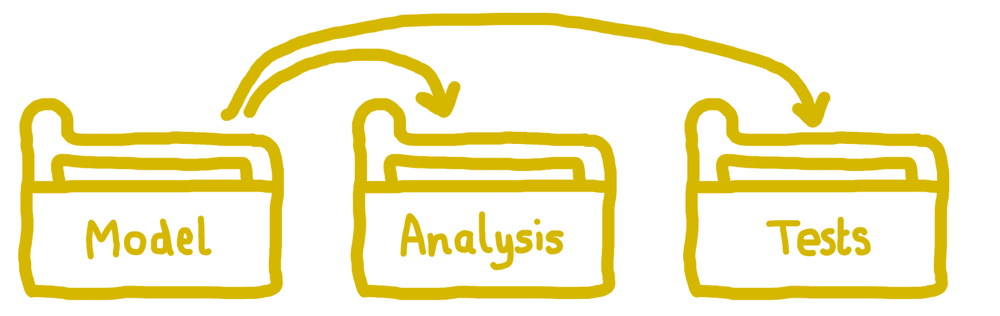
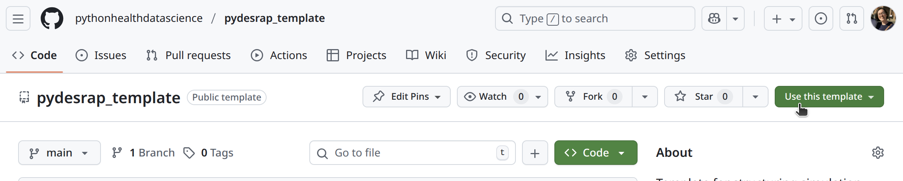

::: {.pale-blue}

**Learning objectives:**

* Learn what **packages** are and their **benefits** for research projects 
* Set up the core **folder and file structure** needed for a package.
* **Configure project, metadata and environment files** appropriately.
* **Check** that package functions load and execute as expected.

**Relevant reproducibility guidelines:**

* NHS Levels of RAP (🥈): Code is well-organised following standard directory format.
* NHS Levels of RAP (🥇): Code is fully packaged.
:::

<br>

This page explains how (and why) to structure your research as a package. At the end, we provide a template repository you can use to easily set-up your own:

::: {.python-content}

<a href="https://github.com/pythonhealthdatascience/pydesrap_template" target="_blank" style="text-decoration: none;">
  <span style="display: inline-flex; align-items: center; background: #1d7898;
  color: #fff; border-radius: 20px; padding: 0.4em 1em; font-weight: 600;
  gap: 0.5em;">
    
    Click to visit pydesrap_template repository
  </span>
</a>

:::

::: {.r-content}

<a href="https://github.com/pythonhealthdatascience/rdesrap_template" target="_blank" style="text-decoration: none;">
  <span style="display: inline-flex; align-items: center; background: #1d7898;
  color: #fff; border-radius: 20px; padding: 0.4em 1em; font-weight: 600;
  gap: 0.5em;">
    
    Click to visit rdesrap_template repository
  </span>
</a>

:::

## Packages

<div class="h3-tight"></div>

### What is a package?

A **package** is a structured collection of code, data, and documentation that can be easily distributed, installed, and reused across projects. They allow developers to group related functions, classes, and documentation together so that they can be managed as a single unit.

::: {.python-content}
**If you've imported libraries like `pandas`, `numpy` or `simpy` in Python, then you've already been using packages.** These packages are created and shared by other developers in exactly the way described here: as reusable bundles that make it easy to build on existing code rather than starting from scratch.
:::
::: {.r-content}
**If you've imported libraries like `dplyr`, `ggplot2` or `simmer` in R, then you've already been using packages.** These packages are created and shared by other developers in exactly the way described here: as reusable bundles that make it easy to build on existing code rather than starting from scratch.
:::

### How are packages structured?

::: {.python-content}

This is an example of a basic python package structure:

```
yourrepository
├── yourpackage
│   ├── __init__.py
│   └── module1.py
└── pyproject.toml
```

It has three key components.

**1. A directory containing one or more modules**.

* The package folder (`yourpackage/`) holds one or more Python files called modules.
* Each module (e.g. `module1.py`) contains code like functions, classes, and variables that perform the core tasks of your package.

**2. An `__init__.py` file.**

* The `__init__.py` file tells Python that a directory should be treated like a package, not just a folder.
* This enables you to import your modules with statements like `import yourpackage.module1`.

**3. A `pyproject.toml` file.**

* This file sits outside the package folder, and is required if you want your package to be installable or published.
* It contains information that helps tools to build and install the package, like the package name, version and dependencies.

:::

::: {.r-content}

This is an example of a basic R package structure:

```
yourrepository
├── R
│   └── module1.R
├── DESCRIPTION
├── man/
└── NAMESPACE
```

It has four key components.

**1. A directory containing one or more modules**.

* The package folder (`R/`) holds one or more R files called modules.
* Each module (e.g. `module1.R`) contains code like functions, classes, and variables that perform the core tasks of your package.

**2. A `DESCRIPTION` file**.

* This file sits outside the package folder, and is required if you want your package to be installable or published.
* It contains information that helps tools to build and install the package, like the package name, version and dependencies.

**3. A `man/` folder**.

* This is automatically generated by the `roxygen2` package.
* It contains help files (using an `.Rd` format) which contain the documentation users will see when they run help commands like `?function_name`. They are generated based on the [docstrings](../style_docs/docstrings.qmd).

**4. A `NAMESPACE` file**.

* This is also automatically generated by `roxygen2`.
* It lists which objects from your package (e.g. functions) are made available to users (as based on `@export` and `@importFrom` tags in your docstrings).

:::

### Why create a package?

Building our simulation model as a package has several advantages...

* The model is **installed** in our environment and can then be easily used anywhere else in our directory (or even from other directories) without needing to specify a system path.

* It encourages us to create a well-organised repository following **standardised** established package structures.

* It helps keep the model and analysis code **separate**, improving maintainability, reusability, and reducing the risk of unintended side effects.

* It supports **automated [testing](../verification_validation/tests.qmd)** frameworks which can verify functionality.



## Create the package structure

:::: {.python-content}

First, let's create the basic directory structure for our simulation package.

### 1. Create folder

In the main project folder, create a folder called `simulation/`.

```
project-name/
└── simulation/   <---
```

::: {.callout-note}

If you followed the [Version control](version.qmd) and [Environments](environment.qmd) pages, then this could be within you `des-rap-python` directory.

This will already contain other files, so your directory with the `simulation/` folder added may look like:

```
des-rap-python/
├── .git/
├── simulation/   <---
├── .gitignore
├── environment.yaml
├── LICENSE
└── README.md
```

:::

### 2. Make `__init__.py` file

Inside the `simulation/` folder, create an `__init__.py` file.

```
project-name/
└── simulation/
    └── __init__.py   <---
```

Open this file and copy in some basic metadata.

```{.python}
"""SimPy Discrete-Event Simulation (DES) Model.
"""

__version__ = "0.1.0"
```

### 3. Add a `.py` file with a function

Within `simulation/`, create another file called `model.py`.

```
project-name/
└── simulation/
    ├── __init__.py
    └── model.py   <---
```

In this, we will add our model code. For now, just copy in this simple function that generates a list of numbers. We will add some real code for our model later.

```{.python}
"""Core simulation model functionality."""


def run_simulation(duration=100):
    """
    Run a simple dummy simulation for the specified duration.

    Parameters
    ----------
    duration: int
        The length of time to run the simulation.

    Returns:
        dict:
            Dummy simulation results.
    """
    return {
        "duration": duration,
        "status": "completed",
        "results": [i for i in range(duration) if i % 10 == 0]
    }

```

### 4. Make `pyproject.toml` file

In the main project folder, create a file called `pyproject.toml`.

```
project-name/
├── simulation/
│   ├── __init__.py
│   └── model.py
└── pyproject.toml   <---
```

Copy the text below into your `pyproject.toml` file. This provides instructions for building the package. We're using `flit` as our build tool because of its simplicity.

```{.bash}
[build-system]
requires = ["flit"]
build-backend = "flit_core.buildapi"

[project]
name = "simulation"
description = "Discrete-event simulation model."
dynamic = ["version"]
```

<br>

::: {.callout-note title="Dynamic version number"}

You have to assign your package a version number using [semantic versioning](https://semver.org/). This follows the syntax `MAJOR.MINOR.PATCH` e.g. `0.1.0`. When packages are updated, then the version number is incremented (e.g. to `0.2.0`).

In our `pyproject.toml`, the `[project]` section uses `dynamic = ["version"]`. This means Flit will automatically look for a variable named `__version__` in your package's `__init__.py` file.

That means (as instructed above) `simulation/__init__.py` should contain:

```{.bash}
__version__ = "0.1.0"
```

:::

::::

:::{.r-content}

We would recommend setting up an `renv` environment before creating your package. If you have not already, following the instructions on the [environments](environment.qmd) page to do this.

For this section, your environment will need to include `roxygen2`, `usethis` and `devtools`. If you set-up the complete enviroment for this book from the "Test yourself" section of the the [environments](environment.qmd) page then you should have these already. If you did not, make sure to install them! An example of a minimal `DESCRIPTION` file for this page would be:

```{.r}
Package: simulation
Title: What the Package Does (One Line, Title Case)
Version: 0.0.0.9000
Authors@R: 
    person("First", "Last", , "first.last@example.com", role = c("aut", "cre"))
Description: What the package does (one paragraph).
License: `use_mit_license()`, `use_gpl3_license()` or friends to pick a
    license
Encoding: UTF-8
Roxygen: list(markdown = TRUE)
RoxygenNote: 7.0.0
Imports:
    devtools,
    roxygen2,
    usethis
```

You can check if the three packages we mention are in your environment by running this command from the R console:

```{.r}
packageVersion("devtools")
packageVersion("usethis")
packageVersion("roxygen2")
```

If will print the version number of each package if installed.

Now, let's first create the basic directory structure for our simulation package.

### 1. Create folder

In the main project folder, create a folder called `R/`.

```
project-name/
└── R/           <---
```

::: {.callout-note}

If you followed the [Version control](version.qmd) and [Environments](environment.qmd) pages, then this could be within you `des-rap-r` directory.

This will already contain other files, so your directory with the `R/` folder added may look like:

```
des-rap-r/
├── .git/
├── .Rproject.user/
├── R/           <---
├── renv/
├── .gitignore
├── .Rprofile
├── .Rproj
├── DESCRIPTION
├── LICENSE
├── README.md
└── renv.lock
```

:::

### 2. Add a `.R` file with a function

Within `R/`, create a file called `model.R`.

```
project-name/
└── R/
    └── model.R   <---
```

This file is our module, into which we could later add modelling functions.

For now, just copy in this simple function that generates a list of numbers. We will add some real code for our model later. 

```{.r}
# Core simulation model functionality

#' Run a simple dummy simulation for the specified duration.
#'
#' @param duration Numeric. The length of time to run the simulation.
#'
#' @return list. Dummy simulation results.
#' @export

run_simulation <- function(duration = 100) {
  results <- seq(0, duration - 1)
  results <- results[results %% 10 == 0]
  
  return(list(
    duration = duration,
    status = "completed",
    results = results
  ))
}

```

### 3. Edit your `DESCRIPTION` file

If you have worked through the [environments](environment.qmd) page then you should already have a `DESCRIPTION` file listing dependencies, though this step will walk you through more of the meta-data in that file important when structuring our work as a package.

::: {.callout-note title="If you don't yet have a `DESCRIPTION` file..." collapse="true"}

If you haven't already, then create a `DESCRIPTION` file in the main project folder.

```
project-name/
├── R/
│   └── model.R
└── DESCRIPTION   <---
```

Open the file and copy in the template below. This is similar to the standard template generated by `usethis::use_description()`, but with a few extra sections.

```{.bash}
Package: simulation
Type: Package
Title: What the Package Does (One Line, Title Case)
Version: 0.0.0.9000
URL: ...
Authors@R: 
    person("First", "Last", , "first.last@example.com", role = c("aut", "cre"))
Description: What the package does (one paragraph).
License: `use_mit_license()`, `use_gpl3_license()` or friends to pick a
    license
Encoding: UTF-8
Roxygen: list(markdown = TRUE)
RoxygenNote: 7.0.0
Imports:
    ...
Suggests:
    ...
```

:::

We will then fill in the template with relevant information for our project. You don't need to change `Type`, `Encoding`, or `Roxygen`. For the other arguments:

* **Package**: When using `devtools` to work with our package (as below), it will prompt you to use a name that complies with CRAN (the main R package repository). They require that the name is only made up of letters, numbers and periods (`.`) - and that it must start with a letter and cannot end with a period. When structuring our research project as a package, this is not often with the aim of uploading it to CRAN, but it can be simple/good practice to follow these guidelines anyway, and means you avoid `devtools` error messages!

* **Title**: Capitalised single line description of the package which does not end with a period (`.`).

* **Version**: The package version. For R packages, this is usually set to `0.0.0.9000` during early development - though some developers prefer to set it to `0.1.0`, as we have done. The version number is used to track changes to the package over time. It typically follows [semantic versioning](https://semver.org/spec/v2.0.0.html), with three numbers representing major, minor and patch changes. For more about how and when to update the version, see the page on [changelogs](../sharing/changelog.qmd).

* **Authors**: List of author names, emails and roles. The main role options are the current maintainer (creator, `cre`), people who have made significant contributions (author, `aut`), those who have made smaller contributions (contributor, `ctb`), copyright holders (`cph`) and funders (`fnd`). You can add additional information using the `comment` argument, like your ORCID ID.

* **URL**: Link to your repository. If you don't have one, we'd strongly recommend making one - check out the [version control](version.qmd) page.

* **Description**: Single paragraph describing project.

* **License**: A license tells others how they can use your code. The `usethis` package makes it easy to add a license: just call the function for your chosen license, for example:

    ```{.r}
    usethis::use_mit_license()
    ```

    This will update the License field in `DESCRIPTION` and create both `LICENSE` (with the year and copyright holder) and `LICENSE.md` (with the full licence text). Note: it will prompt you to overwrite any existing licence files.

    R packages use this two-file structure, while GitHub typically expects a single `LICENSE` file containing the full text. Unless you plan to submit to CRAN - which requires the R package structure - either approach is fine. For simplicity, we recommend sticking with the standard R package setup using `usethis`, and agreeing if prompted to overwrite old license files.

    For more information, see the [licensing](../sharing/licence.qmd) page in this book, and the [R Packages book](https://r-pkgs.org/license.html).

* **RoxygenNote**: `roxygen2` is used when documenting code. Update this to the version of `roxygen2` which you have installed - to check, run:

    ```{.r}
    packageVersion("roxygen2")
    ```

* **Imports**: These are packages necessary for your package. In other words, if it's used by code in `R/`, then list it here.

* **Suggests**: These are any other packages needed. For example, you might include those for development (`devtools`), testing (`testthat`), linting (`lintr`) - or packages used in your analysis (i.e. any code *not* in `R/`).

As an example:

```{.bash}
Package: simulation
Type: Package
Title: Simulation
Version: 0.1.0
Authors@R: c(
    person(
      "Amy", "Heather",
      email = "a.heather2@exeter.ac.uk",
      role = c("aut", "cre"),
      comment = c(ORCID = "0000-0002-6983-2759")
    )
  )
URL: https://github.com/pythonhealthdatascience/rdesrap_mms
Description: Template reproducible analytical pipeline (RAP) for simple R
    discrete-event simulation (DES) model.
License: MIT + file LICENSE
Encoding: UTF-8
LazyData: true
RoxygenNote: 7.3.2
Imports:
    simmer,
    magrittr,
    dplyr,
    purrr,
    rlang,
    tidyr,
    tidyselect,
    future,
    future.apply,
    ggplot2,
    tibble,
    gridExtra,
    R6
Suggests:
    testthat (>= 3.0.0),
    patrick,
    lintr,
    devtools,
    xtable,
    data.table,
    mockery
Config/testthat/edition: 3
```

### 4. Add/edit `.Rbuildignore`

You should find an `.Rbuildignore` file is automatically created which has the following lines:

```{.bash}
^renv$
^renv\.lock$
```

This tells `devtools` to ignore `renv/` when working with your local package.

We want to amend this to also ignore our R project files like so:

```{.bash}
^renv$
^renv\.lock$
^.*\.Rproj$
^\.Rproj\.user$
```

If you don't already have one, then create an `.Rbuildignore` file and copy the text above in.

This is to avoid warnings when we run `devtools::check()` in the following section.

:::

## Configure your project

::: {.python-content}

We now want to install our package into our environment.

### Option A: Pre-existing environment

If you already have a conda environment (e.g. from following instructions in the [environments](environment.qmd) page), then you should first activate it:

```{.bash}
conda activate envname
```

Then edit the `environment.yaml` to add your local package using `-e .` within the `pip:` installation section. The syntax `-e .` installs the package from the current directory (`.`) in "editable" mode (`-e`) so that it will update with any changes to the source code in `simulation/`.

```{.bash}
  - pip:
    - -e .
```

To update the installed environment based on the file, run:

```{.bash}
conda env update --file environment.yaml --prune
```

If you run `conda list`, you should now see our `simulation` package listed as a dependency like so:

```
# Name                    Version                   Build  Channel
simulation                0.1.0                    pypi_0    pypi
```

### Option B: New environment

If you do not have an environment yet, create one using the [environments](environment.qmd) page instructions.

A simple `environment.yaml` with your local package (`-e .`, as explained above) might look like:

```{.bash}
name: envname
channels:
  - conda-forge
dependencies:
  - ipykernel
  - pip
  - python=3.13
  - pip:
    - -e .
```

We've included `ipykernel` as this is needed to run Jupyter notebooks - which we will create in the next section to test our package works.

As explained on [environments](environment.qmd), you can then create, activate and check your environment by running:

```{.bash}
conda env create --file environment.yaml
conda activate envname
conda list
```

### Option C: Other environment managers

A similar syntax is followed for other Python environment managers.

* **venv:** Add `-e .` to your `requirements.txt` file or run `pip install -e .`
* **poetry:** Run `poetry add -e .`
* **uv:** Run `uv add -e .`

::::

::: {.r-content}

We will use `devtools` to build documentation and run checks.

### 1. Build package documentation

The function we created in `model.R` had a docstring (for more info on writing docstrings, see the [docstrings](../style_docs/docstrings.qmd) page). We can create the documentation for this by calling:

```{.r}
devtools::document()
```

This will create:

* `man/`: folder with roxygen2 documentation for each function in package.
* `NAMESPACE`: file which will list all the functions and packages used within your package.

```
project-name/
├── man/        <---
│   └── ...
├── R/
│   └── model.R
├── DESCRIPTION
└── NAMESPACE   <---
```

### 2. Check the package

You can check that the package is set-up correctly by running:

```{.r}
devtools::check()
```

This will load it and perform standard checks. If all is well, you should get an output similar to:

```
> devtools::check()
══ Documenting ══════════════════════════════════════════════════════════════════════════════
ℹ Updating simulation documentation
ℹ Loading simulation
Writing NAMESPACE
Writing run_simulation.Rd

══ Building ═════════════════════════════════════════════════════════════════════════════════
Setting env vars:
• CFLAGS    : -Wall -pedantic -fdiagnostics-color=always
• CXXFLAGS  : -Wall -pedantic -fdiagnostics-color=always
• CXX11FLAGS: -Wall -pedantic -fdiagnostics-color=always
• CXX14FLAGS: -Wall -pedantic -fdiagnostics-color=always
• CXX17FLAGS: -Wall -pedantic -fdiagnostics-color=always
• CXX20FLAGS: -Wall -pedantic -fdiagnostics-color=always
── R CMD build ──────────────────────────────────────────────────────────────────────────────
✔  checking for file ‘/home/amy/Documents/stars/hospital-des-r/DESCRIPTION’ ...
─  preparing ‘simulation’:
✔  checking DESCRIPTION meta-information ...
─  checking for LF line-endings in source and make files and shell scripts
─  checking for empty or unneeded directories
─  building ‘simulation_0.1.0.tar.gz’
   
══ Checking ═════════════════════════════════════════════════════════════════════════════════
Setting env vars:
• _R_CHECK_CRAN_INCOMING_USE_ASPELL_           : TRUE
• _R_CHECK_CRAN_INCOMING_REMOTE_               : FALSE
• _R_CHECK_CRAN_INCOMING_                      : FALSE
• _R_CHECK_FORCE_SUGGESTS_                     : FALSE
• _R_CHECK_PACKAGES_USED_IGNORE_UNUSED_IMPORTS_: FALSE
• NOT_CRAN                                     : true
── R CMD check ──────────────────────────────────────────────────────────────────────────────
─  using log directory ‘/tmp/RtmpyQepIc/file4b07699e20de/simulation.Rcheck’
─  using R version 4.4.1 (2024-06-14)
─  using platform: x86_64-pc-linux-gnu
─  R was compiled by
       gcc (Ubuntu 11.4.0-1ubuntu1~22.04) 11.4.0
       GNU Fortran (Ubuntu 11.4.0-1ubuntu1~22.04) 11.4.0
─  running under: Ubuntu 24.04.2 LTS
─  using session charset: UTF-8
─  using options ‘--no-manual --as-cran’
✔  checking for file ‘simulation/DESCRIPTION’
─  this is package ‘simulation’ version ‘0.1.0’
─  package encoding: UTF-8
✔  checking package namespace information
✔  checking package dependencies (1.4s)
✔  checking if this is a source package ...
✔  checking if there is a namespace
✔  checking for executable files
✔  checking for hidden files and directories
✔  checking for portable file names
✔  checking for sufficient/correct file permissions
✔  checking serialization versions
✔  checking whether package ‘simulation’ can be installed (771ms)
✔  checking installed package size ...
✔  checking package directory
✔  checking for future file timestamps
✔  checking DESCRIPTION meta-information ...
✔  checking top-level files
✔  checking for left-over files
✔  checking index information
✔  checking package subdirectories ...
✔  checking code files for non-ASCII characters ...
✔  checking R files for syntax errors ...
✔  checking whether the package can be loaded ...
✔  checking whether the package can be loaded with stated dependencies ...
✔  checking whether the package can be unloaded cleanly ...
✔  checking whether the namespace can be loaded with stated dependencies ...
✔  checking whether the namespace can be unloaded cleanly ...
✔  checking loading without being on the library search path ...
N  checking dependencies in R code ...
   Namespaces in Imports field not imported from:
     ‘R6’ ‘dplyr’ ‘future’ ‘future.apply’ ‘ggplot2’ ‘gridExtra’ ‘magrittr’
     ‘purrr’ ‘rlang’ ‘simmer’ ‘tibble’ ‘tidyr’ ‘tidyselect’
     All declared Imports should be used.
✔  checking S3 generic/method consistency ...
✔  checking replacement functions ...
✔  checking foreign function calls ...
✔  checking R code for possible problems (1.5s)
✔  checking Rd files ...
✔  checking Rd metadata ...
✔  checking Rd line widths ...
✔  checking Rd cross-references ...
✔  checking for missing documentation entries ...
✔  checking for code/documentation mismatches (343ms)
✔  checking Rd \usage sections ...
✔  checking Rd contents ...
✔  checking for unstated dependencies in examples ...
─  checking examples ... NONE
✔  checking for non-standard things in the check directory
✔  checking for detritus in the temp directory
   
   See
     ‘/tmp/RtmpyQepIc/file4b07699e20de/simulation.Rcheck/00check.log’
   for details.
   
── R CMD check results ──────────────────────────────────────────────── simulation 0.1.0 ────
Duration: 7.3s

❯ checking dependencies in R code ... NOTE
  Namespaces in Imports field not imported from:
    ‘R6’ ‘dplyr’ ‘future’ ‘future.apply’ ‘ggplot2’ ‘gridExtra’ ‘magrittr’
    ‘purrr’ ‘rlang’ ‘simmer’ ‘tibble’ ‘tidyr’ ‘tidyselect’
    All declared Imports should be used.

0 errors ✔ | 0 warnings ✔ | 1 note ✖
```

The note in this case is because we modified the `DESCRIPTION` file used for the `des-rap-r` environment (from the [environments](environment.qmd) page) which contains imports that are not currently used within `R/` - but don't worry about this for now, as will do later when build our simulation model.

### 3. Install the package

We can also verify that our package is working by trying to install it. From the console, run:

```{.r}
devtools::install()
```

:::

## Test if the package works

:::{.python-content}

We will run our model and analyse results within **Jupyter notebooks**, as they allow us to combine code, results and explanations in one document. This can help make our methods and results easier to share, read through and understand.

In this case, we're creating an `.ipynb` file so we can have a go at loading and using our package, to check it works.

### 1. Create directory and notebook

We create a dedicated directory for our notebooks in the main project folder (`notebooks/`), and add a notebook (`simulation_test.ipynb`).

```
project-name/
├── notebooks/                  <---
│   └── simulation_test.ipynb   <---
├── simulation/
│   ├── __init__.py
│   └── model.py
└── pyproject.toml
```

### 2. Check our package works

Open `notebooks/simulation_test.ipynb` and add the following code. This will test that we are able to import our package and use the basic function we had created.

```{.python}
# Import our simulation package
from simulation.model import run_simulation

# Run the simulation with default parameters
results = run_simulation()
print(f"Simulation completed with duration: {results['duration']}")
print(f"Results: {results['results']}")

# Run with a different duration
long_results = run_simulation(duration=200)
print(f"Longer simulation completed with duration: {long_results['duration']}")
print(f"Number of results: {len(long_results['results'])}")
```

When you run the cell, you should see an output confirming that the simulation function runs and returns results, if everything is set up correctly.

```
Simulation completed with duration: 100
Results: [0, 10, 20, 30, 40, 50, 60, 70, 80, 90]
Longer simulation completed with duration: 200
Number of results: 20
```

:::

::: {.r-content}

We will run our model and analyse results within **R markdown (.Rmd)** files, as they combine code, results and explanations in one document. This can help make our methods and results easier to share, read through and understand.

In this case, we're creating an `.Rmd` file so we can have a go at loading and using our package, to check it works.

### 1. Create directory and R markdown file

We create a dedicated directory for our R markdown files in the project root (`rmarkdown/`), and add a file (`simulation_test.Rmd`).

```
project-name/
├── man/
│   └── ...
├── R/
│   └── model.R
├── rmarkdown/                <---
│   └── simulation_test.Rmd   <---
├── DESCRIPTION
└── NAMESPACE
```

As part of an R package, you can create a `vignettes` folder, which is typically used to hold guides, tutorials, or extended examples demonstrating how to use the package. Some people suggest putting your analysis in `vignettes/`, as this ensures everything is run from scratch each time you call `devtools::check()`, helping maintain reproducibility.

However, we usually prefer to use an `rmarkdown/` folder when structuring research as a package because running analyses as vignettes is very inefficient for simulations with longer run times, and saving outputs from vignettes can lead to file path errors during the package build process.

### 2. Check our package works

Open `rmarkdown/simulation_test.Rmd` and add the following code into a cell. This means you put \`\`\`{r} in the line before the code, and \`\`\` in the line after.

This code will test that we are able to import our package and use the basic function we had created.

```{.r}
# Load the package from the local directory
devtools::load_all()

# Load the package
library(simulation)

# Run the simulation with default parameters
results <- run_simulation()
cat(sprintf("Simulation completed with duration: %s\n", results$duration))
cat(sprintf("Results: %s\n", toString(results$results)))

# Run with a different duration
long_results <- run_simulation(duration = 200)
cat(sprintf("Longer simulation completed with duration: %s\n", long_results$duration))
cat(sprintf("Number of results: %d\n", length(long_results$results)))
```

When you run the cell, you should see an output confirming that the simulation function runs and returns results, if everything is set up correctly.

```
ℹ Loading simulation
Simulation completed with duration: 100
Results: 0, 10, 20, 30, 40, 50, 60, 70, 80, 90
Longer simulation completed with duration: 200
Number of results: 20
```

:::

## Summary

:::{.python-content}

To structure your simulation project as a python package:

* Place all core python functions in the `simulation/` directory (e.g. `model.py`).
* Create `simulation/__init__.py` and `pyproject.toml` to set-up as a package.
* Organise analysis into a separate directory (e.g. `notebooks/`).

For example:

```
project-name/
├── notebooks/
│   └── simulation_test.ipynb
├── simulation/
│   ├── __init__.py
│   └── model.py
└── pyproject.toml
```

:::

:::{.r-content}

To structure your simulation project as an R package:

* Place all core R functions in the `R/` directory (e.g. `model.R`).
* Create a `DESCRIPTION` file to define package metadata.
* Use `devtools` and `roxygen2` to generate documentation (`man/`, `NAMESPACE`) and check your package.
* Organise analysis into a separate directory (e.g. `rmarkdown/`).

For example:

```
project-name/
├── man/
├── R/
│   └── ...
├── rmarkdown/
│   └── ...
├── DESCRIPTION
└── NAMESPACE
```

:::

## Template repository

To help speed up project set-up, a **template repository** is available that contains the complete structure described on this page.

::: {.python-content}

<a href="https://github.com/pythonhealthdatascience/pydesrap_template" target="_blank" style="text-decoration: none;">
  <span style="display: inline-flex; align-items: center; background: #1d7898;
  color: #fff; border-radius: 20px; padding: 0.4em 1em; font-weight: 600;
  gap: 0.5em;">
    
    Click to visit pydesrap_template repository
  </span>
</a>

:::

::: {.r-content}

You should follow the instructions above to amend the template `DESCRIPTION` file.

<a href="https://github.com/pythonhealthdatascience/rdesrap_template" target="_blank" style="text-decoration: none;">
  <span style="display: inline-flex; align-items: center; background: #1d7898;
  color: #fff; border-radius: 20px; padding: 0.4em 1em; font-weight: 600;
  gap: 0.5em;">
    
    Click to visit rdesrap_template repository
  </span>
</a>

:::

<br>

On the GitHub, simply click &nbsp;[Use this template]{style="background: #597341; color: #fff; border-radius:4px; padding:2px 8px; font-family:monospace; font-weight:bold; font-size:90%;"}&nbsp; and then select "Create a new repository" to set-up your own repository using the template.

::: {.python-content}



:::

::: {.r-content}


:::

<br>

If you want to use the template outside of GitHub, that is also possible.

Click the &nbsp;[Code]{style="background: #597341; color: #fff; border-radius:4px; padding:2px 8px; font-family:monospace; font-weight:bold; font-size:90%;"}&nbsp; button then select "Download ZIP".

{fig-align="center" width=50%}

## Test yourself

If you haven't already followed along, **now's the time to put everything from this page into practice!**

You have two options:

**1. Set up manually**. Follow the steps above to create the folder structure, configuration files, and test code from scratch. Before getting started, make sure to set-up your repository with [version control](version.qmd) and an [environment](environment.qmd).

::: {.python-content}

**2. Use the template.** [Use the template repository](https://github.com/pythonhealthdatascience/pydesrap_template) to create a pre-configured repository. You could then customise it - for example, if you are following along with this book, you could change the environment to that provided on the [environment](environment.qmd) page.

:::

::: {.r-content}

**2. Use the template.** [Use the template repository](https://github.com/pythonhealthdatascience/rdesrap_template) to create a pre-configured repository.

* You could then customise it - for example, if you are following along with this book, you could change the environment to that provided on the [environment](environment.qmd) page.
* You should also edit the `DESCRIPTION` file - follow the detailed instructions above to do so! If you change the name of the package, you will need to change your `library(simulation)` call in `simulation_test.Rmd` to refer to the new name.

:::

::: {.callout-tip title="Hints"}

* Use the folder, file and code templates already given above.
* Tweak names and descriptions for your own project.
* If you hit any errors, check your files are in the right place, and look back at earlier steps for solutions.

:::

## Further information

:::{.python-content}

* ["How I use Python to organize my data analyses"](https://joshuacook.netlify.app/posts/2024-07-27_python-data-analysis-org/) from Joshua Cook 2024 

  *Approach to structuring python data analysis as a package.*

:::

:::{.r-content}

* ["Open, Reproducible, and Distributable Research With R Packages"](https://dante-sttr.gitlab.io/r-open-science/) from the DANTE Project

  *Website on using packages for structuring your work - lots of great information, like this page on [vignettes](https://dante-sttr.gitlab.io/r-open-science/reports-manuscripts.html).*

* ["Sharing and organizing research products as R packages"](https://doi.org/10.3758/s13428-020-01436-x) from Vuorre and Crump 2020

  *Publication on structuring research as a package*.

* ["R Packages" book](https://r-pkgs.org/) by Hadley Wickham and Jennifer Bryan

  *Go-to-resource for writing R packages. Some suggested pages to read at this point would include ["4  Fundamental development workflows"](https://r-pkgs.org/workflow101.html) and ["9  DESCRIPTION"](https://r-pkgs.org/description.html).*

:::

<br><br>
