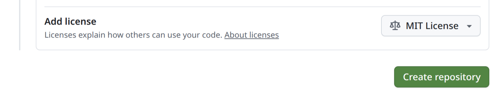

::: {.pale-blue}

**Learning objectives:**

* Understand **why** licenses are necessary.
* Learn how to **choose** an appropriate licence.
* Know the standard ways to **add a licence** to a project.

**Relevant reproducibility guidelines:**

* STARS Reproducibility Recommendations (⭐): Share code with an open licence.

:::

## What is a licence?

A licence is simply a **text file** that explains how other people are allowed to use your work. 

It usually sets out things like:

* Whether attribution (i.e., citing the original author) is required.
* Whether it can be used for commercial purposes.
* Whether modifications or derivates works are allowed.
* Any rules for sharing (e.g., requiring others to use the same licence or not).

For example, here's the popular [MIT licence](https://choosealicense.com/licenses/mit/):

::: {.pale-grey}

```
MIT License

Copyright (c) [year] [fullname]

Permission is hereby granted, free of charge, to any person obtaining a copy
of this software and associated documentation files (the "Software"), to deal
in the Software without restriction, including without limitation the rights
to use, copy, modify, merge, publish, distribute, sublicense, and/or sell
copies of the Software, and to permit persons to whom the Software is
furnished to do so, subject to the following conditions:

The above copyright notice and this permission notice shall be included in all
copies or substantial portions of the Software.

THE SOFTWARE IS PROVIDED "AS IS", WITHOUT WARRANTY OF ANY KIND, EXPRESS OR
IMPLIED, INCLUDING BUT NOT LIMITED TO THE WARRANTIES OF MERCHANTABILITY,
FITNESS FOR A PARTICULAR PURPOSE AND NONINFRINGEMENT. IN NO EVENT SHALL THE
AUTHORS OR COPYRIGHT HOLDERS BE LIABLE FOR ANY CLAIM, DAMAGES OR OTHER
LIABILITY, WHETHER IN AN ACTION OF CONTRACT, TORT OR OTHERWISE, ARISING FROM,
OUT OF OR IN CONNECTION WITH THE SOFTWARE OR THE USE OR OTHER DEALINGS IN THE
SOFTWARE.
```

:::

## What happens if I don't include a licence?

If you don't include a licence, **nobody else has permission to use your work**.

This means that, *legally*, people cannot copy, share or modify your code.

This applies to everyone outside of you - even colleagues inside your own organisation.

## How do I choose a licence?

Different kinds of licenses exist depending on what you're sharing. Some are written for **software and code**, others for **text and data**.

Licenses can be more **permissive** (letting people do almost anything, with few requirements) or more **restrictive** (placing conditions on use or sharing).

Some common examples include:

* **MIT Licence** - a very permissive, simple licence for software.
* **CC BY** - a Creative Commons licence requiring attribution for text/content.
* **Open Government Licence** - a licence often used by the UK public sector.

For helping choosing an appropriate licence:

* For code, visit <https://choosealicense.com/>.
* For text/data, visit <https://creativecommons.org/chooser/>.

## How do I add a licence to my project?

The easiest way to add a license is during GitHub repository set-up. Just use the **Add license** option, and Github will add the right `LICENSE` file for you.



If you didn't add it then though, it's still very simply to add a license at any time. You just need to copy the license text from sites like <https://choosealicense.com/licenses/> or <https://opensource.org/licenses>, paste it into a new file called `LICENSE`, and commit it to your project.

:::: {.r-content}

### Licensing in R

Licensing in R is a little different from other languages. As covered in the [licensing page of the R Packages](https://r-pkgs.org/license.html) book...

1. You list your license in the `DESCRIPTION` file, e.g.,:

::: {.pale-grey}

```
License: MIT + file LICENSE
```

:::

2. You include a `LICENSE` file which contains year and copyright details:

::: {.pale-grey}

```
YEAR: 2025
COPYRIGHT HOLDER: STARS Project Team
```

:::

3. You can also have a `LICENSE.md` file which contains the full text of the license (eqvuialent to `LICENSE` above), but this gets ignored when building the package (add to `.Rbuildignore`).

The usethis package (e.g., `use_mit_license()`) can set this up for you.

You also can use the license format default with github described above etc. you just need to add to rebuildignore and dotdotdot

::::

## Explore the example models

::: {.python-content}





These repositories use MIT licenses (see `LICENSE` file).

:::

::: {.r-content}





These repositories use MIT licenses (see `LICENSE` and `LICENSE.md` files, and note in `DESCRIPTION`).

:::

## Test yourself

```{r}
#| echo: false
library(webexercises)
```

::: {.callout-note}

## What is a license, in the context of code or content?

```{r}
#| output: asis
#| echo: false
cat(longmcq(c(
  "A version control file.",
  answer = "A document that sets rules for how others can use your work.",
  "A type of configuration file for tests."
)))
```

:::

::: {.callout-note}

## What is the legal default if you share code online without a licence?

```{r}
#| output: asis
#| echo: false
cat(longmcq(c(
  "Anyone can use and modify it freely.",
  "Only your collaborators can use it.",
  answer = "No one can legally use, copy, or modify it."
)))
```

:::

<br><br>
