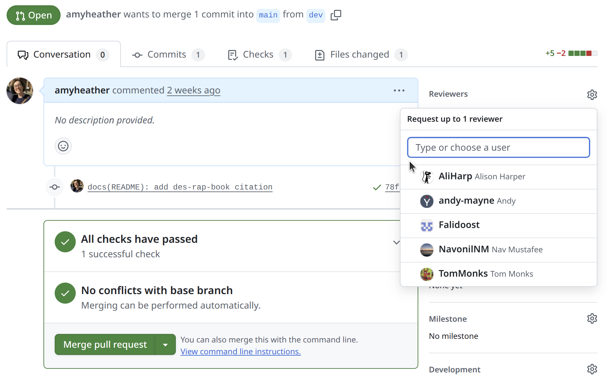
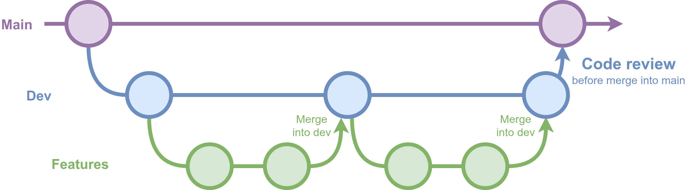

::: {.pale-blue}

**Learning objectives:**

* TODO

**Pre-reading:**

You may find it helpful to read the [Version control](../setup/version.qmd) page, as tools like GitHub pull requests are common for code review.

**Relevant reproducibility guidelines:**

* NHS Levels of RAP (🥉): Code has been peer reviewed.

:::

## What is code review and why do it?

**Code review (or "peer review")** involves having another person examine your code. 

This can be used to check **reproducibility**: can the reviewer set up your environment, run your code and get the same results?

It'll also improve code **quality**. Reviewers can identify errors, bugs, and logic problems so these can be fixed before results are published or used by others. They suggest missing features, possible improvements or alternative approaches.

When **team members** review code, it increases shared understanding of the codebase and can also allow them to gain new insights by seeing different coding styles and approaches.

## When to do code review?

**During development.** The earlier you catch issues, the easier they are to fix. If you leave review until the end of the project and find a deep issue, it can be painful.

**Regularly.** If you do it little and often, review is usually quicker and can go into more detail than if reviewers are faced with the entire codebase all at once.

That said, this approach is often more ideal than realistic. In research, work doesn't always follow tidy steps, and it's common to end up with just one or two big review moments instead of regular check-ins. Even so, any review - whether early, late, or somewhere in between - helps strengthen your code.

## Structures and tools for review

### Pull requests

In research software, peer review most often happens through pull requests ([Eisty and Carver 2022](https://doi.org/10.1007/s10664-021-10053-x)). As explained on the [Version control](../setup/version.qmd) page, a pull request is created when you merge a branch back into the main codebase.

This is a natural point for peer review, and platforms like GitHub make it easy to request feedback from others. For example, you can request **reviewers**, who will be notified to look over your changes.

It's also a good point to run automated tests with GitHub Actions, checking your code before it's merged (see the [GitHub actions](../style_docs/github_actions.qmd) page for details).

 

You can use pull requests with just main and dev branches, but that approach often means either not reviewing every merge, or letting branches grow large and unwieldy over time.

{width="80%" fig-align="center"}

A more flexible and common setup uses main, dev, and feature branches. Team members work on feature branches that merge into dev, with reviews at merge points, or as changes are merged into main. This keeps branches focused and helps avoid accumulating too many changes in one place.

 

These are recommendations, and its rare to follow them perfectly in research. If you only have time for occasional peer review, you might:

* **Target reviews for specific pull requests** into main, rather than every change.
* **Invite reviewers to create a fork**, make suggestions and changes there, and then **submit a pull request** including their feedback.

When reviews are less frequent, more informal methods like GitHub issues can also be a good option.

