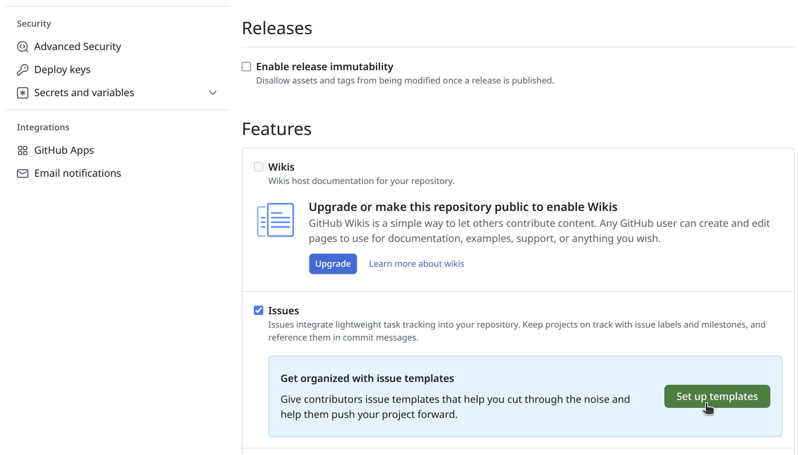
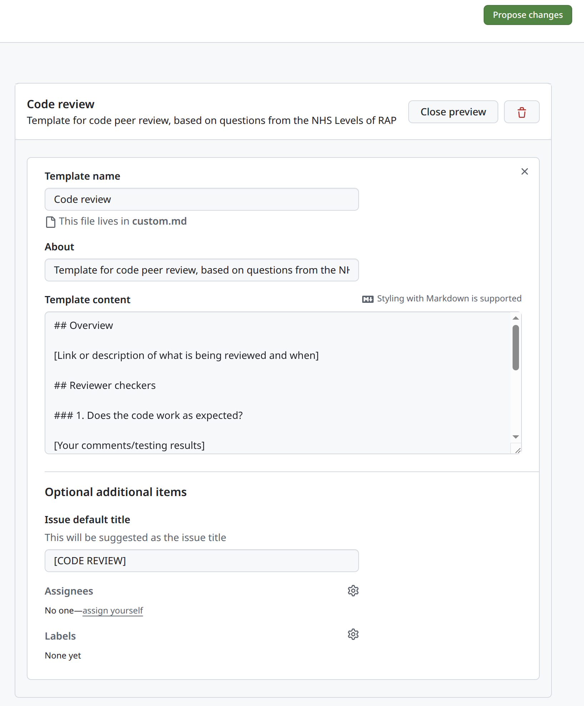
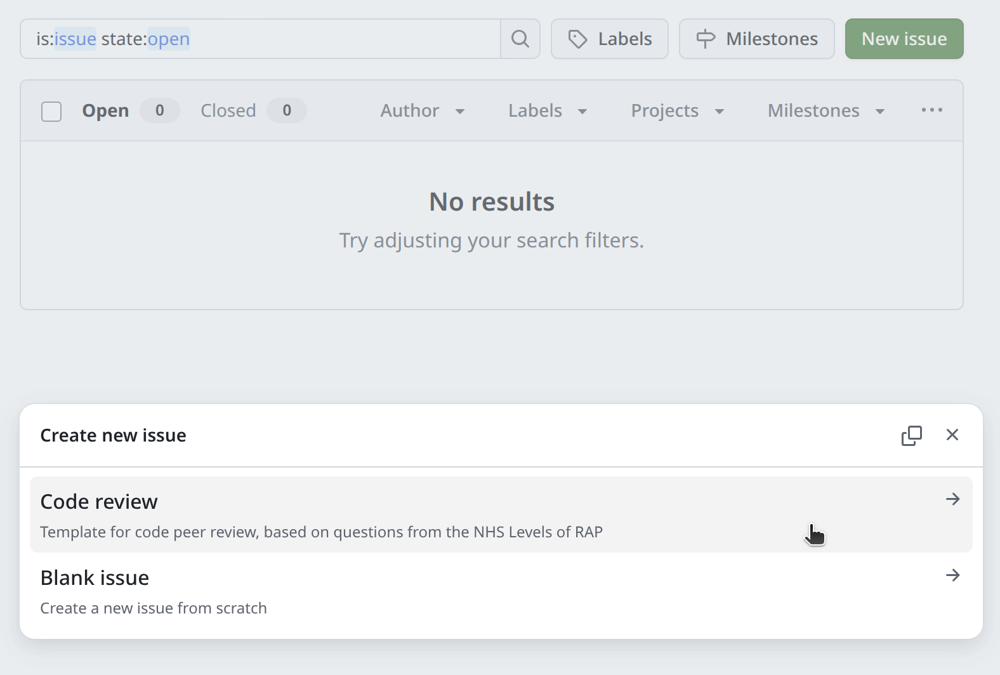

::: {.pale-blue}

**Learning objectives:**

* Understand the purpose of code review.
* Learn 

**Pre-reading:**

You may find it helpful to read the [Version control](../setup/version.qmd) page, as tools like GitHub pull requests are common for code review.

**Relevant reproducibility guidelines:**

* NHS Levels of RAP (🥉): Code has been peer reviewed.

:::

## What is code review and why do it?

**Code review (or "peer review")** involves having another person examine your code. 

This can be used to check **reproducibility**: can the reviewer set up your environment, run your code and get the same results? Providing automated tests gives reviewers a straightforward way to confirm that your code produces consistent results in different setups (for more on setting up tests, see the [Tests](../verification_validation/tests.qmd) page).

It'll also improve code **quality**. Reviewers can identify errors, bugs, and logic problems so these can be fixed before results are published or used by others. They suggest missing features, possible improvements or alternative approaches.

When **team members** review code, it increases shared understanding of the codebase and can also allow them to gain new insights by seeing different coding styles and approaches. Regular review also makes it much easier to hand projects over when staff join, leave, or change roles, since more people are familiar with how the code works.

## When to do code review?

**During development.** The earlier you catch issues, the easier they are to fix. If you leave review until the end of the project and find a deep issue, it can be painful.

**Regularly.** If you do it little and often, review is usually quicker and can go into more detail than if reviewers are faced with the entire codebase all at once.

That said, this approach is often more ideal than realistic. In research, work doesn't always follow tidy steps, and it's common to end up with just one or two big review moments instead of regular check-ins. Even so, any review - whether early, late, or somewhere in between - helps strengthen your code.

## Structures and tools for review

### Pull requests

In research software, peer review most often happens through pull requests ([Eisty and Carver 2022](https://doi.org/10.1007/s10664-021-10053-x)). As explained on the [Version control](../setup/version.qmd) page, a pull request is created when you merge a branch back into the main codebase.

This is a natural point for peer review, and platforms like GitHub make it easy to request feedback from others. For example, you can request **reviewers**, who will be notified to look over your changes.

It's also a good point to run automated tests with GitHub Actions, checking your code before it's merged (see the [GitHub actions](../style_docs/github_actions.qmd) page for details).

 

You can use pull requests with just main and dev branches, but that approach often means either not reviewing every merge, or letting branches grow large and unwieldy over time.

{width="80%" fig-align="center"}

A more flexible and common setup uses main, dev, and feature branches. Team members work on feature branches that merge into dev, with reviews at merge points, or as changes are merged into main. This keeps branches focused and helps avoid accumulating too many changes in one place.

 

These are recommendations, and its rare to follow them perfectly in research. If you only have time for occasional peer review, you might:

* **Target reviews for specific pull requests** into main, rather than every change.
* **Invite reviewers to create a fork**, make suggestions and changes there, and then **submit a pull request** including their feedback.

When reviews are less frequent, more informal methods like GitHub issues can also be a good option.

### GitHub issues

**GitHub issues** are discussion threads attached to a repository. They offer a flexible, informal way to talk about code without being linked to specific sets of changes.

To start one, just click &nbsp;[New issue]{style="background: #597341; color: #fff; border-radius:4px; padding:2px 8px; font-family:monospace; font-weight:bold; font-size:90%;"}&nbsp; on the GitHub repository and fill in the details.

Issues work well for more occasional reviews, letting you track comments and discussions over time. If review happens elsewhere (like email or in person), **writing a summary in an issue** helps keep a transparent record in one place, making it easy to refer back later.

You can also create **templates** for GitHub issues. A template provides a pre-set structure, making reviews more consistent and easier to follow. You can set them up by going to the repository **⚙ Settings**, then scrolling down to **Features** and selecting &nbsp;[Set up templates]{style="background: #597341; color: #fff; border-radius:4px; padding:2px 8px; font-family:monospace; font-weight:bold; font-size:90%;"}&nbsp;.

You can then select **Custom template**, then **Preview and edit**, and the pencil symbol ✎ to edit the template. When you're ready, you can propose and commit changes to add the template to the repository.

Now, when reviewers select &nbsp;[New issue]{style="background: #597341; color: #fff; border-radius:4px; padding:2px 8px; font-family:monospace; font-weight:bold; font-size:90%;"}&nbsp;, they are prompted to choose between starting a blank issue or using a template. Selecting the template will open a draft issue with the template questions/structure you created.

<!--TODO: CHECKLISTS, SUBISSUES, AND GITHUB PROJECTS-->

### Conversations

Sometimes, a real conversation is the best code review tool. Meeting in person or virtually to talk through code can help clarify questions, resolve confusion, and share knowledge within the team. Afterwards, you can add a summary of the discussion to a GitHub issue to keep a clear record for future reference.

## Who should review your code?

It's helpful to have reviewers with knowledge of the research area, project context, and coding experience. They **don't have to be experts** though; different perspectives can spot different issues, so involving **more than one person** is ideal.

If you don't have anyone internal who can review your code, there are other options:

* **Generative AI tools:** These can provide automated feedback, but have limits. They may miss context, give false positives, and you must check internal policies on AI use and avoid sharing sensitive information.

* **Online communities:** Communities for researchers using Python or R might have channels for sharing and reviewing code. You may be able to arrange peer review swaps, like "you review for me, I'll review for you".

The key is to find someone willing to try out your code and give honest feedback - even informal review is valuable.

## What should reviewers look for?

TODO

## Further information

* [Developers perception of peer code review in research software development](https://doi.org/10.1007/s10664-021-10053-x) by Eisty and Carver 2022

    *Interviews research software developers - with discussion including their perceived benefits from doing code review.*

* [Code Review for Research Code](https://www.carolinemorton.co.uk/blog/code-review-for-research-code/) by Caroline Morton 2024.

    *Beginner friendly explanation on using pull requests for research code review.*

  
