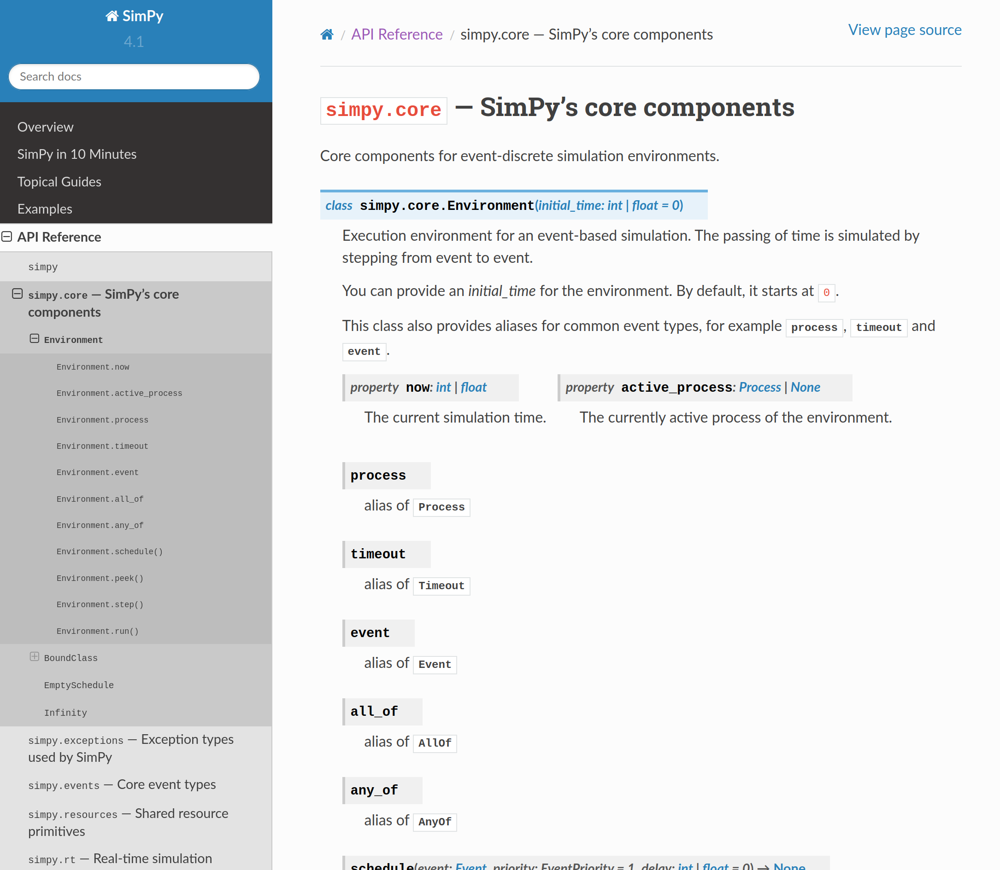
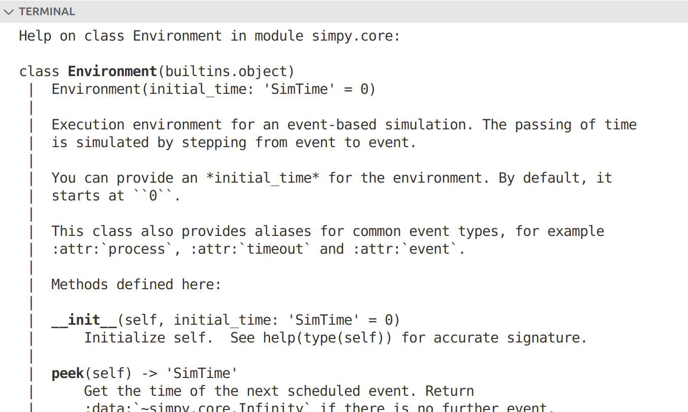
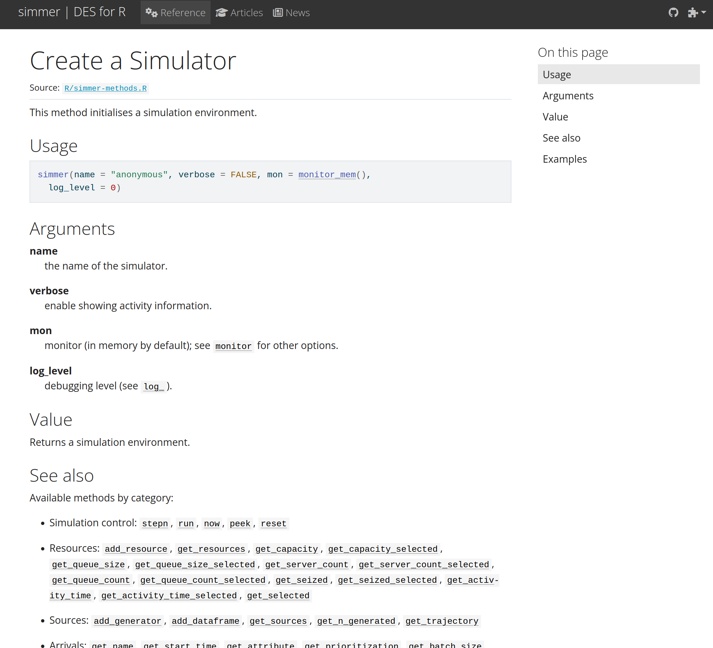
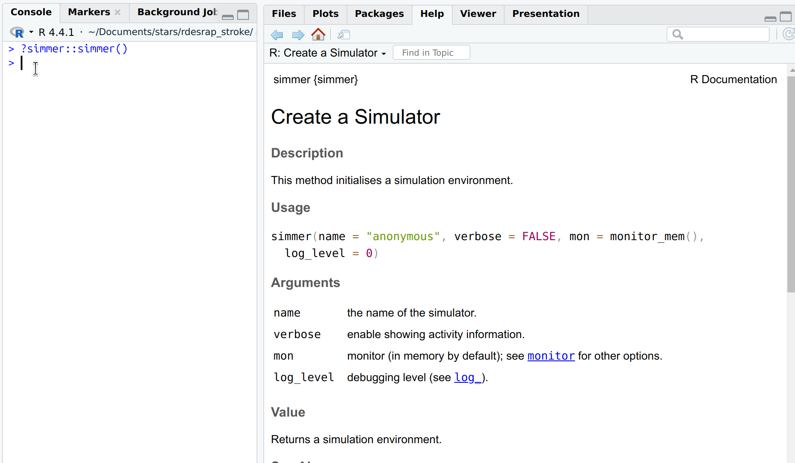



::: {.pale-blue}

**Learning objectives:**

* Understand what docstrings are and why they are important.
* Learn how to write effective docstrings.

**Relevant reproducibility guidelines:**

* STARS Reproducibility Recommendations: Comment sufficiently.
* NHS Levels of RAP (🥈): Code is well-documented including user guidance, explanation of code structure & methodology and docstrings for functions.

:::

::: {.r-content}
```{r}
library(R6)
```
:::

## Docstrings: what and why

::: {.python-content}

**Docstrings** ("documentation strings") are used to describe what each object in your code does. They should be included everywhere: modules, functions, classes, methods, and tests.

Example:

```{python}
def add_positive_numbers(a, b):
    """
    Add two positive numbers.

    Parameters
    ----------
    a : float
        First number to add (must be positive).
    b : float
        Second number to add (must be positive).

    Returns
    -------
    float
        The sum of a and b.
    """
    if a < 0 or b < 0:
        raise ValueError("Both numbers must be positive.")
    return a + b
```

:::

::: {.r-content}

**Docstrings** ("documentation strings") are used to describe what each object in your code does. They should be added to functions and classes.

Example:

```{r}
#' Add two positive numbers
#'
#' @param a First number to add (must be positive).
#' @param b Second number to add (must be positive).
#'
#' @return The sum of a and b.
#' @export

add_positive_numbers <- function(a, b) {
  if (a < 0L || b < 0L) stop("Both numbers must be positive.", call. = FALSE)
  a + b
}
```

:::

### How do they differ from in-line comments?

**Docstrings** explain the overall purpose of a code object (like a function or class), while **in-line comments** clarify individual lines or sections of code when the logic isn't obvious.

For example, we could add an in-line comment to the function above to explain the if statement:

::: {.python-content}

```{.python}
# Check if both inputs are positive before adding
if a < 0 or b < 0:
    raise ValueError("Both numbers must be positive.")
return a + b
```

:::

::: {.r-content}

```{.r}
# Check that both inputs are positive before adding
if (a < 0L || b < 0L) stop("Both numbers must be positive.", call. = FALSE)
a + b
```

:::

### Why use docstrings?

* **Clarity and consistency:** Docstrings make code easier to understand and provide a uniform way to document your work, which is especially valuable when collaborating.

* **Maintainability and reproducibility:** They help future users (including yourself) see the purpose and usage of code, making ongoing maintenance and reuse simpler and less error-prone. (Hence, their inclusion in the NHS Levels of RAP silver criteria (🥈)!)

::: {.python-content}

* **Documentation websites:** If you create a package and build a [documentation website](documentation.qmd) (e.g. with a tool like `quartodoc`), the docstrings are automatically used to generate reference guides and manuals. For example:

    

* **Interactive help systems:** Docstrings are picked up by interactive help tools like `help(function)`, which displays the docstring directly in the console or interface, to explain how the function or class works. For example...

    Open a python script, or open on terminal by calling:

    ```{.bash}
    python
    ```

    Import SimPy and load the documentation for the `Environment()` class.

    ```{.python}
    library(simpy)
    help(simpy.core.Environment)
    ```

    This will display:

    

:::

::: {.r-content}

* **Documentation websites:** If you create a package and build a [documentation website](documentation.qmd) (e.g. with a tool like `quartodoc` or `pkgdown`), the docstrings are automatically used to generate reference guides and manuals. For example:

    

* **Help systems:** When comments follow a docstring format, you can view them in help panels with `?function`. For example:

    

:::

## How to write docstrings

::: {.python-content}

There are a variety of style guides and standardized docstring formats available for Python, many of which are supported by automated documentation tools, linters, and code editors. Choosing a consistent style improves code readability and makes it easier for others to understand and use your code.

Two popular ones include:

* NumPy style docstrings - [numpydoc](https://numpydoc.readthedocs.io/en/latest/format.html).
* Google style docstrings - [google style guide](https://google.github.io/styleguide/pyguide.html#38-comments-and-docstrings).

In our example models, we have used NumPy style. Below, we illustrate both approaches for comparison.

### Function

**NumPy style:**

```{python}
def estimate_wait_time(queue_length, avg_service_time):
    """
    Estimate the total wait time for all customers in the queue.

    Parameters
    ----------
    queue_length : int or float
        Number of customers currently in the queue.
    avg_service_time : int or float
        Average time taken to serve one customer.

    Returns
    -------
    float
        Estimated total wait time.
    """
    return queue_length * avg_service_time
```

**Google style:**

```{python}
def estimate_wait_time(queue_length, avg_service_time):
    """Estimate the total wait time for all customers in the queue.

    Args:
        queue_length (int or float): Number of customers currently in the
            queue.
        avg_service_time (int or float): Average time taken to serve one
            customer.

    Returns:
        float: Estimated total wait time.
    """
    return queue_length * avg_service_time
```

### Class

**NumPy style:**

```{python}
class Patient:
    """
    Represents a patient in a healthcare facility.

    Attributes
    ----------
    patient_id : int or str
        Unique identifier for the patient.
    arrival_time : str or datetime-like
        The time when the patient arrived.
    status : str
        Current status of the patient: one of "waiting", "admitted", or
        "discharged".
    """

    def __init__(self, patient_id, arrival_time):
        """
        Initialise a new patient record.

        Parameters
        ----------
        patient_id : int or str
            Unique identifier for the patient.
        arrival_time : str or datetime-like
            The time when the patient arrived.
        """
        self.patient_id = patient_id
        self.arrival_time = arrival_time
        self.status = "waiting"

    def admit(self):
        """Admit the patient."""
        self.status = "admitted"

    def discharge(self):
        """Discharge the patient."""
        self.status = "discharged"
```

**Google style:**

```{python}
class Patient:
    """Represents a patient in a healthcare facility.

    Attributes:
        patient_id (int or str): Unique identifier for the patient.
        arrival_time (str or datetime-like): The time when the patient arrived.
        status (str): Current status of the patient, one of "waiting",
            "admitted", or "discharged".
    """

    def __init__(self, patient_id, arrival_time):
        """Initialise a new patient record.

        Args:
            patient_id (int or str): Unique identifier for the patient.
            arrival_time (str or datetime-like): The time when the patient
                arrived.
        """
        self.patient_id = patient_id
        self.arrival_time = arrival_time
        self.status = "waiting"

    def admit(self):
        """Admit the patient."""
        self.status = "admitted"

    def discharge(self):
        """Discharge the patient."""
        self.status = "discharged"

```

### Test

Tests are a bit different. They usually just have a short, one‑line description without formal parameters or return sections, and are not based on any specific style guide.

**Example:**

```{python}
def test_estimate_wait_time():
    """Test estimate_wait_time with sample input and expected output."""
    assert estimate_wait_time(5, 2) == 10
```

### Module

A module is a `.py` file within a package containing package code, like functions or classes. Each `.py` file is considered a module, and modules can be used to group related code together.

Module docstrings - similar to tests - are usually brief, giving an overview of the file's purpose and main contents, without necessarily following a strict style guide.

**Example:**

```{.python}
"""
hospital.py

A simple healthcare utility module.

Provides:
- A function to estimate patient wait times in a queue.
- A class to represent a patient and manage their admission status.
"""
```

:::

::: {.r-content}

In R, docstrings are almost always written in [roxygen2](https://roxygen2.r-lib.org/) style. This is because it is the standard for packages, and works seamlessly with R's package tools.

The `@export` tag is included in each docstring to tell Roxygen to add the object to the package's `NAMESPACE` file, making it available for users once they load the package with `library(packagename)`.

### Function

```{r}
#' Estimate the total wait time for all customers in the queue.
#'
#' @param queue_length numeric Number of customers currently in the queue.
#' @param avg_service_time numeric Average time taken to serve one customer.
#'
#' @return numeric Estimated total wait time.
#' @export

estimate_wait_time <- function(queue_length, avg_service_time) {
  queue_length * avg_service_time
}
```

### Class

```{r}
#' Represents a patient in a healthcare facility.
#'
#' @docType class
#' @importFrom R6 R6Class
#' @export

Patient <- R6Class("Patient", list(  # nolint: object_name_linter

  #' @field patient_id integer or character. Unique identifier for the
  #' patient.
  patient_id = NULL,

  #' @field arrival_time character or Date/POSIXt. The time when the patient
  #' arrived.
  arrival_time = NULL,

  #' @field status character. Current status of the patient: one of
  #' "waiting", "admitted", or "discharged".
  status = NULL,

  #' Initialise a new patient record.
  #'
  #' @param patient_id integer or character. Unique identifier for the
  #' patient.
  #' @param arrival_time character or Date/POSIXt. The time when the patient
  #' arrived.
  initialize = function(patient_id, arrival_time) {
    self$patient_id <- patient_id
    self$arrival_time <- arrival_time
    self$status <- "waiting"
  },

  #' Admit the patient.
  admit = function() {
    self$status <- "admitted"
  },

  #' Discharge the patient.
  discharge = function() {
    self$status <- "discharged"
  }
))
```

:::

## Advice when writing docstrings

**Write early!** Add docstrings whilst you code or immediately afterward. If you leave them until later, you can easily forget important details.

**Keep them concise.**

**Use AI wisely.** Large language models can help draft docstrings, but review carefully - they may be too wordy, following a different format, or miss details.

::: {.python-content}

**Use linting tools.** `pydoclint` ([GitHub](https://github.com/jsh9/pydoclint)) is a great new tool for flagging formatting issues and missing parameters in docstrings.

:::

:::{.r-content}

**Use linting tools.** When you run `devtools::check()`, it will let you know about missing parameters in docstrings.

:::

## Explore the example models

::: {.python-content}





These repositories use NumPy style docstrings.

:::

::: {.r-content}





These repositories use roxygen2 style docstrings throughout.

:::

## Test yourself

Try writing docstrings for functions from your own codebase.

Alternatively, practice by writing a docstring for the example function below.

::: {.python-content}

```{.python}
def calculate_interarrival_time(arrival_rate):
    return 1 / arrival_rate
```

:::

::: {.r-content}

```{.r}
calculate_interarrival_time <- function(arrival_rate) {
  1 / arrival_rate
}
```

:::

Suggested solutions are provided, but try writing your own version first before checking them.

:::: {.python-content}

::: {.callout-tip title="Potential NumPy style solution" collapse="true"}

```{.python}
def calculate_interarrival_time(arrival_rate):
    """
    Calculate the average inter-arrival time between patient arrivals.

    Parameters
    ----------
    arrival_rate : float
        The average number of patient arrivals per time unit (e.g., per hour).

    Returns
    -------
    float
        The average time between two consecutive patient arrivals.
    """
    return 1 / arrival_rate
```

:::

::: {.callout-tip title="Potential Google style solution" collapse="true"}

```{.python}
def calculate_interarrival_time(arrival_rate):
    """Calculate the average inter-arrival time between patient arrivals.

    Args:
        arrival_rate (float): The average number of patient arrivals per time unit
            (e.g., per hour).

    Returns:
        float: The average time between two consecutive patient arrivals.
    """
    return 1 / arrival_rate
```

:::

::::

:::: {.r-content}

::: {.callout-tip title="Potential solution" collapse="true"}

```{.r}
#' Calculate the average inter-arrival time between patient arrivals.
#'
#' Given an arrival rate (patients per time unit), this function computes
#' the expected time between successive patient arrivals.
#'
#' @param arrival_rate Numeric. Average number of arrivals per time unit (e.g., per hour).
#'
#' @return Numeric. Average inter-arrival time between two consecutive patient arrivals.
#' @export

calculate_interarrival_time <- function(arrival_rate) {
  1 / arrival_rate
}
```

:::

::::

<br><br>
