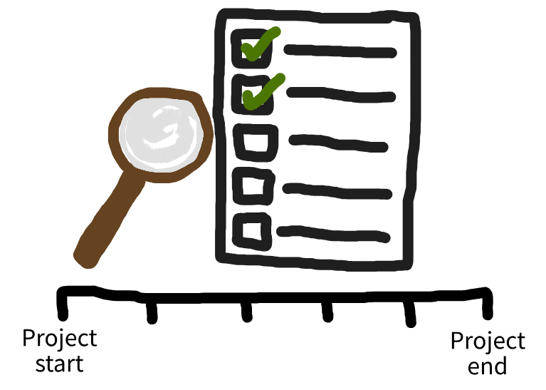

:::: {.pale-blue}

**Learning objectives:**

* Understand what **quality assurance** (QA) means.
* Learn how to **plan QA activities**, based on the UK Government frameworks.
* See how to use **GitHub Projects** to maintain a QA log.

**Acknowledgements:** This page is based on the [AQuA Book](https://www.gov.uk/guidance/the-aqua-book) (Government Analysis Function), and the QA processes used on the [New Hospital Programme](https://connect.strategyunitwm.nhs.uk/nhp/project_information/) (The Strategy Unit).

::::

## What is quality assurance?

**Quality assurance** (QA) is the formal, systematic process of ensuring your analysis meets appropriate standards of quality and is fit for purpose. It means **planning how you will check the work, carrying out those checks, and keeping clear evidence of what you did.**

* **Why do QA?** It helps build trust in the work by ensuring the right processes are followed, and that analysis and results are checked.

* **When to do QA?** It spans the entire project lifecycle: from initial scoping, through design and analysis, to final delivery and sign-off.

* **How does QA relate to verification and validation?** Verification and validation are specific checks within QA that focus on whether the analysis has been built correctly and answers the right question; QA is broader and also covers how the work is planned, documented, reviewed, and signed off.

In the UK, one of the main sources of guidance on QA is the [AQuA Book](https://www.gov.uk/guidance/the-aqua-book), developed by the Government Analysis Function. This page is based on the guidance in the AQuA Book and introduces some of the QA activities it describes, but you should go to the AQuA Book for the complete guidance.

## Planning quality assurance

### Roles and responsibilities

You may assign roles as part of quality assurance. The [AQuA book](https://www.gov.uk/guidance/the-aqua-book) suggests four roles:

| Role | Responsibilities |
| - | --- |
| **Commissioner** | Requests the analysis, sets requirements, confirms the approach will meet their needs, accepts the final work as fit for purpose. |
| **Analyst** | Designs and carries out the analysis, performs self-assurance (including verification and validation), acts on assurer feedback, documents the work. |
| **Assurer** | Reviews the analyst's assurance work, performs additional verification and validation checks, reports issues, confirms the work is appropriately scoped, executed, validated, verified, and documented. Must be independent from the analyst. |
| **Approver** | Scrutinises the work of analyst and assurer, confirms appropriate assurance has occurred, provides formal sign-off. |

 

For smaller projects, you might be the analyst, your supervisor the commissioner, an independent colleague the assurer (or your supervisor if needed), and your supervisor or project lead the approver.

For larger or higher-risk projects, these roles are often held by different people or groups, with more formal assurance and sign-off.

### Quality assurance when scoping the project

When scoping a project, QA mainly means:

::: {.cream}

**1. Documenting what you are trying to do.** Keeping a record makes your project aims clear and transparent. It also gives you something to check against later when you verify and validate your model. Suggestions on what your plan should include are given below.

**2. Planning your QA.** This includes:

* Who will be involved in checking the work? Use the roles and responsibilities above for guidance.

* What QA will you do at each stage? See the descriptions below of QA that can be done during design, analysis and reporting. Also check out the National Audit Office's [Framework to review models](https://www.nao.org.uk/wp-content/uploads/2016/03/11018-002-Framework-to-review-models_External_4DP.pdf), which provides a checklist of questions to consider when reviewing models.

* How much QA does your project need? It depends on the levels of risk associated - e.g., financial, legal, operational, reputational. Higher levels of risk mean you need a more extensive QA approach (e.g., more independent review, more thorough testing).

:::

It is up to you where you record this information. A practical option is to keep it in your repository so everything is in one place and under version control - for example in a `scoping.md` file, as part of an analysis plan, or in a project protocol (which might also be archived on a platform like [OSF](https://osf.io/)). The important thing is that it is written down, easy to find, and shared with the people involved.

::: {.callout-note title="Suggestion on what your plan should include" collapse="true"}

* What your analysis needs to deliver (e.g., "estimate average waiting times for elective surgery under three staffing options, to inform a business case.")

* Question: What decision will this model inform, and what outcomes do you need (e.g., waiting time, beds, costs)?

* Context: Which organisation/service, what time horizon, what demand scenario (e.g. current vs post-policy change)?

* Scope: What is in/out of the model (e.g. elective only vs elective and emergency, one hospital v.s. whole ICS)?

* Constraints: Data limits, timeframes, computing limits, modelling assumptions.

:::

### Quality assurance when designing the analysis

During design, QA is about **planning and documenting how the analysis will work, and how it will be checked**. This builds on your plans made when scoping the project, and includes:

::: {.cream}

* Agreeing on your analytical approach - methods, data, software, and (importantly) assumptions.

* Deciding on your verification and validation strategy before you write code.

* Recording decision decisions, so they can be reviewed and challenged.

:::

### Quality assurance when performing the analysis

During analysis,  QA is about checking that the model, code, and results behave as intended, and leaving a clear trail of what was done.

::: {.cream}

**Verification and validation**. This involves checking that the simulation model correctly implements the intended conceptual model (verification) and checking whether the simulation model is a sufficiently accurate representation of your real system (validation). See the [verification and validation page](verification_validation.qmd) for an overview of approaches you can take.

**Assurance of code and workflows**. Make sure you code and workflow follow good practice for quality and reproducibility (for example, version control, testing, code review). For example, you achieve this by meeting recommendations from the STARS Reproducibility Recommendations and NHS Levels of RAP, as outlined on the [guidelines page](../intro/guidelines.qmd).

**Documentation** - this includes:

* Documenting **code** with docstrings and comments (see [docstrings page](../style_docs/docstrings.qmd)).

* Writing **user documentation** explaining how to run and interpret the model, and writing **technical documentation** explaining the model structure and implementation (see [documentation page](../style_docs/documentation.qmd) for more tips on creating documentation).

* **Maintaining a record** of data sources, assumptions, inputs, and decisions (which you should've started when doing QA as part of the scoping and design stages).

* **Keeping a QA log** (for example, what was checked, when, by whom, and with what outcome) - see section below for more advice on this.

:::

### Quality assurance when deliver results and sign-off

At delivery, communicate results and QA processes to approver and commissioner, providing relevant documentation. They should review and determine whether the work is fit for purpose / of sufficient quality to release.

## Keeping a quality assurance plan and log

In the scoping and design stages, you will usually sketch the plan as part of your analysis plan or project protocol. When you start doing the work, a practical way to manage both plan and log is to use GitHub Issues and a GitHub Projects board.

::: {.cream}

**Using GitHub Projects for QA**

The Strategy Unit's New Hospital Programme model uses a GitHub Projects board both as its QA plan (open issues) and QA log (closed issues). Each QA item is a GitHub issue on the [QA project board](https://github.com/orgs/The-Strategy-Unit/projects/6).

This approach has several advantages:

* QA happens where the work happens, alongside code, data, and documentation.

* Each QA item has context - discussion threads, links to code, commits, and version history.

* The QA trail is transparent and auditable for anyone with access.

* One GitHub Project can pull issues from multiple repositories, public and private.

On the New Hospital Programme QA board, issues are grouped by category, for example:

* 📝 Documentation

* 🗃️ Data and assumptions

* 🧪 Verification

* ❓ Validation

:::

In practice, a simple pattern is:

1. At the start of the project, create QA issues that reflect your plan (e.g., "Check input data consistency", "Cross‑check model outputs against historical data", "Independent code review of routing logic").

2. As you work, update and close issues to turn the plan into a log, noting what was done and any follow‑up.

3. At delivery, use the closed issues and project board as your evidence trail when describing QA and seeking sign‑off.

## Examples of quality assurance

### New Hospital Programme

As described above, the Strategy Unit's New Hospital Programme model is a brilliant, openly-available example of quality assurance for a healthcare model. On their [project information website](https://connect.strategyunitwm.nhs.uk/nhp/project_information/quality_assurance/overview.html), they describe their approach to QA:

> "The model has been quality assured and checked by appropriate individuals internally and externally throughout. The model assumptions and specification were and are regularly reviewed by NHP (DHSC & latterly NHSE). Code review has been carried out internally and externally, and code review will be carried out on an ongoing basis as more elements are added to the model. Code is thoroughly tested using a test suite before any code is added to the model. The data has been checked against SUS data and trusts who have engaged with the model have also checked the data against their own data. Review of the legibility and usefulness of the outputs has also been carried out internally and externally, and sensitivity testing shows that the model behaves as expected.""
>
> ([source](https://connect.strategyunitwm.nhs.uk/nhp/project_information/quality_assurance/overview.html))

They also list the roles and responsibilities for the model - including the model senior responsible officer, model owner, and analysis team. They also link to key documentation from their QA process:

> * [User guide](https://connect.strategyunitwm.nhs.uk/nhp/project_information/)
> * [Technical guide](https://github.com/The-Strategy-Unit/nhp_model/tree/main/docs)
> * [QA plan](https://github.com/orgs/The-Strategy-Unit/projects/6/views/1)
> * [QA log](https://github.com/orgs/The-Strategy-Unit/projects/6/views/2)
> * [Assumptions log](https://connect.strategyunitwm.nhs.uk/nhp/project_information/quality_assurance/assumptions-log.html)
> * [Change log](https://github.com/The-Strategy-Unit/nhp_model/commits/main/)
>
> ([source](https://connect.strategyunitwm.nhs.uk/nhp/project_information/quality_assurance/overview.html))

### NHS England data linkage

NHS England have developed a [Quality Assurance Framework for Data Linkage](https://nhsengland.github.io/quality-assurance-framework-for-data-linkage/) to support robust, transparent, and auditable linkage across their data systems.

The framework outlines the QA activities that should be performed, such as checks on input data quality, linkage methods, and output. It includes recommendations, some worked examples, and helps assess risk and importance.

### The example models

TODO.