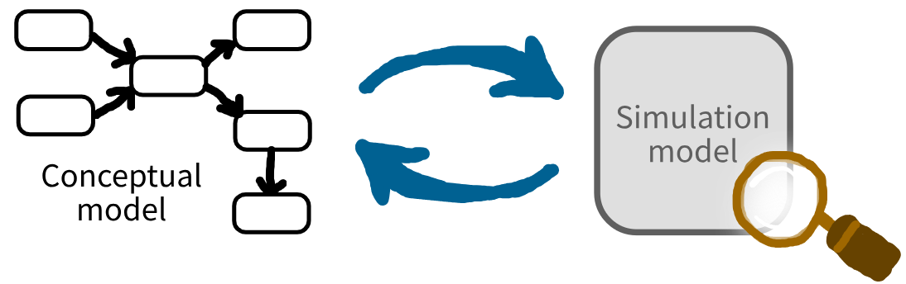
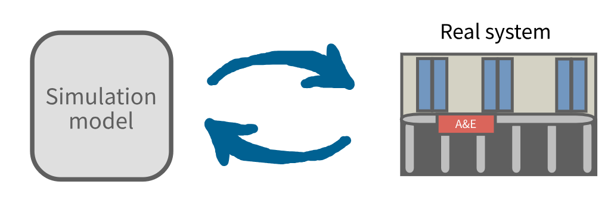

:::: {.pale-blue}

**Learning objectives:**

* Define verification and validation.
* Learn about the range of methods for verification and validation.

::::

## What is the difference between verification and validation?

The following definitions are based on @Robinson2007 and @Sargent2013.

<br>

::: {.blue}

**Verification:** The process of checking that the simulation model correctly implements the intended conceptual model.

It involves checking that the model's logic, structure and parameters are implemented as planned and free from coding errors.

:::



Verification ensures the model is built correctly, which is necessary for accuracy, so it can be seen as a subset of the broader topic of validation. In practice, these steps are sometimes discussed together under the general topic of V&V (Verification and Validation).

<br>

::: {.blue}

**Validation:** The process of checking whether the simulation model is a sufficiently accurate representation of your real system.

It involves comparing the model's inputs, behaviour and results to the real system. The key question is whether any differences are small enough that the model can still reliably support the decisions or answer the questions it was designed for.

:::



You'll come across many different categorisations for simulation validation techniques - a popular example comes from @Sargent2013 who suggest there are three overarching types of validation:

* **Operational validation** - whether the model behaves accurately for its intended purpose.
* **Data validation** - whether data used are adequate and correct.
* **Conceptual model validation** - whether theories, assumptions, and model structure are reasonable for intended purpose.

<br>

The following sections outline various methods for verification and validation - but they are not comprehensive - just a selection we feel likely to be relevant and feasible for healthcare DES models. For more techniques, check out @Balci1998.

## Methods for verification

<div class="h3-tight"></div>

### Desk checking

"Desk checking" or "self-inspection" involves reviewing your own work to see if it appears correct. @Balci1998 suggest several types of checks you can use when reviewing.

**Syntax checking** means checking that the code is properly formatted, that parameters are correctly passed between functions, and that all required libraries are imported.

**Cross-reference checking** focuses on verifying that any links and file paths are correct, and that required functions can be called.

**Documentation checking** involves ensuring all documentation is complete, accurate and consistent with the implemented code.

**Convention violation checking** ensures adherence with coding standards.

**Detailed comparison to specification** involves systematically comparing the implemented model with the original plans. This makes sure that the requirements, logic, parameters and outputs as planned in the conceptual model are implemented in the code.

**Reading the code** line-by-line is also handy for seeing if the code makes sense and for spotting any possible issues. @Rosser2025 suggests two issues that often arise: inconsistent use of time units (e.g., mixing minutes, hours, days), and difficulties reproducing results.

::: {.cream}

**What does this mean in practice?**

✔️ Systematically check your code.

✔️ Keep your documentation complete and up-to-date.

✔️ Maintain an environment with all required packages (see [environments](../setup/environment.qmd) page).

✔️ Lint your code (see [linting](../style_docs/linting.qmd) page).

✔️ Get code review (see [code review](../sharing/peer_review.qmd) page).

:::

### Debugging

**Debugging** is the process of identifying and fixing bugs in your code. In @Balci1998, they describe this as an iterative process of (1) identifying bugs, (2) determining their cause, (3) identifying necessary changes, and (4) making those changes.

::: {.cream}

**What does this mean in practice?**

You'll probably perform debugging naturally as you code the model - but it is helpful to:

✔️ Write tests - they'll help you spot bugs (see [tests](tests.qmd) page).

✔️ As you develop the model, monitor it using logs - this will also help you spot bugs (see [logs](../model/logs.qmd) page).

✔️ Use GitHub issues to record bugs as they arise, so you don't forget about them and so you have a record for future reference (see section on GitHub issues on the [peer review](../sharing/peer_review.qmd#github-issues) page).

:::

### Assertion checking

As defined in @Balci1998, this technique involves making **assertions** - i.e., outlining the expected behaviour of your model. You should then check to ensure these hold true. These assertions can be placed throughout your code, monitoring things like:

* Patient flow logic (e.g., ensuring patients don't skip required stages).
* Resource constraints (e.g., bed capacity never exceeds maximum).
* Parameter validation (e.g., service times are always positive).
* Conservation laws (e.g., total patients in system matches arrivals minus departures).

> **Note:** Another type of verification called "**invalid input testing**" can fall under assertion checking, when you are writing tests that check the model behaves as expected (e.g., with appropriate error messages) if invalid parameters are used (@Balci1998).

::: {.cream}

**What does this mean in practice?**

✔️ Add checks in the model which cause errors if something doesn't look right (e.g., [Parameter validation](../inputs/parameters_validation.qmd) page).

✔️ Write tests which check that assertions hold true (see [Tests](tests.qmd) page).

:::

### Special input testing

There are several techniques for verification that involve varying your model inputs. Some we cover below include:

* **Boundary value testing**
* **Stress testing**

We also mention overlap with:

* **Extreme input testing** (covered by boundary value testing).
* **Invalid input testing** (overlaps with boundary value testing and assertion checking).

Finally, we mention running an **idle system** as an "unofficial" method (i.e., not covered by major simulation references for verification and validation like @Balci1998).

> **Note:** There is overlap between this and **functional testing** (sometimes called "black-box testing"), which is about assessing whether a simulation model accurately performs input-to-output transformations as specified.

#### Boundary value testing

Boundary value testing (BVT) is relevant for input variables with defined minimum and maximum limits (e.g., age restrictions, bed capacity). It involves running the model with parameters just inside, exactly at, and just outside parameter boundaries. The aim is to catch errors in patient routing, resource allocation or event timing, as these can occur more frequently at boundaries than when more safe ranges (@KLE2025, @Balci1998).

> **Note:** BVT specifically focuses on every boundary, not just the minimum and maximum values. This makes it more comprehensive, encompassing another type of verification called **extreme input testing** which just involves running minimum and maximum values. It can also overlap with **invalid input testing** when checking values that fall outside the minimum and maximum (@Balci1998).

**Example 1: Multiple boundaries**

Suppose a simulation model routes patients based on their triage risk scores from 0 to 5. For example:

* Patients with score less than 2 go to Minor Injuries.
* Patients with score from 2 to less than 4 go to Urgent Care.
* Patients with scores of 4 to 5 inclusive go to Resuscitation.

To check your routing logic, you would run boundary value tests using values just inside, exactly at, and just outside these thresholds:

* -0.1, 0, 0.1 (boundary for Minor Injuries).
* 1.9, 2, 2.1 (boundary between Minor Injuries and Urgent Care).
* 3.9, 4, 4.1 (boundary between Urgent Care and Resuscitation).
* 4.9, 5, 5.1 (upper limit for Resuscitation).

**Example 2: Just minimum and maximum boundaries**

Suppose we simulate a screening programme where patients are only eligible if their age is betwen 18 and 75 inclusive. Boundary value tests would check:

* Patients below the minimum are rejected (17).
* Patients at/near the thresholds are accepted (18, 19, 74, 75).
* Patients above the maximum are rejected (76).


::: {.cream}

**What does this mean in practice?**

✔️ If you have input variables with explicit limits, design tests to check the behaviour at, just inside, and just outside each boundary.

:::

#### Stress testing

Stress testing involves running your model under extremely demanding conditions. For example, with very high arrivals, limited resources, and/or long service times. The goal is to check that the system handles congestion/overload appropriately (@Balci1998):

* Do patients queue correctly?
* Does it respect resource constraints?
* Do calculated performance measures remain valid (e.g., utilisation within 0-1).

::: {.cream}

**What does this mean in practice?**

✔️ Write tests that simulate worst-case load and ensure model is robust under heavy demand (see [tests](tests.qmd) page).

:::

#### Idle system

Though not an "official" verification method, it can be helpful to run your model under "empty" or "idle" conditions. For example, with very few arrivals, ample resources, and/or extremely short service times. This is essentially the opposite of stress testing. The goal is still to confirm that the system behaviours sensibly in these unusual conditions (e.g., are performance measures reasonable and valid).

::: {.cream}

**What does this mean in practice?**

✔️ Write tests with little or no activity/waits/service (see [tests](tests.qmd) page).

:::

### Bottom-up testing

Bottom-up testing means testing the smallest parts of your simulation code first, then gradually combining and testing them together as larger sections (@Balci1998). This helps ensure each part is working as intended, making it easier to pinpoint the source of bugs.

::: {.cream}

**What does this mean in practice?**

✔️ Write unit tests for each individual component of your simulation model (see [tests](tests.qmd) page).

✔️ Once individual parts work correctly, combine them and test how they interact. This can be via integration testing or functional testing (see [tests](tests.qmd) page).

:::

### Regression testing

When you make changes to your model, you should re-run your tests to ensure those changes haven't introduced new errors. This is referred to as regression testing (@Balci1998).

::: {.cream}

**What does this mean in practice?**

✔️ Write your tests early! Don't leave them all until the end. Having tests in place early means you can re-run them as you make changes and catch issues as you go.

✔️ Run tests regularly. You can do this manually on your local machine, or automatically through CI/CD pipelines that could run tests on pull requests or merges to the main branch (see [GitHub actions](../style_docs/github_actions.qmd) page).

:::

### Mathematical proof of correctness

Formal validation of a model using mathematical proof of correctness (@Balci1998) is typically possible only for simple models that have accepted theoretical solutions. For example, you can compare a simple M/M/s queueing model to known equations from queueing theory.

As @Robinson2007 notes, this approach can involve comparing the simulation model to a simpler mathematical model. Though it will only be a crude approximation of the simulation and would not be able to predict the outcome exactly, it can be used as a rough comparison. This is sometimes called **static analysis** because the mathematical model doesn't account for the full dynamics of the simulation model. When comparing, it can be useful to simplify the simulation model temporarily - for example, removing random events so it is possible to mathematically determine the outcome.

We provide an example of this on the subsequent [mathematical proof of correctness](mathematical.qmd) page.

::: {.cream}

**What does this mean in practice?**

✔️ For parts of your model where theoretical results exist (like an M/M/s queue), compare simulation outputs with results from mathematical formulas.

This is a great baseline: start with a simple model you can compare against theory. That way, you have confidence in your code as a foundation before you build in more system complexity.

:::

## Methods for validation

<div class="h3-tight"></div>

### Face validation

**Face validation** is a process where the project team, potential model users, and people with relevant experience of the healthcare system review the simulation. Based on their knowledge and experiences, they compare the model's behaviour and results with what would be expected in the real system and judge whether the model appears realistic and appropriate (@Balci1998).

Evaluating and reporting face validity is a requirement of the DES reporting checklist from @Zhang2025 (which is based on reports from the International Society for Pharmacoeconomics and Outcomes Research (ISPOR)-Society for Medical Decision Making (SMDM) Modeling Good Research Practices Task Force).

::: {.cream}

**What does this mean in practice?**

✔️ Present key simulation outputs and model behaviour to people such as:

* Project team members.
* Intended users of the model (e.g., healthcare analysts, managers).
* People familiar with the real system (e.g., clinicians, frontline staff, patient representatives).

Ask for their subjective feedback on whether the model and results "look right". Discuss specific areas, such as whether performance measures (e.g., patient flow, wait times) match expectations under similar conditions.

:::

### Turing test

**Turing test** validation is a technique where experts familiar with the healthcare system are shown real-world output data and simulation output data, without knowing which is which. This provides a "blind test": they must decide which results they think are from the actual system and which are from the model. If experts cannot reliably tell the difference, it increases confidence in the model validity (@Balci1998).

This can be supplementary to face validation and other comparisons - rather than asking reviewers whether outputs seem plausible, they test whether they are indistinguishable.

::: {.cream}

**What does this mean in practice?**

✔️ Collect matching sets of model output and real system, remove identifying labels, and present them to a panel of experts. Record whether experts can distinguish simulation outputs from real data. Use their feedback on distinguishing features to further improve the simulation.

:::

### Predictive validation

**Predictive validation** means running the simulation model based on data from a particular time period of your system (e.g., a specific year, season or event). The model results should then be compared with the actual observed outcomes from that time period (@Balci1998).

Predictive validation is a requirement in the DES reporting checklist from @Zhang2025.

::: {.cream}

**What does this mean in practice?**

✔️ Use historical arrival data, staffing schedules, treatment times, or other inputs from a specific time period to drive your simulation. Compare the simulation's predictions for that period (e.g., waiting times, bed occupancy) against the real outcomes for the same period.

✔️ Consider varying the periods you validate on—year-by-year, season-by-season, or even for particular policy changes or events—to detect strengths or weaknesses in the model across different scenarios.

✔️ Use graphical comparisons (e.g., time series plots) or statistical measures (e.g., goodness-of-fit, mean errors, confidence intervals) to assess how closely the model matches reality - see below.

:::

### Graphical comparison

**Graphical comparison** involves comparing graphs of model variables over time with graphs of real system variables. You should look for similarities in patterns, trends, periodicities (i.e., recurring events), and other characteristics (@Balci1998).

::: {.cream}

**What does this mean in practice?**

✔️ Create time-series plots of key metrics (e.g., daily patient arrivals, resource utilisation) for both the model and system. Create distributions of waiting times, service times, and other performance measures. Compare the model and system graphs.

:::

### Statistical comparison

Statistical comparison involves using formal **statistical techniques** to compare model outputs with real system data. @Balci1998 recommend a validation procedure using simultaneous confidence intervals. Other statistical techniques including t-tests and goodness-of-fits tests have also been proposed.

This is a type of **external validation** (comparing model results to empirical data of actual event), which is a requirement in the DES reporting checklist from @Zhang2025.

::: {.cream}

**What does this mean in practice?**

✔️ Collect real system data on key performance measures (e.g., wait times, lengths of stay, throughput) and compare with model outputs statistically using appropriate tests.

:::

### Animation visualisation

If you build an animation that shows your simulation model as it runs, it can help you spot errors by letting you "see" what's happening (@Balci1998). You can watch patients flow, queues grow and shrink, and resources being used - and you maybe be able to spot odd behaviours.

:::: {.cream}

**What does this mean in practice?**

Creating an animation takes time, but it has several benefits beyond just validation.

* ✔️ **Validation:** It can help you spot mistakes
* ✔️ **Communication:** It is really helpful for sharing the models with others (such as with stakeholders and decision makers).
* ✔️ **Reuse:** It supports reuse of the model (as in the [STARS framework](../project/stars.qmd#reusable)).

::: {.python-content}

In Python, check out [vidigi](https://github.com/Bergam0t/vidigi/tree/main) - a package developed by Sammi Rosser to make animated visualisations for open-source simulation models (e.g., SimPy with streamlit).

:::

::::

### Comparison testing

If two or more simulation models exist for the same system (perhaps built using different methods, languages, or by different groups), **comparison testing** (or "back-to-back testing") can be used. Running both models with identical input data and configurations and comparing their outputs can reveal problems or inconsistencies in at least one model's logic, assumptions or implementation (@Balci1998).

::: {.cream}

**What does this mean in practice?**

✔️ If you have multiple models of the same system, compare them!

You probably won't have two models often, but when you do, comparing them is very useful. For example, if you create an open-source version of a commercial model or translate a model between R and Python (as in this book), comparing results can quickly uncover issues and improve quality.

:::

### Input data validation

Data validation involves confirming that the data used in your model are appropriate and accurately reflect the real system (@Sargent2013).

This includes checking that statistical distributions are appropriate representations and that any data transformations preserve the essential characteristics of the original data (@Banks2005).

::: {.cream}

**What does this mean in practice?**

✔️ Check the datasets used - screen for outliers, determine if they are correct, and if the reason for them occurring should be incorporated into the simulation (@Sargent2013).

✔️ Ensure you have performed appropriate input modelling steps when choosing your distributions - see [input modelling](../inputs/input_modelling.qmd) page.

:::

### Conceptual model validation

Conceptual model validation determines whether the theories, assumptions, and underlying structure of your conceptual model are correct and reasonable for the intended purpose (@Sargent2013, @Robinson2007). This focuses on whether the model includes the necessary details and relationships to meet the study objectives.

Key questions include:

* Are the model's assumptions realistic and justified?
* Does the model structure capture the essential elements of the real system?
* Are simplifications appropriate given the study purpose?
* Do the causal relationships make sense?

::: {.cream}

**What does this mean in practice?**

✔️ Document and justify all modeling assumptions.

✔️ Review the conceptual model with people familiar with the real system to assess completeness and accuracy.

:::

### Experimentation validation

**Experimentation validation** ensures that the procedures used to run experiments and analyse results are appropriate and will produce accurate, reliable findings (@Robinson2007). Key components include:

* **Initialisation bias removal** - ensuring the model reaches steady state.
* **Appropriate run length** - sufficient time for reliable estimates.
* **Adequate replications** - enough runs for statistical confidence.
* **Sensitivity analysis** - testing robustness to parameter changes.

::: {.cream}

What does this mean in practice?

✔️ Use a warm-up period - see [initialisation bias](../output_analysis/warmup.qmd) page.

✔️ Use statistical methods to determine sufficient run length and number of replications - see [length of warm-up](../output_analysis/length_warmup.qmd) and [number of replications](../output_analysis/n_reps.qmd) page.

✔️ Perform sensitivity analysis to test how changes in input parameters affect outputs - see [scenario and sensitivity analysis](../experiments/scenarios.qmd) page.

:::

### Cross validation

**Cross validation** involves comparing your simulation with other modelling studies that address the same or similar decision problems (@Zhang2025). While assessing whether your results are consistent with the broader literature, you may also identify strengths or limitations of your model, and find alternative approaches to the same problem.

Cross validation is a requirement in the DES reporting checklist from @Zhang2025.

::: {.cream}

**What does this mean in practice?**

✔️ Search for similar simulation studies and compare the key assumptions, methods and results. Discuss discrepancies and explain reasons for different findings or approaches. Use insights from other studies to improve or validate your own model.

:::

## Explore the example models

::: {.python-content}



:::

::: {.r-content}



:::

We have completed steps to **verify** the model. **Validation** has not been performed as this is just an example model with synthetic inputs and is not based on a real system.

::: {.python-content}



:::

::: {.r-content}



:::

We have completed steps to **verify** the model. **Validation** has not been performed as this example just replicates an existing published model, and is not being re-applied to a real system.

## Test yourself

We encourage you to apply as many verification and validation methods as you can to your simulation models. Each approach gives a fresh angle on model quality, and together they build a robust foundation of trust in your work.

However, trying to do everything at once can feel overwhelming! Remember, verification and validation are iterative processes - it's normal and expected to work on them bit by bit, returning to add, review, and improve methods as your project develops.

To help you get started, we've put together a checklist you can copy into a [GitHub issue](../sharing/peer_review.qmd#github-issues) on your project. Use it to track which methods you've tried, what you want to tackle next, and which seem most relevant or feasible for your current context. This makes it easier to plan, prioritise, and document your verification and validation efforts over time.



```{.markdown}

```

## References

::: {#refs}
:::

<br><br>
